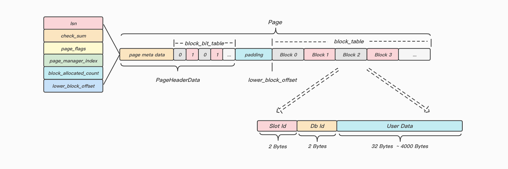
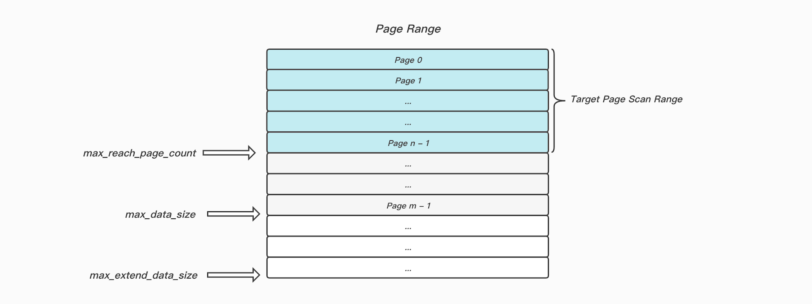

### 背景

目前keewidb在FlushDB/FlushAll以及分裂式扩容的场景下性能存在问题, 原因是目前采用走逻辑删除形式清理数据,  由于数据块的最小单位是Block,  但是数据落冷和升温的最小单位是Page, 走逻辑删除的形式这里就存在一个问题, 如果我们需要清理一个Page上的所有Block, 可能存在反复升温落冷该Page的情况, 这也是我们做清理操作性能低下的原因.

正是由于我们清理操作性能低下, 所以分裂式扩容以及Flushall/Flushdb场景下, 清流流程时间长, 且在此期间清理操作会消耗大量的磁盘IO以及CPU资源, 对业务有严重影响, 所以需要找到一种更高效的清理方法.

#### 技术方案

清理操作分成以下两个步骤:

* 索引清理: 索引清理还是正常走逻辑的形式删除(keewi中索引的大头应该是`LHTablePriIndexBlock`, 对应的就是一整个Page, 删除效率非常高, 不过删除其他数据结构索引可能还是存在上面提到的反复加载Page的问题, 这里索引依然走逻辑删除的形式是因为索引类型众多, 如果针对每种索引都特殊处理, 实现逻辑复杂, 后续风险和兼容性也不好把控)
* 数据块清理: 通过直接加载数据页的形式根据元信息来决定是否清理对应数据块, 这样可以保证单次操作就可以清理Page上所有要清理的数据库, 避免同一个Page反复升温落冷导致的性能问题

具体细节:

```cpp
/*
 * ************************* PageBitDesc *************************
 * | <Space State> | <Manager Index> | <PlaceHolder Block Count> |
 * |     2 Bit            6 Bits                 8 Bits          |
 * |--------------------------- 2 Bytes -------------------------|
 *
 * space_state:
 *   0 ---> this page is not used at all.
 *   1 ---> this page is being used, but free blocks can still be allocated.
 *   2 ---> this page is being used, but could not allocate free blocks.     */
```

1. 多协程并发加载Page, 这个根据PageBitTable中的信息来决定是否需要加载对应Page做清理操作(主要是通过`Space State`以及`Manager Index`字段来选取当前正在使用存储数据块的页)
2. 对Page上写锁, 分析`block_bit_table`找到当前已分配的block, 通过block头部的`Slot Id`和`Db Id`字段来决定当前Block是否需要做清理操作



#### 扫盘范围



这里物理扫盘的的范围是`Target Page Scan Range`的区间, 我们无需扫描`max_reach_page_count`指针之后的那些Page, 因为如果我们当前我们要清理`slot 0 ~ 5000`的数据,  下发清理任务之后, 理论上是没有其他命令会分配处于目标清理区间内的数据块的(DB也是同理).

#### 并发问题

在数据块清理的步骤中, 由于是根据Block头部的元信息来决定是否需要清理, 所以必须保证这部分Block不再跟上层逻辑挂钩,  否则可能存在`Double Free`的和脏数据的问题, 主要有以下一些场景可能会导致问题:

1. 某个Key已经处于大Key删除的流程中了, 而我们又在执行数据块清理操作, 这会导致`Double Free`的问题
2. 已经处于数据块清理操作过程中, 但是又新分配了可能会被清理的数据块(当前已经发起了清理`slot 0 ~ 5000`的操作, 但是又往slot `0 ~ 5000`中写入数据), 这会导致索引可能指向无效数据块的问题
3. 如果当前slot归属权发生切换, 且已经向存储层下发了清理slot操作, 我们需要保证此时没有客户端协程操作已经不属于自己的slot区间了(这里需要做一些额外的策略, 还是集群本身就能规避?).
4. FlushDB/FlushAll操作, 在异步清理任务还没有完成之前, 这里需要阻写, 否则无法区分哪些数据块是需要清理的, 哪些是不需要清理的.

保护措施:

1. 在`AllocDataBlocks()`和`FreeDataBlocks()`中添加保护机制 , 例如当前正在清理slot `0 ~ 5000`, 遇到分配和释放属于该slot之内的数据块, 直接FATAL找原因.

#### 故障恢复

无论是在索引清理和数据块清理期间进程意外退出, 我们都认为任务没有完成, 在重新启动之后会再次触发索引清理和数据块清理两个步骤, 已经清理过的内容由于已经做了修改并且已经持久化(由事务保证), 所以不会重复扫到, 所以也不会存在二次释放的问题.

#### 策略选择

1. 分裂式扩容以及Flushall场景, 可以认为我们要删除磁盘上超过半数的数据, 这里直接采用扫盘的策略做清理操作, 效率最高.
2. Flushdb场景, 还是按照之前走之前的逻辑删除的策略(如果是只使用了单DB且数据量很大的场景特殊考虑?)

### 测试数据

##### 数据信息

| 线程数 | AEP  | SSD  | Key大小 | Key数量   |
| ------ | ---- | ---- | ------- | --------- |
| 单线程 | 20G  | 100G | 32Bytes | 596745976 |

##### 目前机制清理slot测试

###### 磁盘IO开销

| Device  | r/s     | w/s     | rkB/s           | wkB/s           | 总耗时 |
| ------- | ------- | ------- | --------------- | --------------- | ------ |
| nvme0n1 | 3w~5.5w | 3w~8.5w | 100000 ~ 250000 | 100000 ~ 350000 | 9810秒 |

##### 扫盘清理测试

###### 步骤一: 逻辑扫描清理索引

| Device  | r/s         | w/s         | rkB/s         | wkB/s         | 总耗时 |
| ------- | ----------- | ----------- | ------------- | ------------- | ------ |
| nvme0n1 | 6000 ~ 9000 | 3000 ~ 9000 | 30000 ~ 35000 | 10000 ~ 30000 | 817秒  |

###### 步骤二: 多协程加载数据页清理Block

| Device  | r/s       | w/s  | rkB/s           | wkB/s | 总耗时 |
| ------- | --------- | ---- | --------------- | ----- | ------ |
| nvme0n1 | 11w ~ 12w | -    | 440000 ~ 460000 | -     | 230秒  |

这里只是并发的将所有的Page加载到AEP中做Read操作, 并没有涉及清理操作所需要的修改Page, 以及开启事务写`redo/undo`的操作,  由于清理操作我们只是修改`block_bit_table`中的比特信息,  `redo/undo`的量不会很大, 再加上是顺序写操作, 所以整体开销也不会很大, 主要可能要关注一下刷脏的性能.

##### 目前机制Flushall测试

磁盘IO开销

| Device  | r/s   | w/s   | rkB/s           | wkB/s           | 总耗时 |
| ------- | ----- | ----- | --------------- | --------------- | ------ |
| nvme0n1 | 3w~6w | 3w~8w | 130000 ~ 250000 | 120000 ~ 350000 | 9761秒 |

**备注: 上述测试都是基于单线程100G的场景, 目前多核引入, 理论上性能提升5 ~ 6倍.**

### 风险点

1. 在扫描清理期间发现大Key, 无法再将其放入大Key列表渐进式删除了, 只能遍历将索引全释放, 这样可能导致长事务的问题
2. 如果万一由于代码bug导致错删数据, 很难自恢复, 需要考虑全量备份 + Binlog的形式恢复数据, 这里评估一下恢复时间以及是否会丢数据的问题.
