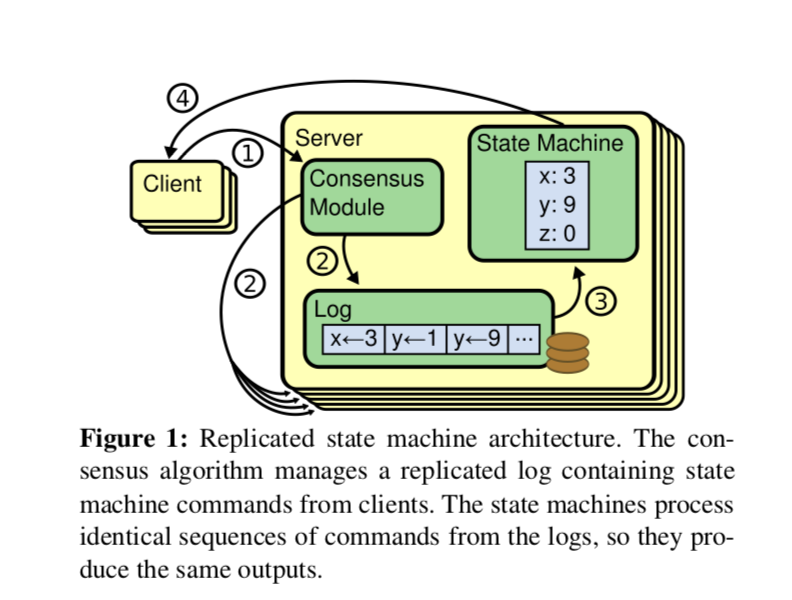
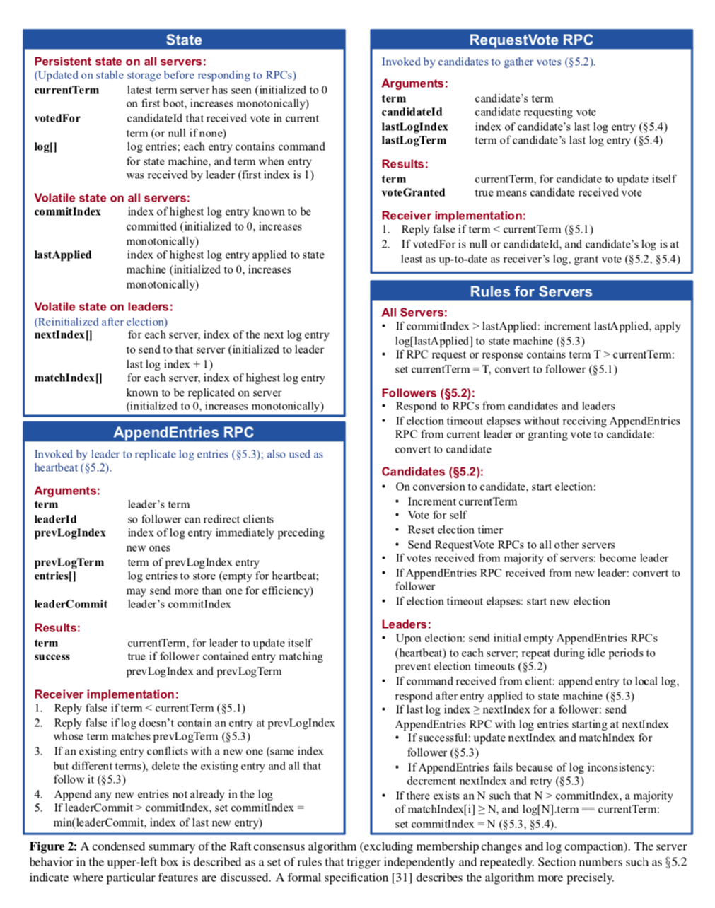
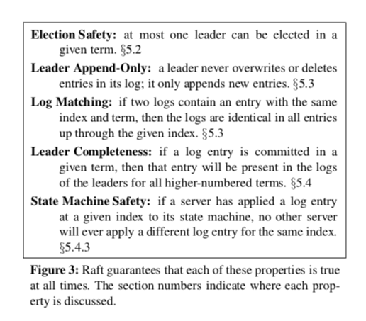
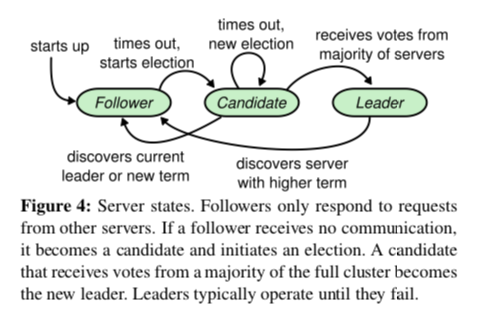
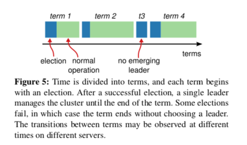
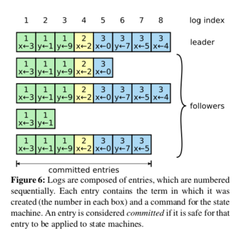
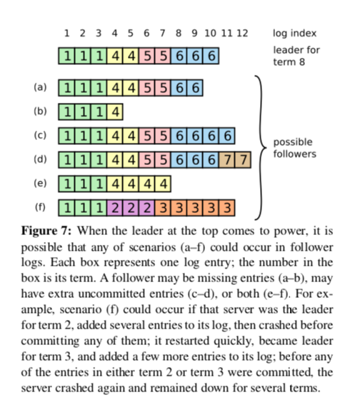
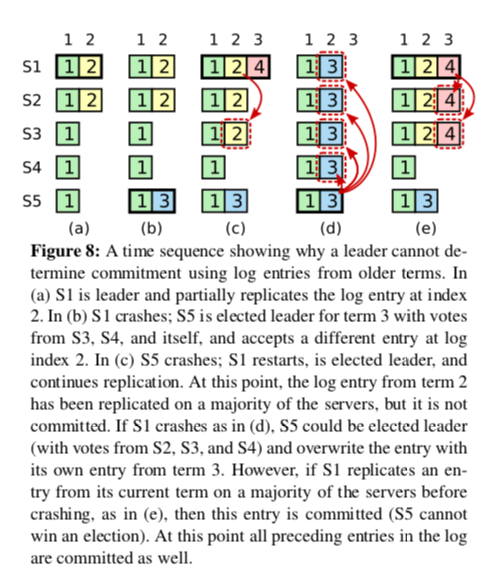
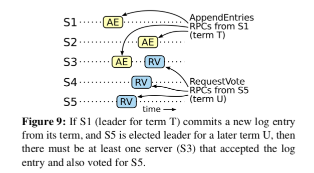

## **In Search of an Understandable Consensus Algorithm**

### 摘要
Raft是一个管理日志复制的一致性算法，它产生的结果相当于Paxos，它与Paxos一样高效，但是它的结构与Paxos不同. 这使得Raft比Poxos更易于理解并且为构建实际系统提供了更好的基础. 为了提高可理解性，Raft分离出了一致性问题的几个关键元素，例如领导选举，日志复制，和安全性，它还要求了更强的一致性以减少需要被考虑的状态数. 研究结果表明对于学生来说Raft比Paxos更加易于学习. Raft还包括一个用来改善集群成员的新机制，该机制用于重叠大多数(Overlapping Majorities)来保证安全.

### 1.介绍
一致性算法允许将一系列机器像一个整体一样进行工作，这样能够在某些成员机器故障时还能正常工作. 正是如此，它们在构建大规模可靠软件系统时扮演着重要角色. Paxos[**15**，**16**]在过去十年里主导了对共识算法的讨论，很多一致性算法的实现都是基于Paxos或者受它影响，Paxos已经成为教授学生关于共识算法的主要工具.

不幸的是，Paxos十分难以理解，尽管有很多尝试想让它更易于理解. 此外，它的结构需要一些复杂的更改来支持实际系统. 最终导致系统构建者和学生共同与Paxos斗争.

在我们与Paxos斗争之后，我们开始寻找一种新的一致性算法来为系统建设和教育提供一个更好的基础. 我们的方法是不同寻常的，因为我们首要目标是易懂. 我们是否可以为实际系统构建一个一致性算法并以一种比Paxos更加容易学习的方法来描述它？我们希望这个算法可以促进直觉开发，这对系统构建者来说是至关重要的. 重要的不仅是算法的工作，搞懂它是如何工作也同样重要.

这项工作的结果是一个称为Raft的一致性算法. 在设计Raft时我们应用了特别的技术来提高可理解性，包括分解(Raft分离了领导选举，日志复制和安全性)并且减少了状态空间(相对于Paxos，Raft减少了不确定性和服务之间可能不一致的方式). 一项用户研究表明两所大学总共43名学生表示Raft明显比Paxos更加易于理解. 在学习了这两种算法之后，这中间33名学生回答Raft的问题比Paxos的要好.

Raft在很多方面和现有一致性算法相似(最值得注意的是Oki和Liskov的复制[29，22])，但是它有一些新特性.

* 强有力的领导(Strong leader): Raft使用了一种比其他一致性算法更强的领导形式. 举个例子，日志条目只能从领导流向其他服务. 这简化了日志管理并且使Raft易于理解.
* 领导选举(Leader election): Raft使用了随机定时器来选举Leader. 这只给任何一致性算法所需的心跳增加了少量的机制，同时简单快速的解决了冲突.
* 成员的变化(Membership changes): 对于集群服务发生变化的场景Raft机制采用了一种新的共识方法，其中两种不同的配置在转换期间是重叠的. 这允许集群在配置转换期间继续正常工作.

我们相信Raft不管是在以教育为目标还是作为实现的基础相对于Paxos和其他一致性算法是更好的，相对于其他算法来说它更加简单并且更加易于理解. 它描述完全足以满足实际系统需要，它有很多开源实现并且在很多公司使用. 它的安全性已经被正式的说明和证明，与其他算法相比Raft效率更高.

这篇论文接下来的部分会在第二章节介绍复制状态机问题，在第三章节介绍Paxos的优缺点，在第四章节描述我们对于可理解性的一般方法，在五到八章节中展示Raft一致性算法，在第九章节对Raft进行评估，最后在第十章节讨论相关工作.

### 2.复制状态机
一致性算法是在复制状态机[**37**]背景下提出的. 在这种方法中，服务器集合上的状态机计算相同状态的相同副本，即使一些服务宕机服务器集合也能继续工作. 复制状态机需要在分布式系统中解决一些容错问题. 举例来说，具有单个集群领导的大规模系统例如GFS[**8**]，HDFS[**38**]和RAMCloud[**33**]，通常使用一个单独的复制状态机来管理领导选举和配置信息存储，这些信息必须在领导崩溃时能存活.复制状态机的例子包括Chubby[**2**]和ZooKeeper[**11**].

复制状态机通常使用复制日志来实现，如插图1所示. 每个服务存储一个包含一系列命令的日志，状态机会按照命令顺序有序执行. 每个日志以相同顺序包含相同命令，因此每个状态机处理相同的命令序列. 由于状态机是确定的，最后执行的结果也是一样的.

保持复制日志的一致是一致性算法的工作. 服务上的一致性模块接收到来自于客户端命令会将它们添加到日志中. 它和其他服务上得一致性模块通信以确保每个日志最终以同样的顺序包含同样的请求，即使一些服务出现了故障. 一旦日志被正确复制了，每个服务的状态机会按照顺序处理它们，并且将输出返回给客户端. 最终，这些服务看起来像是一个高可用单一状态机.

一致性算法在实际系统中通常有如下特性：

* 它们在所有非拜占庭情况下确保安全(从不返回错误结果)，包括网络延迟，分区，包丢失，重复和重新排序.
* 它们是功能齐全的(可用性)只要大多数服务是可用的并且可以和彼此还有客户端通信. 因此，一个典型的拥有五个服务的集群可以容许其中任意两个失败. 服务假定通过停止而失败，它们可能稍后从稳定的存储上恢复状态并且重新加入集群.
* 它们不依赖时间来确保日志的一致性，错误的时钟和极端场景下的消息延迟最坏场景下会导致一致性问题.
* 在一般情况下，只要集群的大多数服务响应了一轮RPC调用，一个命令就可以被完成，少数慢的服务不会影响整个系统的性能.

### 3.Paxos有什么问题?
在过去的十年，Leslie Lamport’s的Paxos协议[**15**]已经成为了一致性的代表. 这个协议在课堂中被广泛的教授，并且大多数一致性实现都是起源于此. Paxos首先定义了一个能够达成单一决策的协议，例如单个复制日志条目. 我们将这个子集称为单一决策Paxos. 之后Paxos通过组合多个这种协议来完成一系列的决策，例如一个日志(multi-Paxos). Paxos同时确保了安全性和活性性，并且它支持集群成员的更变. 它的正确性已经得以证明，通常情况下也是高效的.

不幸的是，Paxos有两个显著的缺点。第一个缺点是Paxos非常难以理解. 总所周知该算法完整的解释是不透明的. 很少有人能完全理解，除非付出巨大努力. 因此已经有好几次尝试想用更简单的术语来解释Paxos[**16**，**20**，**21**]. 这些介绍主要针对于单一决策子集问题，然而它们仍具挑战性. 在2012年NSDL参与者的一次非正式调查中，我们发现很少有人对Paxos有好感，包括经验丰富的研究员在内. 我们自己也在和Paxos斗争. 在阅读了很多通俗易懂的解释和设计了我们自己的替代协议后，我们才能完全理解Paxos协议，这个过程花费了将近一年的时间.

我们假设Paxos的不透明性源于它将单决策子集(Single-Decree Subset)作为它的基础. 单决策Paxos是晦涩且微妙的。它分为两个阶段并且没有简单直观的解释也不能独立的理解. 正是由于此，对于单决策Paxos如何工作很难有直观的理解. 为多决策Paxos增加了额外的复杂性和微妙性. 我们相信在多决策上为了达成一致性的所有问题都可以用一种更加直接和明显的方式分解.

Paxos的第二个问题是它没有为构建实际实现提供一个良好的基础. 其中一个原因是对于多决策Paxos并没有一个得到广泛认同的算法. Lamport的描述大都是关于单决策Paxos，它仅仅描述了实现多决策的可能的方法，但是很多细节被隐藏了. 有许多实现Paxos和优化Paxos的尝试，例如[**26**][**39**]和[**13**]，但是它们都各不相同也与Lamport描述的不一致. 例如Chubby[**4**]已经实现了一个类Paxos算法，但是它们其中很多的细节并没有公开.

此外，Paxos体系结构对于实际构建系统是很糟糕的. 这是单决策问题分解带来的另外一个问题. 举例来说，从许多日志条目中选出条目然后将它们合并到一个有序的日志中并没有带来什么好处. 这只会增加复杂性. 独立设计一个围绕日志的系统可能更加简单和高效，其中新日志条目按照限制顺序有序追加. 另一个问题是Paxos使用对等的点对点实现作为它的核心(尽管最终为了优化性能采用了弱领导者). 这仅仅在单决策的简单世界中是有效的，但是很少有实际系统用这个方法，如果要做出很多决策，首先选择一个领导人，然后由领导人来协调和做决定是更加简单和快速的.

因此，实际的系统和Paxos几乎没有相似之处. 每个实现都起始于Paxos，在实现过程中发现十分困难，然后他们发展成一个明显不同的架构. 这是浪费时间并且容易出错的，并且Paxos的晦涩难懂加剧了这些问题. Paxos算法在它正确性的理论上证明是很好的，但是实际实现和Paxos是非常不同的. 来自Chubby实现的一条评论就能很典型:

* Paxos算法的描述和实际实现之间有一条明显的鸿沟... 最终的系统往往将会基于一个没有经过证明的协议[**4**].

正是由于这些问题，我们得出了Paxos不能为系统构建和教育提供一个好的基础. 考虑到大型软件系统中一致性的重要性，我们决定看看能否设计出一种可以取代Paxos，具有更好性能的一致性算法. Raft就是这个算法.

### 4.可理解性的设计
设计Raft有如下目标: 它必须为构建系统提供一个完整且可实践的基础，这是为了显著减少开发者一系列的设计工作. 它必须在所有场景下都保证安全，在特别的操作场景下保证可用. 它对于常规操作必须是高效的. 但是我们最重要的目标-最困难的挑战是可理解性. 它必须使大多数人理解这个算法变成可能. 此外，它还必须能让开发者有一个直观的认识，这样才能使系统构建者去对它进行扩展.

在Raft设计过程中，我们不得不在很多场景做出选择. 在面临这种场景时，我们通常会权衡可理解性. 每种替代方案的可理解性如何？(举例来说，它的状态空间多复杂并且它是不是有很细微的含义?)对于读者来说该方法和实现是否容易理解？

我们意识到对于可理解性的分析具有高度主观性. 尽管如此，我们使用了两种普遍适用的技术. 第一个众所周知的方法是将问题分解. 我们会尽可能的将问题分解成可以被独立解决，解释，和理解的小问题. 举个例子，在Raft中我们将问题分解成领导选举(leader election)，日志复制(log replication)，安全(safety)和成员变化(membership changes).

第二个方法是通过减少要考虑的状态数来简化状态空间，使系统更加清晰并且消除了不确定性. 具体的说，日志不允许有空洞，并且Raft限制了日志之间不一致的可能性. 尽管在大多数场景下我们尽量消除不确定性，但是在某些场景下，不确定性可以提高可理解性. 特别是随机的方法引入了不确定性，但是它们倾向于通过简单的方式处理所有可能的选择来降低状态空间. 我们使用随机的方法来简化Raft领导选举算法.

### 5.Raft一致性算法
Raft是一种管理第二章节描述的日志复制算法. 插图2简要描述了算法，插图3列出了该算法的关键属性. 表格中这些元素会在本章节剩下部分分别进行讨论.

Raft首先通过选举出一个领导来实现一致性，然后给予这个领导完整的权利来对复制日志进行管理. 领导从客户端处获取日志条目，将它们复制到其它服务然后告诉这些服务什么时候这些日志可以被安全的应用到状态机. 拥有一个领导可以简化对日志复制的管理. 举例来说，领导可以决定在日志的什么地方存放新条目而不需要咨询其他服务，数据流以一种简单的方式从领导流向其它服务. 当领导出现故障或者和其他服务断开连接，一个新的领导将被选举.

通过选举领导人，Raft将一致性问题分解成三个相对独立的子问题，我们将在接下来的部分进行讨论：

* 领导选举(Leader election): 当现有领导故障时一个新的领导将被选举(5.2章节)
* 日志复制(Log replication): 领导必须从客户端处接收日志条目然后将它们复制到集群其他服务器，并且强制要求其他服务的日志与自己的保持一致(5.3章节)
* 安全性(Safety): Raft安全性的关键是插图3展示的状态机安全原则(State Machine Safety)，如果任一服务器将特定日志条目应用到它自己的状态机，那么没有其他服务可以应用一个不同的命令到相同的日志索引上. 章节5.4描述了Raft如何确保这个原则的. 这个解决方案在领导选举时包含了一个额外的限制条件，我们将在章节5.2进行描述.

在展示了这个一致性算法之后，这个章节会讨论关于可用性和系统中定时器的问题.

#### 5.1 Raft基础
一个Raft集群包含多个服务，对于一个拥有五个服务的集群，可以容忍两个服务出现故障. 在任意给定的时刻，每个服务都处于以下三种状态中的一种: 领导人，追随者和候选人. 通常情况下只有一个领导人，剩下的其他服务都是追随者. 追随者是被动的，它们自己不会发出任何请求，只会简单的回应来自领导人和候选者的请求. 领导处理所有来自客户端的请求(如果客户端和追随者通信，那么追随者会将信息发送给领导人). 第三种状态，候选人，它是用来选举成领导人的，在章节5.2会进行描述. 插图4阐述了这些状态和它们的转换关系. 它们的转换会在接下来进行讨论.

Raft将时间划分为任意长度不同的任期(terms)，如插图5那样. 任期被连续的整数进行编号. 每个任期起始于一次选举，一个或者多个候选者尝试成为领导人，就如章节5.2描述的那样. 如果一个候选者赢得了这次选举，它将在该任期的剩余时间成为领导人. 在一些场景下选票将被瓜分，这种情况该任期会由于没有领导人而结束，一个新的任期(伴随着新选举)会马上开始. Raft保证在一个给定的任期最多只会有一个领导人.

不同的服务在任期内可能观察到多次不同的状态转换，然而在某些场景下，一个服务也可能错过一次选举甚至整个任期. 任期在Raft中充当逻辑时钟[**14**]，并且他们允许服务检测过期信息(比如过期领导人). 每个服务保存当前任期序号(任期序号是随着时间单调递增的). 服务之间互相通信时会交换当前任期号. 如果一个服务的当前任期号比另一个要小，那么它更新自己的当前任期为一个较大值. 如果一个候选人或者领导人发现自己的任期号过时了，它立马会转换成追随者状态. 如果一个服务接收到一个包含过期任期号的请求，那么它会拒绝这个请求.

Raft服务之间通信采用RPC调用，最基础的一致性算法只需要两种类型的RPC调用，RequestVote RPC在选举期间由候选人发起(章节2)，AppendEntries RPC由领导人发起，用于复制日志条目和提供心跳机制(章节5.3). 章节7添加了第三种RPC调用用于服务之间传输快照. 如果服务在指定时间里没有收到RPC响应会进行重试，并且它们会并发的执行RPC调用以获取最好的性能.

#### 5.2 领导人选举
Raft使用心跳机制来触发领导人选举. 当一个服务启动时，它们会成为追随者. 一个服务会一直维持追随者的身份只要它能够收到来自领导人和候选人的有效RPC调用. 领导人周期性的发送心跳(不带任何条目的AppendEntries RPC)给追随者以保持它领导人的地位. 如果一个追随者在一个称为选举超时的时间周期内都没有收到心跳信息，那么它们会假设当前没有可用的领导人并且会发起一轮新的选举来选出一个新的领导人.

为了开始选举，追随者会自增当前任期然后转换成候选人状态. 然后给自己投票并且并发的向集群中其他服务发起RequestVote RPC. 候选人会一直保持该状态直到下列三种之一情形发生:

* 它赢得了选举
* 另一台服务赢得了选举
* 一个周期的时间过去而并没有服务赢得选举

这些情景将在接下来分别讨论.

一个候选人赢得选举的条件是它在一个任期内获得了集群中大多数服务的投票. 每个服务在一个任期内最多投票给一个候选人，基于先到先得的原则(注意: 章节5.4对于投票增加了额外的限制). 大多数原则确保了一个特定任期内只有一个候选人可以赢得选举(选举安全特性在插图3展示). 一旦候选人赢得了选举，它将成为领导人，它会给集群中的其他服务发送心跳消息来保证自己的领导人地位和阻止新一轮的选举.

在等待投票的期间，候选者可能会接收到其他声称自己是领导人的AppendEntries PRC. 如果这个领导人的任期比当前候选人的任期要大，候选人会意识到这个领导人是合法的并且将自己的状态转变为追随者. 如果RPC中带有的任期比候选人当前的任期要小，那么候选人会拒绝这个RPC调用并且维持自己候选人的身份.

第三种可能性的结果是候选人既没有赢得选举也没有输掉选举. 如果有太多追随者在同一时间变成了候选人，选票将被瓜分并且没有候选人获得大多数选票. 当这种情况发生，每个候选人都会选举超时并且通过自增任期开启新一轮的选举，然后发起新一轮RequestVote RPC，然而如果不采取其他措施，瓜分选票的结果将不断延续.

Raft采用了随机选举超时时间来确保瓜分选票是罕见的，并且可以迅速得以解决. 为了在第一时间组织瓜分选票，选举超时时间在一个固定的间隔内选择一个随机值(例如150ms~300ms). 这将分散服务器，这样在大多数情况下只有一个服务会率先超时. 它赢得这次选举并且在其他服务超时之前发送心跳. 同样的机制也被用于处理瓜分投票. 每个候选人在开始一场新的选举时会指定一个随机的超时时间. 它会等到超时时间过去之后才开始下一轮选举. 这降低了在新一轮选举中其他服务瓜分选票的可能性. 章节9.3展示了这种方法可以迅速的选出领导人.

选举机制是理解性引导我们设计替代算法的一个例子. 最初我们计划使用一种排名系统. 每一个候选人都被指定一个唯一的排名，排名用于在竞争的候选人中选择领导人. 如果一个候选人发现另外一个候选人的排名更高，它将转变为追随者，这样拥有高排名的候选者将更有可能在选举中赢得胜利. 但是我们在这种方法中发现了一些可用性方面的问题(低排名的服务需要在高排名服务宕机之后，等待超时之后才能再次成为候选人，但是如果这个过程太快，它就会重置选取领导人过程). 我们多次对这个算法做了调整，但是每次调整之后又会在极端场景下出现新的问题. 最终我们得出了随机重试的方法是更加易于理解的结论.

#### 5.3 日志复制
一旦领导人被选举出来，它就开始为客户端服务. 每一个客户端的请求包含一个可以被复制状态机执行的命令. 领导将命令作为一个新的条目追加到日志后面. 然后它并发向其他服务调用AppendEntries RPC来将该条目拷贝给它们. 当条目被安全的拷贝(我们会在接下来进行描述)，领导人将这个条目应用到自己的状态机并且向执行结果返回给客户端. 如果追随者故障了或者运行缓慢或者网络丢包了，领导人会无限重试AppendEntries RPC调用(即使它已经返回结果给客户端了)，直到所有追随者最终都收到了所有的日志条目.

日志的组织形式如插图6所示. 每个日志条目存储着状态机命令和领导人接收到这个条目时的任期号. 日志条目中的任期号用来检测日志之间的不一致并且用来确保插图3中的一些属性. 每个日志条目中还包含一个整形索引来识别该条目在日志中的位置.

领导人决定什么时候可以将一个日志条目安全的应用到状态机. 这样的条目我们称为`可提交`的. Raft确保所有已经被提交的条目是持久化的并且最终都会被所有有效的状态机执行. 当一个日志条目被领导人创建并且被拷贝到集群中大多数服务(插图中的Entry7)，这条日志就是可提交的. 领导人日志中该日志条目之前的也都是可提交的，包括由前领导人创建的条目. 章节5.4讨论了在领导人更替之后应用这个规则的一些细节并且展示了这种提交方式是安全的. 领导人会追踪可提交日志的最大索引，并且在给其他追随者发送AppendEntries RPC(包括心跳)的时候带上这个索引信息，一旦追随者知道一个日志条目是可提交的，它就会将这个条目应用到自己本地的状态机(以日志顺序).

我们设计Raft日志机制来保证不同服务器上日志的一致性. 这不仅简化了系统的行为还使它更可预测，并且它也是保证安全的重要组成部分. Raft保证以下特性(同时也保证插图3中的日志匹配原则):

* 如果不同日志中的两个条目拥有相同的索引和任期，那么它们存储相同的命令
* 如果不同日志中的两个条目拥有相同的索引和任期，那么它们之前的日志条目都是确定的.

第一条特性成立是由于领导人在给定的任期内在一个索引位置上最多创建一个条目，并且日志条目永远不会在日志中变换位置. 第二条特性是AppendEntries RPC时的简单检验机制保证的. 当发送一条AppendEntries RPC调用时，领导人会将当前条目的前一个条目对应的索引信息和任期号包含在里面. 如果追随者没有在日志中发现同样索引和任期的日志条目，它会拒绝这次新追加的条目. 一致性检查遵循以下步骤：一开始日志为空的状态是满足日志匹配原则的. 一致性检查的时候保证了日志添加时的日志匹配原则. 最终，无论何时追加条目RPC返回成功，领导人就知道追随者日志和自己一样.

在一般情况下，领导人和追随者的日志是保持一致的，所以追加条目RPC检查从不会失败. 然而领导人崩溃可能导致日志不一致(旧的领导人可能没有完全复制它日志中的条目). 这些不一致可能会导致一系列领导人和追随者崩溃. 插图7展示了追随者和新领导人日志不一致的场景. 一个追随者可能会丢失领导人存在的条目，也可能包含领导人不存在的条目，也可能两者都会发生. 遗失和多出来的日志条目可能会跨多个任期.

在Raft中，领导人通过强制追随者复制自己日志来处理不一致问题. 这意味着追随者中与领导人冲突的日志条目将被领导人日志条目覆写. 章节5.4会展示当加上一些限制条件之后这种操作是安全的.

为了使追随者的日志和自己相同，领导人必须找到追随者最后一个与它一致的日志条目. 然后删除追随者在该位置之后的条目并且将自己该点位后面的日志条目都发给追随者. 这些操作都在执行AppendEntries PRC进行一致性检查时完成. 领导人会为每个追随者维护一个nextIndex，表示领导人接下来要发送给追随者那条日志的索引信息. 当领导人开始掌权时，它将所有追随者的nextIndex初始化为自己最新日志的后面一条(插图7中的11). 如果追随者的日志和领导人的不一致，那么在调用AppendEntries RPC时一致性检查就会出问题. 当领导人收到拒绝响应时，领导人会将nextIndex递减，然后重新调用AppendEntries RPC. 最终nextIndex将会指向领导人和追随者日志相同的那个索引位置. 当到达这种状态时，AppendEntries RPC将返回成功，这样就将追随者日志中冲突的条目移除并且追加了领导人多余的日志条目. 一旦AppendEntries RPC调用成功，这就说明追随者和领导人的日志保持一致，这样的状态会保持到该任期结束.

如果需要的话，算法还可以通过优化来减少拒绝AppendEntries RPC的次数. 举例来说，当拒绝一次AppendEntries RPC的时候，追随者可以带上冲突条目对应的任期和该任期第一个条目的索引信息. 有了这些信息，领导人可以直接递减nextIndex来跨过那个任期所有冲突的条目. 这样的话一个冲突任期内的所有条目只需要一次AppendEntries RPC，而不是每个冲突条目一次RPC. 在实践中，我们怀疑这种优化是否有必要，因为一致性检查很少失败，就算是失败也只会有少数条目不一致.

有了这个机制，领导人在掌权时不需要额外的措施来恢复日志的一致性. 他只需执行常规操作，响应一致性检查失败的AppendEntries RPC调用，日志就能自动的恢复一致. 领导人从不会覆盖写和删除自己的日志(插图3展示了领导人只能追加的特性).

这种日志复制机制展示了第二章节描述的一致性属性. Raft可以接收，复制，应用新的日志条目只要集群中大多数服务是存活的. 通常情况下一个新的条目只需要一轮RPC调用就能复制到集群中大多数服务上. 单个运行缓慢的追随者不会影响整个集群的性能.

#### 5.4 安全性
前面的章节描述了Raft如何选择领导人和复制日志条目. 然而描述的机制还不足以确保每个状态机都以相同的顺序执行命令. 举例来说，追随者可能在领导人提交若干条日志的时候宕机了，之后它又被选择成为领导人并且用新的日志条目覆盖了旧的那些，这样的话不同的状态机将会执行不同的命令序列.

这个章节将通过对领导人选举做一些额外的限制来完善Raft. 这些限制可以确保在给定的任期，领导人会包含所有之前任期提交的条目(插图3的领导人完全原则). 有了这个限制，日志提交规则更加清晰了. 最终，我们提出了领导人完全原则的证明草图并且展示它如何让复制状态机行为正确的.

##### 5.4.1 选举限制
在所有以领导人为基础的一致性算法中，领导人最终必须存储所有已提交的日志条目，在一些一致性算法中，例如Viewstamped Replication[**22**]，一个服务即便一开始没有包含所有已经提交的条目也能被选举为领导人. 这些算法包含了一些额外的机制来识别遗失的条目并且将它们传输给新的领导人，这个过程要么在选举之中完成，要么在选举之后立即开始. 不幸的是，这导致了额外的机制和复杂性. Raft使用了一种更加简单的方法，它保证了所有之前任期提交的条目都会出现在选举时新领导人的日志里. 而不需要将这些条目传输给领导人. 这意味着日志条目的流向只有一个方向，从领导人到追随者，领导人从不会覆写它已存在的日志条目.

Raft采用投票机制来阻止没有包含所有已经提交条目的候选人赢得选举. 一个候选人为了赢得选举必须和集群中大多数服务通信，这意味着所有已经提交的条目最少在这些服务其中一个中出现. 如果候选人的日志至少和集群中大多数服务的日志一样新(up-to-date会在下面介绍)，那么它一定包含所有已提交的条目. RequestVote PRC实现了这个限制. RequestVote RPC包含了候选人的日志信息， 如果投票者自己的日志比候选人要新，那么它会拒绝投票.

Raft通过比较日志中末尾条目的索引和任期来判断哪个日志更新. 如果两个日志中末尾条目的任期不一样，那么任期更高的那个日志更新. 如果两个日志末尾条目任期相同，那么日志末尾条目索引大的那个日志更新.  

##### 5.4.2 提交之前任期的条目
正如章节5.3描述的，领导人认为当前任期一个条目被提交的前提条件是它已经被集群中大多数服务存储了. 如果领导人在提交一个条目之前崩溃了，之后的领导人会尝试完成日志复制. 然后领导人并不能因为前一个任期的条目被集群中大多数服务存储了就断定它被提交了. 插图8描述了一种场景，一条旧的日志条目被集群中大多数服务存储了，但是它仍然被之后的领导人覆写了.

为了消除插图8展示的问题，Raft从来不通过计算复制数量来提交之前任期的日志条目. 只有领导人当前任期的日志条目通过计算复制数量来进行提交. 一旦当前任期的一个条目以这种方式被提交了，那么该条目之前的所有条目都间接的被提交了(这是由于日志匹配原则). 在某些情况下，领导人可以安全的知道一个老的日志条目是否被提交(例如，这个条目已经被集群中大多数服务存储)，但是Raft为了简单使用了更加保守的方法.

因为当领导人复制之前任期的日志条目时，日志条目包含了它们原始的任期号，这使得Raft在提交规则中增加了额外的复杂性. 在其它一致性算法中，如果新领导人要从之前的任期中复制日志条目，它必须使用当前的新任期号. Raft的方法使得推理日志条目更加简单，因为它们全程都保持着同样的任期号. 此外Raft中的新领导人相对于其它算法只会发送少量的之前任期条目(其它一致性算法必须发送冗余的日志条目并且在它们被提交之前重新排序)

##### 5.4.3 安全性论证
在给出了完整的Raft算法之后，我们现在可以更加精确的论证领导人完全原则(Leader Completeness)，这些基于章节9.2提出的安全性证明. 我们首先假设领导人完全原则不成立，然后我们推导出矛盾. 假设任期T的LeaderT在当前任期T内提交了一个日志条目，但是这个日志条目并没有存储在之后任期的领导人上. 我们设最小的任期U(U>T)，任期U的LeaderU没有存储这个日志条目.

1. 在LeaderU选举期间肯定不存在这条已经提交的日志条目(领导人从来不会删除和覆写日志条目)
2. LeaderT将这个日志条目拷贝到了集群中大多数服务上并且在LeaderU选举时获得了集群中大多数服务的投票，因此，至少有一个服务接收了LeaderT的日志拷贝并且投票给了LeaderU，正如插图9所示，这个投票者是导致矛盾的关键.
3. 这个投票者肯定在给LeaderU投票之前接收到LeaderT的提交条目. 否则它会拒绝LeaderT的AppendEntries请求(因为它当前的任期比T要大)
4. 这个投票者在给LeaderU投票时仍然存储该条目，因为任何中间领导人都包含这个条目(基于假设)，领导人不会移除条目，并且追随者只有发现它们与领导人冲突时才会移除条目
5. 投票者给LeaderU投票成功，这意味着LeaderU的日志至少要和投票者一样新. 这就导致了两个矛盾之一.
6. 首先，如果投票者和LeaderU最后一条日志任期号相同，那么LeaderU的日志至少要和投票者一样长，所以LeaderU日志中包含了投票者的所有日志. 这就是一个矛盾，因为投票者包含了这个已经提交的日志条目，但是LeaderU我们假设没有.
7. 否则，LeaderU最后一条日志的任期肯定要比投票者要大. 不仅如此，它还要大于T，因为投票者最后一条日志的任期最小也是T(它包含了任期T提交的日志条目). 生成LeaderU最后一条日志的前领导人日志中肯定包含该已经提交的条目(通过假设). 这样的话，通过日志匹配原则，LeaderU日志中肯定包含了已经提交的条目，这也是矛盾的.
8. 这就完成了矛盾推导. 因此所有在任期T之后的领导人肯定包含在任期T内提交的所有条目.
9. 日志匹配原则保证将来的领导人日志中同样包含间接提交的日志条目，例如插图8d中的索引2.

给出领导人完全原则(Leader Completeness)，我们能证明插图3中的状态机安全原则(State Machine Safety)，讲的就是如果服务在给定的索引应用了一条日志条目到自己的状态机上，没有其他服务可以应用一条不同的日志条目到同样的索引中. 在一个服务应用一条日志到自己的状态机时，它和领导人在该条新应用日志之前的所有日志都相同，并且已经被提交. 现在我们来考虑在任何一个服务应用一个指定索引位置日志的最小任期. 日志完全匹配原则(Log Completeness)保证更高任期领导人将会存储相同的日志条目，所以之后任期里应用某个索引位置的日志条目对应的值也会相同，因此，状态机安全特性是成立的.

最终，Raft要求服务以日志索引的顺序应用条目到状态机. 结合状态机安全原则来看，这意味着所有服务会应用同样的日志集到它们的状态机当中，并且是以相同的顺序.

#### 5.5 追随者和候选者崩溃
到目前为止我们的关注点一直在领导人故障. 追随者和候选人崩溃处理起来相对于领导人崩溃更加简单，并且它们处理方式一样. 如果一个追随者或者候选人崩溃了，那么发送给它的RequestVote和AppendEntries将会失败. Raft通过无限重试来处理这些失败. 如果崩溃的机器重启了，那么这些PRC调用将会成功. 如果一个服务在完成RPC之后但是在响应之前崩溃了，那么在它重启之后可能会接收到相同的RPC调用. Raft的PRC调用时幂等的，所以这不会有什么问题. 举例来说，如果追随者收到了一个已经包含其中日志的AppendEntries请求，它将忽略新请求中的这些日志条目.

#### 5.6 时序和可用性
我们对Raft的要求之一就是安全性不依赖时序(timing)，这个系统并不会由于某些事件比期待的发生得早或者晚而产生不正确的结果. 然而，可用性(系统及时响应客户端的能力)不可避免要依赖时序. 举个例子，如果消息交换的时间比通常服务崩溃的时间还要长，候选者将无法维持足以赢得选举的时间，没有一个稳定的领导人，Raft将无法正常工作.

领导人选举是Raft对时序要求最关键的地方. 只要系统满足以下的时序要求，Raft就能正常的选出并且维持一个稳定的领导人.

* broadcastTime << electionTimeout << MTBF

在这个不等式中broadcastTime是一个服务并发的向集群中其他服务发送RPC调用并且收到回复的平均时间. electionTimeout是在章节5.2中介绍的选举超时时间. MTBF是单个服务故障的平均时间. 广播时间必须比选举超时时间小一个数量级，这样领导人才能发送心跳来阻止追随者发起新一轮的选举，这个不等式同样可以使瓜分选票变成不可能. electionTimeout要比MTBF小几个数量级，为的是系统稳定运行. 当领导人崩溃，系统大约会在electionTimeout的时间内不可用. 我们希望这占所有时间的很小一部分.

broadcastTime和MTBF是由底层系统决定的性质，而electionTime则需要我们做出选择. Raft的RPC调用需要接收方将接收到的信息持久化到稳定的存储上，所以broadcastTime的时间基于存储技术大约在0.5ms ~ 20ms之间. 最终，electionTime一般在10ms ~ 500ms之间. 大多数服务的MTBF都在几个月甚至更长，这很容易满足时序需求.

...

