## **WiscKey: Separating Keys from Values in SSD-conscious Storage**

### 摘要
我们提出WiscKey，一种持久化的基于LSM-Tree的键值存储，具有面向性能的数据布局，将键值对分离从而最小化I/O放大，WiscKey这种设计针对SSD进行了高度的优化，同时利用了设备顺序和随机性能的特性. 我们在工作场景下同时使用微基准测试和YCSB演示WiscKey的优势. 微基准测试的测试结果显示WiscKey在加载随机数据的场景下比LevelDB快2.5到111倍，在随机查询的场景下比LevelDB快1.6到14倍，在YCSB六种工作场景下WiscKey比LevelDB和RocksDB都要快.

### 1. 介绍
持久化键值对存储在数据密集型的应用中扮演着重要的角色，包括网络索引[**16**，**48**]，电子商务[**24**]，数据去重[**7**，**22**]，相片存储[**12**]，云数据[**32**]，社交网络[**9**,**25**,**51**]，在线游戏[**23**]，消息[**1**,**29**]，软件仓库[**2**]和广告[**20**]，通过实现高效插入，点查询和范围查询，键值对存储服务成为越来越多重要应用的基石.

对于写密集型的工作场景，基于LSM-Tree[**43**]实现的键值对存储已经成为了最先进的技术，各种各样基于LSM-Tree实现的分布式存储和本地存储广泛应用在各大生产环境当中，例如Google的BigTable[**16**]和LevelDB[**48**]，FaceBook的Cassandra[**33**]，HBase[**29**]和Rocksdb[**25**]，Yahoo的PNUTS[**20**]还有Basho的Riak[**4**]. LSM-Tree相对于其他索引结构(例如B-Trees)的主要优势在于它可以维持写操作的顺序，在B-Trees上的一个小小的更新操作可能会牵连多次随机写操作，这在固态硬盘和机械硬盘上都是效率低下的.

为了提供高效的写性能，LSM-Tree将键值对进行打包然后顺序的写入它们，随后为了提高查询效率(点查询和范围查询)，LSM-Tree在后台不断的对键值对执行进行读取排序和写入操作，从而保证键和值的顺序，最终，同样的数据在它的生命周期内被读取和写入多次(我们会在后面进行展示)，在典型的LSM-Tree中，这种I/O放大可以达到50倍甚至更高[**39**，**54**].

基于LSM-Tree技术的成功与它在传统机械硬盘上的使用紧密相关，在机械硬盘上随机I/O比顺序I/O慢一百多倍[43]，因此，执行额外的顺序读写操作来不断的保持Key的有序并且启用有效的查找是一个很好的权衡.

然而，存储领域正在发生飞速的变化，现代固态硬盘在很多重要的场景中已经取代了传统的机械硬盘，和机械硬盘相比，固态硬盘在性能和可靠性方面有着本质的不同，在考虑键值对存储的设计时，我们相信以下三个差异是至关重要的，首先在SSD上随机读写性能和顺序读写性能并没有像HDD差得那么大，因此LSM-Tree为了降低随机I/O操作而去执行大量的顺序I/O可能会浪费不必要的带宽，此外，固态硬盘具有很大程度的内部并行性，在固态硬盘上构建的LSM-Tree必须利用以上提到的并行性仔细的设计[53]，最后，在固态硬盘上反复的写入会导致其有磨损[**34**，**40**]，LSM-Tree的高写放大会显著的降低硬件设备的寿命，我们会在论文中进行展示，这些因素的组合极大的影响了LSM-Tree在SSD上的性能，使吞吐量提高了90%但是写负载增加了10倍以上. 虽然在LSM-Tree下用固态硬盘替换机械硬盘能够提高性能，但是使用当前的LSM-Tree技术，固态硬盘的潜力很大程度上没有得到体现.

在这篇论文中，我们会提出WiscKey, 一种适用于SSD的持久化键值对存储，源自流行的LSM-Tree实现，LevelDB. 在WiscKey背后最重要的思想就是将Key和Value进行分离[**42**]，只将Key在LSM-Tree中进行顺序存储，而Value则单独存放在日志中，在WiscKey中我们将Key排序和垃圾收集进行了解耦，而LevelDB是将他们捆绑在一起，这个简单的技术可以通过避免排序时候不必要的值移动从而降低写放大，此外，LSM-Tree的体积也会明显的减小，导致在查询期间更少的设备读取以及更好的缓存，WiscKey保留了LSM-Tree技术的优点，包括极好的插入和查询性能，但是没有过多的I/O放大.

将Key和Value分离存储带来了一系列挑战和优化的可能性，首先范围查询(Scan)的性能可能会受到影响，因为Value不再有序的存储在一起，WiscKey通过利用SSD内部丰富的并行性解决了这个挑战，此外WiscKey需要垃圾收集机制来回收无效Value占据的空间. WiscKey提出了一种在线的轻量级的垃圾收集器，它只涉及顺序的I/O操作并且最小化对前台工作的影响，最后，将键值对分离在崩溃的时候会带来了数据一致性的挑战，WiscKey利用了当代文件系统一个有趣的属性，那就是在追加不会在崩溃的时候产生垃圾数据，WiscKey在优化了性能的同时提供了和现代LSM-Tree系统相同的一致性保证。

我们将WiscKey和LevelDB[48]还有RocksDB[25]做了性能对比测试(两种流行的LSM-Tree键值存储)，在大多数工作场景下，WiscKey的性能明显更高，用LevelDB自己的微基准测试工具进行测试，WiscKey在加载数据库方面比LevelDB快2.5~111倍不等，取决于键值对的大小不同. 在随机读的场景下，WiscKey比LevelDB快1.6~14倍不等. 但是WiscKey的性能并不总是优于标准的LSM-Tree，如果小Value以随机的顺序进行写入，并且对大数据集进行范围查询，WiskKey的性能会比LevelDB要差，然而这种工作场景并不能反映出我们实际的使用场景(在实际使用过程中我们主要使用小区间的范围查询)并且我们可以通过对log进行重组来提升性能，在更加符合实际使用场景的Yahoo！CloudServing Benchmark[21]测试下，WiscKey在所有YCSB工作场景下比LevelDB和RocksDB更快，并且遵循微基准测试工具加载和随机查询类似的趋势.

本文的其余部分组织如下，我们会在第二章节介绍背景和动机，第三章节介绍WickKey的设计思想，第四章节进行性能分析，第五章节简要的介绍相关工作，最后在第六章中做总结.

### 2. 背景和动机
在这个章节中，我们首先介绍LSM-Tree的概念，然后解释LevelDB的设计，一种基于LSM-Tree技术的的KV存储系统，我们会调查在LevelDB当中的读写放大问题，最后我们会介绍现代存储硬件的特点.

#### 2.1 日志结构合并树
LSM-Tree是一种提供了高速插入和删除[**43**]键值对索引的持久数据结构，为了应用物理设备的连续带宽，它将数据延迟写入并且打包成大块，因为在硬件设备上随机写入比顺序写入要慢近两个数量级，LSM-Tree相对于传统的B-Tree提供了更好的写性能(B-Tree需要随机写)

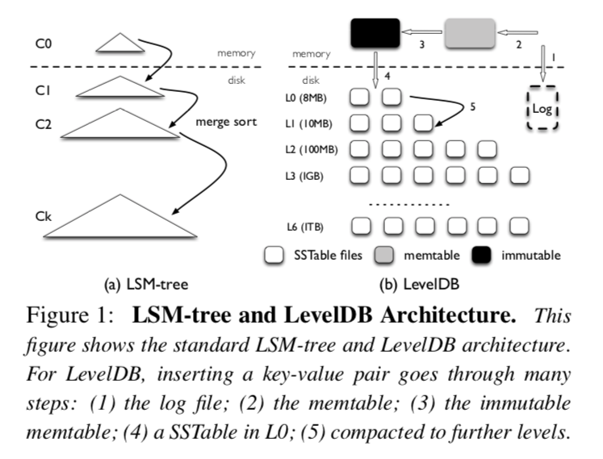

LSM-Tree由几个体积呈指数级增长的组件构成，C0到Ck(如插图1所示)，C0组件是常驻内存的原地更新有序树，而其他的组件(C1到Ck)是常驻在磁盘上只能追加的B树.

在数据插入到LSM-Tree的期间，被插入的键值对被顺序的追加到在磁盘上Log文件末尾，这样在发生意外崩溃的时候可以从Log中恢复数据，然后键值对会被插入到常驻内存的C0中(C0内部是按Key进行排序的)，C0允许高效的查询和遍历最近添加的键值对，一旦C0达到它的体积限制，它将和磁盘上的C1进行合并(类似于一种归并合并的方法)，这个过程我们称为Compaction，新的合并树会顺序的写到磁盘上，替换旧版本的C1，当任意一个Ci达到了它的体积上限，Compaction同样也会发生在磁盘组件上，需要注意的是Compactions只会在相邻的层级之间执行(Ci和Ci+1)，并且这个行为可以在后台异步的执行.

为了提供查询操作， LSM-Tree可能需要查询多个层级的组件，注意C0包含最新的数据，接着是C1，以此类推，因此为了获取键值对，LSM-Tree以级联的方式从C0组件开始搜索，直到在最小的组件Ci中获取到期望的数据，和B-Tree比较，LSM-Tree在点查找的场景下可能需要多次读取，因此，LSM-Tree更加适合写多读[**43**]少的场景.

#### 2.2 LevelDB
LevelDB是一个基于LSM-Tree实现的被广泛应用的KV存储系统，它受到了BigTable[**16**，**48**]鼓舞，LevelDB支持范围查询，快照还有其他对当代应用有用的特性，在这一章节中我们将简要介绍LevelDB设计的核心思想

LevelDB的整体架构在插图1中进行了展示，在LevelDB中主要的数据结构是磁盘上的Log文件，两个常驻内存的跳表(Memtable和Immutable Memtable)，和七个(L0到L6)在磁盘上存储SST文件的层级，LevelDB最初将插入的键值对存入到Log文件和内存中的Memtable当中，一旦Memtable满了，LevelDB切换到一个新的Memtable和Log去处理来自用户新的写入请求，在后台，刚刚的Memtable将被转换成Immutable Memtable，然后Compact线程会将它刷到磁盘上，生成一个新的SST文件(通常来说大小在2MB的样子)放到Level0当中，然后先前的log文件就被抛弃了.

每一层级SST文件的总体积是有限制的，随着层级数增加十倍，举个例子，第一层的文件总体积为10MB，而第二层文件的总体积就为100MB，为了维持体积大小的限制，一旦Li层文件的总体积超过了本身的限制，Compaction线程将会在Li层选择一个SST文件，和Li+1所有和该文件有重叠的SST文件进行归并排序，然后在Li+1层生成新的SST文件，Compaction线程不断运行直到所有层级对应文件总体积符合限制条件，另外，在Compaction的期间，LevelDB确保除了Level0层以外其他层上的SST文件Key区间不会有重叠，Level0层的SST文件与文件之间可能会有重叠，因为他们是通过内存中的Memtable直接刷盘获得的.

在执行一个查询操作的时候，LevelDB先从Memtable中进行查找，然后再是Immutable Memtable，最后在磁盘上按照L0到L6的顺序进行查找，定位一个随机Key需要搜索SST文件的数量受到最大层数的限制，因为Key不会在同一层层级中不同的SST文件中出现，除了L0，因为Level0中的SST文件可能包含重叠Key，一次查询操作可能在Level0层查找多个文件，为了避免较大的查找延迟，LevelDB在L0层SST文件数量大于8的时候会采取缓写的措施对写入进行降速，避免Compaction线程无法及时的将L0的SST文件Compaction到L1层.

#### 2.3 读写放大
读写放大是类LSM-Tree结构的主要问题，例如LevelDB，读写放大的定义是从底层存储设备读写数据量与用户实际数据请求量之比，在这个章节中我们将对LevelDB的读写放大问题进行分析.

为了实现大量的磁盘顺序访问，LevelDB写的数据比实际的要多(虽然是顺序的)，也就是说LevelDB有着很高的写放大，因为Li层的体积限制是Li-1的十倍，在Compaction的期间将Li-1层的一个SST文件合并到Li层，LevelDB在最坏的场景下要在Li层读取十个文件，然后在归并排序之后再将这些文件写回到Li层，因此在相邻的两个层级移动一个文件写放大可以达到十倍，对于大量的数据，因为新生成的数据会通过一系列的Compaction最终从L0迁移到L6，写放大可能超过50(L1到L6每一层的放大是10)

由于在设计之初做的一些权衡，读放大一直是LSM-Tree一个主要的问题，这里有两个在LevelDB中造成读放大的根源，首先为了查找一个键值对，LevelDB可能需要检查多个层级，在最坏的场景下，LevelDB需要在L0中查找八个SST文件，然后在剩下的六个层级中各查找一个，总共就是14个文件，另外，为了在SST文件中查找一个键值对，LevelDB需要在这个SST文件中读取多个Block，具体来说，读取数据的总量来自于IndexBlock，BloomFilterBlock还有DataBlock. 举个例子来说，读取1KB的键值对，LevelDB需要读取16KB的IndexBlock，4KB的BloomFilterBlock，和4KB的DataBlock，总共24KB，因此，考虑到最坏14个SST文件的场景，LevelDB的读放大可以达到24 * 14 = 336倍之多，小的键值对可能导致更加严重的读放大问题.

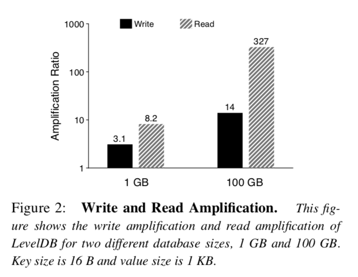

为了测量实际场景中LevelDB的读写放大问题，我们做了如下实验，我们首先启动数据库然后加载大小为1KB的键值对，然后从数据库中查找10w个条目，我们选择随机Key将数据库加载到两种不同的体积，插图2显示了在加载数据期间的写放大和在查询期间的读放大，对于1GB的数据库，写放大为3.1，而对于100GB的数据库写放大增加到了14. 读放大遵循相同的趋势，对于1GB的数据库读放大达到了8.2，而对于100GB的数据库读放大达到了327，写放大问题随着数据库体积越大而越明显的原因显而易见，随着越来越多的数据写入，键值对将更有可能沿着Level移动得更远，换句话说，在将低Level的数据Compaction到高Level的期间，LevelDB会对数据写很多次. 然而写放大并没有达到我们先前预言的最坏场景，因为在不同层级之间合并文件写放大通常都小于最坏的场景(前面提到的写放大为10). 读放大问题也会随着数据库体积越大而越严重，对于小体积的数据库所有的IndexBlock和BloomFilterBlock都能被缓存在内存中. 然而对于大体积的数据库，每一次查询都可能会访问到不同SST文件，需要为每次读取IndexBlock和BloomFilter付出代价.

值得注意的是，高的读写放大是对硬盘设备做出的一个权衡，举个例子，对于具有10ms寻道延迟和100MB吞吐量的硬盘，随机访问1KB数据的花费大约是10ms，而顺序获取下一个Block只需花费10us，随机和顺序延迟比例在1000：1，因此，和可供替代的要求随机写的数据结构相比(例如B-Tree)，在硬盘[**43**，**49**]上写放大小于1000的顺序写模式将更快，另一方面，对于读放大问题，LSM-Tree仍然可以和B-Tree相媲美，举个例子，考虑一个高度为5，块大小为4KB的B-Tree，随机查询1KB的键值对需要访问6个Block，最终导致读放大为24.

#### 2.4 快速存储硬件
许多现代服务采用SSD来提高性能，和硬盘类似，随机写入在SSD中也被认为是有害的[**10**，**31**，**34**，**40**]，由于其独特的擦写周期和昂贵的垃圾收集，尽管SSD初始的随机写入性能很好，但是在Block被反复利用之后性能会有显著的下降，因此LSM-Tree避免随机写的特性非常适合SSD，许多SSD优化的键值存储系统都是基于LSM-Tree[**25**，**50**，**53**，**54**].

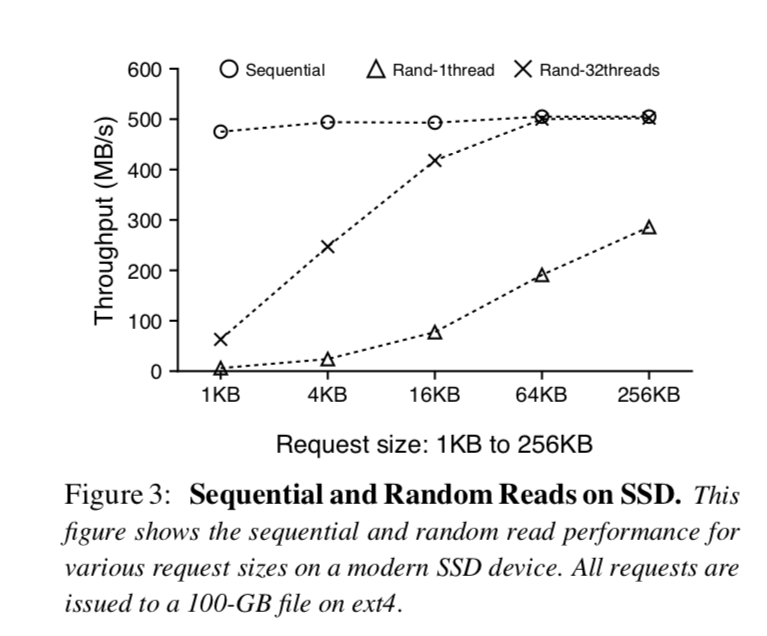

然而不像硬盘，随机读(和顺序读相比)在SSD上相对性能更好，此外，当随机读取在SSD上并发请求时，总的吞吐量可以和某些工作场景[**17**]下顺序吞吐量相媲美，举个例子，在插图3中展示了在各种各样请求大小场景下500GB的三星840 EVO SSD上顺序读和随机读性能，对于单线程的随机读吞吐量随着请求大小而变大，在请求大小为256KB时达到了顺序读吞吐量的一半大，利用32个线程并发的随机读，当请求大小达到了16KB，总的吞吐量可以和顺序读的吞吐量相同，对于更加高端的SSD，多线程并发读取和顺序读取之间的吞吐量差距会更小[**3**，**39**].

正如我们在这个章节中展示的，LSM-Tree有着高写放大和读放大，这对于传统硬盘是可以接受的，但在高性能SSD上使用LSM-Tree可能会浪费大量的设备带宽并且导致过多的写入和读取，在本篇论文中我们的目标是通过有效利用的SSD设备带宽从而提高LSM-Tree的性能.

### 3. WiscKey
之前的章节我们介绍过LSM-Tree如何通过增加I/O放大来保持顺序I/O，然而这种在顺序I/O和I/O放大之间做的权衡仅仅适用于传统的硬盘，对于使用SSD的现代硬件它并不是最优的. 在这个章节中，我们将展示WiscKey的设计，一个在SSD上将I/O放大最小化的键值存储系统.

为了实现一个基于SSD优化的KV存储系统，WiscKey提出了四个重要的观点，首先: WiscKey将Key和Value进行分离，只将Key保留在LSM-Tree当中，然后将Value分离到Log文件当中. 第二: 为了解决无序Value的问题(在范围查询的时候Value需要被随机读)，WiscKey利用了在SSD设备上并发随机读的特性. 第三: WiscKey使用了独特的崩溃一致性和垃圾收集技术来有效的管理存放Value的Log. 最终WiscKey通过移除LSM-Tree的Log而不牺牲一致性来提高性能，这样就减少了由于写入带来的系统调用开销.

#### 3.1 设计目标
WiscKey是一个单机持久化键值对存储，由LevelDB衍生而来，它能作为关系系数据库(例如MySQL)或者分布式键值对存储(例如MongoDB)的存储引擎，它提供了和LevelDB一样的API，包括`Put(key, value)`，`Get(key)`，`Delete(key)`和`Scan(start，end)`，WiscKey的设计遵循以下主要目标.

* 低的写放大: 写放大引入了额外的不必要写，尽管SSD设备和传统的硬盘相比有更高的带宽，大的写放大会消耗大部分的写带宽(超过90%并不罕见)并且降低SSD的寿命，这是由于有限的擦除周期. 因此减小写放大是很重要的，这么做也能提高工作场景的性能和SSD的寿命.
* 低的读放大: 高的读放大导致了两个问题，首先每次查询都需要多次读取会显著的降低查询的吞吐量，第二，将大量的数据加载到内存当中会降低缓存的效率，WiscKey的目标是为了提高查询效率降低读放大.
* SSD优化: WiscKey通过将I/O模式与SSD的特性相匹配，为SSD做了优化. 具体的说就是有效的利用了顺序写和并发随机读，使应用程序能够充分利用设备的带宽.
* 丰富的API: WiscKey的目标是支持使现代LSM-Tree流行起来的特性，例如范围查询和快照，范围查询允许扫描一段连续的键值对，快照允许捕获某一个特定时间点数据库的状态，然后高效的在这个状态上进行查询.
* 现实的键值对大小: 在现代工作场景中，Key通常都是很小的(例如16Bytes)[**7**，**8**，**11**，**22**，**35**]，虽然Value大小的范围很宽广(小的100Byte，大的能达到4KB)[**6**，**11**，**22**，**28**，**32**，**49**]，WiscKey的目标是在不同键值对大小的场景中提供高的性能.

#### 3.2 键值对分离
LSM-Tree主要性能开销是Compaction时不断的对SST文件进行排序，在Compaction的期间，很多文件被读到内存当中，排序，然后再写回去，这个过程会明显的影响前台工作的性能，然而排序是有效检索必须的，有了排序这个过程，范围查询可以在多个文件中顺序的获取数据，点查询可以在每一层中最多访问一个文件(L0除外)

WiscKey的动机是受到了一个简单的启示，Compaction只需要对Key进行排序，而Value可以单独被管理[**42**]，因为Key通常是比Value要小的，Compaction时只对Key进行排序可以显著降低需要排序数据的总量. 在WiscKey中，只有Value的索引信息和Key一起存在LSM-Tree当中，而实际值则以对SSD友好的方式存储在其他地方. 在这种设计中，对于同样给定大小的数据库，WiscKey的LSM-Tree比LevelDB要小，小的LSM-Tree可以有效降低现代工作场景下大Value的写放大问题，举个例子，假设一个16Bytes的Key和1KB的Value，对于Key的写放大是10(在LSM-Tree当中)对于Value是1，WiscKey的有效写放大为(10 * 16 + 1024) / (16 + 1024) = 1.14，除了提高应用写性能外，降低写放大还可以通过减少SSD的擦写周期来提高SSD的寿命.

WiscKey小的读放大也提高了读取性能，在查询期间，WiscKey首先在LSM-Tree当中搜寻Key和对应Value的位置，一旦找到，就发出另一个读请求来取回Value，读者可能会认为WiscKey查找过程会比LevelDB慢，由于它为了取到Value花费额外的I/O，然而由于WiscKey的LSM-Tree比LevelDB要小得多(对于同样大小的数据库来说)，一次查询可能搜索较小层级数量的SST文件并且LSM-Tree的很大一部分可以很容易的缓存在内存当中，因此，每次查询只需要一次随机读(用于取到Value)，从而获得了比LevelDB更好的读取性能，举个例子，假设对于16Bytes的Key和1KB的Value，整个数据库的大小为100GB， 那么LSM-Tree的大小大约只占了2GB(假设用12Bytes开销来存储Value的位置和大小)，这很容易被缓存在拥有超过100GB内存的现代服务中.

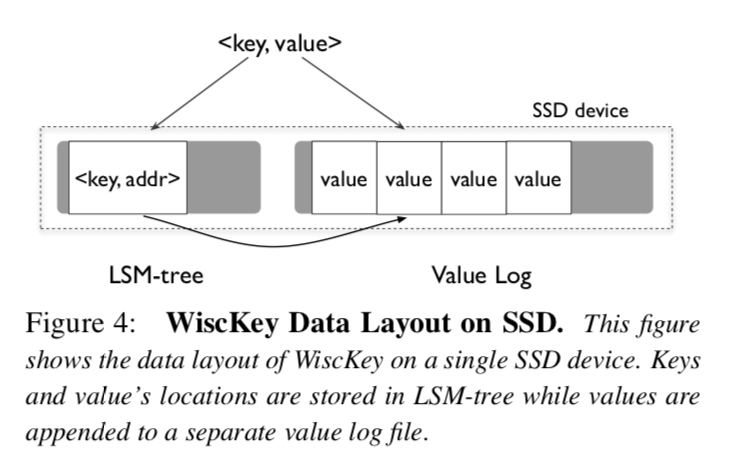

WiscKey的架构在插图4中展示，Key在LSM-Tree中有序的存储，而Value被单独存在ValueLog文件当中，和Key一起在LSM-Tree中存储的是ValueLog中实际Value的地址.

当用户在WiscKey中插入键值对，Value会被追加到ValueLog末尾，然后Key和Value的地址会被插入到LSM-Tree当中(<vLog-offset，value-size>). 删除一个Key只是简单的将它从LSM-Tree中删除，不需要接触vLog，所有在ValueLog中有效的Value都有相应的Key在LSM-Tree当中，而其它ValueLog中无效的Value将会被垃圾收集机制进行回收.

当用于查询一个Key的时候，首先在LSM-Tree中查询这个Key，如果查询到，那么我们就获取到对应Value的地址，然后WiscKey就从ValueLog中读取对应的Value，注意这个过程适用于点查询和范围查询.

尽管键值对分离背后的思想很简单，但是它带来了很多挑战和优化性能的可能性，这些我们将在接下来的部分进行介绍.

#### 3.3 挑战
将键值对分离存储在范围查询的时候需要随机I/O，此外，分离存储带来了垃圾收集和崩溃一致性的挑战，现在会介绍我们如何解决这些问题的.

##### 3.3.1 并发范围查询
范围查询是当代KV数据库一个很重要的特性，允许用户对一个区间的键值对进行扫描，关系型数据库[**26**]，本地文件系统[**30**，**46**，**50**]甚至是分布式文件系统[**37**]使用KV数据库作为存储引擎，范围查询在这些环境中是一个核心的API.

对于范围查询， LevelDB为用户提供了基于迭代器的接口，包括`Seek(key)`，`Next()`，`Prev()`，`Key()`和`Value()`操作，为了扫描一个区间的键值对，用户首先需要调用`Seek()`命令定位到起始Key的位置，然后调用`Next()`或者`Prev()`接口一个一个迭代Key，为了获取当前位置的Key和Value，用户可以分别调用`Key()`和`Value()`.

在LevelDB当中， 因为Key和Value是有序的存放在一起的，一个范围查询可以顺序的从SST文件中读取到键值对，然而，因为在WiscKey当中Key和Value是分开存储的，范围查询需要随机读，因此效率不高，就像我们在插图3中展示的那样， 在SSD上的单线程随机读性能不能和顺序读相媲美，然而，并行出发大的随机读请求可以充分利用设备内部的并行性，使性能能够接近顺序读.

为了使范围查询更加高效，WiscKey利用了SSD设备并行I/O的特性在范围查询期间从ValueLog中预读Value的值，最根本的想法是，在SSD上只关注Key被高效获取，只要Key可以被高效获取了，区间访问可以并发的发起随机读来获取Value.

预读取框架可以轻易的适应当前范围查询接口，在当前的接口中，如果用户的请求是范围查询，那么一个迭代器会返回给用户，对于每次迭代器上的`Next()`或者`Prev()`，WiscKey会追踪范围查询的访问模式. 一旦请求的是一段连续的键值，WiscKey开始顺序的从LSM-Tree中读取一系列的键，对应的在LSM-Tree中存储的Value的地址会被插入到一个队列当中，多线程会在后台并发的获取ValueLog中这些地址上的值.

##### 3.3.2 垃圾收集
基于LSM-Tree实现的键值存储在键值对被删除或者重写之后不会马上释放空间，而是在Compaction期间进行回收，如果找到了被删除或者被复写的键值对被找到，这些数据会被丢弃并且回收空间，在WiscKey当中，只有无效的Key会在LSM-Tree的Compaction期间被回收，因为WiscKey不会对Value进行Compaction操作，Value在ValueLog中需要特别的垃圾收集机制对空间进行回收

因为我们在ValueLog文件中只存储Value，一种从ValueLog中释放空间的简单做法是先扫描LSM-Tree获取所有有效Value的地址，然后在ValueLog中没有被LSM-Tree有效引用的Value可以被视为无效的并且是可回收的，然而，这种方法太重量级了，并且只能适用于离线垃圾收集.

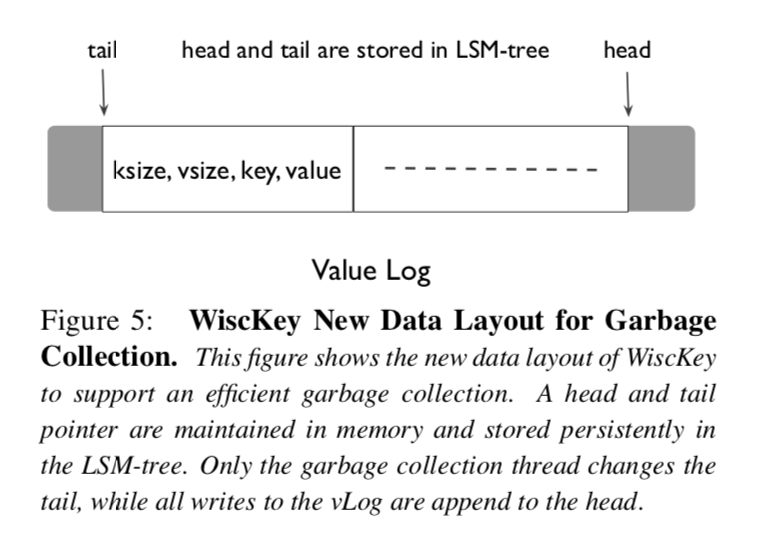

WiscKey的目标是轻量级并且在线垃圾收集，为了使其成为可能，我们对WiscKey的基本数据布局进行了一些小改动，在ValueLog存储Value的同时，我们还存储相应的键和值，新的数据排布格式在插图5进行展示，组件(键大小，值大小，键，值)被存储在ValueLog当中.

WiscKey垃圾收集的目标是将有效值保存在ValueLog连续区间内(和删除Key不对应的Value)，正如插图五展示的那样，这个范围的一端，也就是头部，总是对应的vLog的末尾，新值总是被添加到这个位置，这个范围的另一端，我们称之为尾部，这就是当垃圾收集触发的时候我们释放空间的位置，只有在ValueLog头部和尾部之间的部分包含了有效的Value，并且在我们查找数据的期间也只会从这个部分中进行查找.

在垃圾收集期间，WiscKey首先从ValueLog的尾端读取一大块的键值对(通常 是1MB)，然后通过访问LSM-Tree来查找这里面哪些Value是有效的，然后WiscKey将这些有效的Value写回到ValueLog的头部，最后释放之前占用的块并且对尾部做相应的更新.

为了避免在垃圾收集期间发生崩溃造成数据的丢失，WiscKey必须确保在实际释放空间之前，新添加的有效Value和新尾部信息在设备上是持久的，WiscKey使用了如下步骤完成了目标，在将有效Value追加到ValueLog之后，垃圾收集机制会在ValueLog上调用`fsync()`，然后它将这些Value的新地址和当前的尾部信息以同步的形式添加到LSM-Tree. 尾部信息在LSM-Tree中保存的形式是\<tail, tail-vLog-offset\>，最后ValueLog就能回收空闲空间了.

WiscKey可以配置定期持续的垃圾收集或者达到阈值之后再垃圾收集，垃圾收集也可以运行在离线模式下用来维护ValueLog，在拥有很少删除的工作场景和提供大容量存储空间的工作场景下，垃圾回收机制可以很少的被触发. 

##### 3.3.3 崩溃一致性
在系统发生崩溃时，LSM-Tree实现通常能够保证键值对插入的原子性，并且顺序的恢复插入的键值对. 因为WiscKey将Value分离出LSM-Tree存储的架构，获得同样同样的崩溃时一致性保证看起来很复杂. 然而WiscKey通过使用现代文件系统的特性来保证了同样的崩溃时一致性保证(例如ext4,btrfs和xfs). 考虑一个文件有一系列字节构成(b1，b2，b3...bn)，然后用户追加一个序列到文件末尾(bn+1，bn+2，bn+3...bn+m)，如果发生了崩溃，在现代文件系统恢复之后[**45**]，这个文件将被观察到包含如下字节(b1，b2，b3...bn，bn+1，bn+2，bn+3...bn+x)其中x<m，也就是说在文件系统恢复的时候只有新添加的字节串的前缀会被正常恢复，而并不会随机的恢复一些字节，或者恢复一个并不是前缀串的内容到文件末尾，因为在WiscKey中Value总是顺序的被追加到vLog的末尾，上面提到的特性可以被简短的翻译如下: 如果Value X在ValueLog中由于崩溃而遗失了，那么在Value X后面所有的Value(在Value X后被插入的其他Value)也会同样被遗失.

当用户请求一个键值对，如果WiscKey由于系统崩溃的原因丢失了Key从而导致在LSM-Tree中无法找到这个Key，WiscKey的行为和传统的LSM-Tree是一样的，即使这个Value在系统崩溃的时候已经被写入到了ValueLog，它也将在未来的垃圾收集机制被回收，如果这个Key可以在LSM-Tree中被找到，则需要额外的步骤来保持一致性. 在这种场景下WiscKey首先验证从LSM-Tree中获取的Value对应的地址是否在当前ValueLog的有效区间以内，然后再确认找到的Value是否和请求的Key相对应，如果验证失败，那么WiscKey会假设这个Value已经在系统崩溃时丢失了，会从LSM-Tree中将这个Key删除，然后通知用户这个Key是Statues::NotFound()的状态，因为向ValueLog添加每个Value字段的头部包含对应的Key，所以验证Key和Value是否匹配是很简单的，如果有必要，魔数和校验和可以被很简单的添加到头部.

LSM-Tree的实现还能保证用户要求在同步的形式插入时系统崩溃后的数据持久性. WiscKey通过在执行同步插入LSM-Tree之前刷新ValueLog来实现同步形式的插入.

#### 3.4 优化
在WiscKey中键值对的分离提供了机会让我们反思如何更新ValueLog以及LSM-Tree Log的必要性，我们现在会介绍这些机会如何改善性能.

##### 3.4.1 vLog的缓冲区
对于每次`Put()`操作，WiscKey需要通过调用write()系统调用将Value追加到ValueLog末尾，然而对于插入密集型的工作场景，向文件系统发出大量小的写操作会带来明显的开销，特别是在快速存储设备上[**15**，**44**]，插图6显示了在ext4上顺序的写入10GB到文件中花费的总时间，对于较小的写操作，每次系统调用的开销是十分显著的，导致了长的运行时间. 对于较大的写操作(大于4KB)，设备的吞吐量能得到充分的利用.

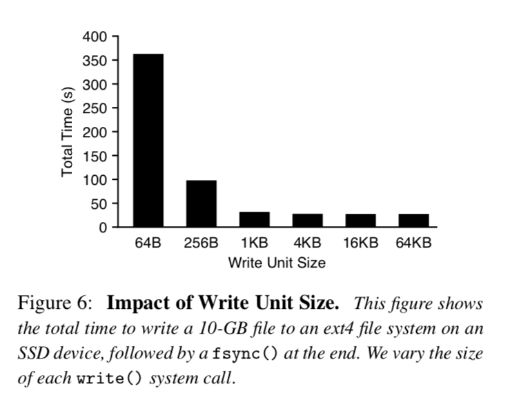

为了减少开销，WiscKey将Value缓存在用户空间的缓冲区当中，只有在buffer的大小超过阈值或者用户要求同步的时候才会执行flush操作，因此，WiscKey只会发出较大的写操作并且减少write()系统调用的次数，对于查询操作，WiscKey首先查询ValueLog缓冲区，如果在这里没有找到，才会去从ValueLog中查找，显而易见的是，这种机制可能会在系统崩溃的时候导致一些数据的丢失，这种崩溃一致性的保证和LevelDB类似.

##### 3.4.2 优化LSM-Tree的日志
正如插图一所示，一个Log文件通常在LSM-Tree中被使用，LSM-Tree在这个Log文件中跟踪记录键值对的插入，这样，如果用户要求同步插入然后系统崩溃了，这个Log可以在重启之后被扫描，然后恢复那些插入的键值对.

在WiscKey当中，LSM-Tree仅仅用来记录Key和对应Value的地址，此外vLog也会记录插入的Key用于前一章节介绍的垃圾回收机制，因此可以避免写入LSM-Tree日志而不影响正确性.

如果在Key持久化到LSM-Tree之前发生了崩溃，可以通过扫描ValueLog来恢复他们，然而，一个朴素的算法可能要扫描整个ValueLog来恢复数据，为了达到只扫描ValueLog中一小部分的效果，WiscKey定期的在LSM-Tree中以键值对的形式记录vLog的头部信息(\<head， head-vLog-offset\>)，当数据库打开的时候，WiscKey从LSM-Tree中记录的最近的头部位置开始扫描ValueLog，并且持续的扫描直到ValueLog的末尾，因为头部信息被存储在了LSM-Tree中. LSM-Tree本质上保证插入到LSM-Tree中的Key会按插入顺序恢复，这优化了崩溃时的一致性保证. 因此从WiscKey中的LSM-Tree移除Log是一个安全的优化，并且提高了性能，尤其是针对大量小插入的场景.

#### 3.5 实现
WiscKey是基于v1.18的LevelDB，WiscKey在创建数据库的时候创建ValueLog，并且在LSM-Tree中管理Key和Value的地址，ValueLog内部可以被多个组件以不同的模式访问，举个例子，一个查询操作以随机读的形式访问ValueLog，而垃圾收集机制则以顺序读的方式从vLog尾部开始读取，并且在ValueLog头部追加内容，在不同的场景下我们使用`posix_fadvise()`预声明ValueLog的访问模式.

对于区间查询，WiscKey在后台维护一个大小为32的线程池，这些线程在一个线程安全的队列上休眠，等待新Value地址到达，当预读取被触发的时，WiscKey向工作队列插入固定数量的Value地址，然后唤醒所有睡眠的线程，这些线程会并发的读取这些Value，自动的将它们缓存在缓冲区里面.

为了提高垃圾收集机制回收ValueLog空间的效率，我们使用了现代文件系统的打孔功能(fallocate())，在文件中打孔可以释放已经分配的物理空间，并且允许WiscKey弹性的使用存储空间，现代文件系统最大文件大小足够WiscKey运行很长一段时间而不需要回滚到文件开头位置. 举个例子来说，在ext4上最大的文件大小为64TB，在xfs上是8EB，在btrfs上是16EB，如果有必要的话ValueLog还可以被简单的调整成一个循环日志.

### 4 评估
在这个章节中，我们的测评结果将展示WiscKey的设计优点.

所有的测试将在一个搭载两个Intel(R) Xeon(R) CPU E5-2667 v2@ 3.30GHz和64GB内存的机器上运行，操作系统是64位的Linux 3.14，文件系统使用的是ext4，存储设备是500GB的Samsung 840EVO SSD，它有着最高500MB/s的顺序读和400MB/s顺序写的性能，该设备的随机读性能在插图3展示了.

#### 4.1 微基准测试
我们使用了db\_bench(LevelDB中默认的微基准测试工具)，对LevelDB和WiscKey进行测试，我们总是使用16 Bytes大小的Key，但是在不同Value大小的场景下进行测试，我们关闭数据压缩功能以便更加理解和分析性能.

##### 4.1.1加载数据性能
我们现在描述微基准测试顺序加载和随机加载的结果，前一个基准测试我们通过顺序的插入键值对来构造一个100GB大小的数据库，而后者则通过分布均匀的形式随机插入键值对，注意顺序加载在LevelDB和WiscKey中都不会导致Compact，而随机加载会.

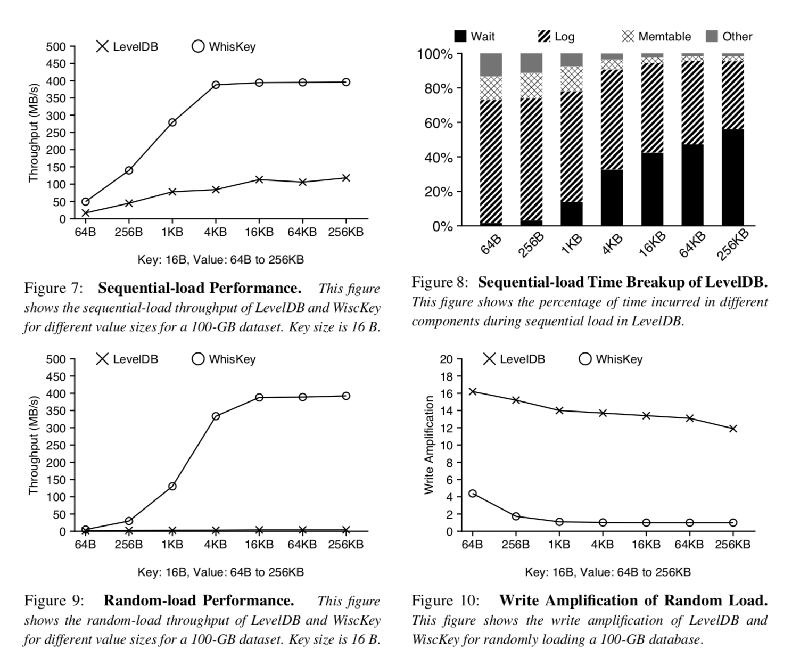

插图7展示了在宽泛的Value大小范围内LevelDB和WiscKey顺序读取的吞吐量，两个存储的吞吐量都随着值的大小而增加，但是就算是在最大Value的场景下(256KB)，LevelDB的吞吐量还是远比设备的带宽要小. 为了进一步分析原因，插图8展示了在LevelDB运行基准测试期间不同组件花费时间的分布情况，时间被花费在三个主要的部分，写log文件，插入数据到Memtable，和等待Memtable刷盘. 对于小键值对的场景，写log文件占据了总时间的大部分，具体的原因用插图6可以解释，对于大的键值对，写日志和数据插入Memtable更加高效，但是Memtable刷盘成了瓶颈.
不像LevelDB，WiscKey在Value大小大于4KB时可以达到设备的全带宽，因为它不需要写LSM-Tree的日志，并且是把缓冲区的内容追加到ValueLog后面，即便是小Value的场景下，速度也快三倍.

插图9展示了LevelDB和WiscKey在不同Value大小下随机加载数据的吞吐量，LevelDB的吞吐量范围只有2MB/s(64 Bytes大小的Value)到4.1MB/s(256-KB大小的Value)，而WiscKey的吞吐量随着Value的大小而增加，在Value的大小大于4KB的时候达到了设备写吞吐量的峰值，WiscKey的吞吐量在Value大小为1KB和4KB的时分别为LevelDB的46和111倍，LevelDB的吞吐量不高是由于Compaction机制消耗了大量的带宽并且会对前台写入请求进行降速处理(避免在LSM-Tree的L0层堆积过多的SST文件造成严重的读放大问题降低查询效率，在2.2章节介绍过)，在WiscKey当中，Compaction只会带来非常小的开销，使整个带宽得到了高效的利用. 为了进一步进行分析，插图10展示了LevelDB的写放大和WiscKey的写放大，LevelDB的写放大总是大于12，而WiscKey在Value大小达到1KB之后写放大会迅速的降低接近于1，由于WiscKey的LSM-Tree明显更小.

##### 4.1.2 查询性能
我们现在对LevelDB和WiscKey的随机点查询和范围查询性能进行比较. 插图11展示了在一个包含随机加载数据的100GB大小数据库中执行10w次随机查询操作. 尽管在WiscKey中随机查询需要访问LSM-Tree和vLog，但是WiscKey的吞吐量还是比LevelDB要好. 对于大小为1KB的Value，WiscKey的吞吐量能达到LevelDB的12倍，对于大Value的场景，WiscKey的吞吐量就被设备随机读的吞吐量所限制了，就像插图3展示的那样. LevelDB吞吐量低是由于2.3章节提到的高读放大的问题. WiscKey性能更好的原因是更小的LSM-Tree降低了读放大的问题[**3**]，另外一个WiscKey性能更优的原因是内部Compaction强度很低，因此避免了后台频繁的读写.

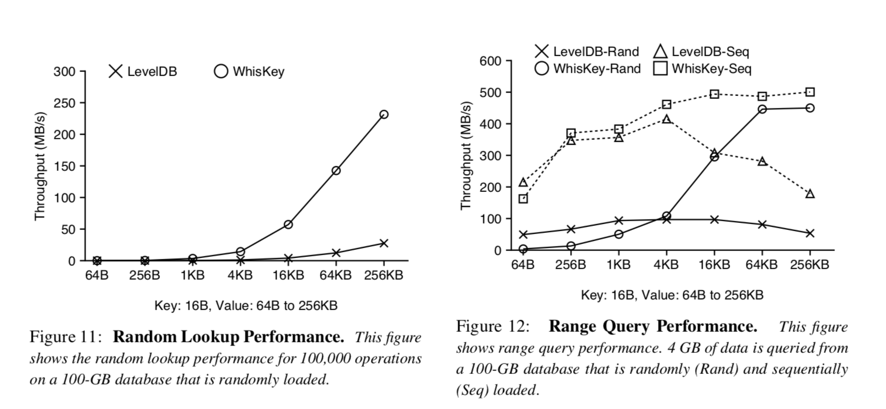

插图12展示了LevelDB和WiscKey的范围查询性能. 对于随机加载数据的数据库来说，LevelDB需要在不同层级中读取多个文件，而WiscKey只需要在ValueLog中进行随机读(WiscKey会利用并发随机读). 可以从插图12看出来，LevelDB的吞吐量最初随着Value的大小增加(两个数据库都是这种趋势). 然而在Value的大小大于4KB的时候，由于一个SST文件只能存储小数量的键值对，打开很多SST文件和并且在每个SST文件中读取IndexBlock和BloomFilters占据了主要的开销. 对于大的键值对，WiscKey的吞吐量可以达到设备的顺序带宽，最多比Leve了DB快8.4倍. 然而在键值对大小为64Bytes的场景下WiscKey比LevelDB差12倍，这是由于在小请求的场景下设备限制了并发随机读的吞吐量. WiscKey的相对性能在具有高并发随机读吞吐量的高端SSD上更好，此外，这种工作场景能代表数据库被随机数据填充并且数据在ValueLog中是杂乱无序的最坏场景.

插图12也展示了当数据库里的数据是顺序插入时范围查询的性能. LevelDB和WiscKey都可以顺序扫描数据，顺序插入数据的数据库和随机插入数据的数据库遵循同样的趋势，对于64Bytes的键值对，WiscKey比LevelDB要慢25%，这是由于WiscKey要从ValueLog获取键和值(浪费了带宽). 但是在大键值对的场景下，WiscKey比LevelDB快2.8倍. 因此，在有小键值对的场景下，对日志进行重新组织排序可以使WiscKey的范围查询性能和LevelDB相当.

##### 4.1.3 垃圾收集
我们现在调查一下WiscKey在后台执行垃圾收集时任务时的性能如何. 根据在垃圾收集期间发现的可用空间百分比不同，性能可能会有所不同，因为这影响着垃圾收集线程数据写入量和空间释放量. 我们将随机加载数据(受垃圾收集影响最大的工作场景)作为前台的工作场景，并且研究在不同空闲空间百分比场景的性能. 我们的实验具体包含三个步骤: 我们首先用随机加载数据的方式创建数据库，然后删除指定百分比的键值对，最终，我们随机的加载数据并且测试在后台进行垃圾清理时的吞吐量，我们使用的键值对大小为4KB并且空闲空间的百分比为25%到100%.

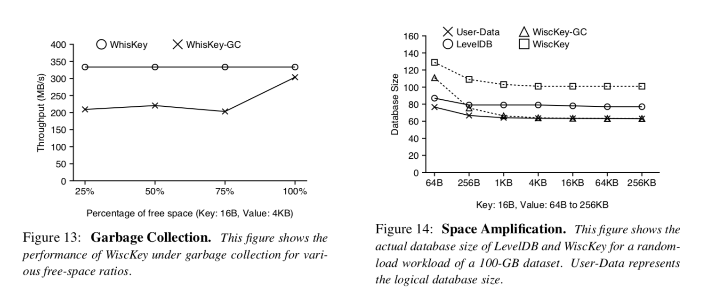

插图13展示了测试的结果，如果垃圾收集装置读到的数据都是无效的，吞吐量只降低了10%，吞吐量只有略微降低的原因是垃圾收集从ValueLog的尾部读取数据，并且只将有效的数据写到ValueLog的头部. 如果垃圾收集装置读到的所有数据都是无效的，那么没有键值对需要被写入头部. 对于其他空闲空间百分比的场景，吞吐量降低了35%，这是由于垃圾收集装置执行了额外的写操作. 需要注意的是，在所有的测试场景中，虽然垃圾收集装置正在工作，但是WiscKey的性能还是比LevelDB快70倍.

##### 4.1.4 崩溃一致性
将键值对进行分离需要一些额外的措施来维持崩溃一致性. 我们使用了ALICE工具[**45**]来验证WiscKey的崩溃一致性，这个工具可以选择并且模拟出一组高可能性可以暴露不一致问题的系统崩溃. 我们使用一个测试样例来调用一些同步和异步的`Put()`. 当配置为ext4，xfs和btrfs进行测试时，ALICE检查了超过3000个选择性的系统崩溃，并且没有报告出任何由WiscKey引入的一致性漏洞.

这个新的一致性机制也影响着WiscKey崩溃后的恢复时间. 我们设计了一个实验来测量最坏场景下WiscKey和LevelDB的恢复时间. LevelDB的恢复时间和崩溃后log文件的体积是成比例的. log文件在Memtable刷盘之前以它最大的大小存在. WiscKey在恢复的期间，首先从LSM-Tree中获取ValueLog头部的指针，然后从vLog的头部扫描到文件末尾，因为在Memtable刷盘的时候ValueLog头部指针会持久化到磁盘. WiscKey最坏场景下的恢复时间也取决于发生崩溃的时间，我们测量了到目前为止所描述的最坏场景下的恢复时间. 对于1KB的Value，LevelDB花费了0.7秒来恢复崩溃后的数据库，而WiscKey花费了2.6秒. 注意，如果必要的话WiscKey可以配置更短的周期将头指针持久化到磁盘.

##### 4.1.5 空间放大
当我们评估一个存储系统时，前期大部分工作都集中在读写放大上. 然而，空间放大对于闪存设备来说更加重要，因为相对于硬盘来说它们每个GB的单价更加昂贵. 空间放大指的是磁盘上数据库体积于实际数据体积的比值[**5**]. 举个例子，如果一个1KB的键值对在磁盘上占用了4KB的空间，那么空间放大就是4. 压缩机制降低了空间放大，而其他额外的数据(例如垃圾数据，碎片或者元数据)会增加空间放大. 为了简化讨论，我们关闭了压缩机制.

对于顺序加载的工作场景，空间放大可以接近于1(在LSM-Tree中记录的额外元数据信息占比很小). 对于随机加载和覆盖写场景，当无效的键值对没有足够快的被垃圾收集机制回收时，空间放大通常大于1.

插图14展示了在随机加载100GB数据之后LevelDB和WiscKey数据库的体积大小(和插图9的工作场景一样)，LevelDB的空间开销是由于当随机加载结束时无效的键值没有被垃圾收集机制回收导致的. WiscKey的空间开销包括无效的键值对和额外的元数据信息(LSM-Tree中的指针信息和插图5展示的ValueLog中的元组信息). 在进行垃圾收集之后，WiscKey的数据库大小接近实际数据大小(前提是元数据相对于Value来说是很小的).

没有键值对存储系统可以同时最小化读放大写放大和空间放大，只能在各种不同的系统中对三者进行权衡. 在LevelDB中，排序和垃圾收集是耦合在一起的，LevelDB用高的写放大来获取低的空间放大，然而在实际工作场景中性能会受到显著的影响. WiscKey在工作过程中花费了更多的空间来最小化I/O放大，由于排序和垃圾收集在WiscKey中是解耦的，垃圾收集可以稍后再被执行，因此最小化了对前台性能的影响.

##### 4.1.6 CPU使用情况
我们现在调查一下前面章节各种场景下LevelDB和WiscKey的CPU使用情况，这里展示的CPU使用情况包括应用和操作系统的使用情况。

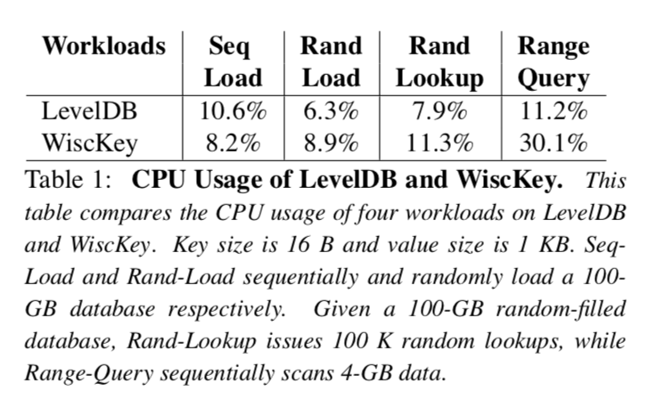

如表格一所示，在顺序加载的工作场景下LevelDB有着更高的CPU使用率. 正如我们在图8展示，LevelDB花费了大量的时间将键值对写入到Log文件中，将数据写入到Log文件时需要对每个键值对进行编码，这是很耗费CPU的. 因为WiscKey将移除Log文件作为优化，WiscKey有着比LevelDB更低的CPU使用.

对于范围查询的工作场景，WiscKey在后台使用32个线程做预读取操作，所以CPU使用比LevelDB要高很多.

我们发现在使用场景中CPU并不是LevelDB和WiscKey的瓶颈，LevelDB的架构是基于单线程写的，后台Compaction也只用到了一个线程，在多核的场景RocksDB[25]有更好的并发设计.

#### 4.2 Yahoo！CloudServing Benchmark
YCSB基准测试工具[21]提供了一个框架和六个工作场景的标准集对键值对存储系统的性能做评估. 我们使用YCSB对LevelDB，RocksDB[**25**]和WiscKey在大小为100GB的数据库上做了对比. 除了测量WiscKey普通场景下的性能之外，我们也在后台不断运行垃圾收集组件的场景下测试它最差性能. RocksDB[**25**]可以看做LevelDB的SSD优化版本，有着很多的优化. 包括多个Memtable和后台多个Compaction线程. 我们用默认配置使用RocksDB，然后在两种不同的Value大小下做测试(1KB和16KB，关闭数据压缩的功能).

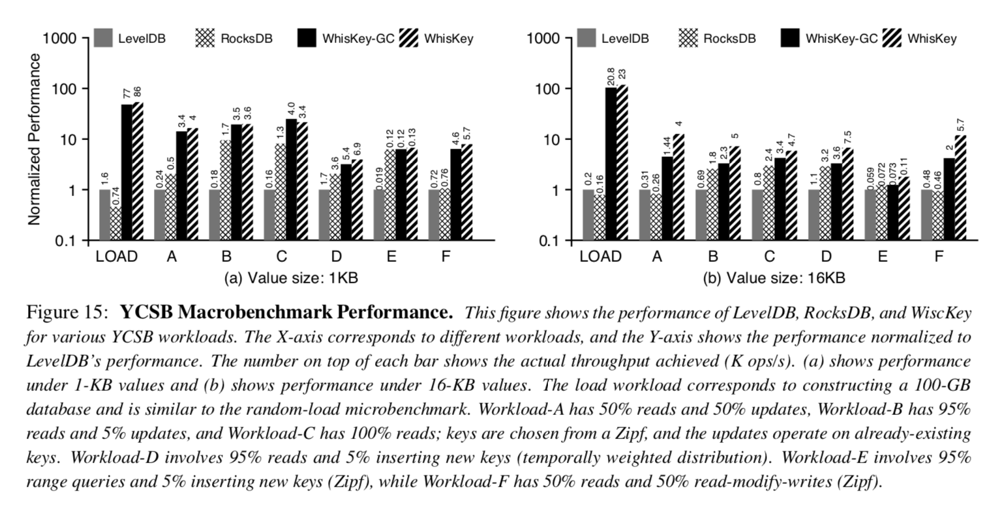

如插图15所示，WiscKey的性能明显要比LevelDB和RocksDB要好. 举个例子来说，在加载数据期间，对于1KB的Value，WiscKey在通常场景下性能至少比其他数据库快50倍. 而在最差的场景(在垃圾收集组件在运行的时候)下也比他们快45倍. 对于16KB Value的场景下WiscKey比其他数据库快104倍，即便在最坏的情况下.

对于读取，Zipf分发被用于大多数工作场景中，它允许缓存和和检索常用项而不需要访问磁盘. 从而降低了WiscKey相对于LevelDB和RocksDB的优势，因此WiscKey的相对性能(和LevelDB还有RocksDB比较)在工作场景A(50%的读取)比在工作场景B(95%的读取)和工作场景C(100%的读取)要好，然而在任何的这些工作场景中RocksDB和LevelDB性能都比不上WiscKey.

在WiscKey性能最差的情况下(后台总是在执行垃圾收集器，即使对于只有读取操作的情况下)也优于LevelDB和RocksDB. 然而垃圾收集器带来的性能影响在Value为1KB和Value为16KB时是显著不同的. 垃圾收集器在ValueLog中重复的选择并且清理大小为4MB的块，对于小Value场景，这个块将会包含很多键值对，因此垃圾收集器花费更多的时间去LSM-Tree中进行查询操作以验证每个键值对的有效性. 对于大Value场景，垃圾收集器花费较少的时间进行验证，因此积极的写出已经被清理的块，对前台的吞吐量影响更大. 注意，如果有必要的话对垃圾收集进行限制以减少对前台的影响.

和之前微基准测试不同，工作场景E有多个小的范围查询. 每次查询检索1到100个键值对，因为这个工作场景包含了多个范围查询，获取每个区间里面的第一个Key是一个随机查询操作(一种对WiscKey有利的场景)，因此WiscKey的性能比RocksDB和LevelDB都要好，甚至对1KB的Value来说也是如此.

### 5 相关工作
很多键值对存储针对SSD设备提出了基于哈希表的存储方法，FAWN[**8**]在SSD上以追加的形式将键值对保存在Log中，并且在内存中维护一个哈希表索引用户快速查找，FlashStore[**22**]和SkimpyStash[**23**]遵循了同样的设计，但是优化了内存中的哈希表，FlashStore使用了布谷鸟散列和紧凑Key特征(我的理解思想和布隆过滤器类似)，而SkimpyStash使用线性链接将表的一部分移到SSD上. BufferHash[**7**]在内存中使用了多个哈希表和布隆过滤器来选择哪个哈希表应该用于查询. SILT[**35**]对内存进行了高度优化，结合了日志结构，哈希表和排序表布局. WiscKey和这些键值对存储共享了Log结构的数据排布. 然而，这些存储使用了哈希表作为索引查询，因此不支持构建于LSM-Tree之上的一些现代特性，例如范围查询和快照. WiscKey的目标是建立一个功能丰富的键值对存储，可以适用于任何场景.

优化原始的LSM-Tree键值存储[**43**]需要做很多工作. bLSM[**49**]提出了一种新的合并调度程序来限制写延迟，从而保持稳定的写吞吐量，并使用布隆过滤器来提高性能. VT-Tree[50]通过使用中间层来避免在Compaction期间对之前已经排序过的键值对进行重新排序. 相反WiscKey直接从键中分离值，无论在工作场景中键分布如何都显著的降低了写放大. LOCS[**53**]对LSM-Tree提供内部闪存通道，这可以利用设备更高的并行性来提高Compaction的效率. Atlas[**32**]是一种基于ARM处理器和纠删码的键值存储系统，它将键值分别存放在不同的硬件设备上. WiscKey是一个独立的键值对存储系统，为了达到显著提升性能的目标，它将键值对分离存储并且针对SSD设备做了高度的优化. LSM-Trie[**54**]使用了一种trie数据结构来管理键，目标是基于trie能够实现更高效的Compaction，然而这种设计牺牲了LSM-Tree的一些特性，比如高效的进行范围查询. 正如前面描述的那样，RocksDB依然有着很高的写放大，因为从根本上来说他的设计和LevelDB相似. RocksDB的优化和WiscKey的设计是正交的.

Walnut[**18**]是一个混合对象存储系统，它将小对象存储在LSM-Tree当中，将大对象直接写入到文件系统. IndexFS[**47**]将元数据以列模式插入到LSM-Tree当中来提高插入操作的吞吐量. Purity[**19**]通过对索引进行排序并且以时间顺序存储元组来将索引信息从数据元组中分离出来. 这三个系统都使用了类似于WiscKey的技术. 然而我们以更加完整和通用的形式解决了这个问题，并且在广泛的工作场景下优化了SSD设备的加载和查询性能.

基于其他数据结构实现的键值对存储也被提出. TokuDB[**13**，**14**]基于分形树索引，它将内部结点更新进行缓存，键是无序的，为了保持良好的性能必须在内存中维护一个很大的索引. ForestDB[**6**]使用HB+-trie有效的索引长键，提升性能的同时减少了内部结点的空间开销. NVMKV[39]是一种FTL-aware的键值存储，它使用了本地的FTL功能，例如稀疏寻址和事务支持，对于键值存储还提出了对多个请求进行分组到单个操作的接口[**52**]. 因为这些键值存储基于不同的数据结构实现，它们在性能方面都有不同的权衡，相反WiscKey的目标是改进广泛使用的LSM-Tree结构.

许多被提出的技术都试图克服内存键值存储可扩展的瓶颈，例如Mastree[**38**]，MemC3[**27**]，Memcache[**41**]，MICA[**36**]和cLSM[**28**]. 这些技术可以用于WiscKey以进一步提高性能.

### 6 结论
键值对存储已经成为数据密集型应用的一个基础构建块，在这篇论文中，我们提出了WiscKey，一种基于LSM-Tree新颖的键值对存储，它将键值对分离来最小化写放大和读放大. WiscKey的数据布局和I/O模式针对SSD设备做了高度的优化. 我们的测试结果表明在大多数工作场景下WiscKey可以显著的提高性能. 我们希望WiscKey中的键值对分离和各种优化技术可以启发未来高性能的键值对存储.

### 致谢
感谢匿名评论者和Ethan Miller的反馈，感谢ADSL研究团队的成员，RocksDB团队，Yinan Li(微软研究员)和Bin Fan的建议和在各个阶段对这项工作的评价.
该材料得到了美国国家科学基金会的资助，包括CNS-1419199、CNS-1421033、CNS-1319405和CNS-1218405，同时得到了EMC、Facebook、Google、华为、Microsoft、Netapp、希捷、三星、Veritas和VMware的慷慨捐赠. 本材料中所表达的任何观点，发现和结论或建议均为作者观点，而不能反映美国国家科学基金会或其他机构的意见.

### 引用
[1] Apache HBase. [http://hbase.apache.org/](http://hbase.apache.org/), 2007.  
[2] Redis. [http://redis.io/](http://redis.io/), 2009.  
[3] Fusion-IO ioDrive2. [http://www.fusionio.com/products/iodrive2](http://www.fusionio.com/products/iodrive2), 2015.  
[4] Riak. [http://docs.basho.com/riak/](http://docs.basho.com/riak/), 2015.  
[5] RocksDB Blog. [http://rocksdb.org/blog/](http://rocksdb.org/blog/), 2015.  
[6] Jung-Sang Ahn, Chiyoung Seo, Ravi Mayuram, Rahim Yaseen, Jin-Soo Kim, and Seungryoul Maeng. ForestDB: A Fast Key-Value Storage Sys- tem for Variable-Length String Keys. IEEE Trans- actions on Computers, Preprint, May 2015.  
[7] Ashok Anand, Chitra Muthukrishnan, Steven Kappes, Aditya Akella, and Suman Nath. Cheap and Large CAMs for High-performance Data- intensive Networked Systems. In Proceedings of the 7th Symposium on Networked Systems Design and Implementation (NSDI ’10), San Jose, Califor- nia, April 2010.  
[8] David Andersen, Jason Franklin, Michael Kamin- sky, Amar Phanishayee, Lawrence Tan, and Vijay Vasudevan. FAWN: A Fast Array of Wimpy Nodes. In Proceedings of the 22nd ACM Symposium on Operating Systems Principles (SOSP ’09), Big Sky, Montana, October 2009.  
[9] Timothy G. Armstrong, Vamsi Ponnekanti, Dhruba Borthakur, and Mark Callaghan. LinkBench: A Database Benchmark Based on the Facebook So- cial Graph. In Proceedings of the 2013 ACM SIG-MOD International Conference on Management of Data (SIGMOD ’13), New York, New York, June 2013.  
[10] Remzi H. Arpaci-Dusseau and Andrea C. Arpaci- Dusseau. Operating Systems: Three Easy Pieces. Arpaci-Dusseau Books, 0.9 edition, 2014.
[11] Berk Atikoglu, Yuehai Xu, Eitan Frachtenberg, Song Jiang, and Mike Paleczny. Workload Anal- ysis of a Large-Scale Key-Value Store. In Proceed- ings of the USENIX Annual Technical Conference (USENIX ’15), Santa Clara, California, July 2015.  
[12] Doug Beaver, Sanjeev Kumar, Harry C. Li, Ja- son Sobel, and Peter Vajgel. Finding a needle in Haystack: Facebook’s photo storage. In Proceed- ings of the 9th Symposium on Operating Systems Design and Implementation (OSDI ’10), Vancou- ver, Canada, December 2010.  
[13] Michael A. Bender, Martin Farach-Colton, Jeremy T. Fineman, Yonatan Fogel, Bradley Kuszmaul, and Jelani Nelson. Cache-Oblivious Streaming B-trees. In Proceedings of the Nineteenth ACM Symposium on Parallelism in Algorithms and Architectures (SPAA ’ 07), San Diego, California, June 2007.  
[14] AdamL.Buchsbaum,MichaelGoldwasser,Suresh Venkatasubramanian, and Jeffery R. Westbrook. On External Memory Graph Traversal. In Pro- ceedings of the Eleventh Annual ACM-SIAM Sym- posium on Discrete Algorithms (SODA ’00), San Francisco, California, January 2000.  
[15] Adrian M. Caulfield, Arup De, Joel Coburn, Todor I. Mollow, Rajesh K. Gupta, and Steven Swanson. Moneta: A High-Performance Stor- age Array Architecture for Next-Generation, Non- volatile Memories. In Proceedings of the 43nd An- nual IEEE/ACM International Symposium on Mi- croarchitecture (MICRO’ 10), Atlanta, Georgia, De- cember 2010.  
[16] Fay Chang, Jeffrey Dean, Sanjay Ghemawat, Wil- son C. Hsieh, Deborah A. Wallach, Michael Bur- rows, Tushar Chandra, Andrew Fikes, and Robert Gruber. Bigtable: A Distributed Storage System for Structured Data. In Proceedings of the 7th Sympo- sium on Operating Systems Design and Implemen- tation (OSDI ’06), pages 205–218, Seattle, Wash- ington, November 2006.  
[17] Feng Chen, Rubao Lee, and Xiaodong Zhang. Es- sential Roles of Exploiting Internal Parallelism of Flash Memory Based Solid State Drives in High- speed Data Processing. In Proceedings of the 17th International Symposium on High Perfor- mance Computer Architecture (HPCA-11), San An- tonio, Texas, February 2011.  
[18] Jianjun Chen, Chris Douglas, Michi Mutsuzaki, Patrick Quaid, Raghu Ramakrishnan, Sriram Rao, and Russell Sears. Walnut: A Unified Cloud Object Store. In Proceedings of the 2012 ACM SIGMOD International Conference on Management of Data (SIGMOD ’ 12), Scottsdale, Arizona, May 2012.  
[19] John Colgrove, John D. Davis, John Hayes, Ethan L. Miller, Cary Sandvig, Russell Sears, Ari Tamches, Neil Vachharajani, and Feng Wang. Pu- rity: Building Fast, Highly-Available Enterprise Flash Storage from Commodity Components. In Proceedings of the 2015 ACM SIGMOD Interna- tional Conference on Management of Data (SIG- MOD ’ 15), Melbourne, Australia, May 2015.  
[20] Brian F. Cooper, Raghu Ramakrishnan, Utkarsh Srivastava, Adam Silberstein, Philip Bohannon, Hans-Arno Jacobsen, Nick Puz, Daniel Weaver, and Ramana Yerneni. PNUTS: Yahoo!s Hosted Data Serving Platform. In Proceedings of the VLDB Endowment (PVLDB 2008), Auckland, New Zealand, August 2008.  
[21] Brian F. Cooper, Adam Silberstein, Erwin Tam, Raghu Ramakrishnan, and Russell Sears. Bench- marking Cloud Serving Systems with YCSB. In Proceedings of the ACM Symposium on Cloud Computing (SOCC ’ 10), Indianapolis, Indiana, June 2010.  
[22] Biplob Debnath, Sudipta Sengupta, and Jin Li. FlashStore: High Throughput Persistent Key-Value Store. In Proceedings of the 36th Interna- tional Conference on Very Large Databases (VLDB 2010), Singapore, September 2010.  
[23] Biplob Debnath, Sudipta Sengupta, and Jin Li. SkimpyStash: RAM Space Skimpy Key-value Store on Flash-based Storage. In Proceedings of the 2011 ACM SIGMOD International Conference on Management of Data (SIGMOD ’11), Athens, Greece, June 2011.  
[24] Guiseppe DeCandia, Deniz Hastorun, Madan Jam- pani, Gunavardhan Kakulapati, Avinash Laksh-man, Alex Pilchin, Swami Sivasubramanian, Pe- ter Vosshall, and Werner Vogels. Dynamo: Ama- zon’s Highly Available Key-Value Store. In Pro- ceedings of the 21st ACM Symposium on Operating Systems Principles (SOSP’ 07), Stevenson, Wash-ington, October 2007.  
[25] Facebook. RocksDB. [http://rocksdb.org/](http://rocksdb.org/),2013.  
[26] Facebook. RocksDB 2015 H2 Roadmap. [http://rocksdb.org/blog/2015/rocksdb-2015-h2-roadmap/](http://rocksdb.org/blog/2015/rocksdb-2015-h2-roadmap/), 2015.  
[27] Bin Fan, David G. Andersen, and Michael Kamin- sky. MemC3: Compact and Concurrent MemCache with Dumber Caching and Smarter Hashing. In Proceedings of the 10th Symposium on Networked Systems Design and Implementation (NSDI ’13), Lombard, Illinois, April 2013.  
[28] Guy Golan-Gueta, Edward Bortnikov, Eshcar Hil- lel, and Idit Keidar. Scaling Concurrent Log- Structured Data Stores. In Proceedings of the Eu- roSys Conference (EuroSys ’ 15), Bordeaux, France, April 2015.  
[29] Tyler Harter, Dhruba Borthakur, Siying Dong, Amitanand Aiyer, Liyin Tang, Andrea C. Arpaci- Dusseau, and Remzi H. Arpaci-Dusseau. Anal- ysis of HDFS Under HBase: A Facebook Mes- sages Case Study. In Proceedings of the 12th USENIX Symposium on File and Storage Technolo- gies (FAST ’14), Santa Clara, California, February 2014.  
[30] WilliamJannen,JunYuan,YangZhan,AmoghAk- shintala, John Esmet, Yizheng Jiao, Ankur Mittal, Prashant Pandey, Phaneendra Reddy, Leif Walsh, Michael Bender, Martin Farach-Colton, Rob John- son, Bradley C. Kuszmaul, and Donald E. Porter. BetrFS: A Right-Optimized Write-Optimized File System. In Proceedings of the 13th USENIX Sym- posium on File and Storage Technologies (FAST ’15), Santa Clara, California, February 2015.  
[31] Hyojun Kim, Nitin Agrawal, and Cristian Ungure- anu. Revisiting Storage for Smartphones. In Pro- ceedings of the 10th USENIX Symposium on File and Storage Technologies (FAST ’12), San Jose, California, February 2012.  
[32] Chunbo Lai, Song Jiang, Liqiong Yang, Shiding Lin, Guangyu Sun, Zhenyu Hou, Can Cui, and Ja- son Cong. Atlas: Baidus Key-value Storage System for Cloud Data. In Proceedings of the 31st Inter- national Conference on Massive Storage Systems and Technology (MSST ’15), Santa Clara, Califor- nia, May 2015.  
[33] Avinash Lakshman and Prashant Malik. Cassandra – A Decentralized Structured Storage System. In The 3rd ACM SIGOPS International Workshop on Large Scale Distributed Systems and Middleware, Big Sky Resort, Montana, Oct 2009.  
[34] Changman Lee, Dongho Sim, Jooyoung Hwang, and Sangyeun Cho. F2FS: A New File System for Flash Storage. In Proceedings of the 13th USENIX Symposium on File and Storage Technolo- gies (FAST ’15), Santa Clara, California, February 2015.  
[35] Hyeontaek Lim, Bin Fan, David G. Andersen, and Michael Kaminsky. SILT: A Memory-efficient, High-performance Key-value Store. In Proceed- ings of the 23rd ACM Symposium on Operating Systems Principles (SOSP ’11), Cascais, Portugal, October 2011.  
[36] Hyeontaek Lim, Dongsu Han, David G. Andersen, and Michael Kaminsky. MICA: A Holistic Ap- proach to Fast In-Memory Key-Value Storage. In Proceedings of the 11th Symposium on Networked Systems Design and Implementation (NSDI ’14), Seattle, Washington, April 2014.  
[37] Haohui Mai and Jing Zhao. Scaling HDFS to Man- age Billions of Files with Key Value Stores. In The 8th Annual Hadoop Summit, San Jose, California, Jun 2015.  
[38] Yandong Mao, Eddie Kohler, and Robert Mor- ris. Cache Craftiness for Fast Multicore Key-Value Storage. In Proceedings of the EuroSys Conference (EuroSys ’12), Bern, Switzerland, April 2012.  
[39] Leonardo Marmol, Swaminathan Sundararaman, Nisha Talagala, and Raju Rangaswami. NVMKV: A Scalable, Lightweight, FTL-aware Key-Value Store. In Proceedings of the USENIX Annual Tech- nical Conference (USENIX ’15), Santa Clara, Cali- fornia, July 2015.  
[40] Changwoo Min, Kangnyeon Kim, Hyunjin Cho, Sang-Won Lee, and Young Ik Eom. SFS: Random Write Considered Harmful in Solid State Drives. In Proceedings of the 10th USENIX Symposium on File and Storage Technologies (FAST ’12), San Jose, California, February 2012.  
[41] Rajesh Nishtala, Hans Fugal, Steven Grimm, Marc Kwiatkowski, Herman Lee, Harry C. Li, Ryan McElroy, Mike Paleczny, Daniel Peek, Paul Saab, David Stafford, Tony Tung, and Venkateshwaran Venkataramani. Scaling Memcache at Facebook. In Proceedings of the 10th Symposium on Networked Systems Design and Implementation (NSDI ’13), Lombard, Illinois, April 2013.  
[42] ChrisNyberg,TomBarclay,ZarkaCvetanovic,Jim Gray, and Dave Lomet. AlphaSort: A RISC Ma- chine Sort. In Proceedings of the 1994 ACM SIG- MOD International Conference on Management of Data (SIGMOD ’94), Minneapolis, Minnesota, May 1994.  
[43] Patrick ONeil, Edward Cheng, Dieter Gawlick, and Elizabeth ONeil. The Log-Structured Merge- Tree (LSM-tree). Acta Informatica, 33(4):351–385, 1996.  
[44] Simon Peter, Jialin Li, Irene Zhang, Dan R. K. Ports, Doug Woos, Arvind Krishnamurthy, and Thomas Anderson. Arrakis: The Operating Sys- tem is the Control Plane. In Proceedings of the 11th Symposium on Operating Systems Design and Implementation (OSDI ’14), Broomfield, Colorado, October 2014.  
[45] Thanumalayan Sankaranarayana Pillai, Vijay Chidambaram, Ramnatthan Alagappan, Samer Al-Kiswany, Andrea C. Arpaci-Dusseau, and Remzi H. Arpaci-Dusseau. All File Systems Are Not Created Equal: On the Complexity of Crafting Crash-Consistent Applications. In Proceedings of the 11th Symposium on Operating Systems Design and Implementation (OSDI ’ 14), Broomfield, Colorado, October 2014.  
[48] Sanjay Ghemawat and Jeff Dean. LevelDB. [http://code.google.com/p/leveldb](http://code.google.com/p/leveldb), 2011.  
[49] Russell Sears and Raghu Ramakrishnan. bLSM: A General Purpose Log Structured Merge Tree. In Proceedings of the 2012 ACM SIGMOD Interna- tional Conference on Management of Data (SIG- MOD ’12), Scottsdale, Arizona, May 2012.  
[50] Pradeep Shetty, Richard Spillane, Ravikant Mal- pani, Binesh Andrews, Justin Seyster, and Erez Zadok. Building Workload-Independent Stor- age with VT-Trees. In Proceedings of the 11th USENIX Symposium on File and Storage Technolo- gies (FAST ’13), San Jose, California, February 2013.  
[51] Roshan Sumbaly, Jay Kreps, Lei Gao, Alex Fein- berg, Chinmay Soman, and Sam Shah. Serv- ing Large-scale Batch Computed Data with Project Voldemort. In Proceedings of the 10th USENIX Symposium on File and Storage Technologies (FAST ’12), San Jose, California, February 2012.  
[52] VijayVasudevan,MichaelKaminsky,andDavidG. Andersen. Using Vector Interfaces to Deliver Mil- lions of IOPS from a Networked Key-value Storage Server. In Proceedings of the ACM Symposium on Cloud Computing (SOCC ’12), San Jose, Califor- nia, October 2012.  
[53] Peng Wang, Guangyu Sun, Song Jiang, Jian Ouyang, Shiding Lin, Chen Zhang, and Jason Cong. An Efficient Design and Implementation of LSM-Tree based Key-Value Store on Open- Channel SSD. In Proceedings of the EuroSys Con- ference (EuroSys ’14), Amsterdam, Netherlands, April 2014.  
[54] Xingbo Wu, Yuehai Xu, Zili Shao, and Song Jiang. LSM-trie: An LSM-tree-based Ultra-Large Key- Value Store for Small Data. In Proceedings of the USENIX Annual Technical Conference (USENIX ’15), Santa Clara, California, July 2015.  

