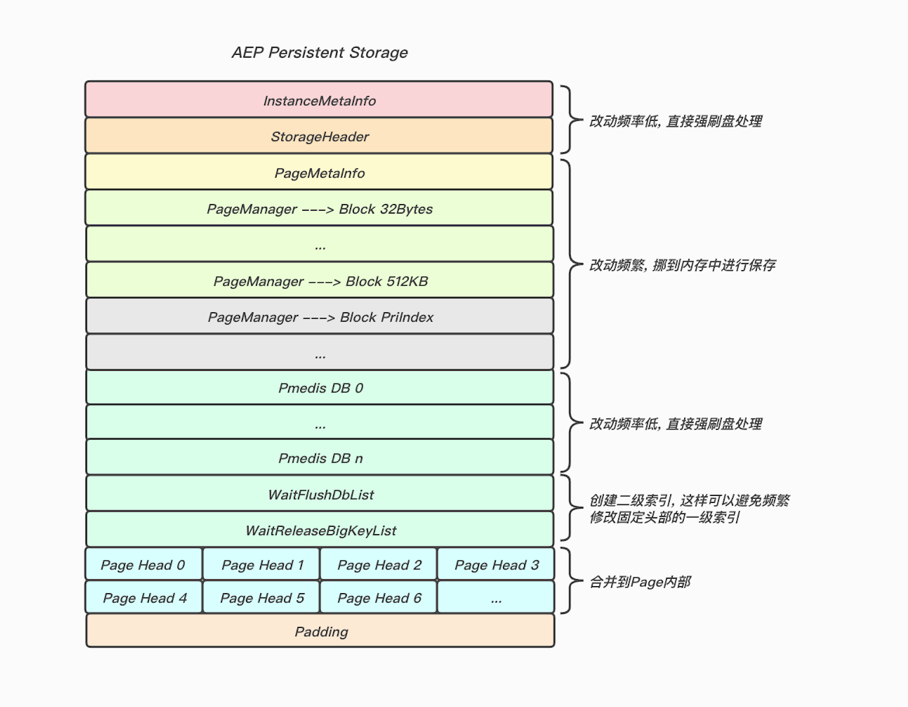
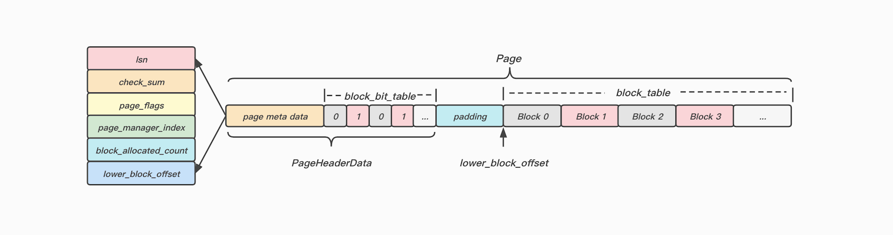
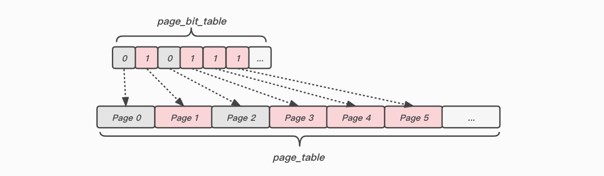
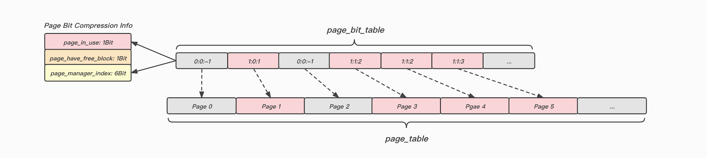
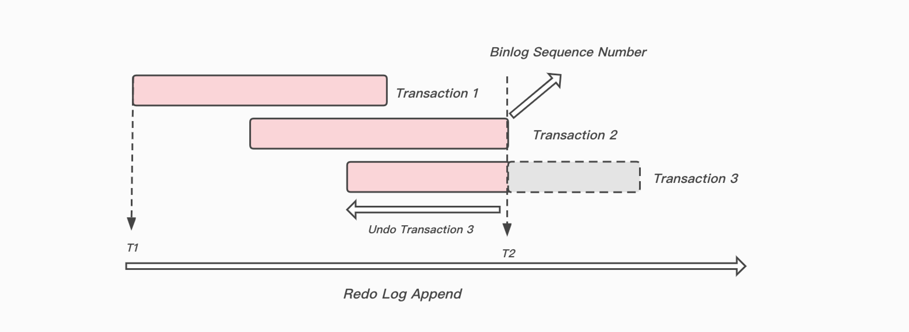

## 背景

目前Keewidb, 采用Shadow文件来保证在数据库发生故障的场景(机器断电, 进程异常退出等)下可以将数据库恢复到正确的状态, 这套机制有如下一些问题:

1. shadow文件相当于是全量数据的一个备份(`data_file`和`cold_file`), 这样占用了额外的磁盘空间, 成本较高.
2. 异步线程将已经提交的事务应用到shadow文件上, 这里会消耗大量的磁盘IO.


## CheckPoint解决了哪些问题
* 缩短数据库恢复时间
* 通过定期CheckPoint, 可回收旧的Redo日志, 有效的重复使用文件, 不需要新开辟redo日志空间.

## CheckPoint分类
### Sharp CheckPoint(完全检查点)
数据库正常关闭时，会触发把所有的脏页都写入到磁盘上(这时候logfile的日志就没用了，脏页已经写到磁盘上了)

### Fuzzy CheckPoint(模糊检查点)
数据库正常运行期间, 触发把部分脏页写入磁盘

## LSN(Log Sequence Number)

LSN的含义是日志的逻辑序列号(实际上就是RedoLog的偏移量), 通过LSN我们可以获取如下的信息:

1. 数据页的版本信息.
2. 写入的日志总量，通过LSN开始号码和结束号码可以计算出写入的日志量.
3. 可知道检查点的位置.

`data_page_in_buffer_lsn` :  Buffer Pool上Page的LSN

`data_page_on_disk_lsn` : 磁盘上Page的LSN

`redo_log_in_buffer_lsn` : 内存中还没有刷盘的RedoLog的最大LSN

`redo_log_on_disk_lsn` : 在磁盘上RedoLog的最大LSN

`check_point_lsn`: 检查点的LSN

## 固定头部重构
由于之前我们把`PageManager`和`PageHead`都放在固定头部, 这带来了如下的一些问题:

1. 将PageHead放在固定头部, 占据了AEP的空间, 这部分空间较大且不能落冷(PageHead约占整个Page的1%)
2. 每次分配和释放Page, 可能涉及到修改AEP中`PageMetaInfo`和`PageManager`信息(包括空闲Page用链表串联操作), 这部分操作需要记录redo, 造成了不小的写放大, 影响了性能.





#### 将PageHead放在Page内部, 并且优化相关字段:

优势:

 1. 减少随机IO(原先分配Page需要修改PageHead中的元信息和Page中的数据块)
 2. 减少缓存的占用空间(原先PageHead存放在AEP上, 无法落冷)
 3. 减少写放大(原先分配和释放block时需要更新`free_block_list`等一系列元信息, 现在只需要更新`block_bit_table`对应比特位即可)
 4. 初始化一个新Page的时候可以记录逻辑redo而非物理redo, 降低redo开销

劣势:

 1. 对线性Hash定位槽不太友好, 可能增多读盘次数(解决方案: 对线性Hash占用的Page做特殊标记-永不落冷)

全新PageHeaderData定义:

```cpp
struct PageHeaderData {
  uint64_t lsn;
  uint16_t check_sum;
  uint8_t  page_flags;
  uint8_t  page_manager_index;
  uint8_t  block_allocated_count;
  uint16_t lower_block_offset;

  uint64_t block_bit_table[FLEXIBLE_ARRAY_LENGTH];
}
```



#### 将PageMetaInfo和PageManager存放在内存当中(方案一):
**优势**:  分配Page都是内存中`PageMetaInfo`和`PageManager`元信息的修改, 没有涉及磁盘操作(这里指的是持久化数据的修改, 以及写redo的开销), 性能有所提升.

**问题**:  由于`PageMetaInfo`和`PageManager`信息没有持久化, 在重启以及故障恢复时我们需要依靠一系列的自我纠正措施来恢复这些信息.

**修改策略**:

1. 在内存中维护一个`page_bit_table`(对应索引的比特位用于表示page的使用情况, 0表示未使用, 1表示已经使用).
2. 在分配和归还page时更新`PageMetaInfo`和`PageManager`以及`page_bit_table`上对应比特位的信息.
3. 根据时间和改动次数两个维度决定`page_bit_table`刷盘时机(将`page_bit_table`拷贝, 异步线程刷盘到单独的文件, 避免对主线程造成影响)

**恢复策略:**

1. 由于并不是每次更新`page_bit_table`我们都会触发持久化操作, 所以在重启加载`page_bit_table`文件时, 文件中的内容可能是`过时的`
2. 将`page_bit_table`文件加载到内存中, 将其认为是空闲的page添加到`free_page_list`当中(此时`free_page_list`中可能有一些页并不是空闲的, 并且有一些实际上是空闲的页并不在`free_page_list`中).
3. 重新从前往后遍历内存中的`page_bit_table`并且读取对应的Page进行校验恢复(这里记录一个`纠正指针`), 我们称这个流程为自我纠正阶段:
	1. 发现当前Page是空闲状态, 确保它在`free_page_list`当中.
	2. 发现当前Page是非空闲状态, 确保它不在`free_page_list`当中, 并且将其加入到对应的`PageManager`中.
4. 在自我纠正阶段, 数据库是可以提供服务的, 我们可能会分配或者释放页,  如果当前操作的页在`纠正指针`之前, 直接做对应的操作即可, 如果在`纠正指针`之后, 由于可能存在数据不准确的问题, 在做对应操作之前可能需要进行纠正操作:
	1. 在`free_page_list`中获取新的空闲页时, 解析读取PageHead, 若发现其非空闲, 直接从`free_page_list`中移除, 并且加到对应的`PageManager`中.
	2. 由于某些操作释放了Page中的block, 先确认当前Page并不在`free_page_list`中, 并且更新对应`PageManager`中的元信息.
5. 等到`纠正指针`到达`page_bit_table`末尾, 我们认为自我纠正已经完成, 当前内存中的`PageMetaInfo`和`PageManager`信息已经完全准确.

自我纠正分为`主动纠正`和`被动纠正`两种, 由于`主动纠正`是从前向后的, 而`被动纠正`是根据业务行为随机触发的, `主动纠正`可能会遇上已经`被动纠正`的页, 这里可以对已经自我纠正的页做比特标记, 避免重复纠正造成页加载的开销.

```cpp
struct PageMetaInfo {
  int32_t total_page_count;
  int32_t total_page_allocated_count;

  std::set<int32_t> free_page_list;
}

struct PageManager {
  int32_t page_allocated_count;
  int32_t block_allocated_count;

  std::set<int32_t> noempty_page_list;
}
```



**内存占用情况:**

我们以单Page大小为8k进行计算, 1TB的存储空间进行计算(Page数量为1024 * 1024 * 1024 * 1024 / 8 / 1024 = 134217728个)

`page_bit_table`中1Bit可表示单个Page的空闲情况, 1TB的存储空间, `page_bit_table`占用空间约为16MB(134217728 / 8 / 1024 / 1024 = 16MB)
`PageMetaInfo`和`PageManager`中4Bytes可表示一个Page, 1TB的存储空间, Page元信息占用空间约为512MB(134217728 * 4 / 1024 / 1024 = 512MB)

优化策略: 并不记录整个存储空间的所有Page信息, 采用渐进式分配Page的策略, 并且当前只记录当前分配`最远触达`Page之前的信息,

#### 将PageMetaInfo和PageManager存放在内存当中(方案二):
**优势**:  分配Page都是内存中`PageMetaInfo`和`PageManager`元信息的修改, 没有涉及磁盘操作(这里指的是持久化数据的修改, 以及写redo的开销), 性能有所提升.

**修改策略**:

1. 在内存中维护一个`page_bit_table`, 每个Page的信息用8 Bit压缩表示
	* `page_in_use`占用1 BIt, 用于区分Page是否空闲, 为0表示当前Page空闲, 为1表示当前Page在使用中
	* `page_have_free_block`占用1 Bit, 用于区分在使用中的Page是否还可分配空闲Block, 为0表示当前Page所有Block都已用完, 为1表示当前Page还可分配空闲Block
	* `page_manager_index`占用6 Bit, 用于记录当前在使用中的Page属于哪个PageManager
2. 在分配和归还page时更新`PageMetaInfo`和`PageManager`以及`page_bit_table`上对应比特位的信息.

**持久化阶段**

由于`PageMetaInfo`和`PageManager`是在内存中进行保存, 在进程主动退出和机器宕机时, 这部分数据会丢失, 所以我们必须持久化`page_bit_table`数据, 以便可以在重启的时候恢复这部分数据.

这里可以在每次做CheckPoint的时候对`page_bit_table`做持久化操作, 并且在故障恢复的时候对CheckPoint点位之后的`Redo/Undo`进行遍历, 加载其对应操作的Page获取准确的分配信息, 并且更新`page_bit_table`, 等到`Redo/Undo`遍历完成之后`page_bit_table`中的内容一定是准确的.

```cpp
struct PageMetaInfo {
  int32_t total_page_count;
  int32_t total_page_allocated_count;

  std::vector<int32_t> free_page_list;
}

struct PageManager {
  int32_t page_allocated_count;
  int32_t block_allocated_count;

  std::vector<int32_t> noempty_page_list;
}
```



**内存占用情况:**

我们以单Page大小为8k进行计算, 1TB的存储空间进行计算(Page数量为1024 * 1024 * 1024 * 1024 / 8 / 1024 = 134217728个)

`page_bit_table`中1Byte可表示单个Page的基础信息, 1TB的存储空间, `page_bit_table`占用空间约为128MB(134217728 / 1024 / 1024 = 128MB)
`PageMetaInfo`和`PageManager`中4Bytes可表示一个Page, 1TB的存储空间, Page元信息占用空间约为512MB(134217728 * 4 / 1024 / 1024 = 512MB)

优化策略: 并不记录整个存储空间的所有Page信息, 采用渐进式分配Page的策略, 并且当前只记录当前分配`最远触达`Page之前的信息,

**备注:**

1.  之前PosInfo的语义会发生变化. 
2.  这里要考虑B+树和线性Hash的Raw Page的用法的改动大小.
3.  由于我们需要用Page来重建内存中的`PageMetaInfo`和`PageManager`信息, 所以我们完全依赖Page中信息的准确性, 这里在初始化Page的时候和再归还Page的时候需要将一些关键字段赋值.
4.  这里需要考虑回滚的问题(持久化数据可以来undo进行回滚, 内存数据无法回滚)

## Page修改流程
1. 对需要修改的Page(缓存)进行Lock操作
2. 将需要的修改应用到Page上
3. 将Page标记为脏(为什么必须发生在WAL日志插入前? 因为异步线程做CheckPoint的时候获取了新的LSN, 但是可能由于当前Page没有dirty标记从而错过刷脏)
4. 构建一条RedoLog, 插入WAL(此时`redo_log_in_buffer_lsn`更新)
5. 获取最新的LSN(`redo_log_in_buffer_lsn`), 更新脏Page(缓存中)的LSN(`data_page_in_buffer_lsn`)
6. 对Page进行UnLock操作


## Page刷脏和Redo/Undo刷盘策略
**Page刷脏时机:**

1. 要加载冷页, 但是此时BufferPool已经满了, 根据LRU策略进行被动的Page的刷脏.
2. 要做CheckPoint, 遍历BufferPool中所有的Page并且做标记, 将有`CHECKPOINT_NEEDED`标记对应的Page进行主动刷脏.
3. 定期刷脏的逻辑, 避免BUfferPool满了.

**Redo和Undo的刷盘时机:**

1. 事务提交, 确保对应事务的Redo一定要刷盘
2. Page刷盘之前, 确保Page上对应LSN之前的Redo, 以及改动该Page的Undo一定要刷盘.


## CheckPoint流程(异步线程处理)
1. 达到触发条件, 启动CheckPoint.
2. 获取当前的`redo_log_in_buffer_lsn`作为`redo_point_lsn`.
3. 遍历Buffer Pool中的Page(需要上锁), 将当前处于Dirty状态的Page标记为`CHECKPOINT_NEEDED`状态.
4. 重新遍历Buffer Pool, 将`CHECKPOINT_NEEDED`状态的Page进行刷盘处理(页面不会从缓存中逐出，而只会写入磁盘).
5.  将当前的CheckPoint信息作为一条特殊redo记录到Log当中.
6. 更新ControlFile中的CheckPoint信息(包括`redo_point`的位置, CheckPoint的类型(`Sharp` or `Fuzzy`)等等...).
7. 标记`redo_point`之前的RedoLog处于可清理状态.

## 部分写流程
主要是解决Keewidb中的PageSize和操作/文件系统中的PageSize不一致而导致Keewidb刷脏无法保证原子性的问题(例如Keewidb中单个Page为16k, 操作/文件系统中Page为4k(通过`getconf PAGESIZE`获取), 刷一个Keewidb中Page需要写四个文件系统中的页)

解决方案是引入Double Write Buffer(简称DWB), 其中包含两部分内容, 一部分是内存中的Buffer, 另外一部分是磁盘上的文件.

1. 将Keewidb中待刷脏的页先Copy到DWB的内存Buffer中.
2. 将DWB内存Buffer中的数据页刷到DWB的磁盘文件上.
3. 最后再将DWB内存Buffer中的数据页刷到Keewidb中的`cold_file`中.
4. 清空DWB中的内容

##  Full Page Write机制
Keewidb后续可能会将单个Page的大小调整为8K，Keewidb数据页写入是以page为单位的, 但是在断电等情况下, 操作系统不能保证单个Keewidb中Page原子地写入磁盘的问题，这样有可能导致部分数据块只写到4K(操作系统是一般以4K为单位)，这些"部分写"的页面包含新旧数据的混合, 在崩溃后的恢复期间, 由于redo里存储的记录变化信息不够完整，无法完全恢复该页.

Keewidb在CheckPoint之后在对数据页面的第一次写的时候会将整个数据页面写到RedoLog里面。当出现主机断电或者OS崩溃时，Redo操作时通过checksum发现"部分写"的数据页，并将RedoLog中保存的这个完整数据页覆盖当前损坏的数据页，然后再继续redo就可以恢复整个数据库了.

**这里在应用层面无法解决, 操作系统和硬件若支持4k/8k原子写, 我们可在Keewidb层面增加`Full Page Write`开关,  正在确认中**

## 故障恢复
1. 启动Keewidb, 查看ControlFile中CheckPoint信息
2. 如果CheckPoint类型为`Sharp`, 表明之前是正常退出, 所有脏页都已刷盘, 直接跳过恢复流程
3. 找到redo_point位置, 遍历之后的RedoLog, 进行Page恢复, 此时事务可能存在如下三种状态:
	1. 已提交的事务: 事务有Commit标记, 直接回放.
	2.  未提交事务: 事务有Prepare标记, 但是没有Commit标记, 且事务的Binlog已经落盘(**这里需要快速检索Binlog, 还需要考虑Binlog的删除时机**), 直接回放, 并且对该事务做Commit标记.
	3.  未提交事务: 事务没有Commit标记, 无论是否有Prepare标记, 只要事务对应的Binlog没有落盘, 我们都认为事务未完成, 我们先进行Redo回放, 并且做记录, 等待后续执行Undo进行回滚操作.
4.  在遍历RedoLog恢复的过程中, 我们会读取改动Page内部的元信息, 进行`page_bit_table`校准.
5. 加载`page_bit_table`到内存中, 重建内存中的`PageMetaInfo`和`PageManager`元信息.
6. 反向遍历UndoLog, 筛选出未Commit事务的Undo进行回滚操作.

## 备份流程
这里采用直接copy文件的方式进行备份(可跳过文件空洞), 由于在copy的过程中可能存在源文件上Page的修改, 目标文件上可能会存在某些Page存在新旧混合数据, 所以在copy文件的过程中, 如果我们对页进行了修改, 我们需要记录该页的完整数据(实际上就是Full Page Write).

优先触发CheckPoint

**copy文件:**

1. 异步线程启动备份流程, 标记当前处于备份状态中.
2. 记录当前redo的点位(记录当前时间为T1), 并且开始copy文件.
3. 在copy文件的期间, 对数据页面的第一次修改时会将整个数据页面记录到redo里面(可能存在`部分写`的问题), 我们需要记录该页面的全量数据.
4. 生成目标文件之后, 记录当前redo的点位(记录当前时间为T2).



**回放redo:**

1. 在目标文件上回放T1 ~ T2这个时间段内产生的redo日志.
2. 记录在该时间段已产生redo, 但未提交事务的集合.
3. 通过undo将未提交事务回滚.
4. 将T1 ~ T2时间段内最后提交事务所对应的`Binlog Sequence Number`作为增量同步的点位(若没有, 则从T1回溯查找)


## 备注

1. 并发需要考虑Multi和Lua相关问
