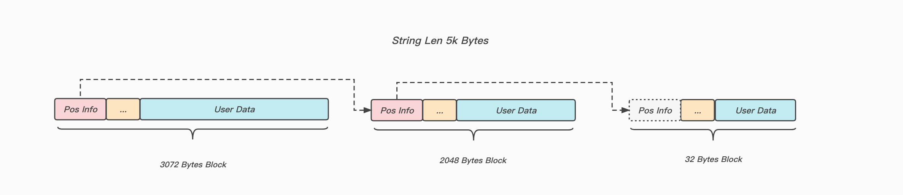

## Keewidb底层存储介绍

#### 整体结构

Keewidb Storage展示的是存储在磁盘上的数据文件格式, 数据文件由若干个大小为4K的Page组成, 文件头部使用了一些Page用于存储元信息, 包括跟实例相关和存储相关的元信息, 元信息后面的Page主要用于用户数据的存储以及我们自身数据结构对应索引的存储.

Redis在字典内部存储的元素达到一定阈值之后, 考虑到查找性能可能会触发expand操作, Redis侧每次都是双倍expand操作(如果当前dict的size是128MB, 下次就需要分配256MB连续的内存空间), 在keewi侧一次性分配大块的连续page页开销很大(需要查找, 初始化, 以及写Redo/Undo日志), 会严重影响性能(P99/P100), 所以采用了线性Hash来渐进式扩容(最大只需要找4MB的连续Page).

#### Page的内部结构

根据`block_bit_table`可以快速的查找空闲block的索引

#### 多Block链接

我们Page的大小为4K, 除去`PageHeaderData`占据的空间, 最大的Block存储空间不足4k, 遇到单个Block存储不了的用户数据, 我们需要将多个Block链接起来进行存储.

#### Block的分配逻辑

先去Block对应的PageManager中进行查询, 看`noempty_page_list`是否为空, 若非空直接从链表中获取Page分配Block, 否则从全局的`Free Page List`中获取空闲Page.

不同的Block都有自己对应的PageManager, 用来管理相关信息.

