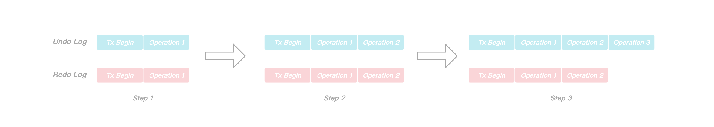

### KeeWiDB常见问题排查

#### 事务并发写WAL导致错误

目前KeeWiDB为了保证事务的持久性和原子性记录了Redo和Undo日志，针对数据操作WAL分为以下两种类型:

* 有Undo也有Redo，例如存储层的数据分配模块，如果事务没有完成服务就Core掉了，重启时需要回放对应的Undo做撤销操作.
* 没有Undo只有Redo，例如线性Hash索引层，一次事务触发了线性Hash的分裂，但是本次事务还没有完成服务就Core掉了，那么重启时是不能撤销分裂操作的， 因为有可能其他事务已经在分裂过后的线性Hash上做了插入数据操作了.

为了讨论问题简单，下面我们只讨论数据操作是有Undo和有Redo的场景，在故障恢复期间我们会回放目前存在的所有完整的Redo日志(如果是通过备份恢复，则通过区间信息决定回放的范围)，这里的正确性由如下两点来保证：

* 由于我们在Page层面记录了lsn信息， 所以Redo的回放是幂等的(无论是服务正常运行期间，还是故障恢复期间，只要是对Page做了修改操作， 都会更新Page的lsn，下次回放到对该页面修改操作的Redo时， 会根据对比Redo和页面的lsn来决定是否需要回放).
* 回放了未完成事务的Redo日志， 从而对Page做了修改操作，那么后续会通过回放对应的Undo来做对应的撤销操作.

通过上面的描述，我们发现如果要对未完成事务做撤销操作，那么需要保证如果存在一条需要应用的Redo日志， 那么它对应的Undo一定是完整落盘的，所以在工程实现中我们不管是写WAL还是做刷盘操作都是Undo先于Redo的，但是这里引入了另外一个问题:

通过上图看，在`Step 1`中启动了一个新事务，针对`Operation 1`先做纪录Undo和刷盘操作，然后再做纪录Redo和刷盘操作， 在`Step 2`中，同样的，针对`Operation 2`先做纪录Undo和刷盘操作，然后再做纪录Redo和刷盘操作，到目前为止都是没问题的，问题出在`Step 3`,  到了`Step 3`，我们针对`Operation 3`做纪录Undo和刷盘操作，来没来得及做纪录Redo和刷盘操作，此时刚好机器掉电或者Server Core掉，便多了一条Undo日志出来.

上图是故障恢复时WAL的遍历应用流程图，首先顺序回放Redo日志，然后在T0和T1两个时刻分别执行该事物的`Operation 1`和`Operation 2`两个操作，Redo日志回放完后接着逆序回放Undo日志，由于该事务未提交，我们需要回放该事务的Undo日志，但是T2时刻回放`Operation 3`就出问题了，因为在此之前并没有回放`Operation 3`对应的Redo日志，我们平白无故多做一次Undo操作显然会导致数据正确性的问题.

为了保证数据的正确性，我们需要确保只回放**需要被回放**的Undo日志(也就是对应Redo已经落盘的Undo)，由于我们是Undo先于Redo记录和刷盘的，理论上就会存在Undo比Redo多刷的情况，所以我们需要引入额外的字段来将多余的Undo日志给过滤掉，最终我们是在每一条Redo日志中记录当前事务在写此条Redo时的Undo的最大lsn.

