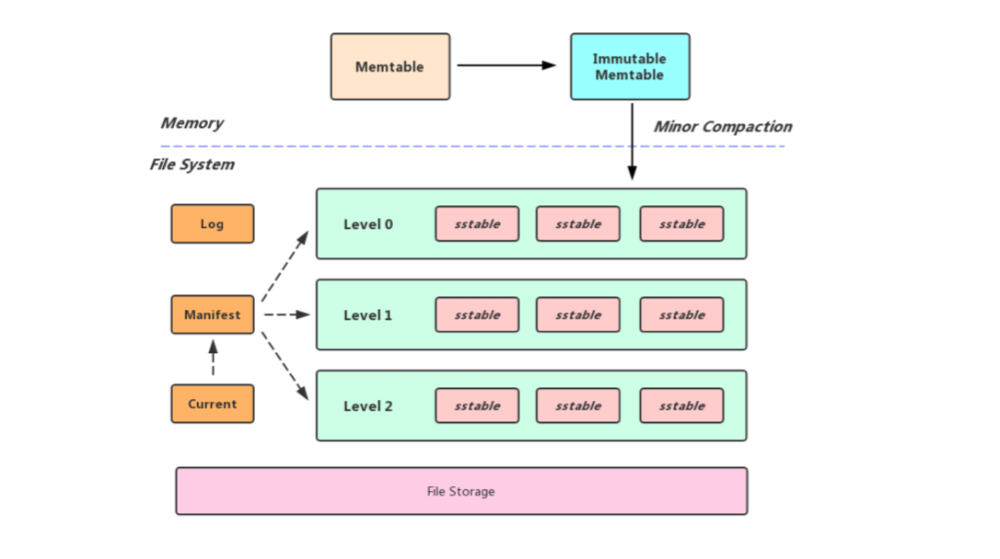
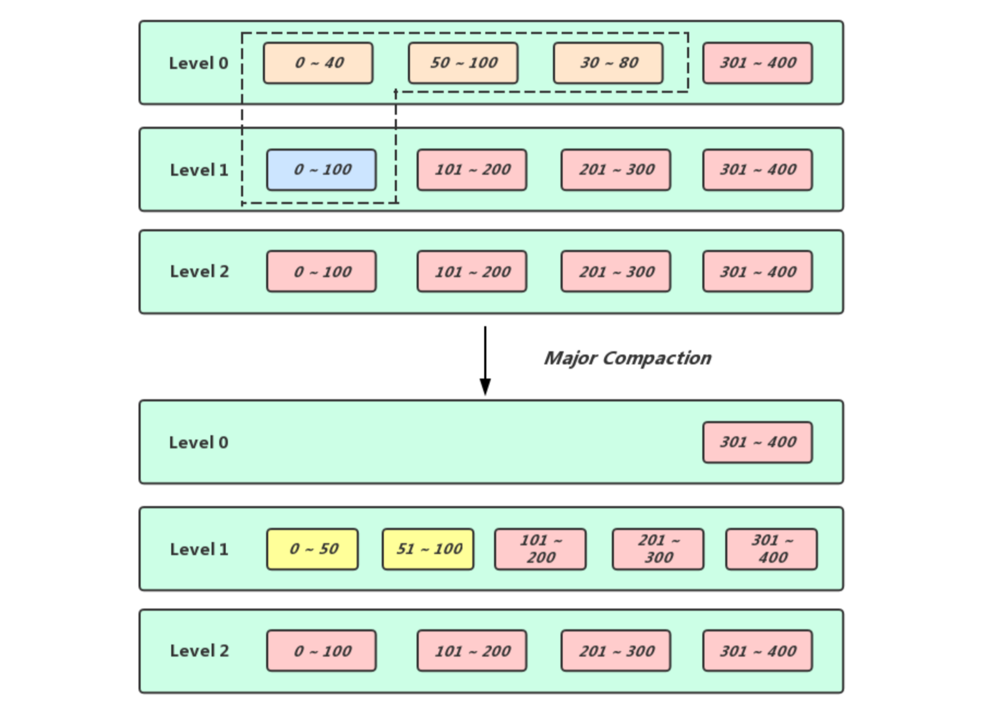
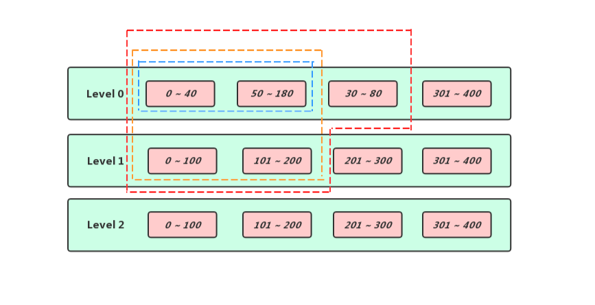
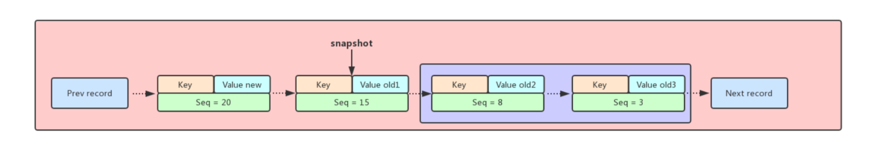
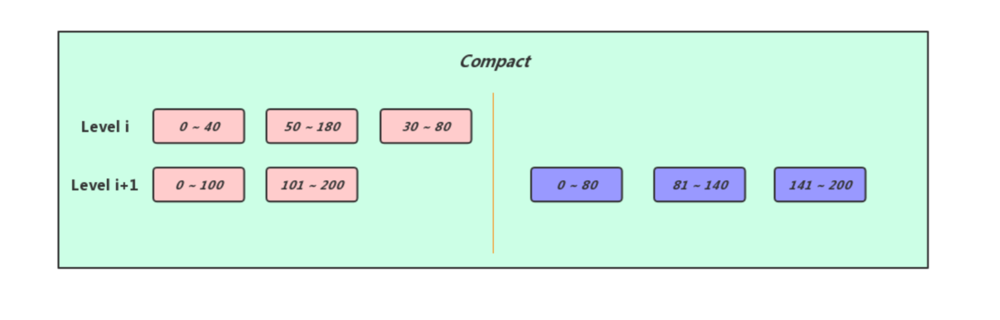

## **LevelDB的Compact**

### 介绍  
通过前面的博客我们了解到LevelDB是一个写性能十分优秀的存储引擎，是典型的LSM树的实现，LSM树写性能极高的原理实际上就是尽量减少随机写的操作，对于每次写入操作并不是直接将最新的数据进行落盘操作，而是将其拆分成两个步骤，首先将当前写入操作转换成一条记录顺序追加到日志末尾，然后将数据插入到内存维护的数据结构当中，等到内存中的数据体积到达一定的阈值，进行刷盘操作，基于这种思路实现的LevelDB确实获得了不俗的写性能，但是却面临如下两个问题

* 读放大（Read Amplification): 从LevelDB中进行数据查找操作需要从新到旧(从上到下）一层一层的进行查找，具体的来说如果没有在内存命中的话，则需要按照sst文件的新旧程度在Level 0层文件中依次遍历查找(因为Level 0层文件可能会有overlap)，因此在最差的情况下，可能要遍历所有的sst文件，显然一次查询操作可能需要不止一次I/O操作
* 空间放大（Space Amplification): 由于所有的写入都是顺序写，而不是实时更新，所以无效的数据不会马上被清理掉，而是继续占用着磁盘空间，比如说对一个key进行删除操作，实际上是对这个key做了一个删除的标记，并不会物理删除，又比如说对某一个key对应的value进行update操作，实际上是新添加了一条key/value的记录，而老的那个key/old value还是存在于磁盘上

可预见的是，随着数据不断的写入我们如果不采取任何措施，读放大和空间放大问题会越来越严重，LevelDB为了提高读写效率并且降低空间放大的问题引入了Compact机制，这正是本篇博客要介绍的

LevelDB中的Compact可以分为Minor Compact和Major Compact，下面会一一介绍

### Minor Compact
前面的博客提到过，向LevelDB中写数据，首先是写入内存中的Memtable，然后Memtable在一定的条件下(实际上就是Memtable的体积达到了用户设置的write\_buffer\_size大小)就会转换成Immutable Memtable，而Immutable Memtable就会等待被刷盘， 所以Minor Compact的本质就是将内存数据库中所有数据持久化到一个磁盘文件中



Minor Compact的流程实际上很简单，创建一个迭代器用于迭代Immutable Memtable，在遍历的过程中将获取到的数据写入到一个sst文件当中，这个过程完毕之后将新生成的sst文件放入到Level 0当中， 然后将Immutable Memtable置空， 需要注意的是由于Level 0中的sst文件是由内存中的数据直接生成，所以该层不同的sst文件之间可能有overlap，正是由于有此特性，所以不管是数据查询还是Major Compact对Level 0层都会进行特殊处理

#### 触发时机
LevelDB中Memtable的体积达到了write\_buffer\_size, 就会转换成Immutable Memtable(这时会将Memtable置空，允许外界将数据写入新的Memtable当中), 然后后台线程便会执行Minor Compact的操作

Q: Minor Compact既然是后台线程操作，那么会不会存在上次Minor Compact任务还没执行完，新的Memtable又被写满了？

A: 问题是存在的，这种情况下我们只能阻塞等待，也就是常说的阻写操作

### Major Compact
如果说Minor Compact的作用是将内存中的数据原封不动的刷到磁盘中然后腾出内存中的空间容纳新的数据，那么Major Compact的作用实际上就是经可能的清理掉无效的数据来缓解读放大和空间放大的问题，Major Compact是作用于相邻Level之间的，在Level层选出待Compact的连续一段区间的sst文件，然后在Level + 1层选出可以完全覆盖Level待Compact的那段区间，接着就是将这些sst文件中的所有条目做一次归并遍历然后将有效的数据输出到新的sst文件当中，最后将新生成的sst文件放入Level + 1层合适的位置中，然后将参与Compact的那些旧sst文件删除即可 (这个过程是比较复杂的，并且LevelDB做了一系列优化操作， 下面会细说)



#### 触发时机

* 通过体积触发(Size Compaction): 在生成新的Version之前会通过当前Version的sst文件的分布情况为每一个Level计算出一个score值，score值越大表示对应层越需要触发compact，因为Level 0层的sst文件之间可能存在overlap，查询起来开销较其它层要大，我们需要避免在Level 0层存放过多的sst文件，所以Level 0层的score值是按照该层sst文件数量以及kL0_CompactionTrigger(Level 0层最多4个sst文件)计算出来的，对于Level i (i >= 1)来说，一次读取最多只会访问一个sst文件，因此，本身对于读取效率影响不会太大，针对这部分数据发生compact的条件，从提升读取效率转变成了降低compact的IO开销，这种情况score值是根据该层自身所有sst文件体积之和以及该层对应触发Compact的阈值决定的(Level 1层的阈值是10MB，Level 2层的阈值是100MB，依次类推， 某层sst文件的总体积除以该层对应的阈值就是score)，遍历了所有Level之后会在当前Version中记录下最大的score值到compaction\_score\_中以及对应的level到compaction\_level\_中，如果score的值大于1，那么就需要等待被Compact了

* 通过Seek触发(Seek Compaction): 在Leveldb内部实际上有一套假设，说是一次Seek花费10ms，读写1MB的数据花费也是10ms，然后对1MB的数据做Compact会花费25MB的IO，所以得出结论说执行一次Seek的代价和Compact 40Kb的数据的代价相等，所以在生成一个新的sst文件时，会通过该文件的体积计算出其最大可以被seek的总次数记录在对应文件的allowed\_seeks当中，以后如果通过Get接口执行的查询操作找到了某个sst文件，但是实际上我们所需要的数据并不在这个文件当中，那么该文件的allowed\_seeks变量会进行自减操作，如果某个sst文件的allowed\_seeks小于等于0了，那么就会将该当前Version中的file\_to\_compact\_指向这个文件，并且令file\_to\_compact\_level\_记录这个文件的所在层，等待触发Compact

#### 步骤
1. 在Level层寻找需要被Compact的sst文件
2. 根据上一步选中的sst文件扩大输入文件的集合
3. 多路合并，生成新的sst文件到Level + 1层
4. 不同Level的积分重新计算(就是上面说的score)

##### 寻找输入文件
上面介绍了两种触发Compact的时机，如果是通过体积触发的，我们只需要找到Level层第一个大于该层compact\_pointer\_的sst文件作为目标文件即可， 如果是通过Seek触发的，那更加简单了，目标文件直接被记录在了Version的file\_to\_compact\_当中(需要注意的是，如果当前是Level 0层触发Compact，那么需要特殊处理一下，要在该层找到其他和目标文件有overlap的sst文件)，我们将在Level层选中待Compact的sst文件放入input[0]集合当中

##### 扩大输入文件集合
1. 计算出input[0]集合中sst文件覆盖的总区间(我们将这个区间称为[smallest, largest]，也就是下图中蓝色框内部的sst文件）
2. 在Level + 1层找到和[smallest, largest]有overlap的sst文件放入到input[1]集合当中（Level + 1层被橘色框括住的sst文件）
3. 最后根据input[0]和input[1]集合中sst文件覆盖的总区间(这里我们将这个区间称为[all\_start， all\_end])，在不扩大input[1]输入文件的前提下，查找Level层中与[all\_start, all\_end]有overlap的sst文件构成input[0]中最终的文件(被红色框扩住的sst文件就是最后计算出来参与这次Compact的文件)



##### 多路合并
1. 先计算出一个smallest\_snapshot(我们知道LevelDB的快照本质上就是一个序列号，而DB每条记录也有一个对应的序列号，我们可以根据这个序列号来判断记录是否可以被合法删除)
2. 根据上一步骤计算出来的input[0], input[1]集合来构建一个MergingIterator([LevelDB中的Iterator](https://axlgrep.github.io/tech/leveldb-iterator.html))
3. 利用迭代器遍历参与Compact的sst文件中所有条目，并且按照如下规则将无效条目给丢弃掉，并且把过滤之后留下来的有效条目写入到新的sst文件放入到Level + 1层，这样一轮Compact结束之后由于删除了部分无效数据就能缓解空间放大的问题


```cpp
      if (last_sequence_for_key <= compact->smallest_snapshot) {
        // Hidden by an newer entry for same user key
        drop = true;    // (A)
      } else if (ikey.type == kTypeDeletion &&
                 ikey.sequence <= compact->smallest_snapshot &&
                 compact->compaction->IsBaseLevelForKey(ikey.user_key)) {
        // For this user key:
        // (1) there is no data in higher levels
        // (2) data in lower levels will have larger sequence numbers
        // (3) data in layers that are being compacted here and have
        //     smaller sequence numbers will be dropped in the next
        //     few iterations of this loop (by rule (A) above).
        // Therefore this deletion marker is obsolete and can be dropped.
        drop = true;
      }
```



前面介绍过在LevelDB当中如果多条记录具有相同的Key，那么排列在最前面的那个条目序列号一定是最大的，并且存储的数据也是最新的，而排列在后面的那些则是旧数据，理论上是可以被删除的，但是前提是这个条目没有被快照引用，在上面的插图中Seq=20的那条记录是最新的，但由于在Seq=15处打了一个快照，所以只有被紫色矩形括住的条目在可以被drop掉


再考虑另外一种场景，和上面一样有一系列Key相同的条目排列在一起，但是队头的条目是带有删除标记的，这就意味着对应Key是已经被删除的，在没有快照限制的场景下紫色矩形括住的条目实际上都是可以被drop掉的，但是当我们在删除带有kTypeDeletion标记的条目的时候要保证在[level_ + 2， kNumLevels]层这个Key一定没有出现过，否则高Level的对应Key的旧数据可能会变成新数据



经历过多路合并之后Level i和Level i+1层的sst文件中的有效条目被合并会生成新的sst文件，我们需要将新生成的sst文件放入Level i+i层中合适的位置，然后将之前参与Compact的sst文件删除

##### 重新计算积分
经过上一步多路合并的操作，由于我们对Level i层以及Level i+1层的sst文件进行了改动，所以可能会触发新一轮的Size Compaction，这时候我们需要对每一次进行积分统计，从而得出参与新一轮Compact的层数

积分规则十分简单

* 对于Level 0来说，积分等于该层的sst文件数量 / 4
* 对于非Level 0来说，积分等于该层sst文件的总体积 / 该层的数据总体积上限

我们会在新的Version中记录最高的积分以及对应的层数，如果记录的积分大于等于1，则我们会在下次对对应的Level进行Compact操作

### 总结
Compact我认为是Leveldb最复杂的过程之一，同时也是Leveldb的性能瓶颈之一(compact过程伴随着文件的增删，占据磁盘IO，如果Compact速度过慢导致Level 0层sst文件堆积，可能会触发Leveldb的缓写甚至阻写的机制)，但是在执行Compact的期间对Leveldb的可用性不会造成影响，在Compact的过程中虽然会生成新的sst文件，但是旧的sst文件是不会被删除的，这意味着它依然是可读的，只有在Compact结束的时候会将sst文件的改动应用到新的Version上，这时候如果没有快照引用旧sst文件，那么这些旧的sst文件就可以被安全的删除了.
