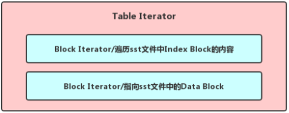
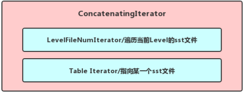
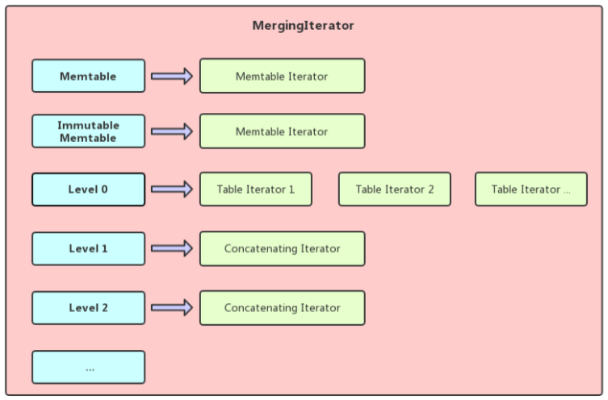
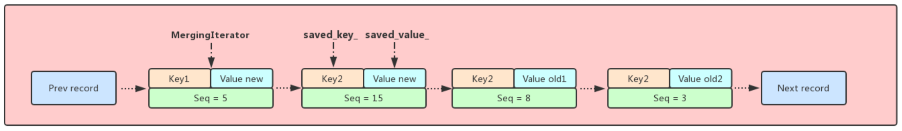

## **LevelDB中的Iterator**
### 介绍  
LevelDB作为一个非常高效的kv数据库，得益于其使用了LSM Tree的存储模型，写入性能十分强悍，但是作为数据库并不是一味的写入数据，必要的时候我们还需要对数据进行遍历获取，这时候我们需要一个组件来对LevelDB中存储的数据进行批量的访问，这个组件正是我们这篇博客要介绍的Iterator，通过之前的博客我们了解到LevelDB中存储的数据分布在Memtable，Immutable Memtable，以及各层Level的sst文件当中(而且Level 0层的sst文件之间还可能有overlap)，因为访问各个位置数据的方式并不完全相同，所以LevelDB中定义了多种类型的Iterator，在不同的场景使用不同的Iterator，在某些特定的场景下甚至需要对几个不同的Iterator进行组合使用，下面我们会一一介绍.

### 接口
尽管访问不同位置的对应Iterator的实现各不相同，但是Iterator的作用无非就是定位，遍历以及获取，为此LevelDB定义了一个Iterator基类，基类中列出了这些必要的纯虚方法，继承Iterator的子类只需实现这些方法即可.

 * 判断当前Iterator指向的位置是否有效: Valid()
 * 定位到某个位置获取数据: SeekToFirst(), SeekToLast(), Seek()
 * 访问当前Iterator指向位置的前驱或者后继: Next(), Prev()
 * 访问当前Iterator指向的位置的数据信息: key(), value(), status()
 * 注册方法在Iterator析构的时候对当前Iterator持有的数据进行释放: RegisterCleanup()
 
### 基础的Iterator
1. MemTableIterator
	* 主要用于获取Memtable/Immutable Memtable中的数据，由于两者的结构完全相同并且底层都是Skip List实现，Skip List有自己的Iterator， MemTableIterator实际上就是对Skip List Iterator的封装，Memtable的结构博客[LevelDB中的Memtable](https://axlgrep.github.io/tech/leveldb-memtable.html)中有详细的介绍
	* 需要注意的是Skip List中的每个节点只有指向后继的指针，而没有指向前驱的指针，在调用MemTableIterator的Prev()接口时内部需要二分查找，找到第一个比当前Node小的Node，所以实际上MemTableIterator的Prev()接口性能是低于Next()接口的，而且options.write-buffer-size越大，性能差距越明显

2. BlockIterator
	* 主要用于遍历SST文件中各个Block中的数据，通过博客[LevelDB的SST File](https://axlgrep.github.io/tech/leveldb-sst-file.html)我们对Block的格式已经有所了解，并且知道每一个Block末尾都有重启点信息，所以当我们需要Seek到Block中的某个位置时，Block末尾的重启点信息可以作为我们的一级索引，通过它我们可以Seek到离我们target最近的前一个重启点的位置，然后再向后遍历尝试查找target
	* 由于Block存储数据的特殊性，当我们调用Next()接口之后，内部解析了当前记录然后可以把指针挪到下一条记录的起始位置方便下一次解析，但是当我们调用Prev()接口，我们并不知道前一条记录的起始位置，我们只能先Seek到离我们当前记录最近的前一个重启点的位置，然后向后遍历找到当前记录的前一条记录，所以和MemTableIterator一样，BlockIterator也是Prev()接口性能低于Next接口()，并且options.block\_restart\_interval值越大，性能差距越明显

3. LevelFileNumIterator
	* 主要用于遍历除Level0以外其他层的sst文件, 构造LevelFileNumIterator需要传入对应Version和Level的所有FileMetaData集合，由于除了Level0以外其它层的sst文件都没有overlap，并且sst文件可以按照从小到大的顺序在集合中进行存放，所以LevelFileNumIterator的各个接口实现起来就很简单了，Prev()/Next()就是指向集合中前一个/后一个对象，SeekToFirst()/SeekToLast()就是指向集合中第一个/最后一个对象
	* Seek(const Slice& target)方法稍微复杂一点，由于FileMetaData中会记录对应的sst文件存储了哪个区间范围内的数据，调用Seek()方法时，我们使用target对FileMetaData集合进行二分查找，找到符合要求的FileMetaData并且指向它

	
### 组合的Iterator
对于遍历MemTable/Immutable MemTable这种简单的数据结构，我们使用MemTableIterator这种基础的迭代器就能胜任，但是当我们需要遍历一个sst文件，或者遍历某一层的所有sst文件，使用基础迭代器就不可行了，我们需要对这些基础的迭代器进行组合封装成一个新迭代器，这个新迭代器内部的各个基础迭代器进行协同合作才能应付复杂的遍历场景，下面举出LevelDB中几种组合迭代器


#### TwoLevelIterator
TwoLevelIterator内部维护了index\_iter\_和data\_iter\_两个迭代器，我们可以将index\_iter\_理解为一级索引，负责key到data\_iter\_的映射，而data\_iter\_才是真正指向用户数据的，两者协同合作可以快速定位数据，并且不同类型的index\_iter_和data\_iter\_组合也能形成不同的TwoLevelIterator以应付各种场景，下面我们会分别介绍

1.	用于遍历某一个sst文件的TwoLevelIterator, 我们暂且称为TableIterator, index\_iter\_对sst文件中Index Block中的内容进行遍历，并且驱动data\_iter\_指向新的Data Block，从而遍历整个sst文件的用户数据(创建TableIterator的时候会先去[LevelDB的TableCache](https://axlgrep.github.io/tech/leveldb-tablecache.html)中查找对应的sst文件是否已经打开并且将Index Block的内容缓存在Table Cache中)
<center></center>


2. 用于遍历除Level 0以外其他Level的所有sst文件的TwoLevelIterator, 我们暂且成为ConcatenatingIterator，index\_iter\_对这一层各个sst文件进行遍历，遍历到某一个sst文件的时候实际类型为TableIterator的data\_iter\_便指向它对其中用户数据进行遍历
<center></center>


#### MergingIterator
MergingIterator最典型的使用场景是需要对整个DB的数据进行有序遍历的时候，我们知道这时候有的数据在Memtable/Immutable Memtable中，需要Memtable Iterator遍历其中的数据，其他存在磁盘上的数据需要使用TableIterator和ConcatenatingIterator来进行遍历，而MergingIterator实际上就是将这些不同的Iterator管理起来，通过归并的方式使这些存放在不同位置的数据可以整体有序的返回给使用者

<center></center>

上面就是一个典型MergingIterator结构图，看了下面一段代码之后MergingIterator就能够了解其主要思想，如果是正向遍历则所有的迭代器都先SeekToFirst()一下，然后将这些这些迭代器中指向最小key的那个迭代器作为基准迭代器返回数据，下一次Next的时候只有这个基准迭代器调用Next()方法，然后再调用FindSmallest找出新的基准迭代器返回数据，这样就能让所有的这些迭代器所指向的数据整体有序返回了

```cpp
// 让Memtable和Immutable Memtable, 还有指向sst
// 文件的Iterator都SeekToFirst, 然后选出这些
// Iterator中指向key最小的那个作为当前的基准
// Iterator
virtual void SeekToFirst() {
  for (int i = 0; i < n_; i++) {
    children_[i].SeekToFirst();
  }
  FindSmallest();
  direction_ = kForward;
}j
  
// 遍历所有的Iterator, 然后找到当前指向Key最小的
// 那个, 用current_指向这个Iterator
void MergingIterator::FindSmallest() {
  IteratorWrapper* smallest = NULL;
  for (int i = 0; i < n_; i++) {
    IteratorWrapper* child = &children_[i];
    if (child->Valid()) {
      if (smallest == NULL) {
        smallest = child;
      } else if (comparator_->Compare(child->key(), smallest->key()) < 0) {
        smallest = child;
      }
    }
  }
  current_ = smallest;
}
```

### DBIterator
使用过LevelDB的同学应该知道，当我们需要遍历整个DB的时候我们会调用db->NewIterator(options)方法来创建一个迭代器，通过这个迭代器我们可以获取DB中所有符合要求的用户数据，下面看一下NewIterator的实现，实际上NewInternalIterator()创建的是我们上面说过的MergingIterator，可以获取DB中所有的数据。

```cpp
Iterator* DBImpl::NewIterator(const ReadOptions& options) {
  SequenceNumber latest_snapshot;
  uint32_t seed;
  // 在外部调用NewIterator创建一个迭代器之前，内部首先会创建一个
  // MergingIterator(内部维护一个迭代器集合, 指向memtable的，指向
  // immutable memtable的，还有指向level0层各个sst文件的，还有指向
  // 其他level的...), 然后外层还有一个DBIter持有了Mergingiterator
  Iterator* iter = NewInternalIterator(options, &latest_snapshot, &seed);
  // 在这里可以看到，实际上我们创建迭代器的时候可以传入一个snapshot, 这个
  // snapshot的本质就是一个sequence_number, 如果我们没有传入snapshot, 在
  // 构造这个迭代器的时候会从调用versions_->LastSequence(), 来获取最大的
  // Sequence
  return NewDBIterator(
      this, user_comparator(), iter,
      (options.snapshot != NULL
       ? reinterpret_cast<const SnapshotImpl*>(options.snapshot)->number_
       : latest_snapshot),
      seed);
}
```
看到这里也许读者会产生疑问，既然MergingIterator可以遍历DB中所有数据的话为什么用户使用的时候还需要在外层包一个DBIterator? 实际上原因很简单，前面的博客我们有提到过，LevelDB不管是写入数据还是删除数据，在DB内部的表现形式都是一条record， 这就意味着对同一个Key多次操作实际上就是相当于向DB中添加了多条包含同一个Key的不同record，由于越新的操作record上带的Sequence Number越大(也就是说这条record在所有Key相同的record中最靠前), 所以我们判定某一个Key的最新状态是以所有含有这个Key的record中Sequence Number最大的那个为准的，并且LevelDB支持快照的功能，可以创建一个迭代器来遍历某一个快照时刻DB中的用户数据，这时候我们就需要将用户指定快照时刻之后的数据给屏蔽了.

这时候你心里应该对DBIterator的作用有了一个答案了，DBIterator中含有MergingIterator，MergingIterator具有遍历DB中所有数据的功能，这些数据中对同一Key的record可能有多个，实际上除了最新的哪一个其他的都是无效的，而DBIterator的作用正是通过MergingIterator遍历DB中的所有数据，并且把无效的数据过滤掉，只把有效的数据返回给上层用户

下面来看一下DBIterator最常使用的Next()和Prev()方法的实现

```cpp
void DBIter::Next() {
  assert(valid_);

  if (direction_ == kReverse) {  // Switch directions?
    direction_ = kForward;
    // iter_ is pointing just before the entries for this->key(),
    // so advance into the range of entries for this->key() and then
    // use the normal skipping code below.
    if (!iter_->Valid()) {
      iter_->SeekToFirst();
    } else {
      iter_->Next();
    }
    if (!iter_->Valid()) {
      valid_ = false;
      saved_key_.clear();
      return;
    }
    // saved_key_ already contains the key to skip past.
  } else {
    // 在调用迭代器的Next()的时候, 首先会记录一下当前的迭代器
    // 指向的user_key, 并且将其保存到saved_key_这个变量当中去
    // 接着调用下面的FindNextUserEntry的时候就会跳过和saved_key_
    // 相同的key, 因为最新的数据我们已经遍历到了(user_key相同
    // sequence number大的表示最新的数据)
    // Store in saved_key_ the current key so we skip it below.
    SaveKey(ExtractUserKey(iter_->key()), &saved_key_);
  }

  FindNextUserEntry(true, &saved_key_);
}

/*
 * skip可以理解为我们已经获取了这个key了, 接下来如果还遍历到了这
 * 个key, 我们可以直接忽略掉, 因为之前获取的肯定sequence number
 * 要大, 也就是数据越新
 *
 * eg1..
 *   (D a) 18 -> (S a b) 14 -> NULL
 *   (S a c) 10 -> (S a f) 8 -> (S b d) 4 -> NULL
 *
 * 调用SeekToFirst之后迭代器会指向(S b d) 4
 *
 *
 * eg2..
 *   (S a b) 18 -> (S a c) 14 -> NULL
 *   (S a c) 10 -> (S b c) 8 -> (S b d) 4 -> NULL
 *
 * 调用SeekToFirst之后迭代器会指向(S a b) 18
 * 调用Next之后首先会记录一下a这个key, 然后遍历的时候
 * 直接跳过user_key为a的key, 最后迭代器会指向(S b c)
 *
 */

void DBIter::FindNextUserEntry(bool skipping, std::string* skip) {
  // Loop until we hit an acceptable entry to yield
  assert(iter_->Valid());
  assert(direction_ == kForward);
  do {
    ParsedInternalKey ikey;
    // 当ikey.sequence小于快照的sequence的时候才进行判断,
    // 否则直接跳过
    if (ParseKey(&ikey) && ikey.sequence <= sequence_) {
      switch (ikey.type) {
        case kTypeDeletion:
          // Arrange to skip all upcoming entries for this key since
          // they are hidden by this deletion.
          SaveKey(ikey.user_key, skip);
          skipping = true;
          break;
        case kTypeValue:
          if (skipping &&
              user_comparator_->Compare(ikey.user_key, *skip) <= 0) {
            // Entry hidden
          } else {
            valid_ = true;
            saved_key_.clear();
            return;
          }
          break;
      }
    }
    iter_->Next();
  } while (iter_->Valid());
  saved_key_.clear();
  valid_ = false;
}
```
实际上Next()的流程还是比较简单的，首先调用内部的MergingIterator的Next()方法指向DB中下一条record(仅仅是下一条record，这一条record对用户来说并不一定有效)，然后调用FindNextUserEntry()来查找下一条对用户有效的record，在MergingIterator遍历的过程中遇到带有kTypeDeletion标记的record需要跳过，并且记录当前key，便于后面遇到相同Key能直接跳过(因为带有这个Key的record前面已经出现过了，当前record肯定就是比较老旧的，换句话说就是失效的)，遍历的过程中遇到了符合要求的record便停止遍历(并且记录当前的key，原因和之前一样)，这时候MergingIterator所指向的内容就是用户当前所需要的数据

```cpp
void DBIter::Prev() {
  assert(valid_);

  if (direction_ == kForward) {  // Switch directions?
    // iter_ is pointing at the current entry.  Scan backwards until
    // the key changes so we can use the normal reverse scanning code.
    assert(iter_->Valid());  // Otherwise valid_ would have been false
    SaveKey(ExtractUserKey(iter_->key()), &saved_key_);
    while (true) {
      iter_->Prev();
      if (!iter_->Valid()) {
        valid_ = false;
        saved_key_.clear();
        ClearSavedValue();
        return;
      }
      if (user_comparator_->Compare(ExtractUserKey(iter_->key()),
                                    saved_key_) < 0) {
        break;
      }
    }
    direction_ = kReverse;
  }

  FindPrevUserEntry();
}

/*
 *
 * eg1..
 *   (D a) 18   -> (S a b) 14 -> NULL
 *   (S a c) 10 -> (S a f) 8  -> (S b d) 4 -> NULL
 *
 *  调用SeekToLast()之后迭代器会指向record (S a f) 8, 但是成员
 *  变量saved_key_和saved_value_会记录record (S b d) 4
 *  此时调用key(), value()返回的分别是b, d
 *
 *  调用Prev()之后此时iter_已经失效, 并且saved_key_和saved_value_
 *  里面不存储任何内容, 并且由于value_type == kTypeDeletion还会
 *  将DBIter的成员变量赋值为false, 宣告DBIter失效
 *
 *
 * eg2..
 *   (S a b) 20 -> (D a)  18 -> (S a c) 14 -> NULL
 *   (S a c) 10 -> (S b c) 8  -> (S b d) 4 -> NULL
 *
 *  调用SeekToLast()之后迭代器会指向record (S a c) 10, 但是成员
 *  变量saved_key_和saved_value_会记录record (S b c) 8, 此时调用
 *  key(), value()返回的分别是b, c
 *
 *  调用Prev()之后此时iter_已经失效，但是saved_key_和saved_value_
 *  会记录record(S a b) 20, 此时调用key(), vlaue()返回分别是a, b
 *  注意此时虽然iter_已经失效了, 但是DBIter的成员变量valid_被赋值为
 *  true, 所以外界调用迭代器的Valid()函数返回的是true
 *  再次调用Prev()之后, 由于下列函数一开始会将value_type设置为
 *  kTypeDeletion,并且由于iter_是失效的，所以直接走到最下面的逻辑
 *  将成员变量valid_赋值为false, 宣告DBIter失效
 *
 *
 * eg3..
 *   (S a b) 18 -> (S b d) 14 -> (S b f) 10 -> NULL
 *   (S a c) 9  -> (S b c) 7  -> NULL
 *
 *  调用SeekToLast()之后迭代器会指向(S a c) 9，但是成员变量
 *  saved_key_和saved_value_会记录record (S b d) 14
 *  此时调用key(), value()返回的分别是b, d
 *
 *  调用Prev()之后此时iter_已经失效, 但是saved_key_和saved_value_
 *  会记录record (S a b) 18, 此时调用key(), value()返回分别是a, b
 *  注意此时虽然iter_已经失效了, 但是DBIter的成员变量valid_被赋值为
 *  true, 所以外界调用迭代器的Valid()函数返回的是true
 *  再次调用Prev()之后, 由于下列函数一开始会将value_type设置为
 *  kTypeDeletion,并且由于iter_是失效的，所以直接走到最下面的逻辑
 *  将成员变量valid_赋值为false, 宣告DBIter失效
 */
void DBIter::FindPrevUserEntry() {
  assert(direction_ == kReverse);

  ValueType value_type = kTypeDeletion;
  if (iter_->Valid()) {
    do {
      ParsedInternalKey ikey;
      if (ParseKey(&ikey) && ikey.sequence <= sequence_) {
        if ((value_type != kTypeDeletion) &&
            user_comparator_->Compare(ikey.user_key, saved_key_) < 0) {
          // We encountered a non-deleted value in entries for previous keys,
          break;
        }
        value_type = ikey.type;
        if (value_type == kTypeDeletion) {
          saved_key_.clear();
          ClearSavedValue();
        } else {
          Slice raw_value = iter_->value();
          if (saved_value_.capacity() > raw_value.size() + 1048576) {
            std::string empty;
            swap(empty, saved_value_);
          }
          SaveKey(ExtractUserKey(iter_->key()), &saved_key_);
          saved_value_.assign(raw_value.data(), raw_value.size());
        }
      }
      iter_->Prev();
    } while (iter_->Valid());
  }

  if (value_type == kTypeDeletion) {
    // End
    valid_ = false;
    saved_key_.clear();
    ClearSavedValue();
    direction_ = kForward;
  } else {
    valid_ = true;
  }
}

```
Prev()的过程和Next()稍有不同，由于是从后向前遍历，MergingIterator并不知道当前自己指向的record是否是用户有效的，所以DBIterator中使用saved\_key\_和saved\_value\_两个变量对当前MergingIterator指向的record进行记录，然后MergingIterator才能'放心地'向前再进行遍历，FindPrevUserEntry()实际上就是让MergingIterator向前找到第一条与当前指向含有不同key的record, 这时候用户调用key()，value()获取的分别是saved\_key\_和saved\_value\_，而不是MergingIterator当前指向的key，value

从下图可以看出MergingIterator向前遍历找到第一条不是Key2的record并且指向它，并且saved\_key\_和saved\_value\_指向Key2的有效用户数据用于返回

<center></center>

### 总结
正是由于LevelDB各个组件用不同的格式将数据进行存储，所以在获取不同位置的数据时候需要针对其特定的格式进行解析，如果在获取数据的时候都对去关心所有的存储格式，无疑代码可读性会很差，正是由于如此LevelDB的Iterator用确定的特定接口将上层需求和下层实现解耦合，用于遍历特定位置的迭代器只需要继承Iterator，然后根据自己访问数据的特定格式对Iterator定义的几个接口进行实现即可