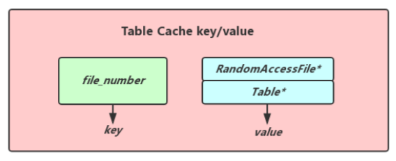
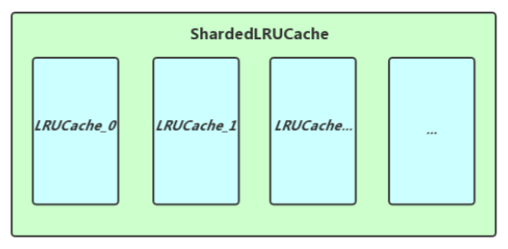
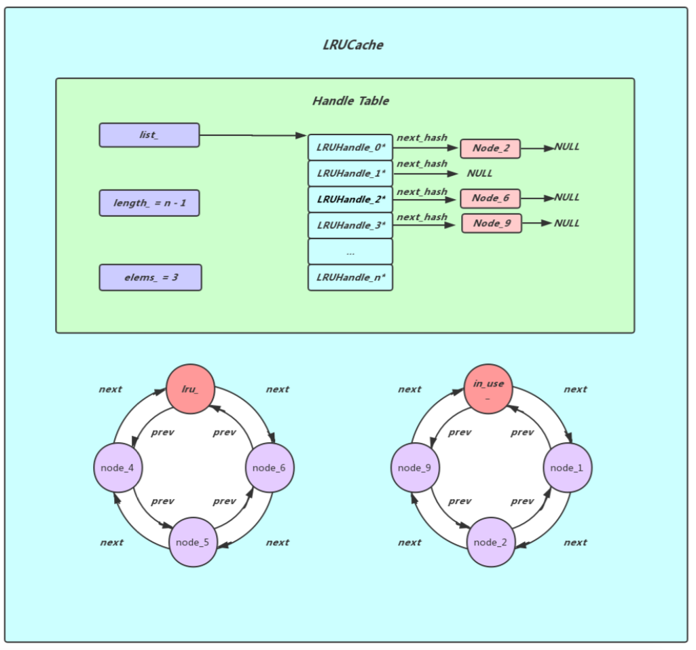

## **LevelDB的TableCache**

### 介绍
前一篇博客介绍过LevelDB数据是落盘的，而数据在磁盘上的表现形式就是SST文件，如果我们要查找的数据在Memtable和Immutable Memtable中都找不到，那我们就需要打开sst文件，首先解析它的Index Block，然后再通过其中的索引信息到对应的Data Block中进行查找了，如果每次都sst查询操作都经历上述步骤，效率之低可想而知，为此LevelDB引入了TableCache来缓存已经打开的sst文件以及对应的Index Block，这样如果需要对某个SST文件进行访问而它恰好又在Table Cache中，就可以直接从内存中进行读取，访问效率大大提升，同时为了避免将过多的SST文件信息都存在Table Cache中，LevelDB使用ShardedLRUCache，控制进程打开的文件句柄数以及内存的使用量，本篇博客会介绍TableCache的结构以及缓存策略.


### TableCache缓存的数据
上面提到了，TableCache用于缓存已经打开的sst文件以及对应的Index Block，方便快速的对SST文件进行访问，我们知道每个SST文件都有自己独立的编号，所以这个编号自然而然的成为了我们在TableCache中查找对应SST文件信息的key，而value的内容包括指向一个RandomAccessFile的指针以及指向Table的指针(这value中的这两个对象在堆上进行分配，我们在清除value的时候需要手动释放空间)，而Table中存有了对应sst文件的整个Index Block内容，可见还是会占据一定量的内存空间，下面是Table Cache key/value的结构图.




### TableCache的创建
在LevelDB的DB构造函数中会创建table\_cache\_，通过options\_.max\_open\_files和常量kNumNonTableCacheFiles的差值table\_cache\_size来控制table\_cache\_中缓存打开sst文件的上限.

```cpp
  // Reserve ten files or so for other uses and give the rest to TableCache.
  // options.max_open_files记录的是LevelDB最大的可以打开文件描述符的数量,
  // table_cache_size记录的是table_cache_中最大缓存打开sst文件的数量(实际上就是
  // 打开了sst文件，并且把index_block读入内存当中)
  const int table_cache_size = options_.max_open_files - kNumNonTableCacheFiles;
  table_cache_ = new TableCache(dbname_, &options_, table_cache_size);
```
我们继续跟到TableCache的构造函数里面，发现它实际上是调用了NewLRUCache()方法创建了一个cache_对象.

```cpp
TableCache::TableCache(const std::string& dbname,
                       const Options* options,
                       int entries)
    : env_(options->env),
      dbname_(dbname),
      options_(options),
      cache_(NewLRUCache(entries)) {
}
```
通过查看NewLRUCache(), 我们发现cache_的实际类型原来是ShardedLRUCache

```cpp
Cache* NewLRUCache(size_t capacity) {
  return new ShardedLRUCache(capacity);
}
```

### ShardedLRUCache
通过查看ShardedLRUCache的构造方法，我们发现实际上ShardedLRUCache内部就是维护了一个LRUCache的数组，而让内部的这些LRUCache去分摊外界给ShardedLRUCache设定的capacity，ShardedLRUCache中的一系列方法首先通过key进行Hash取最终会分配到对应的LRUCache上进行调用，所以我们对ShardedLRUCache不必过多的关注，直接了解LRUCache的实现即可. 

```cpp
  explicit ShardedLRUCache(size_t capacity)
      : last_id_(0) {
    // ShardedLRUCache实际上就是内部维护了多个LRUCache而已,
    // 在数据插入和查找的时候首先对key进行Hash取模，确认
    // 数据在哪个LRUCache当中，调用对应LRUCache的方法
    const size_t per_shard = (capacity + (kNumShards - 1)) / kNumShards;
    for (int s = 0; s < kNumShards; s++) {
      shard_[s].SetCapacity(per_shard);
    }
  }
  virtual ~ShardedLRUCache() { }
  virtual Handle* Insert(const Slice& key, void* value, size_t charge,
                         void (*deleter)(const Slice& key, void* value)) {
    const uint32_t hash = HashSlice(key);
    return shard_[Shard(hash)].Insert(key, hash, value, charge, deleter);
  }
  virtual Handle* Lookup(const Slice& key) {
    const uint32_t hash = HashSlice(key);
    return shard_[Shard(hash)].Lookup(key, hash);
  }
```
下面是ShardedLRUCache的结构，实际上就是由一个LRUCache的数组构成.



### LRUHandle
在看LRUCache之前我们先来了解一下LRUCache内部缓存的对象LRUHandle, 由于LRUCache缓存数据需要记录一些额外的信息，所以LevelDB将用户要缓存的key/value加上一些缓存必须的额外信息封装成了一个LRUHandle对象，例如deleter(由于value指针指向的内容大都是用户自己在堆上进行分配的，所以在LRUCache抛弃某些数据的时候需要有一个回调来释放value指向的对象)，next\_hash(用于HandleTable，指向下一个LRUHandle对象), next和prev(用于lru\_或者in\_use\_环形双向链表)，charge(可以理解为当前LRUHandle所占据的空间，如果当前LRUCache所有LRUHandle charge的和已经大于capacity\_的值了，那就需要对那些老旧的LRUHandle对象进行清理了)

需要额外注意一下占据一个字节的key\_data对象，因为在用户还没有存入对应的key/value之前，对于value，实际上就是一个指针的空间，但是key的长度我们就不知道了，所以我们在这里先预分配1个Byte的空间，等到实际存入数据的时候再根据key的长度对LRUHandle分配对应的空间

```cpp
struct LRUHandle {
  void* value;                                // 由于value是个指针，指向的内容可能是我们自己在堆上
  void (*deleter)(const Slice&, void* value); // 分配的空间，所以我们要自己定义一个方法对其进行回收
  LRUHandle* next_hash;  // 用于指向HandleTable中其下一个LRUHandle的指针
  LRUHandle* next;       // next和prev是用于LRUCache中lru_或者in_use_环形双链表当中, 而
  LRUHandle* prev;       // 当前LRUHandle要么在lru_中，要么在in_use_中, 不可能同时存在
  size_t charge;      // TODO(opt): Only allow uint32_t?
  size_t key_length;
  bool in_cache;      // Whether entry is in the cache.
  uint32_t refs;      // References, including cache reference, if present.
  uint32_t hash;      // Hash of key(); used for fast sharding and comparisons
  char key_data[1];   // Beginning of key

  Slice key() const {
    // next_ is only equal to this if the LRU handle is the list head of an
    // empty list. List heads never have meaningful keys.
    assert(next != this);

    return Slice(key_data, key_length);
  }
};
```

### LRUCache
LRUCache实际上Least Recently Used Cache的缩写，实际上就是最近最少使用的意思，LRUCache根据数据的历史访问记录来进行数据的淘汰，其核心思想是 ‘如果数据最近被访问，那么该数据将来被访问的几率也更高’

下面先给出LRUCache的结构图，我们可以发现LRUCache实际上是由三大组件构成，HandleTable(HandleTable的作用是存储实际的数据，内部实际上是一个数组，数组的元素是指向一个LRUHandle的单链表的表头元素，当需要向Handle Table中插入数据的时候，先根据用户数据的key计算出一个hash值，然后根据这个hash值确定数据应该存储在HandleTable中的哪一条单链表上)，lru\_和in\_use\_两者的结构是完全相同的都是环形双链表，lru\_里存储的是之前被使用过，但是当前外界没有引用的LRUHandle对象，而in\_use\_中存储的是目前外界正在使用的LRUHandle对象，所以在HandleTable中存储的LRUHandle对象要么在lru\_要么在in\_use\_中




### LRUCache::Insert
对于Cache，最重要的方法就是插入和查找了，下面贴出了LRUCache的Insert方法，可以看到用户的key/value对象被封装成了一个LRUHandle对象，然后被插入到了table_当中(这个table实际上就是上图中的HandleTable)，然后再Insert方法的末尾有一个循环用于判断当前LRUCache中存储的数据是否已经达到了上限，并且把哪些很久没有被放访问的并且已经超出容量上限的数据给清除掉。

注意以下几个细节

 * 在上面我们已经说过了由于事先不知道用户的Key准确的size, LRUHandle预先只为Key分配了一个字节的空间，所以在真正为LRUHandle对象分配空间的时候采用了 malloc(sizeof(LRUHandle) - 1 + key.size()))
 * 由于调用Insert方法之后会返回一个Handle指针给用户，所以在将其插入到HandleTable之前，我们需要将其也插入到in\_use\_双向链表中，表示当前这个LRUHandle对象正在被外部使用，而当外界使用完毕之后需要调用Release将这个对象释放
 * 由于我们向LRUCache中插入数据是以Key作为索引的，所以我们再插入一个和LRUCache中具有相同key的新对象的时候，我们需要将老的对象给释放掉，所以也就有了FinishErase(table_.Insert(e));

```cpp
Cache::Handle* LRUCache::Insert(
    const Slice& key, uint32_t hash, void* value, size_t charge,
    void (*deleter)(const Slice& key, void* value)) {
  MutexLock l(&mutex_);

  // 因为LRUHandle中的key_data默认是一个Bytes，
  // 为了存下key, 还需要多分配(key.size() - 1)个Bytes
  LRUHandle* e = reinterpret_cast<LRUHandle*>(
      malloc(sizeof(LRUHandle)-1 + key.size()));
  e->value = value;
  e->deleter = deleter;
  e->charge = charge;
  e->key_length = key.size();
  e->hash = hash;
  e->in_cache = false;
  e->refs = 1;  // for the returned handle.
  memcpy(e->key_data, key.data(), key.size());

  if (capacity_ > 0) {
    e->refs++;  // for the cache's reference.
    e->in_cache = true;
    LRU_Append(&in_use_, e);
    usage_ += charge;
    // table_.Insert(e)返回非NULL，表示这次是
    // 替换节点，而不是新增节点，而返回值是指
    // 向被替换节点的指针
    FinishErase(table_.Insert(e));
  } else {  // don't cache. (capacity_==0 is supported and turns off caching.)
    // next is read by key() in an assert, so it must be initialized
    e->next = NULL;
  }

  // 在lru_环形双链表里的LRUHandle，它的refs值必然是1, 因为
  // 没有外界客户端对其进行引用, 这时候先调用table_.Remove()
  // 方法将这个节点从HandleTable中移除，然后再调用FinishErase
  // 方法将这个节点从lru_中移除, 最后调用deleter将这个节点进行
  // 析构，释放内存, 如此循环，直到usage_小于capacity_或者
  // lru_环形链表已经为空
  while (usage_ > capacity_ && lru_.next != &lru_) {
    LRUHandle* old = lru_.next;
    assert(old->refs == 1);
    bool erased = FinishErase(table_.Remove(old->key(), old->hash));
    if (!erased) {  // to avoid unused variable when compiled NDEBUG
      assert(erased);
    }
  }

  return reinterpret_cast<Cache::Handle*>(e);
}
```

### HandleTable
我们知道调用LRUCache的Insert方法，数据最终还是会落到HandleTable上来，下面我们来看一下数据是怎么插入到HandleTable中去的, 可以看到首先调用了FindProinter()方法会返回一个指向'目标结点'指针的指针，通过转换我们得到一个old指针，这是一个指向'目标结点'的指针，如果这个指针指向的内容不为空，表示当前是替换结点(当前插入的key, 在HandleTable中已经存在), 反之就是新插入结点, 在新插入结点之后在必要的时候会ReHash对list\_做扩容的操作，维持高效的查找效率

```cpp
  /* e.g..
   *
   *  head_ -> NULL
   *  这是一个空链表的初始状态, 这时候我们要插入一个node_a, 我们通过
   *  FindPointer()方法会返回一个指向head_的指针(head_本身就是一个指                                                                                                                              *  针,head_的初值为NULL), old = *ptr, 那么old == NULL, 接着我们再
   *  为结点的后继指针赋值, node_a->next_hash = NULL, (这里没有后继结                                                                                                                             *  点, 所以是NULL), 最后令*ptr = &node_a(在这里我们完全可以把*ptr
   *  等同于head_, 就是我们的head_指向了node_a.                                                                                                                                                   *
   *  插入第一个结点以后的链表为:
   *  head_ -> node_a -> NULL
   *
   *
   *  此时我再在该链表中插入第二个结点node_b1, 我们通过FindPointer()
   *  方法会返回一个指向node_a->next_hash的指针, 由于*ptr的值在当前
   *  实际上就是node_a->next_hash的值, 所以old == NULL, 然后我们再令
   *  node_b1->next_hash = NULL, 最后令*ptr = &node_b1, 我们就完成了
   *  node_b1的插入(*ptr = &node_b1相当于node_a->next_hash = node_b1)
   *
   *  插入第二个结点以后的链表为:
   *  head_ -> node_a -> node_b1 -> NULL
   *
   *  如果此时我们再插入一个与node_b1拥有相同key和hash的node_b2, 我们通过
   *  FindPointer()方法会也会返回一个指向node_a->next_hash的指针(由于链表中
   *  已经存在与我们当前插入结点key, hash相同的结点了, 所以没有遍历到链表
   *  的末尾就提前返回了), 此时old == &node_b1, 然后我们将node_b2的后继结
   *  点指针指向node_b1后继结点指针指向的内容, 由于node_b1->next_hash为NULL
   *  所以node_b2->next_hash也指向NULL, 最后令*ptr = &node_b2, 我们就完成
   *  了node_b2的插入(*ptr = &node_b2相当于node_a->next_hash = node_b2)
   *
   *  最后链表状态为:
   *  head_ -> node_a -> node_b2 -> NULL
   */

  LRUHandle* Insert(LRUHandle* h) {
    LRUHandle** ptr = FindPointer(h->key(), h->hash);
    LRUHandle* old = *ptr;
    h->next_hash = (old == NULL ? NULL : old->next_hash);
    *ptr = h;
    // old == NULL表示新添加节点，需要对elems_进行累加
    // 反之是替换之前的节点
    if (old == NULL) {
      ++elems_;
      if (elems_ > length_) {
        // Since each cache entry is fairly large, we aim for a small
        // average linked list length (<= 1).
        Resize();
      }
    }
  }
```
下面再看一下HandleTable::Insert中调用的FindPointer(), 我认为这是整个HandleTable中比较关键的一个方法，由于涉及了二级指针，理解起来稍微有点绕，所以下面给出了example方便理解

```cpp
  // 这是整个HandleTable最关键的一个方法, 作用是给出一个key和他
  // 与之对应的hash值, 在HandleTable中找出指向其所在的位置的指针,
  // 并且返回一个指向这个指针的指针
  //
  // 首先根据hash值和当前数组的长度信息进行位运算，得出当前给定的
  // key应该在哪个链表当中, 然后获取到这个链表的head.
  // 获取到这个链表的head之后我们遍历这个链表的每个结点, 逐一匹配
  // key和hash值.
  //
  // 返回的指针分为三种情况
  //
  // 空链表的情况
  // head_ -> NULL
  // 那么这时候就是返回一个指向head_指针的指针
  //
  // 目标结点在链表中已经存在的情况
  // head_ -> node_a -> node_b -> node_c -> NULL
  // 这时候我们如果要找node_b结点，那么返回的是
  // 一个指向node_a->next_hash指针的指针
  //
  // 目标结点在链表中不存在的情况
  // head_ -> node_a -> node_b -> node_c -> NULL
  // 这时候如果我们需要寻找node_d结点, 那么返回的
  // 是一个指向node_c->next_hash指针的指针
  //
  // Return a pointer to slot that points to a cache entry that
  // matches key/hash.  If there is no such cache entry, return a
  // pointer to the trailing slot in the corresponding linked list.
  LRUHandle** FindPointer(const Slice& key, uint32_t hash) {
    LRUHandle** ptr = &list_[hash & (length_ - 1)];
    while (*ptr != NULL &&
           ((*ptr)->hash != hash || key != (*ptr)->key())) {
      ptr = &(*ptr)->next_hash;
    }
    return ptr;
  }
```

### 总结
TableCache引入主要是为了能够快速的访问sst文件中的数据，其中存储的是打开sst文件的句柄，以及其中的Index Block，如果我们需要访问一个sst文件，而其数据正好在TableCache当中，我们就不需要重新打开文件，并且将Index Block中的数据从磁盘读取并且解析到内存当中了，效率是有比较大的提升的，但是如果缓存的sst文件信息过多，Index Block占据的内存空间也是不容小觑的，好在我们可以通过options\_.max\_open\_files来控制LevelDB打开sst文件的上限，从而对其占用的内存做出一定的限制，实际上就是时间换空间或者空间换时间的思想，在使用过程中需要自己做出权衡.
