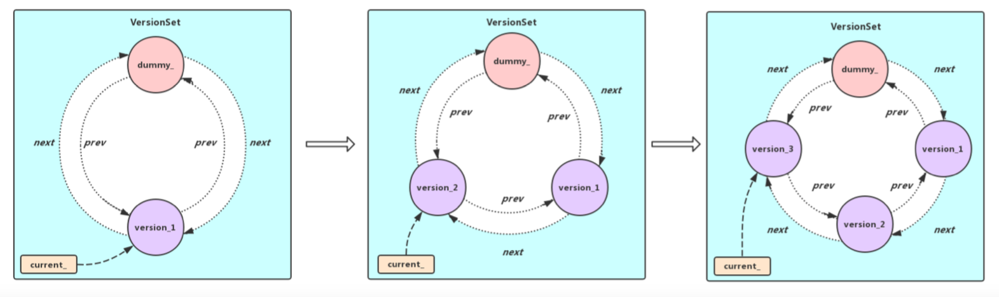
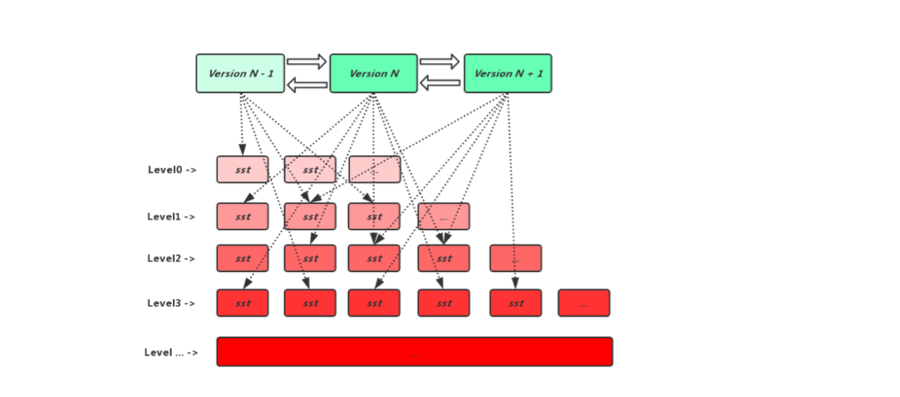
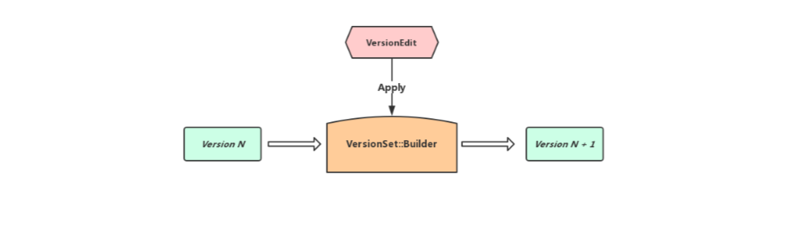
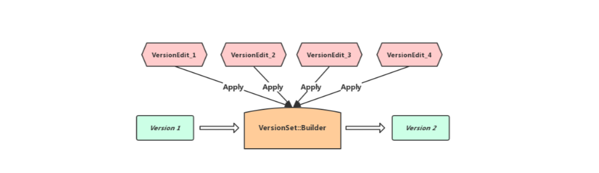
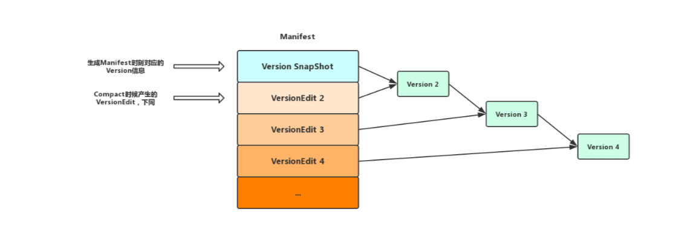

## **LevelDB的版本控制**

### 介绍
通过前面的博客我们知道LevelDB中数据的添加与删除实际上是通过追加写的形式实现的，随着数据不断的写入会产生新的sst文件，并且将新产生的sst文件添加到不同Level中也可能会触发该层Level的局部compact, 局部compact执行意味着有新的sst文件的生成以及旧sst文件的销毁，可见LevelDB在不同的时期持有的sst文件是不断变化的，这时候我们就需要一个组件对这些sst文件进行管理了，这个组件就是我们今天要说的LevelDB版本控制系统，这个组件由VersionSet, Version, VersionEdit还有Builder构成，下面我们会一一介绍

### FileMetaData
既然版本控制系统是用于管理LevelDB不同时期持有的sst文件的，我们先看一个sst文件在版本控制系统中是如何表示的，下面这个结构体就清楚的表示了LevelDB中一个sst文件的状态，通过这个状态信息我们就能确定这个sst文件什么时候可以被销毁，什么时候需要执行Compact操作(Compact的具体内容下篇博客会说)

```cpp
struct FileMetaData {
  int refs;                   // 当前有多少个version引用了这个sst文件
  int allowed_seeks;          // 在执行compact之前还允许seek多少次
  uint64_t number;            // 序列号，也就是sst文件的编号
  uint64_t file_size;         // sst文件的体积
  InternalKey smallest;       // 该sst文件记录的最小key
  InternalKey largest;        // 该sst文件记录的最大key

  FileMetaData() : refs(0), allowed_seeks(1 << 30), file_size(0) { }
};
```

### VersionSet
在LevelDB中是允许有多个Version同时并存的(随着数据的写入或者compact可能有新的version生成，但是还有老的version被引用)，这时候我们就需要VersionSet组件对这些Version进行统一的管理，VersionSet的作用其实不仅仅是管理Version，实际上LevelDB中触发Compact也和VersionSet密切相关，在这里我们先简单介绍VersionSet是如何管理多个Version的

先看VersionSet中最重要的一个方法

```cpp
// 这里实际上是将Version添加到一个环形双向链表里面去
// 其中dummy_versions_是这个环形双向链表的头, dummy_versions_->prev_
// 指向的是最新的version, 而dummy_versions_->next_指向的是最旧的version
void VersionSet::AppendVersion(Version* v) {
  // Make "v" current
  assert(v->refs_ == 0);
  assert(v != current_);
  if (current_ != NULL) {
    current_->Unref();
  }
  current_ = v;
  v->Ref();

  // Append to linked list
  v->prev_ = dummy_versions_.prev_;
  v->next_ = &dummy_versions_;
  v->prev_->next_ = v;
  v->next_->prev_ = v;
}
```
实际上VersionSet内部的不同Version是作为环形双向的结点进行存储的，而dummy\_versions\_则是这个环形双向链表的表头，dummy\_versions\_.prev_指向VersionSet中最新的Version, 而dummy\_versions\_.next\_指向最旧的Version，通过下面的插图可以了解到向VersionSet内部Append一个新的Version不过是在环形双向链表内部插入一个新的结点而已

<center></center>

Q: 随着数据的写入，LevelDB可能会触发Minor Compact(Immutable Memtable刷盘)和Major Compact(Level层sst文件和Level+1层sst文件的合并)，sst文件的变动必然会产生新的Version添加到VersionSet当中，这样内部维护的环形双向链表是否会存在大量的结点？

A: 其实不用担心这个问题，每个Version内部会记录外界对其的引用(外界通过调用Ref()和Unref()方法来进行引用和解引用)，当外界对某个Version最后一个解引用被调用的时候，这时候析构方法会被调用，在析构函数里面会将当前Version从环形双向链表中剥离(Version内部会记录前驱和后继)


### Version
LevelDB用Version表示一个版本的元信息，用FileMetaData表示一个sst文件的元信息，每个Version内部需要记录当前版本对哪些sst文件持有了引用，而LevelDB中的sst文件又是分层存放的，所以Version内部使用了一个成员是FileMetaData指针的二维数组用以指向当前版本各层级所有sst的文件信息(一个sst文件可以由不同的Version引用，所以不同的Version内部可能指向同一个FileMetaData对象)

<center></center>

另外伴随着数据写入可能会触发Compact，各Level的sst文件数量可能会发生变化，这时候Version会计算出当前版本最适合Compact的level记录在自己的成员变量当中等待下一轮的Compact(LevelDB的版本控制和Compact联系异常紧密，后面会有一章博客专门讲Compact，这里就不过多展开

下面是Version的析构方法，可以看到在析构方法中Version将自己从VersionSet维护的环形双向链表中移除，然后遍历自己所持有的sst文件的元信息使其引用自减，如果某一个FileMetaData当前唯一的引用对象就是该Version, 那么将这个FileMetaData删除掉，避免内存泄漏

```cpp
Version::~Version() {
  assert(refs_ == 0);

  // Remove from linked list
  prev_->next_ = next_;
  next_->prev_ = prev_;

  // Drop references to files
  for (int level = 0; level < config::kNumLevels; level++) {
    for (size_t i = 0; i < files_[level].size(); i++) {
      FileMetaData* f = files_[level][i];
      assert(f->refs > 0);
      f->refs--;
      if (f->refs <= 0) {
        delete f;
      }
    }
  }
}
```

### VersionEdit
从名称我们就能了解到这个类实际上是对Version进行编辑的，实际上Version是一个静态的概念，某一个Version一旦生成它就不会改变，而VersionEdit则扮演着一种差量的角色，它表示相邻Version之间的差值，下面代码列出了VersionEdit几个主要的成员变量

```cpp
class VersionEdit {
 public:
  VersionEdit() { Clear(); }
  ~VersionEdit() { }
 private:
  std::vector< std::pair<int, InternalKey> > compact_pointers_;
  DeletedFileSet deleted_files_;                              // 删除了哪些sst文件
  std::vector< std::pair<int, FileMetaData> > new_files_;     // 新增了哪些sst文件
}
```

### VersionSet::Builder
上面介绍了VersionEdit代表的是Version和Version之间的差值，但是如果我们需要将一个Old Version和VersionEdit组合生成一个新的Version，这时候就需要VersionSet::Builder来实现了，Builder最重要的两个API, 一个是`void Apply(VersionEdit* edit)`, 该方法用于将一个VersionEdit存储的信息先应用到自身(实际上Builder内部有数据结构用于记录VersionEdit中的文件变动信息)，另外一个是`void SaveTo(Version* v)`, 该方法用于将Old Version以及Builder自己存储的文件变动信息有序的应用到一个全新的Version上(Version中除了Level 0层的sst文件是无序存放的， 其他层都是有序的，所以要保证新生产的Version除Level 0层以外其他层的sst文件存储依旧有序), 下面列出两处使用VersionSet::Builder的地方

在进行Minor Compact或者Marjor Compact的时候产生一个VersionEdit，Version N和一个VersionEdit通过Builder就能产生一个全新的Version N+1


<center></center>

在启动DB的时候，LevelDB会从Manifest文件中进行恢复，而Manifest中存储着生成Manifest文件时候Version的快照信息以及后续通过Compact产生的多个VersionEdit信息，Version 1和多个VersionEdit通过Builder就能产生一个全新的Version 2

<center></center>

### Version持久化
在LevelDB运行期间, 随着数据的写入以及读取可能会触发Compact造成sst文件的增加以及删除, 从而生成新的Version(上面提到过，通过旧的Version以及VersionEdit生成), 为了下次启动DB可以恢复到正确的状态， LevelDB在生成新Version之前，会把作用于这个Version的VersionEdit追加写到Manifest文件末尾，以便下次启动DB的时候从磁盘上的Manifest文件中读取数据进行恢复

下图是LevelDB运行期间, 各版本Version与Manifest中VersionEdit记录的关系, 在重新打开DB时从Manifest中读取Version SnapShot, 然后读取后面的所有VersionEdit记录并且依次作用于VersionSet::Builder, 最后通过SaveTo()方法即可以生成新的Version, 然后将其挂到VersionSet当中, 这时候DB启动就成功了

<center></center>

### 总结
版本控制我认为是LevelDB中最难理解的一个模块，主要是其和Compact联系异常紧密，由VersionSet控制何时触发Compact，Compact完成之后生成新的Version又存于VersionSet当中，得益于LevelDB将随机写转化为顺序写的特性，sst文件一旦生成就不会再发生变化，一个旧的Version只需要加上sst文件的差值便可以成为一个新的Version，同时VersionSet内部将不同的Version按照环形双向链表进行保存，使之前某个时刻生成的迭代器可以继续访问老版本Version对应的数据，保证了迭代器访问的数据是某一个快照时刻的，不会随着数据的写入而发生变化

另外LevelDB将内存中维护的Version以及Version的更变信息进行落盘，下次Recover DB时读取Manifest文件信息，并且检查当前DB中存在的sst文件是否和Manifest中记录的一致，如果有文件的缺失，那么Recover DB失败向用户报错

