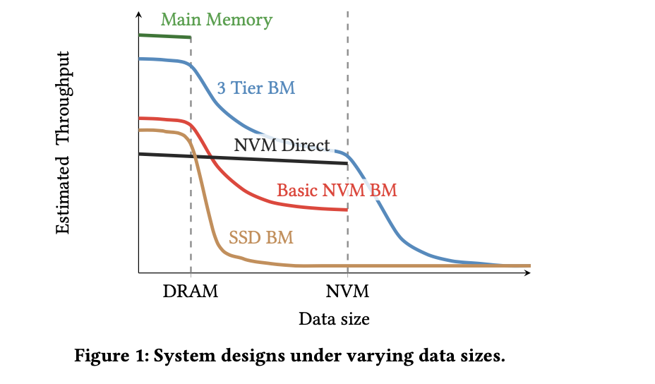
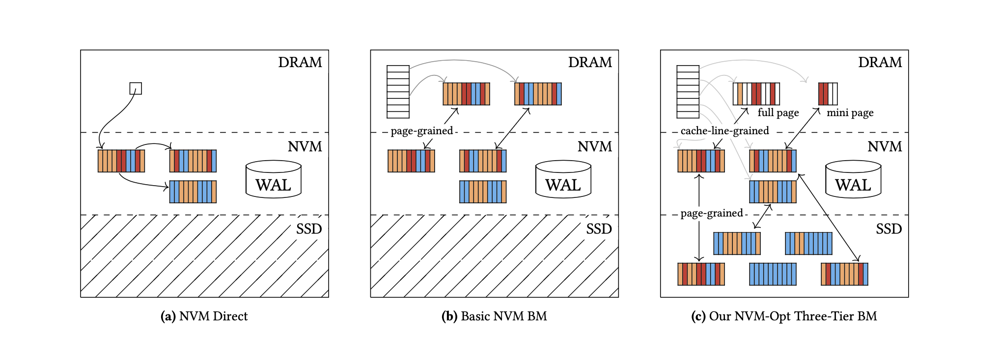
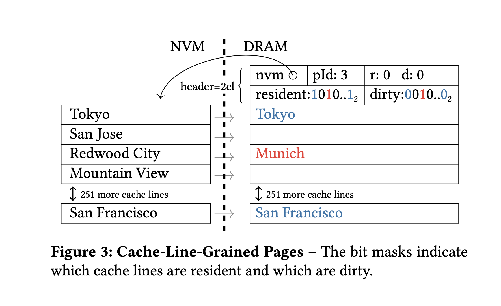
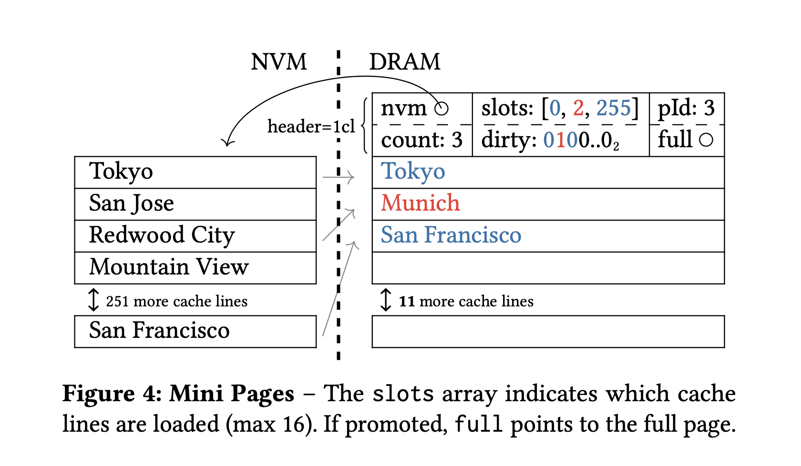
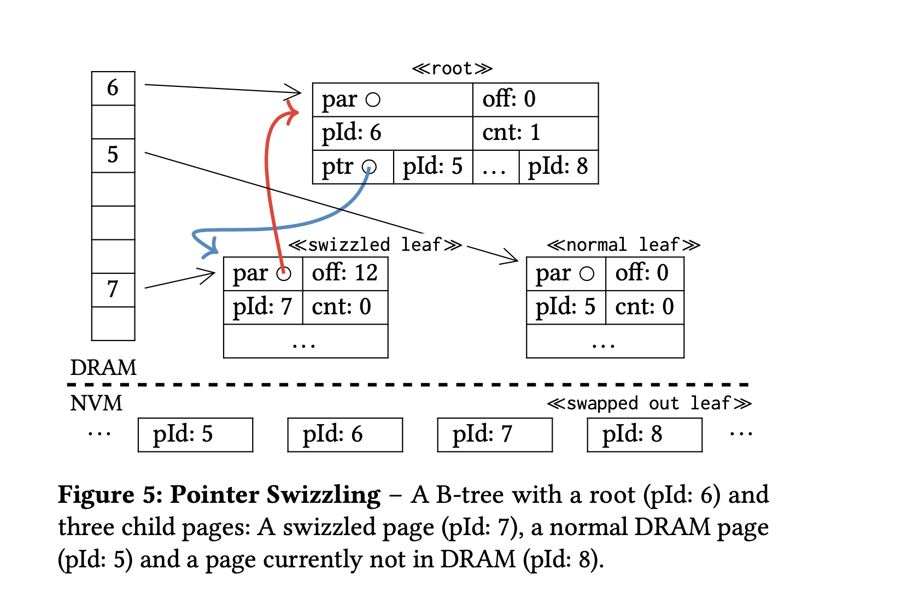
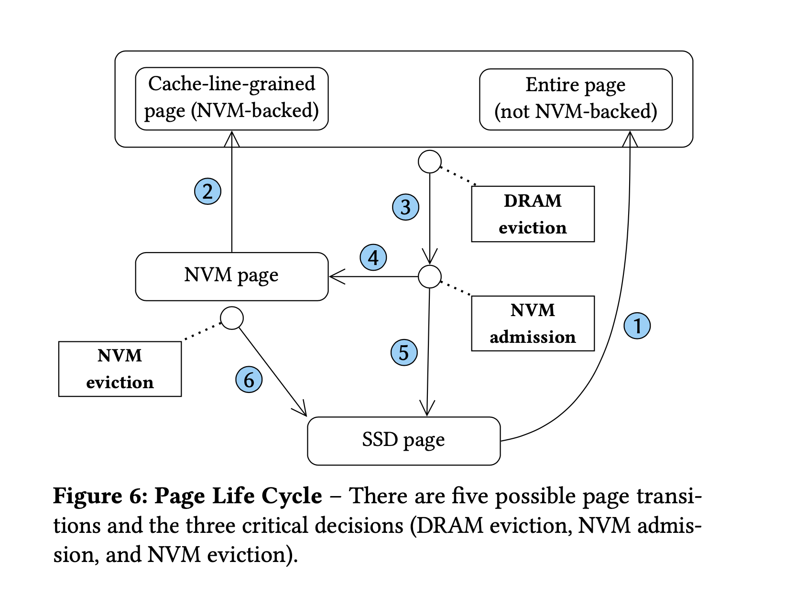

## Managing Non-Volatile Memory in Database Systems

### 摘要
非易失性内存(NVM)是一种性的存储技术, 它结合了DRAM的性能和字节寻址能力以及像SSD等传统存储设备的持久性. 正是这些特性使得NVM非常有前景, 目前还不清楚如何将NVM集成到现代数据库系统的存储层中. 但是有两种系统设计方案已经被提出. 第一种是独立使用NVM, 例如将所有的数据和索引结构都存在NVM. 可是由于NVM比DRAM有更高的延迟, 这种设计比内存数据库系统更低效. 因此, 第二种方案在NVM前面采用基于页的DRAM缓存, 然而这种方案由于并没有使用上NVM的字节寻址能力, 最终在NVM上访问一个没被缓存的页, 需要检索整个页面.

在本篇论文中, 我们评估这两种方案并且将它们和主存数据库以及使用主存作为SSD前置缓存的传统BufferManagers进行比较. 这使我们能够确定可以从NVM中获取多少性能增益. 我们也提出了一种同时支持DRAM, NVM,Flash的轻量级存储管理器. 我们的设计利用了NVM的字节寻址能力并其作为一个额外的缓存层来提高性能, 同时也不会失去更快的DRAM和更大存储容量SSD带来的好处.

### 1. 介绍

非易失性存储(NVM), 也被成为存储类内存(SCM)和NVRAM, 它是一种全新且很有前景的存储设备, 像PCM, STT-RAM和ReRAM这些技术具有略微不同的特性. 但是通常将DRAM的字节寻址和SSD的持久化存储能力结合了起来.由于还没有商业产品退出, 所以NVM的确切特性, 价格, 还有容量等信息尚未公开披露(就像所有之前的NVM研究一样, 我们不得不求助于模拟实验), 然而我们所知道的是, 在可预见的未来, NVM会比DRAM更慢和更大, 同时比SSD更慢和更小. 此外, NVM有着非对称的读写延迟, 写操作开销比读操作开销大得多. 鉴于这些特点, 我们认为NVM不太可能将DRAM和SSD完全取代.

NVM的这些特性使得它特别适用于数据库系统, 同时也带来了一些新架构上的挑战. 无论是传统基于磁盘架构还是现代主存系统都不能在不对其设计进行更改的情况下充分利用NVM. 受NVM影响最大的两个组件分别是日志和恢复系统. 最近很多关于NVM的研究都在优化日志和恢复. 在本篇论文中我们将关注焦点转移到存储和缓存上, 例如动态的决定数据应该驻留在哪(DRAM, NVM还是SSD).

两种将NVM集成到数据库的存储模块的主要方法已经提出. 第一种是由Arulrajt等人提出, 它将NVM作为关系和索引结构的主要存储, 并且直接在NVM上执行更新操作. 这个方法可以充分利用NVM字节寻址的特性. 但是这种设计的缺点是要比主存数据库系统慢. 第二种方法是由Kimura提出, 他建议在NVM前使用一个数据库管理的DRAM缓存, 将关系和索引存储在DRAM中, 这样可以受益于DRAM的低延迟, 从而隐藏更高延迟的NVM. 和基于磁盘的缓冲池一样, 访问总是在固定大小的页面的内存副本上执行. 然而访问一个未缓存的页比直接访问NVM开销更大, 因为即使只访问一个元组也需要将整个页都加载上来.此外, 这两种方法都不支持非常大的数据集, 因为与SSD相比, NVM的容量有限.

在本篇论文中我们采取一种破坏性较小的方法将NVM实现为一个额外的缓存. 我们追随Michael Stone-braker, 他认为NVM速度不够快, 无法取代主存, 并且价格不够便宜, 无法取代磁盘和闪存.

插图1概述了不同系统设计的性能特征和容量限制(缓冲区管理器简称为BM). 除了两种NVM方法("NVM  BM"和"NVM Direct"), 我们也展示了主存系统和传统SSD缓冲管理器("SSD BM"). 这些设计在性能和存储容量方面提供了不同的权衡. 如图所示, 所有现有的方法都表现出陡峭的性能悬崖甚至是硬限制

在本篇论文中我们提出一种新的存储引擎, 在利用NVM字节寻址特性的同时可以支持DRAM, NVM和Flash. 正如三级缓存行所示, 我们的方法避免了性能悬崖, 并且性能由于或者接近于专门的系统. NVM被用作存储结构中补充DRAM和SSD的附加层.此外通过支持SSD, 它可以管理非常大的数据集, 并且比其他方法更加经济. 这些可靠的结果是通过如下综合技术实现的:

* 为了使用NVM的字节寻址能力, 我们以缓存行粒度在DRAM中缓存NVM访问, 这允许有选择性的加载热点缓存行, 而不是整个页面(其中可能包含大部分冷数据).
* 为了更加有效的使用有限的DRAM缓存, 我们的缓冲池透明且自适应的使用小页面.
* 与此同时, 我们的设计也使用大页面来将数据暂存到SSD, 从而支持非常大的数据集.
* 更新操作在主存中而不是直接在NVM上操作, 这增加了耐用性并且隐藏了写延迟.

本文的其余部分组织如下: 我们首先会在第二节中讨论目前已有的将NVM集成到数据库系统的方法, 然后在第三节中介绍一些我们存储引擎的关键技术, 第四节会描述我们的方法如何支持DRAM, NVM和SSD,第五节通过和其他设计进行比较来评估我们的存储引擎, 相关工作会在第六节进行讨论, 并且在第七节对本文进行总结.

### 2. 背景:NVM存储

文献中提出了几种针对NVM优化的数据库系统架构. 在本章节中, 我们重新审视这些设计中最有前途的两个, 并且将它们的一般概念抽象为两种最具代表性的系统设计. 它们和我们在本篇论文中提出的方法都被展示在插图2中.

#### 2.1 NVM直接

NVM提供了接近DRAM的延迟和字节寻址能力, 可以直接被用于主要存储层. Arulraj等人对不同架构的NVM直接存储系统做了深入的研究. 他们将数据库系统拆分为就地更新, 日志结构和写时复制引擎, 然后为NVM优化和适配每一个引擎, 实验结果表明在大多数场景下就地更新引擎在NVM硬件上达到了最高的性能和最低的损耗.因此我们选择就地更新引擎作为直接在NVM上工作的参考系统.

一个使用NVM的挑战是写操作并不会立即持久化, 因为NVM与DRAM处于相同的CPU缓存层次之后, 修改操作最初会写到易失性的CPU缓存中. 只有相应的缓存行从CPU中驱逐淘汰, 对应的更新操作才持久化成功. 我们无法阻止缓存行被驱逐并且写入到NVM中, 每次更新操作都有可能在任何时候被持久化. 但是可以通过刷新对应的缓存行来强制将更新操作持久化到NVM. 这些刷新操作是持久和可恢复系统的基石.

日志系统的实现如下. 元组的更新通过写入预写式日志来记录元组的ID和变化(修改前和修改后的视图). 日志条目需要通过驱逐对应的缓存行来持久化到NVM.支持NVM的Intel CPU, 例如Crystal Ridge软件仿真平台, 也在我们的计算中被使用, 为此提供了一个特殊的指令: clwb允许将缓存行写回NVM而并不会使其失效(普通的clflush指令会). 此外, 为了确保编译器和CPU乱序执行指令都不会对后续存储重新排序, 我们使用了内存围栏, 此后, 日志条目是持久化的, 恢复组件可以使用它来重做和撤销对实际元组的修改. 此时, 事务可以更新并且持久化元组本身. 在事务完成之后, 事务写入的整个日志就可以被截断了, 因为所有的修改都已经持久化到NVM了.

正如插图2a所示, 设计将所有数据存储在NVM, DRAM只用于临时数据, 并保留到NVM数据的引用, 日志同样也是写入到NVM.

NVM直接存储的设计有几个优点. 只保留最少量的日志(在执行过程中事务的对应日志), 恢复是非常高效的. 此外, 读操作非常简单, 因为操作系统可以直接从NVM中简单读取请求的元组.

然而也有一些缺点. 首先由于NVM和DRAM相比有更高的延迟, 实现高吞吐事务量变得更加困难. 第二, 在没有缓冲区的情况下直接在NVM上工作会消耗有限的NVM寿命, 从而可能导致硬件故障. 第三, 编写一个直接在NVM上工作的存储引擎是非常困难的, 因为没有办法阻止驱逐, 任何修改都可能随时被持久化. 因此任何在NVM上的就地更新操作都需要确保数据结构处于一个正确的状态(类似于无锁数据结构, 这是出了名的困难).

#### 2.2 基本NVM缓冲管理器

考虑到NVM直接方法的种种缺陷, 在NVM前使用DRAM当做缓存似乎是一个很有前景的选择. 在易失性和持久性之间自适应内存管理的一个众所周知的技术是缓冲区管理器. 它被大多数传统型的磁盘数据库系统使用并且可以轻易的扩展为使用NVM而不是SSD, 我们在插图2b中展示了这种想法.

在缓冲管理器系统中, 所有的页都被存储在更大的持久化层上(NVM). 较小的, 易失性的层(DRAM)充当软件管理缓存, 称为缓冲池. 事务操作只在DRAM中执行, 并且在访问页面时使用修复和取消修复函数将页面锁定到缓冲池中. 在传统的缓冲管理器(DRAM + SSD/HDD)中这是必要的, 因为不能直接在面向块的设备上进行修改. 在NVM的情况下, 我们认为它仍然是有益的, 因为NVM具有更高的延迟和有限的寿命.

在研究原型FOEDUS中引入了该方法的一种NVM优化变体. 内存被划分为固定大小的页面, 事务只能在DRAM中操作. 不像传统缓冲管理器那样存储页面标识符, FOEDUS存储两个指针, 一个标识NVM上页的常驻副本, 另一个(如果非空)标识DRAM副本. 当一个页没有在DRAM中被找到, 它会被加载到缓冲池. FOEDUS使用异步进程来组合预写式日志中的条目, 并且将它们合并到NVM的常驻页中, 来实现持久化.

因此一个页不会被直接写回, 而是通过日志间接写回. 该系统针对合适DRAM的工作负载进行了优化. NVM主要用于持久化和冷数据.

相比之下, 我们的目标是支持频繁访问NVM常驻数据的工作负载. 因此我们扩展了缓冲管理器的想法, 并且对其进行优化, 使其访问NVM开销更小.一个未优化过的版本用作表示分层系统的基线.

#### 2.3 恢复

除了存储布局, 数据库系统的日志和恢复组件也受到即将到来的NVM硬件的巨大影响. 日志条目写入到NVM的速度比写入到SSD快得多. 因此从性能的角度考虑, 将NVM替换为SSD作为存储日志的设备总是更好的.

在这项工作中, 我们关注存储布局, 因此在每项评估系统中实现了相同的日志方法. 这使我们避开数据库其他组件的干扰从而仅仅关注存储引擎自身的优缺点成为可能.

我们使用带有重做和撤销的预写式日志. 撤销日志使人们可以执行回滚, 并且在恢复期间撤销未完成事务的修改操作. 而重做日志用来重放已提交事务的修改(为了避免已提交事务相关修改没持久化造成的数据丢失), 然而在NVM直接的方法中, 这是没必要的, 因为修改操作总是立即持久化到NVM中. 因此只有未提交的事务需要通过撤销日志来执行撤销操作,  已提交事务早就已经被持久化了.

基于NVM系统的日志记录可以并且已经在之前的工作中进行了优化. 虽然所描述的每种存储架构都可以受益于更高级的日志技术, 但是我们认为对存储引擎的影响在很大程度上是正相交的, 这两个问题可以独立处理.

### 3. NVM缓冲管理器

我们系统架构蓝图的目标是: 在小数量级场景下系统的性能和内存数据库媲美, 但它可以在NVM和SSD存储层级上进行扩展, 同时性能可以优雅的降低(而不是前面那样形成性能悬崖), 为此, 我们设计了一个新颖的内存驻留缓冲区管理器, 他可以在DRAM和NVM之间交换缓存行粒度的数据对象, 因此可以通过NVM的字节寻址能力优化带宽的利用率. 正如插图2c所示, 从DRAM扩展到SSD大小导致我们依赖于在NVM和SSD之间传统页粒度的交换.在DRAM和NVM之间, 我们自适应的区分full-page和mini-page的内存分配以进一步优化DRAM利用率. 这样在大多数"冷"页上的单个"热"对象通过缓存行粒度被交换到更小的内存帧中. 只有当mini-page溢出时, 它才会透明的被提升为full-page, 但是仍然一次只填充一个缓存行. 我们还设计了一个指针切换方案, 优化必要页面的间接寻址, 以实现和纯内存系统几乎相同的性能, 这避免了任何间接但是一旦数据库大小超过DRAM容量的内存墙问题.

#### 3.1 缓存行粒度的页

相比较于Flash, NVM的低延迟(数百纳秒)使传输缓存行而不是整个页成为可能. 使用这种方法, 我们所谓缓存行粒度页面就能够从冷页中提取热的数据对象. 因此我们在保留带宽的同时提升了性能. 在下文中, 我们讨论这种方法的具体细节.

单次SSD的操作消耗数百微秒. 为了分摊高延迟, 一次传输一个大块(例如16kB)是很重要的. 因此, 传统缓冲管理器必须以页面粒度方式进行工作: 当一个事务操作页的时候, 需要将整个页都被加载到DRAM, 存储在页上的数据才可以被处理. 相比之下, 我们的缓冲管理器最初只在DRAM中分配一个页, 而没有从NVM中完全加载它. 当事务请求某个内存区域时, 缓冲管理器从页中获取对应的缓存行(如果尚未加载).

页的布局入插图3所示, 缓存行粒度的页维护一个位掩码(标记为常驻)用于跟踪哪些缓存行已经被加载. 在这个例子中, 第一, 第三和最后一个缓存行已经被加载, 由位掩码中相应位置的位设置成1表示. 和常驻位掩码类似, 脏位掩码用于追踪哪些缓存行有修改操作, 在驱逐时这些脏缓存行需要被写回NVM. r和d位分别用于表示整个页是否驻留和标记脏. 为了按需加载缓存行, 也还额外存储了一个指向底层NVM的指针. 对于16KB的页, 有256个缓存行, 因此两个位掩码每个需要32字节. 加上其余字段(`|nvm| + |pid| + |r| + |d| = (8 + 8 + 1 + 1)byte = 18 byte`), 整个头部`(2 * 32 + 18)byte = 82 byte`只占用两个缓存行大小(128byte), 因此只会产生小于`0.8%`的可忽略开销.

虽然这种缓存行粒度的设计在每次访问都有额外的检查逻辑(检查位掩码), 但是它通常大大减少了从NVM加载数据到DRAM: 举例来说, 考虑B树中的叶子结点, 所有键值对都是顺序存储的. 假设页的大小为16kb并且键和值的都是8字节, 单个页面最多有`16kb / (8byte + 8byte) = 1024`个条目, 我们使用二分操作进行查找, 最多只需要`log2(1024) = 10`次缓存行操作. 因此, 我们的设计只需要获取`64byte * 10 = 640byte`数据, 而不是整个16kB的页. 虽然这已是一个巨大差异, 但是它可以更大.  我们在第五节中采用`YCSB`和`TPC-C`进行基准测试, 我们测量到每次查找操作平均访问6.5个缓存行.

允许以缓存行粒度访问的系统比传统的基于页访问系统更难编程. 这是因为在访问所有数据之前需要显式的驻留并且修改数据之后需要进行标脏操作. 但是是否以缓存行模式进行工作是可选的, 也可以加载和写回整个页面. 因此在缓存行工作模式下, 我们只提供能获取最大收益的操作: 例如查找, 插入和删除. 其他低频和复杂的操作(例如重组B树)通过加载和处理整页的方式实现(避免常驻检查). 检查每条缓存行的驻留情况所带来的额外开销只有在我们访问少量缓存行的场景下才值得. 在扫描和遍历B树内部节点的场景下, 很多缓存行被加载访问, 所以缓存行粒度访问在这种场景下并不推荐.

#### 3.2 Mini Pages

缓存行粒度的页面通过只加载那些实际需要的缓存行, 将所消耗的带宽降到最低. 然而, 前面描述的页面布局仍然消耗比实际更多的DRAM. 在本章节中, 我们介绍第二种更小的称为mini页的页面, 它减少了内存的浪费. 考虑上面提到B树的例子: 虽然从16kB的页中仅仅只需要获取640Byte的数据, 但是系统仍需要为这个页在DRAM中分配16kB(不包括头部)的空间. 这个问题在传统磁盘型系统中是常见的: 即使只需要访问一个元组, 整个页也需要完整的加载并且存储到DRAM中, 这浪费了NVM带宽和DRAM容量. 在接下来我们将用完整页面来指代传统页面, 就像之前介绍过的那样. 注意,这两种页面(mini页和完整页)都可以利用缓存行粒度加载的方法来优化带宽占用-但是无法优化DRAM利用率. 因此, 术语-缓存行粒度页既可以指mini页, 也可以指完整页.

mini页的实现如图4所示. 它仅仅消耗了1088byte的内存, 并且可以存储多达16个高速缓存行. 槽数组用来实现间接访问. 它将物理高速缓存行ID存储在大小为16的高速缓存行数组槽中. 举例来说包含"San Francisco"内容缓存行, 它的在页上的物理索引是225, 但是在mini页中所对应的槽却是2. 因此槽数组在位置2上存储索引255. 这个数组仅仅需要占用16Byte的空间, 因为每个物理高速缓存行ID只占用1Byte.  如果一个mini页中只存放一个缓存行, 那么占用的空间是`|nvm| + |slots| + |pid| + |count| + |dirty| + |full| = (8 + 16 + 8 + 1 + 2 + 8) = 43byte`如果和整个页面相比, 这是非常小的开销(0.3%), 这将在没有mini页的系统中使用. `count`字段用来标识有多少缓存行已经被加载, 例如插图4中count为3表示mini页中的缓存行槽数组的前三个被使用. 额外的脏比特掩码用于标识当页面驱逐时有哪些缓存行已经被修改需要被写回到NVM. 在我们的例子当中, 缓存行"Redwood City"已经变更为"Munich"需要被写回到NVM.

在mini页上访问内存比直接在完整页上访问要更加复杂. 由于存在缓存行的映射关系. 在页面上的数据成员并不能被直接访问. 因此, 我们使用一个抽象接口来支持无感的页面访问: `void* MakeResident(Page* p, int offset, int n)`

这个函数使用页面P作为输入, 并且返回一个指向给定偏移量且长度为n字节数据块的指针. 如果p是完整页, 则加载指定的缓存行(如果尚未驻留)并返回指向它的指针, 否则, 如果是mini页, 该函数通过扫描槽数组来获取请求的缓存行. 如果对应的缓存行尚未驻留, 则将其加载并且添加到槽数组中. 然后将这个已经驻留的缓存行的指针返回.因此, 这个基础接口无感的解决了mini页间接访问的问题. 和传统的页相比, 唯一的区别是访问mini页上的内存不再能直接访问, 而是需要通过这个函数.

mini页需要保证通过这个函数返回的内存块是连续的, 例如, 如果多于一个的缓存行被访问(例如id为3和4的缓存行), 它们在mini页的数据数组中必须有序存储. 否则返回的指针只对第一个缓存行有效. 为了保证这一点, 我们的实现以有序的方式维护缓存行(以它们在内存中的位置排序). 维护这种有序性的开销很小. 因为mini页中最多只有16个缓存行, 且逻辑不在关键路径上(只有从NVM加载数据之后需要重新排序). 这个方法的好处是实现简单, 并且避免了复杂的排序逻辑.

当一个mini页没有足够的内存空间来处理一个请求, 它会被提升为一个完整页. 为此, 缓冲管理器分配一个空的完整页并且存储mini页的所有成员. 然后将mini页的当前状态拷贝到新分配的完整页中: 包括所有驻留的缓存行, 还有驻留以及脏标记的信息. 如果插图4的mini页做了提升操作, 新初始化的完整页就像插图3所示. 最终, 在缓冲管理器中的页映射表将指向这个完整页. 从现在开始, 这个mini页称为部分提升并且所有向这个mini页的请求都会被转发到完整页上. 一旦最后一个事务取消持有它, 它才会安全地被垃圾回收. 这是一定会发生的, 因为页的映射表指向了这个完整页所以不会新创建指向这个mini页的引用. 这个特性对使用mini页的数据结构是很方便的, 因为当mini页做提升操作时, 指向到这个mini页的引用不会失效. 因此, 提升操作对数据结构是隐藏的. 并且不会带来额外的复杂性.

#### 3.3 指针切换

尽管缓冲池使系统从低延迟的DRAM缓存中受益, 它同时也带来了一些不可忽视的开销. 在本章节中, 我们引入混合指针, 一种通过动态用物理指针替换页面ID的技术来降低开销(主要指的是页表查找). 在传统的缓冲管理器(DRAM + SSD/HDD)中, 这种开销只有大部分工作压力都在DRAM上时才会被注意到, 否则, 页面从SSD/HDD被加载, 这相比于哈希表的查找要慢好几个数量级. 与传统的缓冲管理器相比, 在我们提出的系统中, 这种开销也与更大的工作负载相关. 我们无法将这个开销隐藏在更慢的加载之后, 这里有两个原因, 第一是这些加载操作并不是那么慢(NVM的延迟要比Flash低很多), 第二是由于引入了缓存行加载, 数据读取的总量更少了. 因此尽可能地降低这些管理的开销对我们的系统来说是至关重要的.

指针切换最近在传统的缓冲管理器(DRAM + SSD/HDD)环境中被提出. 主要的思想是在DRAM驻留页的页标识符中直接编码页地址(记录页指针). 页上的最高位比特决定剩余位构成页标识符还是页指针. 因此, 每当访问一个页, 系统首先检查是否设置了最高有效位. 如果设置了, 表明剩余位编码成了一个可以直接解引用的指针. 否则, 剩余位表示的就是页标识符. 系统必须在缓冲管理器中检查哈希表来查找该页面, 如果它不存在的话, 我们需要从NVM加载它. 通过这种方式, 就避免了对已经驻留的页进行哈希表查找操作从而将开销减少为一个分支.

插图5说明了我们指针切换的实现方式. 在左侧, 展示了缓冲管理器的页映射表. 它将页面标识符(表中的数字)映射到页面(用箭头表示). 这里例子展示了有一个根节点和三个叶子节点的B树:  第一个节点(pid为7)是一个使用指针切换的叶子节点. 根节点可以用指针(蓝色箭头表示)来访问它, 而不通过页ID. 第二个节点(pid为5)是一个普通节点. 第三个页(pid为8)已经被换出了-当前并没有在DRAM中.

在这个例子中, 根节点有一个使用指针切换的子节点(如cnt字段所示), 带有切换指针的子节点对应页永远不会被换出, 因为指向子节点的切换指针会被持久化.当一个切换页(在本例中左孩子所对应标识符为7的页)被换出. 它需要更新父节点(通过父节点指针): 首先减少固定偏移量位置处的`child`字段数值, 然后将指向自身的指针转换为页面标识符. 这个指针的位置可以通过偏移量字段找到(off). 在页面头部需要额外的10byte来存储这些信息, 包括父节点指针(8byte)和偏移量(2byte), 因此仍然适合mini页(1个缓存行)和完整页头部(两个缓存行). 指针切换与各种数据结构是兼容的(树, 堆, 哈希表); 它只需要固定大小的页面和额外的头部字段.

考虑一个带有指针切换的mini页. 当这个mini页提升为完整页, 这个指针切换信息也同样需要被更新. 这在部分提升的mini页不再被引用时发生. 在此之前, 它充当一个完整页的包装器. 当它不再被引用, 父节点指向它的指针将被重定向到一个完整页. 此外在mini页中指向父节点的指针和偏移量(off)需要被拷贝到完整页中.

### 三级缓冲管理器

到目前位置, 我们介绍了缓存行粒度加载, mini页, 和指针交换技术, 这些是我们在NVM存储层之上构建高效DRAM缓冲池的基石. 实现构建一个跨NVM和SSD层次的存储引擎目标的下一步是添加Flash(SSD)作为第三层. 与只使用内存和NVM的系统相比, 三级的设计大大提高了存储容量的上限. 在本章节中会介绍所涉及的缓冲的更换策略以及如何用低开销加入第三级.

尽管增加对SSD的支持并不能提高性能, 但是它仍然是很重要的, 因为它允许管理更大的数据集而且也更加经济. 现实中的数据通常是有冷热之分的(例如老的数据访问频率通常更低). 为了尽可能快地处理热数据, 它应该常驻在内存中. 但是将冷数据存放在单独的系统中和购买足够的DRAM来将冷数据保留在DRAM中都不是好的做法. 我们采用分层的方法解决这个问题. 它为热数据提供接近内存的访问速度(前提是他适合DRAM), 同时还支持在同一个系统中用廉价的SSD存储冷数据. 除了其他系统之外，它甚至允许通过迷你页面来压缩应用程序的各个工作集

#### 4.1 设计概述

在我们的三级缓存架构中, 缓存管理是通过选择将NVM和DRAM作为SSD存储层的缓存来完成的(章节4.2). 页面只会在DRAM中被访问(读和写). 由预写式日志来保证持久性. 当页面从DRAM中被驱逐, 会根据页面的热度情况来选择将它写入到NVM还是SSD.

要NVM上定位页面,  需要一个页表(类似于DRAM中的页表). 为了避免开销, 可以通过为DRAM和NVM使用组合页表来实现, 将要查找的页表数量从两个变为一个(章节4.3)

对于故障恢复(章节4.4), 我们建议使用教科书式的预写式日志和基于ARIES的重启流程. 在三级架构中. 有必要重用NVM上驻留页面的内容来加快重启速度. 因此组合页表的内容会在重启之后被重建.

#### 4.2 替换策略

在三级缓存的架构中需要管理两个缓冲池(DRAM和NVM)而不是一个. 在本章节中, 我们详细描述可能发生的页面转换和三个必要的替换决策: DRAM驱逐, NVM驱逐和NVM admission, 该过程如图6所示, 可用作概述.

最初, 新页面的分配都在SSD上. 当事务请求一个页面, 这个页面直接被完整地加载到DRAM中(`箭头1`). 页面被完全加载的原因是基于块的设备只允许基于块的访问. 当从SSD加载页面时我们不会将其放到NVM中, 因为访问是直接在DRAM里的执行的, 而将它放入到NVM只会浪费NVM空间. 页面只有在从DRAM换出的时候会加入到NVM. 页面是直接从SSD加载而不是由NVM支持, 所以不能以缓存行的方式操作. 只有当页面从NVM(`箭头2`)加载的,  因此NVM支持的时候才可能发生.

当DRAM中没有更多可用的空闲槽, 缓冲管理器为了腾出空间给新页面需要对DRAM中的驻留页面做驱逐操作(`箭头3`). DRAM驱逐是缓冲管理器必须执行的三个决策中的第一个.  我们的目标将最热的页面保持在DRAM中. 我们使用一个众所周知的时钟算法(二次机会?), 它在开销和质量上都做得非常好. 它持续不断的遍历缓冲池中的所有页面, 并将自从上次迭代之后再也没有被访问的页面换出.

一旦页面被选择从DRAM中驱逐(`箭头3`)并且该页面没有在NVM中, 它被认为是NVM admission的, 这就是三个决策中的第二个. 这个决策更加困难, 因为目标是确认暖页而不是热页. 本文在ARC替换策略背景下进行了研究, 为了优化在两层系统中热页的替换策略, 这里使用两个队列用来区分暖页. 基于这个想法, 我们使用一个称为admission的集合来识别最近访问的页面. 主要想法是将最近拒绝提
