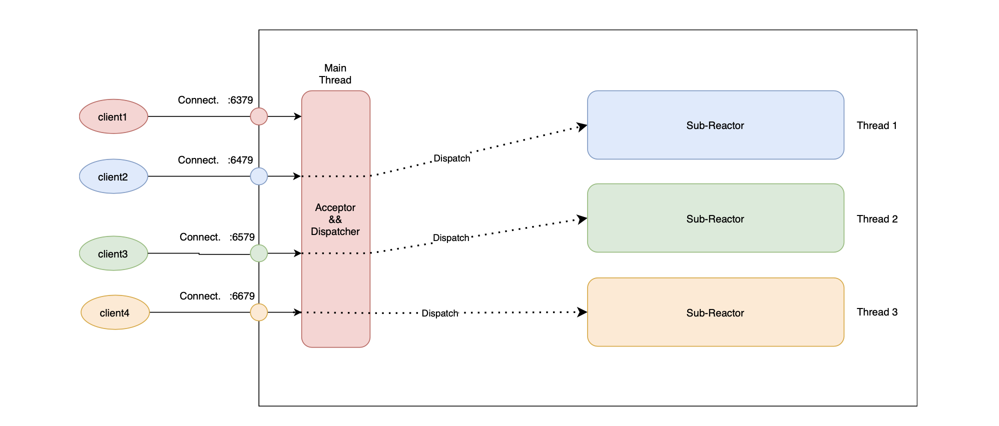

## 背景

目前Keewidb采用单进程单线程架构(数据处理单线程, 存在另外一个辅助线程处理一些异步任务),  由于数据有冷热之分, 在服务运行期间, 我们需要处理页的加载和刷脏的逻辑, 并且还需要写RedoLog, UndoLog和Binlog, 此外内部还启动了多个协程处理一些定时任务, 导致我们单进程的处理能力有限, 吞吐量不及Redis, 因此我们需要将Keewidb升级为单进程多线程架构, 利用多核来提升单进程的吞吐量.

### 主要思路
集群由多个分片共同构成, 在Keewidb内部, 一个分片实际上就是一个进程, 进程内部启动多个线程, 每个线程负责该分片内的一段`Slot`子区间, 不同线程负责的数据互相独立, 在内核层面我们严格限定, 命令中的Key必须在同一个`slot`上(在Proxy侧还是支持按照`slot`来拆分多Key命令, 所以类似`MGet`这种命令从Proxy侧进来还是能执行成功), 这样就规避了命令跨线程或者跨进程执行的场景. 


### 多核性能对比测试
#### 测试环境
* PMEM: 1T
* NVME: 5T
* Cpu: Intel(R) Xeon(R) Platinum 8374C CPU @ 2.70GHz
* Memory:  512G DDR4
* Network Card: 25-Gigabit Mellanox Technologies MT27800 Family

MultiCore: 利用Seastar实现的一个单进程多线程的Demo版本, 每个线程内部有独立的内存存储模块.

压测命令:  `memtier_benchmark --key-pattern=S:S --ratio=10:0  -d 32  -n 5000000  --key-maximum=5000000  -p 6379 -c 50 -t 1`

#### 测试结果

|  不同内核 |    QPS    | Avg Latency |   P99   |   P100   | 主线程CPU |
|  --------  | --------  | ----------- | ------- | -------  | -------- |
|  Redis     |  11.8w    |   0.42ms   |   0.63ms |  1.4ms  |   100%  |
|  Keewidb 冷热1比1  |  4.1w    |   1.2ms    |   2.01ms  |  4.08ms  |   100%  |
|  MultiCore 1核  |  13.07w    |   0.39ms   |   0.58ms |  1.18ms  |   100%  |
|  MultiCore 2核  |  30.06w    |   0.39ms   |   0.559ms |  1.59ms  |   200%  |
|  MultiCore 3核  |  37.8w    |   0.39ms   |   0.58ms |  1.32ms  |   300%  |
|  MultiCore 4核  |  51.1w    |   0.39ms   |   0.55ms |  1.07ms  |   400%  |

#### 结论:
 在KeewiDB上采用多核方案, QPS的提升和进程使用的核数正相关, 可以简单认为就是倍数关系, 前提是网络和磁盘不会成为瓶颈.

### 整体架构


1. 多线程启动KeewiDB, 每个线程绑定一个CPU Core.
2. 每个线程通过`TLS`(Thread-local storage)存放线程数据, 各线程相对独立(Shard Nothing).

### 网络拆分

多线程网络模型采用`Multiple Reactor`模式

* `Dispatch Thread`负责建立网络链接:
	* 负责`Listen`所有端口的网络连接事件(`Connect`).
	* 负责`Accept`连接, 并且初始化`Established Connection`系统资源.
	* 根据链接的目的端口, 分发链接资源到特定线程.
* `Worker Thread`负责处理链接本身的事件:
	* 负责接收从`Dispatch Thread`分发过来的链接
	* 负责处理链接的请求
	* 负责链接的销毁以及资源释放

备注: `Dispatch Thread`本身也是一个特殊的`Worker Thread`.



### 存储拆分
同一个进程内, 不同线程负责的Slot区间互不重叠, 所以不同线程底层的存储都是互相独立的, 跟存储相关的缓存模块, 事务模块, 以及Binlog模块都需要进行拆分, 这些模块所对应的文件也都分开进行存储.


#### 存储空间占用
考虑一种场景, 用户买了三分片实例, 其中AEP: 30G, 磁盘: 150G, 分摊到每个分片就是AEP: 10G, 磁盘: 50G, 由于每个分片内部不同线程的存储是互相独立的, 我们需要考虑用户只往该分片的一个结点写入数据的极端场景, 因此我们不能简单的将单个线程的存储容量上限简单的设置为`分片容量上限 / 线程数量`,  而是应该根据该分片上所有线程的存储容量相加, 再来判断是否应该进行阻写.

### 日志拆分
考虑到升级到单进程多线程架构, 每个线程都有自己的存储模块, 以及集群和事务模块, 处理的逻辑相对独立, 如果再将不同线程中的日志都打在一起, 日志逻辑较为混乱, 尤其是在集群建立以及排查Bug的场景下, 非常不友好, 所以考虑日志拆分, 将不同线程的日志输出到独立的文件中, 目前采用的Glog无法支持日志拆分的功能, 后续考虑替换为[Spdlog](https://github.com/gabime/spdlog/tree/master), 下面是不同日志库的性能对比测试:

Time needed to log 1,000,000 lines in synchronous mode (in seconds, the best of 3 runs):

|threads|boost log 1.54|glog   |easylogging |spdlog|
|-------|:-------:|:-----:|----------:|------:|
|1|       4.169s  |1.066s |0.975s     |0.392s|
|10|     6.180s   |3.032s |2.857s     |0.773s|
|100|     5.981s  |1.139s |4.512s     |0.587s|

### 配置模块相关改动
#### 目录类配置
* logfile : `./log/`  &rArr; `./log/CORE_ID/`
* binlog.dir : `./binlog_dir/` &rArr; `./binlog_dir/CORE_ID/`
* binlog.backup-dir : `./binlog_backup_dir/` &rArr;  `./binlog_backup_dir/CORE_ID/`
* relaylog.dir : `./relaylog_dir/` &rArr; `./relaylog_dir/CORE_ID/`
  * redo-log-dir : `./redo_log_dir/` &rArr; `./redo_log_dir/CORE_ID/`

* redo-log-recover-dir : `./redo_log_recover_dir/` &rArr; `./redo_log_recover_dir/CORE_ID/`
* undo-log-dir : `./undo_log_dir/` &rArr; `./undo_log_dir/CORE_ID/`
* undo-log-recover-dir : `./undo_log_recover_dir/` &rArr; `./undo_log_recover_dir/CORE_ID/`
* backup-dir : `./backup/` &rArr; `./backup/CORE_ID/`

#### 文件类配置
* data-file-path : `./pmedis_data_file` &rArr; `./pmedis_data_file_CORE_ID` 
* cache-file-path : `./pmedis_cache_file` &rArr; `./pmedis_cache_file_CORE_ID`
* control-file-path : `./control_file` &rArr; `./control_file_CORE_ID`
* page-bit-table-path : `./pmedis_page_bit_table` &rArr; `./pmedis_page_bit_table_CORE_ID`

多核方案由于进程内数据分成了多块, 相关文件也需要按照不同线程进行拆分, 目前管控侧的配置无需更改, 内核侧在遇到目录类配置时, 在目录下新增一个目录层级`/CORE_ID/`用于拆分目录, 遇到文件类配置时在文件名后添加`_CORE_ID`后缀用于拆分文件.

#### 其他配置
* port: `6379` &rArr; `6379, 6479, 6579, 6679`

#### 线程安全问题
由于配置模块是多线程共享的, 并且我们还支持`Config Set`命令进行配置的修改, 不同线程可能会修改同一个线程, 我们需要考虑线程安全的问题, 在必要的地方进行加锁处理. 

### 标准版和集群版
考虑到在标准版场景下, 如果我们将数据按照核拆分成多份, 很多多Key命令和无Key命令难以支持(`MSet`, `Rpoplpush`, `Flushdb`), 并且涉及到跨核命令的原子性也无法保证(每个核有自己独立的事务)

因此我们在标准版的场景下, 还是采用单进程单线程架构, 


### 异常场景
#### 主从反转场景


*  线上可能出现Master负载太高, 无法及时响应心跳, 被误判死, 主从反转, 这种场景无需特别处理.

#### 主从断连场景


* Slave加载全量备份, 向Master发起增量同步, 结果失败(增量同步点位在Master处已经被清理掉).
* 主从关系已经建立, 从库回放Binlog速度慢, 导致Master处Binlog堆积最终达到OutputBuffer的限制, 从而断开连接.

#### 进程CoreDump


#### 主从反转, 并且进程CoreDump


#### 管控机制
由于我们单个进程内部可能存在多个节点, 进程中任意一个节点故障(这里指的是Slave长时间断开连接, 或者Master被判死等等故障), 都需要将该节点所对应的进程给Kill掉(虽然该进程其他节点都是正常的), 在出现上述异常后, 我们将故障节点进程Kill掉, 集群都会进入下面插图显示的`最终态`, 此时管控新启动一个进程, 并且 将进程内部的节点按照`CoreID`挂到对应的Master节点上即可. 


#### 备注
这里要考虑, 由于我们是一个进程内多个节点, 单个节点故障可能会导致管控下掉整个进程, 进程内其他节点也会受到影响.

### Cluster命令兼容
目前暂时考虑只展示一个节点, 其中NodeID可以根据实例的appid进行计算.

`Cluster Nodes`: 

```cpp
43a7b13c5efe66676ad20fc031793b5be62565d2 10.0.100.137:6379@17000 master - 0 1652085062073 3 connected 0-16383`
```

`Cluster Slots`:

```cpp
1) 1) (integer) 0
   2) (integer) 16383
   3) 1) "10.0.100.137"
      2) (integer) 6379
      3) "43a7b13c5efe66676ad20fc031793b5be62565d2"
```

### 集群改动
`ClusterNode`结构体内部添加`ShardId`和`CoreID`字段, 这样可以根据这两个字段推断出哪些节点属于同一个进程, 方便后续同进程的不同结点进行内部通信

### 缓解集群通信压力
在大分片场景下, 由于我们采用单进程多线程的架构(一个分片内部可能存储了四个节点, 所以如果用户购买了128分片的实例, 实际上该实例内部的节点数为128 * 4 = 512个), 集群内部消息通信开销巨大, 为了缓解这个问题, 我们可以从`减少消息传播数量`和`消息内容压缩`两个方面入手, 下面是采用`Snappy`对消息包进行压缩的测试数据.

#### PING/PONG包压缩测试结果

| 规格     | 原始包长度（Bytes） | 压缩后长度 （Bytes） | 压缩率 | 平均压缩时间 (us) | 平均解压缩时间（us) |
| -------- | ------------------- | ------------------ | ------ | ----------------- | ------------------- |
| 16分片   |         2688            |         534           |    80.1%    |       11            |         15            |
| 32分片   |         3208            |         905           |    71.8%    |        18           |           17          |
| 64分片   |          4248           |           1637         |    61.5%    |           33        |              22       |
| 128分片  |          6224           |            2999        |    52.0%    |        63           |           32          |
| 256分片  |          10176           |          5669          |     44.3%   |            138       |               49      |
| 512分片  |          18184           |            11018        |    39.4%    |        298           |         87            |
| 1024分片 |           34200          |              21604      |     36.8%   |           677        |         183            |

#### SlotsMap压缩测试结果

| 规格     | 原始包长度（Bytes） | 压缩后长度 （Bytes） | 压缩率 | 平均压缩时间 (us) | 平均解压缩时间（us) |
| -------- | ------------------- | ------------------ | ------ | ----------------- | ------------------- |
| 16分片   |         2048            |         102           |   95.0%     |       4            |       10              |
| 32分片   |         2048           |         102           |   95.0%     |         4          |           10          |
| 64分片   |           2048          |          105          |    94.8%    |        4           |          10           |
| 128分片  |           2048          |        107            |    94.8%    |        4           |           10          |
| 256分片  |          2048           |          106          |     94.8%   |            4       |         10            |
| 512分片  |           2048          |          108          |   94.7%     |        4           |           10          |
| 1024分片 |            2048         |          106          |     94.8%   |           4        |              10       |

#### 结论
1. SlotsMap格式特殊（大部分bit等于0，且非零部分连续），故压缩率很高。
2. PING/PONG包随着分片数（节点数）的增多，原包线性增大，压缩包和压缩时间也线性增大。

### 监控指标聚合
目前实例大部分指标都从Proxy侧进行采集, 而我们的多核方案对Proxy是透明的, 无需有任何修改, 但是有部分指标(`读写请求`, `QPS`, `CPU使用率`, `持久内存以及磁盘的使用量`等)是直接从内核侧进行采集, 需要监控采集了同分片上不同结点的数据之后进行聚合展示.

### 绑核的问题
根据目前的架构, 启动单个分片至少是四个线程, 如果针对小规格实例(例如三分片12GB存储空间的实例), 每个线程都绑定一个核, 对用户来说可能并不需要这么高的CPU核数, 对我们自身来说成本也较高, 不利于超卖.

所以针对小规格实例, 可以多个线程共享一个CPU核(例如上面提到的三分片12GB存储空间的实例,可以每个分片绑定一个核, 也就是说四个线程共享一个核), 等到用户扩容时再根据具体情况来扩进程的核心数.

通过测试目前启动时如果要绑定CPU, CPU的数量必须大于等于线程数`./build/bin/multicore -c 4 -m20G  --cpuset 0-3`, 但是进程启动成功之后可以通过`taskset`将不同的线程绑到同一个核上(`taskset -c 0 tid`), 


### 备注
* 底层存储模块要支持分裂式扩容.
* AEP存储影响性能, 在单进程多线程的场景下, 如何确保不同的线程可以按需使用AEP缓存空间.
* 单进程多线程方案带来的集群通信连接数翻倍的问题, 通过启动一个辅助线程, 该线程负责进程内部不同节点集群消息的发送和接收.
* 集群消息的压缩, 替换NodeID的生成方式, 另外`ip`采用整形进行存储, 而不是字符串.
* 考虑采用进程级别的判死, 而不是进程内部节点级别的判死
* 考虑主从反转后, 此时主从连接都断开了.
* 监控问题, 主从反转之后用户没有开启读写分离.


### 相关改动

1. 多线程引入 (网络拆分, 存储以及事务,Binlog拆分).
2. 日志库替换, 支持按照线程输出到单独文件中.
3. 启动辅助线程用于不同进程之间的集群通信, 收敛集群通信连接数.
4. 集群消息压缩(同进程节点互相通信采用submit_to?) .
5. 内核新增ShardID和CoreID配置.
6. cluster nodes/cluster slots新增一个参数, 支持展示shard id和core id.
7. Proxy侧相关命令(Cluster Nodes/Cluster Slots)的兼容.
8. 存储模块支持按照slot来删除对应的数据用于支持分列式扩容.
9. 限制同进程内不同线程的磁盘容量开销.
10. 同进程内不同线程的缓存按需驱逐.
11. 一些无法拆分的公共模块考虑线程安全的问题.


## 集群部分
### 基础设计
1. 以整个进程作为一个集群节点，只有一个集群端口，集群本身的创建/传播/判死/切换/扩容等逻辑还是维持原来的大体逻辑；
2. 进程内部分为N个数据子分片(N=4)，每个子分片分配一个IO端口和一个数据线程，用户对数据的访问直接连到具体的IO端口；
3. 单个进程负责某个范围内的连续slot，进程内部用slot id对子分片数取模，把每个slot分给每个数据线程，保证扩容前后，负责每一个slot的数据线程一致


### 管控依赖
1. 备份逻辑与补从逻辑，数据备份一份变多份
2. 发货逻辑，分配5个端口(4个IO端口，一个集群端口)
3. 监控聚合
4. slaveof/cluster replicate只需要发给主线程所在的端口(集群端口-10000那个)


## 代码改动
1. 集群消息长度压缩【2】
    1. 消息头部(主要是slots map)走snappy压缩
    2. 消息体gossip字段，NODE IP和NODE ID处理
        1. IP考不考虑ipv6支持？【要考虑，且此项压缩只在收发包的时候转换，集群内部逻辑依旧沿用字符串】
        2. ID考虑基于IP和port的UUID【】
            1. 算法：IP+Port +Time+Seq
2. 集群消息支持多分片【2】
    1. 增加字段，带上每个子分片的port信息，方便其它进程move重定向，填充和解析修改
        1. cluster node里面需要带上其它数据端口
    2. repl_off字段改成数组，填充和解析逻辑都要，ClusterNode的存储和提取相关逻辑也要适配
3. 集群重定向逻辑【2】
    1. 新增命令，类似CLUSTER slots，但是提供每个子分片的详细slot分布，让proxy感知slot分布
        1. 需要给proxy伪造一下node ID【真实ID的基础上增加SEQ即可】
    2. 重定向的时候，需要重定向到具体的数据端口
4. 集群命令特殊处理
    1. 主线程处理，其它IO线程收到集群命令，需要submit到主线程或者报错 @显坚
5. 集群线程与数据线程的同步【】
    1. 类似于线程之间的心跳机制，集群线程需要感知各个数据线程的状态
        1. 仅当所有数据线程都OK的情况下，集群线程才判断本节点OK，可以回pong，否则应该拒绝回包，主动被其它节点判死
    2. 集群线程需要获取每个数据线程的主从同步进度
6. 被动failover适配修改【3】
    1. ClusterNode的rank机制需要适配修改，根据所有数据线程的同步进度算出总的replica节点排名，决定选举顺序【依赖3.1】
    2. failover拿到足够的投票之后，需要设置多个子分片的主从关系
7. 主动failover适配修改【3】
    1. 主节点PAUSE Clients逻辑修改，需要阻塞所有数据线程的读写
    2. 从节点对齐逻辑修改，需要等所有数据线程的数据追齐才能发起切换【依赖3.2】
