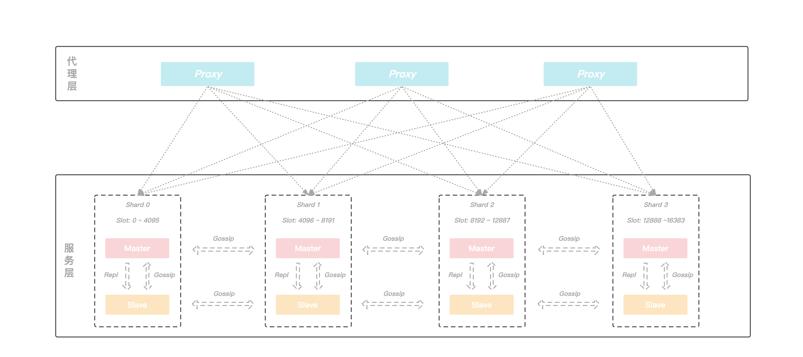
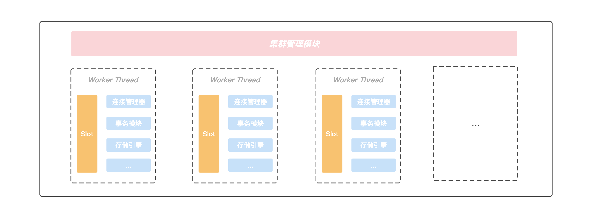
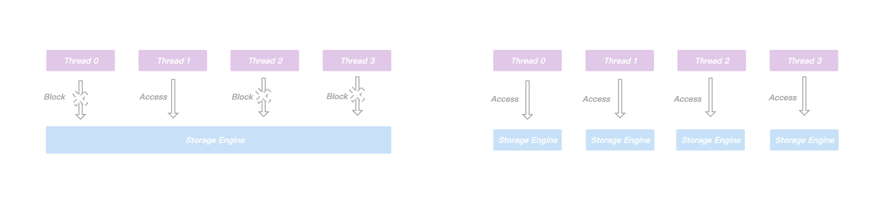
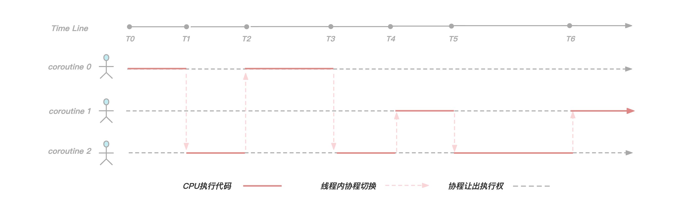
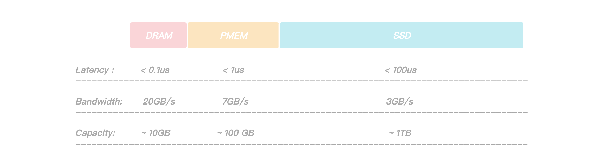
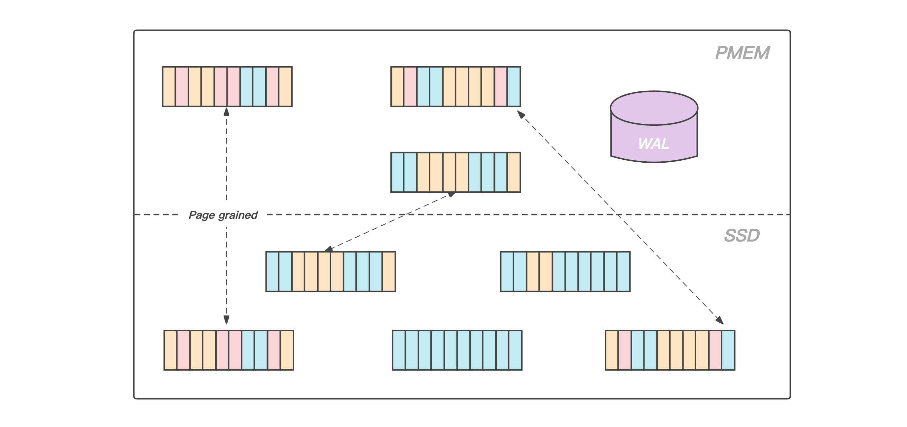
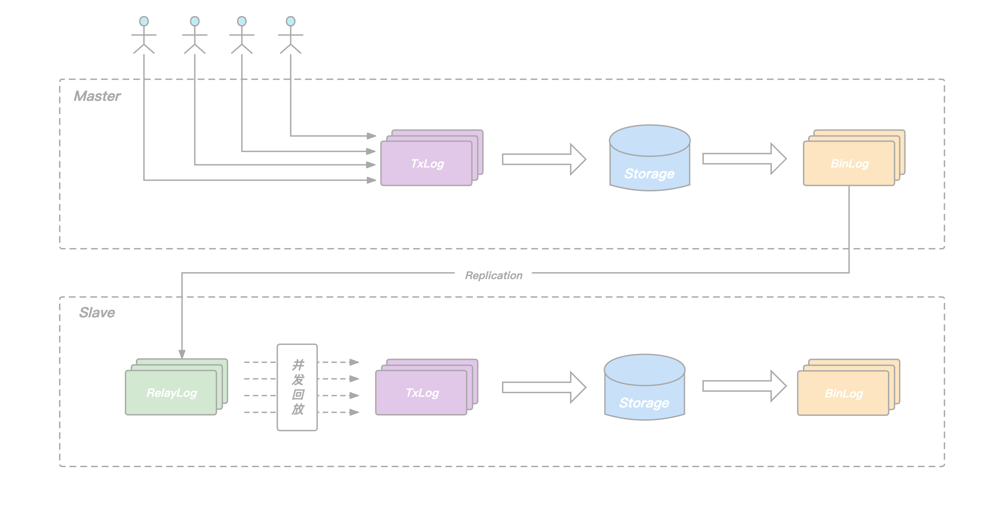

## KeeWiDB架构设计

### 介绍

Redis得益于高性能以及丰富的数据结构命令，成为目前最受欢迎的KV内存数据库，但是随着业务数据量越来越大，Redis的内存消耗也会随之提升，一方面我们知道不管是在云服务器还是自建服务器上，内存都是一个昂贵且难以不断增大的资源，另外一方面随着科技的进步，硬盘的速度也在逐渐提升，甚至在**英特尔® 傲腾™ 持久内存**出现后，进一步缩小与内存的性能差距，也许我们可以通过合理利用新型磁盘技术来为客户提供更好的服务。

根据我们实际的观察，目前很多使用Redis的业务， 实际上数据是有冷热之分的，将访问频率很低的冷数据也存放在昂贵的内存中，从成本角度考虑并不是一个很好的选择。此外Redis虽然提供了AOF和RDB两种方案来实现数据的持久化，但是使用不当可能会对性能造成影响甚至引发丢数据的问题。

正是由于使用Redis的过程中始终伴随着内存成本，容量限制以及持久化等一系列的问题，腾讯云数据库团队推出了KeeWiDB，KeeWiDB有如下一些特性:

* 完全兼容Redis协议，原先使用Redis的业务无需修改任何代码便可以迁移到KeeWiDB上.
* 高性能低延迟，通过创新性的分级存储架构设计，单节点读写能力超过18万QPS，访问延迟达到毫秒级.
* 相对于Redis更低的成本，内核自动的区分冷热数据，冷数据存储在相对廉价的SSD上.
* 大容量，节点支持TB级别的数据存储，集群支持PB级别的数据存储.
* 保证了事务的ACID(原子性Atomicity、一致性Consitency、隔离性Isolation、持久性Durability)四大特性

### 整体架构

KeeWiDB的架构图如下, 架构由两部分构成，分别是代理层和服务层，代理层由多个无状态的Proxy节点组成， 主要功能是负责与客户端进行交互， 而服务层则是由多个Server节点组成的集群，负责数据的存储，以及在机器发生故障时可以自动的进行故障切换。

#### 代理层

客户端通过连接我们的Proxy来进行访问，由于Proxy内部维护了后端集群的路由信息，所以Proxy可以将客户端的请求转发到正确的节点进行处理，从而客户端无需关心集群的路由变化，用户可以像使用Redis单机版一样来使用我们的KeeWiDB，不仅如此，整个架构中由于有Proxy的引入还给我们带来了如下的一些优势：

* 客户端直接和Proxy进行交互，后端集群在扩缩容场景不会影响客户端请求.
* Proxy内部有自己的连接池和后端KeeWiDB进行交互，可大大减少KeeWiDB上的连接数量，同时有效避免业务短连接场景下反复建连断连对内核造成性能的影响.
* 读写分离的支持，针对读多写少的场景，通过添加副本数量可以有效分摊KeeWiDB的访问压力.
* 命令拦截和审计功能支持，针对高危命令进行拦截和日志审计，大幅度提高系统的安全性.
* 由于Proxy是无状态的，负载较高场景下可以通过增加Proxy数量来缓解压力，此外我们的Proxy支持热升级功能，后续Proxy添加了新功能或者性能优化，存量KeeWiDB实例的Proxy都可以进行对客户端无感知的平滑升级.

#### 服务层

由于集群具有高可用、可扩展性、分布式、容错等特性， 所以我们后端采用了集群的架构，并且在具体的实现上参考了Redis的集群模式，KeeWiDB集群同样由若干个分片构成，而每个分片上又存在若干个节点，由这些节点共同组成一主多从的高可用架构，此外每个分片的主节点负责集群中部分Slot的数据，并且可以通过动态修改主节点负责Slot区间的形式来实现横向的扩缩容，为客户提供了容量可弹性伸缩的能力。

### Server内部模型

先来整体的看一下Server内部的模型结构，然后在文章的剩余部分会对我们如此设计的原因以及一些重点的模块进行介绍。

在Server内部存在一个集群管理模块，该模块通过Gossip协议与集群中的其他节点进行通信，获取集群的最新状态信息，另外Server内部存在多个工作线程，我们将当前Server负责的slot区间按一定的规则划分给各个工作线程进行处理， 并且每个工作线程都有自己独立的连接管理器，事务模块以及存储引擎等重要组件，线程之间不存在资源共享，做到了进程内部的Shared-Nothing.  正是这种Shared-Nothing的体系结构，我们降低了进程内部线程之间由于竞争资源的等待时间，获得了良好并行处理能力以及可扩展的性能。

#### 线程模型

在KeeWiDB设计之初，由于我们是希望接下目前使用Redis但是受到Redis容量限制以及高成本问题困扰的客户，所以大容量，高性能以及低延迟是我们追求的目标. 和数据都存放在内存中的Redis不同，KeeWiDB的数据是存储在PMem(Intel Optane Persistent Memory)和相对廉价的SSD上，在用户执行读写访问请求期间KeeWiDB都有可能会涉及到跟硬盘的交互，所以如果还和Redis一样采用单进程单线程方案的话，单节点的性能肯定会大打折扣，所以我们采取了单进程多线程的方案，一方面可以更好的利用整机资源来提升单节点的性能，另一方面也能降低运维门槛。

多线程方案引入的核心思想是想通过提高并行度来提升单节点的吞吐量，但是在处理用户写请求期间可能会涉及到不同线程操作同一份共享资源的情况，比如存储引擎内部为了保证事务的原子性和持久性需要写WAL，主从之间进行同步需要写Binlog，这些日志文件在写入的过程中通常会涉及到持久化操作，相对较慢，虽然我们也采取了一系列的优化措施，例如使用组提交策略来降低持久化的频率，但是优化效果有限。同时为了保证线程安全，在这类日志的写入期间通常都要进行加锁，这样一来，一方面虽然上层可以多线程并行的处理用户请求，但是到了写日志期间却退化成了串行执行，另外一方面，申请和释放锁通常会涉及到用户态和内核态的切换，频繁的申请释放操作会给CPU带来额外的开销，显然会导致性能问题。

正是由于进程内不同线程访问同一份共享资源需要加锁，而大量的锁冲突无法将多线程的性能发挥到极致，所以我们将节点内部负责的slot区间进行进一步的拆分，每个工作线程负责特定一组slot子区间的读写请求，互不冲突，此外每个工作线程都拥有自己独立的事务模块以及存储引擎等重要组件，不再跨线程共享。

通过对共享资源进行了线程级别的拆分，各个线程在处理用户请求时都可以快速的获得所需要的资源，不发生等待事件，这无论是对单个请求延迟的降低还是多个请求并发的提升，都有巨大的好处，此外由于处理用户请求所需的资源都在线程内部，我们无需再为了线程安全而上锁，有效规避了由于频繁上锁带来的额外性能开销。

#### 引入协程

通过上面的章节，我们了解到KeeWiDB通过进程内部Shared-Nothing的体系结构，减少了线程之间由于竞争共享资源花费的等待时间，提升了进程内部的并发度。此时我们再将视角转移到线程内部，在业务高峰时期我们的工作线程也需要负责处理大量的客户端请求，由于每次请求操作都有可能会涉及到和磁盘的交互，此时如果再采用同步IO的形式和磁盘进行交互的话，由于一个客户端请求执行的I/O操作就会阻塞当前线程，此时后面所有的客户端请求需要排队等待处理， 显然并发度会大打折扣。

这时候也许有读者会提出按照我们目前这套进程内部Shared-Nothing的体系结构，线程之间不存在共享资源竞争了，是不是可以通过增加线程数来缓解这个问题，但是大量的线程引入可能会带来另外一些问题:

* 开启过多的线程会耗费大量的系统资源, 包括内存.
* 线程的上下文切换涉及到用户空间和内核空间的切换, 大量线程的上下文切换同样会给CPU带来额外的开销.

为了让单个线程的性能能够发挥到极致，不把时间浪费在等待磁盘I/O上，我们首先考虑的是采取异步I/O的方案(`应用层触发I/O操作后立即返回，线程可以继续处理其他事件，而当I/O操作已经完成的时候会得到I/O完成的通知`)，很明显，使用异步I/O来编写程序性能会远远高于同步I/O，但是异步I/O的缺点是编程模型复杂，我们常规的编码方式是自上而下的，但是异步I/O编程模型大多采用异步回调的方式，随着项目工程的复杂度增加，由于采用异步回调编写的代码和常规编码思维相悖，尤其是回调嵌套多层的时候，不仅开发维护成本指数级上升，出错的几率以及排查问题的难度也大幅度增加。

正是由于异步I/O编程模型有上面提到的种种缺点， 我们经过一系列调研工作之后，决定引入协程来解决我们的痛点， 下面先来看一下[cppreference](https://en.cppreference.com/w/cpp/language/coroutines)中对协程的描述：

> A coroutine is a function that can suspend execution to be resumed later. Coroutines are stackless: they suspend execution by returning to the caller and the data that is required to resume execution is stored separately from the stack. This allows for sequential code that executes asynchronously (e.g. to handle non-blocking I/O without explicit callbacks).

通过上面描述我们了解到协程实际上就是一个可以**挂起(suspend)**和**恢复(resume)**的函数，我们可以暂停协程的执行，去做其他事情，然后在适当的时候恢复到之前暂停的位置继续执行接下来的逻辑， 总而言之就是**协程可以让我们使用同步方式编写异步代码**。

在KeeWiDB中我们为每一个客户端连接都创建了一个协程，如上图所示，由于在工作线程内我们服务了三个客户端连接，所以创建了三个协程，在[T0，T1)阶段**协程0**正在执行逻辑代码，但是到了T1时刻**协程0**发现需要执行磁盘I/O操作获取数据，于是让出执行权并且等待I/O操作完成，此时**协程2**获取到执行权，并且在[T1，T2)时间段内执行逻辑代码，到了T2时刻**协程2**让出执行权，并且此时**协程0**的I/O事件正好完成了，于是执行权又回到**协程0**手中继续执行。

可以看得出来，通过引入协程，我们有效解决了由于同步I/O操作导致线程阻塞的问题，使线程尽可能的**繁忙**起来，提高了线程内的并发，另外由于协程切换只涉及基本的CPU上下文切换，并且完全在用户空间进行，而线程切换涉及特权模式切换，需要在内核空间完成，所以协程切换比线程切换开销更小，理论上性能是最优的。

### 数据存储

在文章的开头有提到在**英特尔® 傲腾™ 持久内存**出现后，进一步缩小了与内存的性能差距，持久内存是一种新的存储技术，它结合了DRAM的性能和字节寻址能力以及像SSD等传统存储设备的可持久化特性，正是这些特性使得持久内存非常有前景，并且也非常适合用于数据库系统.

通过上图我们可以看到，PMem(Intel Optane Persistent Memory)相对于DRAM有着更大的容量，但是相对于SSD有着更大的带宽和更低的读写延迟，正是因为如此，它非常适合用于存储引擎中的WAL日志，前面有提到过日志文件在写入的过程中涉及到的持久化操作有可能会成为整个系统的瓶颈，我们通过将WAL存放在PMem上，日志持久化操作耗时大幅降低，提升了服务整体的性能，此外由于PMem的读写速度比SSD要快1~2个数量级，在故障恢复期间，回放WAL的时间也大幅度的缩短，整个系统的可用性得到了大幅度的提升.

考虑到KeeWiDB作为高性能低延迟的数据库，我们不仅需要做到平均延迟低，更要做到长尾延迟可控，虽然在涉及到文件操作的场景下，利用 Page Cache 技术能够大幅提升文件的读写速度，但是由于Page Cache默认由操作系统调度分配，存在一定的不确定性(`内核总是积极地将所有空闲内存都用作Page Cache和Buffer Cache，当内存不够用时就会使用LRU等算法淘汰缓存页, 此时有可能造成文件读写操作有时延抖动`)，在一些极端场景下可能会直接影响客户实例的P99，P100.  所以KeeWiDB采用了Direct I/O的方式来绕过操作系统的Page Cache并自行维护一份应用层数据的Cache，让磁盘的IO更加可控。

> 页面缓存（Page Cache）是 Linux 内核中针对文件 I/O 的一项优化，Linux 从内存中划出了一块区域来缓存文件页，如果要访问外部磁盘上的文件页，首先将这些页面拷贝到内存中，再进行读写。由于硬件结构限制，磁盘的 I/O 速度比内存慢很多，因此使用 Page cache 能够大大加速文件的读写速度。

和大多数磁盘数据库一样，KeeWiDB将Page作为存储引擎磁盘管理的最小单位，我们将数据文件内部划分成若干个Page，每个Page的大小为4K，用于存储用户数据和一些我们存储引擎内部的元信息， 从大容量低成本的角度出发，我们将数据文件存放在相对廉价的SSD上。

此外，得益于PMem接近于DRAM的读写速度以及支持字节寻址的能力，我们在PMem上实现了我们存储引擎的Cache模块，在服务运行期间存放业务热数据的数据页会被加载到PMem上，KeeWiDB在处理用户请求期间不再直接操作SSD上的数据页，而是操作读写延迟更低的PMem，使得KeeWiDB的性能以及吞吐量得到了进一步的提升，同时为了能够合理高效的利用PMem上的空间，KeeWiDB内部实现了高效的LRU淘汰算法，并且通过异步刷脏的方式，将PMem中长时间没有访问的数据页写回到SSD上的数据文件中.

### 主从同步

文章开头的架构图有提到到KeeWiDB集群由多个分片构成，每个分片内部有多个节点，这些节点共同组成一主多从的高可用架构。和Redis类似，用户的请求会根据Key被路由到对应分片的主节点，主节点执行完后再将请求转化为Binlog Record写入本地的日志文件并转发给从节点，从节点通过应用日志文件完成数据的复制。

在Redis的Replication实现中，从节点每接收一个请求都立即执行，然后再继续处理下一个请求，如此往复。依赖其全内存的实现，单个请求的执行耗时非常短，从节点的回放相当于是单连接的pipeline写入，其回放速度足以跟上主节点的执行速度。但这种方式却不适合我们KeeWiDB这样的存储型数据库，主要原因如下：

* 存储型数据库的请求执行过程中涉及到磁盘IO，单个请求的执行耗时本身就比较长.
* 主节点同时服务多个客户端连接，不同连接的请求并发执行，发挥了协程异步IO的优势，节点整体QPS有保障.
* 主从同步只有一个连接，由于从库顺序回放请求，无法并发，回放的QPS远远跟不上主节点处理用户请求的QPS.

为了提升从节点回放的速度，避免在主库高负载写入场景下，出现从库追不上主库的问题，KeeWiDB的Replication机制做了以下两点改进:

* 在从节点增加RelayLog作为中继，将从节点的命令接收和回放两个过程拆开，避免回放过程拖慢命令的接收速度.
* 在主节点记录Binlog的时候增加逻辑时钟信息，回放的时候根据逻辑时钟确定依赖关系，将互相之间没有依赖的命令一起放进回放的协程池，并发完成这批命令的回放，提升从节点整体的回放QPS.

所谓的逻辑时钟，对应到KeeWiDB的具体实现里，就是我们在每一条BinLog Record中添加了seqnum和parent两个字段：

* seqnum是主节点事务commit的序列号，每次有新的事务commit，当前seqnum赋给当前事务，全局seqnum自增1.
* parent由主节点在每个事务开始执行前的prepare阶段获取，记录此时已经commit的最大seqnum，记为max，说明当前事务是在max对应事务commit之后才开始执行，二者在主节点端有逻辑上的先后关系.

从节点回放RelayLog中的Binlog Record时，我们只需要简单地将它的parent和seqnum看作一个区间，简记为`(P，S)`，如果它的`(P，S)`区间和当前正在回放的其它Record的`(P，S)`区间有交集，说明他们在主节点端Prepare阶段没有冲突，可以把这条Record放进去一块并发地回放，反之，则这条record需要阻塞等待，等待当前正在回放的这批Binlog Record全部结束后再继续。

通过在Binlog中添加seqnum和parent两个字段，我们在保证数据正确性的前提下实现了从库的并发回放，确保了在主库在高负载写入场景下，从库依旧可以轻松的追上主库，为我们整个系统的高可用提供了保障。

### 总结

目前KeeWiDB在腾讯内部已经接下了不少业务，其中不乏有一些超大规模以及百万QPS级的业务，线上服务运行稳定。在本篇文章中，我们先从整体架构介绍了KeeWiDB的各个组件，然后深入Server内部分析了一下我们在线程模型选择时的一些思考以及面临的问题，最后还介绍了存储引擎层面的数据文件以及相关日志在不同存储介质上的分布情况，以及KeeWiDB是如何解决从库回放Binlog低效的问题，相信读者对KeeWiDB又有了进一步的了解，在接下来的文章中我们还会深入到KeeWiDB自研存储引擎内部，向读者介绍我们如何在存储引擎层面实现高效的数据存储和索引，敬请期待。
