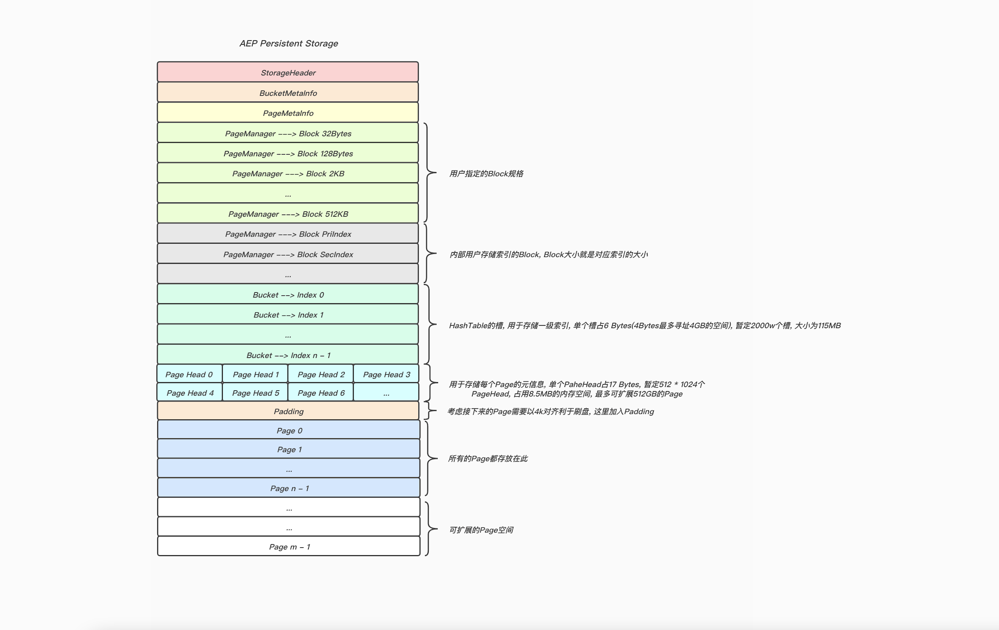

## Pmedis内存模型

### 背景
Pmedis是一个可持久化存储的数据库, 用户数据被存储在AEP设备上, 而AEP有两种工作模式:

* Memory Mode
	* 这种工作模式实际上就是把DRAM当做AEP的缓存用, 在这种模式下AEP和DRAM共同组成了一块对上层透明且容量更大的易失性内存, 这时系统内存的总容量等于AEP的容量.
* App Direct Mode
	* 这种模式下是把AEP呈现为持久性设备(/dev/pmem), 这时系统内存总容量还是还是DRAM的容量，而应用通过操作pmem设备来读写AEP(在这种模式下我们可以把AEP看成一个高速的磁盘)

由于我们需要数据持久化的功能, 于是采用了`App Direct Mode`的方式来使用AEP设备, 基于这种使用模式, 我们需要实现一套数据结构, 让应用层可以在AEP设备上合理的分配空间, 并且能够把Redis不同类型的数据存储在上面.

### 技术方案
将AEP设备上的空间看成一块很大的内存, 我们在这块内存的头部加入一些元信息, 以及管理数据结构, 然后将剩余的空间按照1MB的大小分割成若干个Page, 应用在分配内存时会通过元信息和这些管理数据结构分配Block返回给应用使用.

### 存储模型
#### 整体存储格式

#### Page结构

#### Block链表


### 相关数据结构
外界指定当前在AEP设备上初始使用的内存空间, 以及最大可扩展的内存空间, 并且通过参数指定底层可分配的Block规格, 初始化时会通过参数计算出每个Page可存储Block的数量, 记录在对应的数组元素中.

```cpp
struct StorageHeader {
  uint64_t size;
  uint64_t max_extend_size;

  uint32_t block_size[kMaxBlockCategoryCount];
  uint32_t block_count_per_page[kMaxBlockCategoryCount];
  uint32_t block_category_count;
};
```
桶的元信息, 用于记录桶的总个数和已使用桶的个数(一级索引用使用HashTable进行管理, 落到同一个桶的一级索引用链表进行连接, 以解决冲突), 这里主要考虑作为后期用于检测性能的指标.

```cpp
struct BucketMetaInfo {
  uint64_t bucket_allocated_count;
  uint64_t total_bucket_count;
};
```
记录Page的元信息, 包括当前已使用的Page数量, 总共的Page数量以及最大可扩展的Page数量, 另外空闲Page可看成用链表串联起来的, free\_page\_head指向链表头的Page, 若为-1, 表示当前已经没有空闲Page供使用了.

```cpp
struct PageMetaInfo {
  int32_t page_allocated_count;
  int32_t total_page_count;
  int32_t max_extend_page_count;
  int32_t free_page_head;
};
```
紧接着是PageManager数组(这里是跟Block规格挂钩的, 有多少种规格的Block, 就有多少种规格的PageManager), 记录已分配的该规格Page数量, 以及该规格Block数量, 我们在PageManager中分配Block时, 会先去查看是否有未完全使用的Page可供使用, 否则去全局分配新的Page.

```cpp
struct PageManager {
 int32_t page_allocated_count;
 int32_t block_allocated_count;
 int32_t noempty_page_head;
 int32_t full_page_head;
};
```
noempty\_page\_head和full\_page\_head指向双链表的表头(没有完全使用的Page和完全使用的Page), 每个Page头部的元信息如下, 实际上除了前后指针外, 主要还需要记录Page已分配的Block数量, 以及需要指向空闲Block链表的头部Block.

```cpp
struct PageHead {
  int32_t next_page;
  int32_t prev_page;
  uint16_t block_allocated_count;
  uint8_t page_mng_index;
  PosInfo free_block_head;
};
```

下面是每个Block的头部信息, 在用户存在大Value场景, 单个Block可能存不下所有数据, 这时候就需要多个Block进行串联, 而头部信息非空, 就表示当前Block后面还有Block需要解析, 如果是我们内部的索引Block(因为大小固定, 不需要多个Block串联), 那么就没有这个头部信息.

```cpp
struct PosInfo {
  PosInfo() : chunk(0), page_num(0), offset(0) {}
  PosInfo(uint8_t chunk_, uint16_t page_num_, uint16_t offset_)
      : chunk(chunk_), page_num(page_num_), offset(offset_) { }

  uint32_t page_num;
  uint16_t offset;
};
```

一级索引, 这里需要关注的是, `next`变量用于指向处于同一个bucket的下一个一级索引, 用于解决Hash冲突.

```cpp
struct PriIndex {
  uint8_t type;
  uint8_t status;
  PosInfo next;
  uint32_t last_update_time;
  uint32_t expired_time;

  PosInfo key_pos;
  uint16_t key_length;      /* Key的长度不能大于等于64MB */
  PosInfo value_pos;
  uint32_t value_length;    /* Value的长度不能超过4GB    */
};
```
