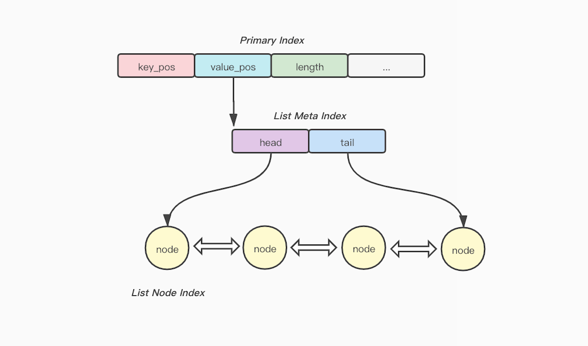
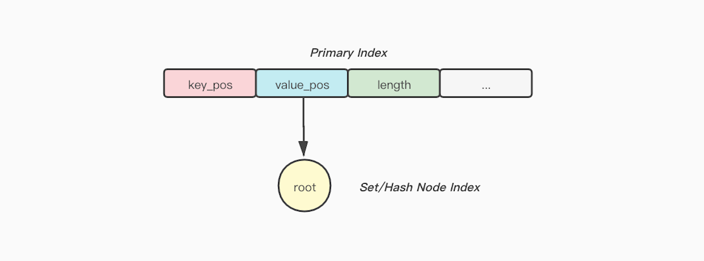
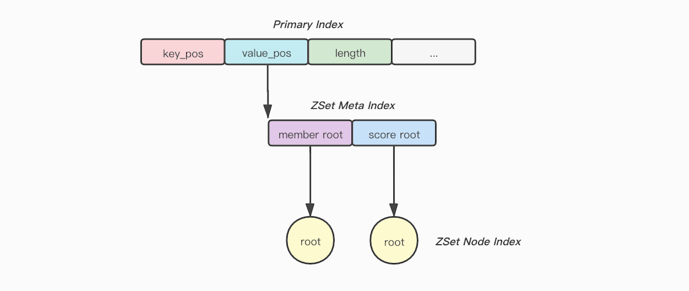
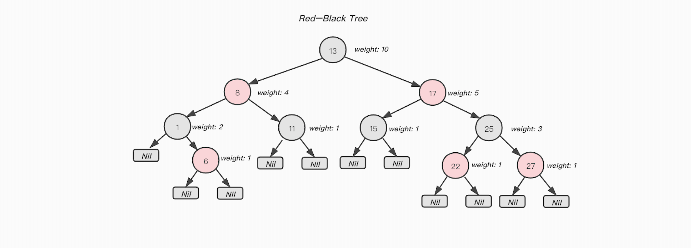

## 多数据结构存储方案

### List数据结构
```cpp
struct ListMetaIndex {
  PosInfo head;
  PosInfo tail;
};

struct ListNodeIndex {
  PosInfo prev;
  PosInfo next;
  PosInfo value_pos;
  pmedis::p<uint32_t> value_length;
};
```



#### 备注
区间访问做优化, 根据区间位置选择前半段访问还是后半段访问.

### Set以及Hash数据结构
```cpp
struct SetNodeIndex {
  RBNode rb_node;
  PosInfo member_pos;
  pmedis::p<uint32_t> member_length;
};
```
```cpp
struct HashNodeIndex {
  RBNode rb_node;
  PosInfo field_pos;
  pmedis::p<uint32_t> field_length;
  PosInfo value_pos;
  pmedis::p<uint32_t> value_length;
};
```


### ZSet数据结构
```cpp
struct ZSetMetaIndex {
  PosInfo member_rb_root;
  PosInfo score_rb_root;
  pmedis::p<uint32_t> count;
};
```

```cpp
struct ZSetNodeIndex {
  RBNode member_rb_node; // member tree
  RBNode score_rb_node;  // score tree

  PosInfo member_pos;
  uint32_t member_length;
  long double score;
};
```


#### 备注
ZSet由于需要同时满足按照score排序以及按照member进行排序, 所以这里维护两个红黑树(field\_rb\_root指向的红黑树按照member的字典序规则排列节点, score\_rb\_root指向的红黑树按照score的大小规则排列节点), 此外为了节省空间, 虽然是维护两棵红黑树, 但是结点是复用的(也就是一个节点会同时存在于两颗树里面)

### RB-Tree

####  RB-Tree Node
```cpp
struct RBNode {
  bool color;
  PosInfo parent;
  PosInfo left;
  PosInfo right;
  uint32_t weight;
};
```




#### RB-Tree需要支持的功能
1. 节点的插入和删除以及原地更新.
2. 点查询和范围查询.
3. 由于数据在RB-Tree中是有序存储的, 可以支持按照索引进行scan的功能(需要保证在scan的过程中, RB-Tree结点没有变化, 若发生改变, 则无法保证一轮scan的完整性).
4. 随机pop一个节点(`hrandfiled`, `srandmember`, `zrandmember`), 由于RB-Tree中总结点数量n我们是知道的, 只需要生成一个`0 ~ n - 1`的随机数m, 然后从RB-Tree中获取第m大的节点即可.
5. 由于节点结构不一样, 我们要实现两个红黑树, 一个对应`Sets/Hashes`, 另外一个对应`ZSets`.

### 特殊场景支持
#### 大KEY删除
pmedis是单线程模型, 目前存储引擎和持久化模块都不是线程安全的, 所以暂时无法将大Key放到另外一个线程做删除, 如果Client删除大Key采用同步删除的策略, 不单当前Client会被阻塞, 其他Client也会被阻塞住, 这里采取先将大Key的一级索引从HashTable中移除, 然后渐进式删除子元素的策略(List/Hash/Set/ZSet每个周期删除50个元素).
