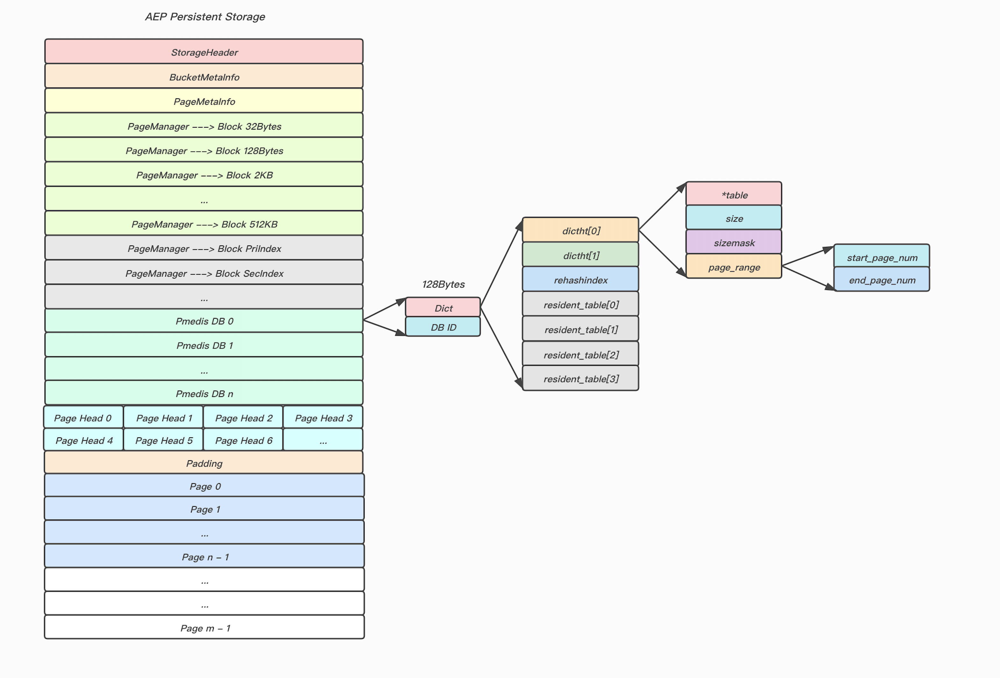
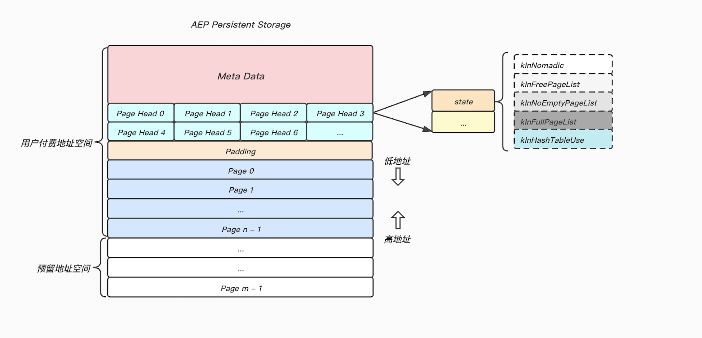
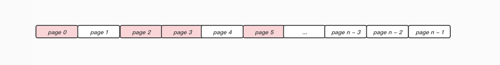
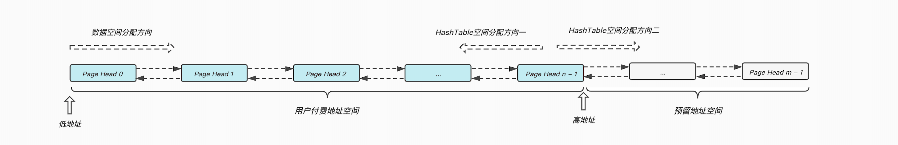
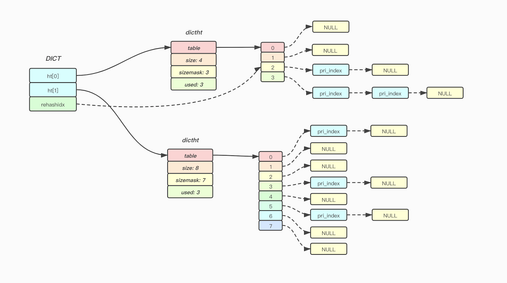

## Pmedis HashTable扩缩容与Multidb方案

### 背景
在迭代一中, 基于单DB的架构, 为了查找效率考虑, 我们为HashTable设置了32兆个槽, 占用内存空间为192MB, 但是由于线上存在不少多DB的用户, 为了保证这批用户迁移到Pmedis上不存在DB的兼容性问题, Pmedis也需要支持多DB, 为每个DB都初始分配32兆个槽(启动占用内存太多, 大概率造成浪费)显然不是可行的方案, 我们需要初始化时为每个DB设置一个较小的HashTable, 该HashTable可以随着用户Key的数量变化进行动态扩张和缩减, 以保证在不浪费AEP空间的前提下保证查询效率. 

### Pmedis存储模型改动
主要是将之前的32兆的Bucket数据块去除, 替换为多个Pmedis DB数据块.

```cpp
typedef struct Dictht {
  pmedis::p<PosInfo*> table;

  pmedis::p<uint64_t> size;
  pmedis::p<uint64_t> sizemask;
  pmedis::p<uint64_t> used;

  PageRange page_range;
} Dictht;

typedef struct Dict {
  Dictht  ht[2];
  pmedis::p<int64_t> rehashidx;
  PosInfo resident_table[8];
} Dict;

typedef struct PmedisDb {
  Dict dict;
  pmedis::p<uint16_t> id;
} PmedisDb;
```



这里为每个DB初始化时分配大小为4常驻的HashTable(resident\_table), 若该DB一直没有触发Rehash操作, *table将一直指向该常驻HashTable.

若触发了Rehash操作, 新HashTable占用的空间将从pages块中进行分配(一个或者多个物理地址相邻的page), *table指向新分配page数组的起始位置, 而`start_page_num`和`end_page_num`分别指向起始page和末尾page, 这里主要是为了后续在Rehash结束之后释放该HashTable时, 可以将这部分page, 归还到`free_page_list`当中.


#### 备注
单个Pmedis DB对象占用内存空间为128 Bytes, 以启动Pmedis默认配置256 DB为例, Pmedis DB数据块固定占用AEP空间为32KB.

### HashTable的空间分配策略
HashTable槽是根据计算偏移量来进行定位的, 这里不能直接复用之前Block的分配策略(用链表串联, 不同block逻辑相邻, 但是物理地址不连续), 我们采用直接分配Page的策略, 之前一个Page永远处于以下三种状态中的一种:

* **kInFreePageList**: 空闲状态, 处于`Free Page List`中.
* **kInNoEmptyPageList**: 已经被PageManager获取, 但是Page中还可以继续分配`Block`.
* **kInFullPageList**: 已经被PageManager获取, 但是Page已满, 无法继续分配`Block`.



目前我们采用直接分配Page的策略为HashTable提供空间, 这里新提供一种状态:

* **kInHashTableUse**: 已经被用作HashTable, 无法满足其他空间分配需求.

由于用于数据的Page, 我们采用从低地址向高地址方向进行分配, 所以在实际使用过程中, **前半段内存空间**可能空闲page数量不多, 并且可能存在空洞, 若继续采用从低地址向高地址搜索的策略来分配k个物理连续的page, 效率可能不高, 所以这里采取高地址向低地址搜索的形式分配k个物理连续的page. 



#### 分配流程:
1. 定位到用户付费地址空间内的最高`PageHead`.
2. 反向搜索k段连续的, 状态处于`kInFreePageList`的page.
	* 若遍历到`Page Head 0`都没有找到符合要求的page段, 则通过**HashTable空间分配方向二**进行搜索(`maxmemory`通过命令层进行限制)
3. 将目标page段从`free_page_list`中移除, 并且进行**kInHashTableUse**标记, 最后将区间记录到HashTable的`page_range`当中.



### HashTable的扩缩容

#### 扩容条件: 
`HashTable中一级索引数量 >= HashTable槽数量`

#### 缩容条件:
`HashTable槽数量 >= 4` 并且 `HashTable中一级索引数量 * 10 <= HashTable槽数量`

#### 访问流程:
* **没有处于Rehash状态中**: 直接访问`ht[0]`即可.
* **处于Rehash状态中**: 先访问`ht[0]`, 若没有命中, 再访问`ht[1]`.



#### 渐进式Hash触发方式:
* **被动触发**: 客户访问Key的时候, 被动的触发搬迁.
* **主动触发**: 防止内部由于过期机制淘汰了过多的Key, 触发了HashTable的缩容, 但是由于没有用户请求被动触发搬迁, 导致一直存在两个HashTable占用空间, 这里每个周期会轮训检查, 如果有必要的话主动触发搬迁操作.

### 相关改动
1. 存储模型修改.
2. 分配Page策略实现.
3. 轮训淘汰过期Key.
4. HashTable的扩缩容以及`主动/被动`搬迁实现.
5. `Scan`命令相关支持.
6. `debug htstats dbid`命令支持.

```cpp
[Dictionary HT]
Hash table 0 stats (main hash table):
 table size: 8388608
 number of elements: 6322032
 different slots: 4441355
 max chain length: 9
 avg chain length (counted): 1.42
 avg chain length (computed): 1.42
 Chain length distribution:
   0: 3947253 (47.05%)
   1: 2976741 (35.49%)
   2: 1120975 (13.36%)
   3: 281377 (3.35%)
   4: 53327 (0.64%)
   5: 7849 (0.09%)
   6: 960 (0.01%)
   7: 112 (0.00%)
   8: 13 (0.00%)
   9: 1 (0.00%)
```


