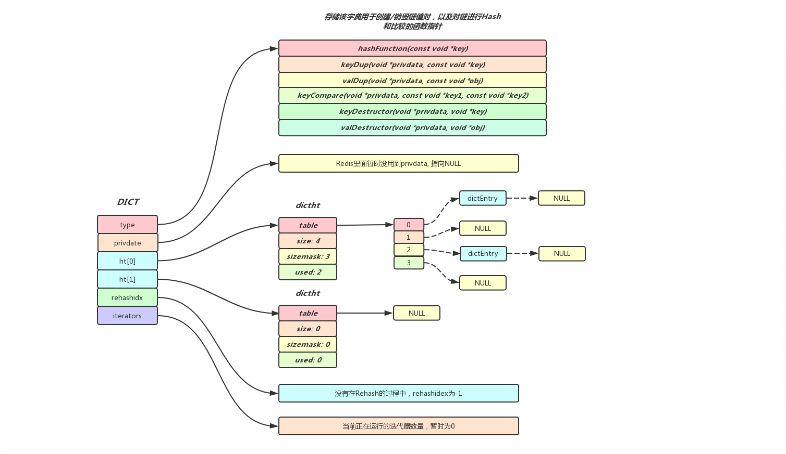
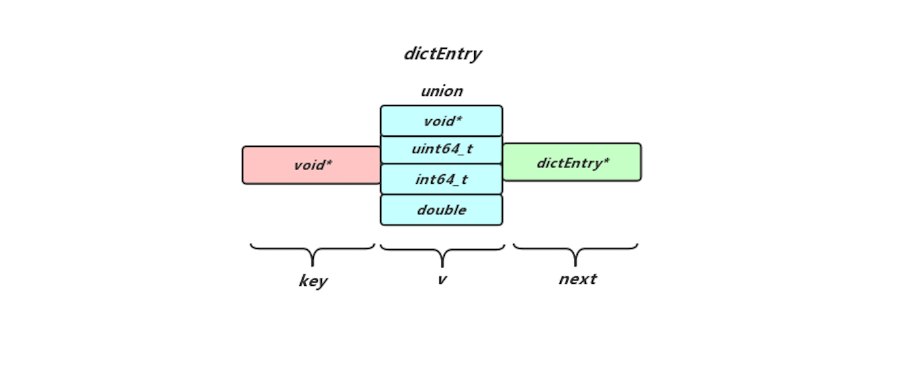
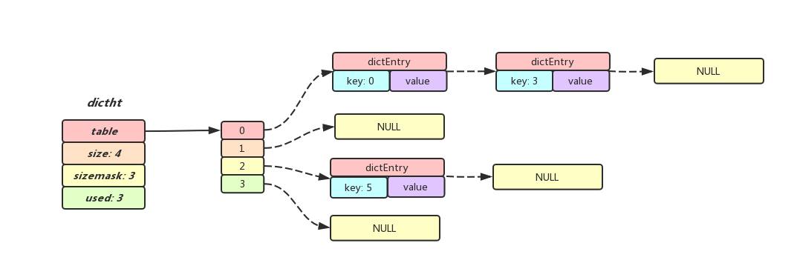
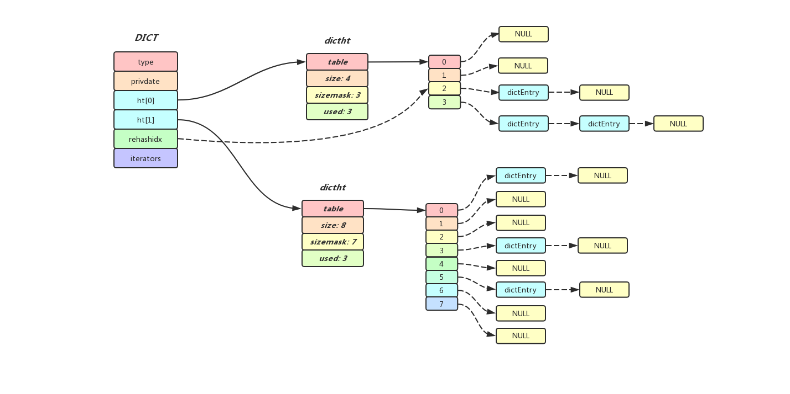

## Redis中的Dict

### 介绍

字典在Redis当中使用得相当广泛,存储Redis所有命令的CommandTable实际上就是一个字典,而Redis的数据库本身也是使用字典作为底层实现的,对数据库的增删改查操作也是构建在字典之上,所以把字典形容为Redis的基石也不足为过,这篇博客会介绍字典的整体结构，字典中数据结点的构造以及在大数据量场景下字典如何维持高性能的插入以及查找操作并且尽可能的节省内存空间.

### Dict的整体结构

先来看一个最简单Dict的整体结构:



字典中的type和privdata属性是针对不同类型的键值对,为了创建多态字典而设置的,在字典初始化的时候可以根据字典中不同键值对的类型传入相对应的type以及Privdata,type指向一个dictType的结构体,结构体中保存用于操作特定类型键值对的函数指针, 而privdata属性则保存了需要传给特定键值对函数的可选参数.

字典中的存在两个指向dictht的指针(dictht实际上就是HashTable,也就是Dict中真正存储数据的地方), 在当前没有rehash操作的时候,ht[0]指向其中一个dictht, 而ht[1]指向另一个大小为0的dictht,而在执行rehash操作的过程中,ht[0]指向迁出数据的dictht, ht[1]指向迁入数据的dictht

在执行rehash操作的过程中,rehashidx存储的就是ht[0]中下一次待迁移buckets的位置,而如果当前没有执行rehash操作,则rehashidx的值便为-1

iterators记录的是外界当前迭代该Dict迭代器的个数

### Dict的构造函数

下面代码列出来了Dict构造过程的调用链,调用过程还是比较清晰的,首先先为dict分配空间,然后初始化内部的两个dictht, 再将外部传入的type以及privDataptr赋值给自身的成员变量,最后再将rehashidx以及iterators附初始值(在Dict构造之初没有rehash操作,也没有外界迭代操作,所以rehashidx和iterators值分别为-1和0)

```cpp
/* Create a new hash table */
dict *dictCreate(dictType *type, void *privDataPtr)
{
    dict *d = zmalloc(sizeof(*d));

    _dictInit(d,type,privDataPtr);
    return d;
}

/* Initialize the hash table */
int _dictInit(dict *d, dictType *type,
        void *privDataPtr)
{
    _dictReset(&d->ht[0]);
    _dictReset(&d->ht[1]);
    d->type = type;
    d->privdata = privDataPtr;
    d->rehashidx = -1;
    d->iterators = 0;
    return DICT_OK;
}

static void _dictReset(dictht *ht)
{
    ht->table = NULL;
    ht->size = 0;
    ht->sizemask = 0;
    ht->used = 0;
}
```

### 字典中的哈希表: Dictht
Redis的字典使用HashTable作为底层实现,一个HashTable中可以保存多个哈希表结点(dictEntry), 而每个dictEntry中就保存着字典中的一个键值对, table属性就是一个数组, 数组中每个元素的类型都是指向dictEntry的指针,而size属性便是table数组的长度, sizemask总是等于size - 1, 用于计算索引信息, used属性记录当前HashTable中dictEntry的总数量

```cpp
/* This is our hash table structure. Every dictionary has two of this as we
 * implement incremental rehashing, for the old to the new table. */
typedef struct dictht {
    dictEntry **table;      // HashTable数组
    unsigned long size;     // HashTable的大小
    unsigned long sizemask; // HashTable大小掩码,总是等于size - 1, 通常用来计算索引
    unsigned long used;     // 已经使用的节点数,实际上就是HashTable中已经存在的dictEntry数量
} dictht;
```
### 哈希表中的结点: DictEntry
dictEntry是Dictht中结点的表现形式, 每个dictEntry都保存着一个键值对, key属性指向键值对的键对象, 而v属性则保存着键值对的值, Redis采用了联合体来定义v, 使键值对的值既可以存储一个指针, 也可以存储有符号/无符号整形数据,甚至可以存储浮点形数据, Redis使用联合体的形式来存储键值对的值可以让内存使用更加精细灵活, 另外, 既然是HashTable, 不可避免会发生两个键不同但是计算出来存放索引相同的情况, 为了解决Hash冲突的问题, dictEntry还有一个next属性, 用来指向与当前dictEntry在同一个索引的下一个dictEntry.

下面列出了一个最简单的dictht, 这个哈希表大小为4(一共有四个可用索引),  其中已经存在三个dictEntry结点,我们可以看到其中key为0和1的两个dicEntry都落到了索引0上,Redis采用了链地址法,使计算出来相同索引的dictEntry用next指针构成了一个单向链表,以此来解决Hash冲突

dictEntry的索引信息首先是通过构造字典时传入dictType中的`hashFunction((const void *key)方法`计算出一个hash值, 然后再用hash值与哈希表中的sizemask字段进行与运算,这样就能得到一个位于[0, size - 1]区间中的一个索引

这时候为了确保新传入dictEntry的Key在该索引对应的单链表中不存在,还需要遍历这个单链表上所有的结点,并且一一做比较, 如果发现哈希表中已经存在目标Key对应的dictEntry对象,就会将dictEntry对象返回,上层直接更新dictEntry对象中的Value即可,否则创建新的dictEntry对象

```cpp
/* 为给定key计算一个hashtable的index, 如果这个key已经存在于dict中,那么返回-1,
 * 需要注意的是如果dict当前正在执行rehash操作,那么返回的一定是ht[1]中的index
 */
static int _dictKeyIndex(dict *d, const void *key, unsigned int hash, dictEntry **existing)
{
    unsigned int idx, table;
    dictEntry *he;
    if (existing) *existing = NULL;

    /* Expand the hash table if needed */
    if (_dictExpandIfNeeded(d) == DICT_ERR)
        return -1;
    for (table = 0; table <= 1; table++) {
        idx = hash & d->ht[table].sizemask;
        /* Search if this slot does not already contain the given key */
        he = d->ht[table].table[idx];
        while(he) {
            if (key==he->key || dictCompareKeys(d, key, he->key)) {
                if (existing) *existing = he;
                return -1;
            }
            he = he->next;
        }
        if (!dictIsRehashing(d)) break;
    }
    return idx;
}
```

### Dict的Rehash
可以预见的是,随着我们不断的对HashTable进行操作,可能会发生以下两种情况:

* 不断的向HashTable中添加数据,HashTable中每个索引上的dictEntry数量会越来越多,也就是单链表会越来越长,这会十分影响字典的查询效率(最坏的场景可能要把整个单链表遍历完毕才能确定一个Key对应的dictEntry是否存在), 而Redis通常被当做缓存,这种低性能的场景是不被容许的.
* 向一个本身已经十分巨大的HashTable执行删除节点的操作,由于原先这个HashTable的size很大(也就是说table数组十分巨大,我们假设size为M), 但是执行了大量的删除操作之后,table数组中很多元素指向了NULL(由于对应的索引上已经没有任何dictEntry,  相当于一个空的单链表), HashTable中剩余结点我们假设为N,这时M远大于N,也就是说之上table数组中至少有M - N个元素指向了NULL,这是对内存空间的巨大浪费,而Redis是内存型数据库,这种浪费内存的场景也是不被容许的.

针对以上两种场景,为了让HashTable的负载因子(HashTable中所有dictEntry的数量/HashTable的size值)维持在一个合理的范围内,Redis在HashTable保存的dictEntry数量太多或者太少的时候,会对HashTable的大小进行扩展或者收缩,在没有执行Rehash操作时,字典的所有数据都存储在ht[0]所指向的HashTable中,而在Rehash操作过程中,Redis会创建一个新的HashTable, 并且令ht[1]指向它,然后逐步的将ht[0]指向的HashTable的数据迁移到ht[1]上来

#### 判断扩展HashTable的逻辑:

```cpp
/* Expand the hash table if needed */
static int _dictExpandIfNeeded(dict *d)
{
    /* Incremental rehashing already in progress. Return. */
    if (dictIsRehashing(d)) return DICT_OK;

    /* If the hash table is empty expand it to the initial size. */
    if (d->ht[0].size == 0) return dictExpand(d, DICT_HT_INITIAL_SIZE);

    /* If we reached the 1:1 ratio, and we are allowed to resize the hash
     * table (global setting) or we should avoid it but the ratio between
     * elements/buckets is over the "safe" threshold, we resize doubling
     * the number of buckets. */
    if (d->ht[0].used >= d->ht[0].size &&
        (dict_can_resize ||
         d->ht[0].used/d->ht[0].size > dict_force_resize_ratio))
    {
        return dictExpand(d, d->ht[0].used*2);
    }
    return DICT_OK;
}
```
每次获取一个Key的索引信息时,都会调用上述的`_dictExpandIfNeeded(dict *d)`方法判断是否需要对当前HashTable执行扩展操作,满足下列任意条件之一,便会执行扩展操作:

* 当前ht[0]所指向的HashTable大小为0
* 服务器目前没有执行BGSAVE或者BGREWRITEAOF操作,并且HashTable的负载因子大于等于1(`d->ht[0].used >= d->ht[0].size`)
* 服务器目前正在执行BGSAVE或者BGREWRITEAOF操作,并且HashTable的负载因子大于5(`dict_force_resize_ratio = 5`)

#### 判断收缩HashTable的逻辑:

```cpp
int htNeedsResize(dict *dict) {
    long long size, used;

    size = dictSlots(dict);
    used = dictSize(dict);
    return (size > DICT_HT_INITIAL_SIZE &&
            (used*100/size < HASHTABLE_MIN_FILL));
}

/* Resize the table to the minimal size that contains all the elements,
 * but with the invariant of a USED/BUCKETS ratio near to <= 1 */
int dictResize(dict *d)
{
    int minimal;

    if (!dict_can_resize || dictIsRehashing(d)) return DICT_ERR;
    minimal = d->ht[0].used;
    if (minimal < DICT_HT_INITIAL_SIZE)
        minimal = DICT_HT_INITIAL_SIZE;
    return dictExpand(d, minimal);
}
```
Redis会定期的检查数据库字典HashTable的状态,当HashTable的负载因子小于0.1时,会自动的对HashTable执行收缩操作

#### Rehash操作的流程
Redis对HashTable执行rehash操作步骤如下:

 * 为ht[1]指向的HashTable分配空间, 分配空间的大小取决于要执行的操作,以及ht[0]所指向HashTable中dictEntry结点的数量, 也就是`ht[0].used`中记录的值:
	* 如果当前执行的是扩展操作,那么新HashTable的大小为第一个大于等于`2 * ht[0].used`的2的n次方幂
	*  如果当前执行的是收缩操作,那么新HashTable的大小为第一个大于等于`ht[0].used`的2的n次方幂
 * 将ht[0]所指向HashTable中的所有dictEntry节点都迁移到ht[1]所指向的新HashTable上(由于两个HashTable的size不同,所以在迁移过程中要重新计算dictEntry的索引,这也就是rehash的关键所在)
 * 当迁移完成之后,ht[0]所指向的HashTable中已经没有任何节点,释放该HashTable, 并且令ht[0]指向迁入节点的新HashTable, 最后为ht[1]创建一个空白的HashTable,为下一次rehash做准备

### 渐进式Rehash
前面提到够Rehash操作本质上就是将一个HashTable中的所有dictEntry节点迁移到另外一个HashTable上,考虑到在HashTable上dictEntry存在大量节点的情况下,节点迁移的过程将会非常长,这将会阻塞Redis服务,所以Redis的rehash操作并不是一次性完成的,而是随着服务的运行分多次,渐进式的将ht[0]里的dictEntry慢慢rehash到ht[1]上,可以看一下下面rehash的关键方法:

```cpp
/* Performs N steps of incremental rehashing. Returns 1 if there are still
 * keys to move from the old to the new hash table, otherwise 0 is returned.
 *
 * Note that a rehashing step consists in moving a bucket (that may have more
 * than one key as we use chaining) from the old to the new hash table, however
 * since part of the hash table may be composed of empty spaces, it is not
 * guaranteed that this function will rehash even a single bucket, since it
 * will visit at max N*10 empty buckets in total, otherwise the amount of
 * work it does would be unbound and the function may block for a long time.
 *
 * n实际上是这次rehash移动非空bucket的数量, 但是由于可能会有一些bucket是空
 * 的,所以为了避免遍历过多的空bucket,在这里加了一个empty_visits的限制
 *
 * 该方法比较简单,遍历ht[0]当前bucket上的元素,然后通过元素的key和ht[1]的
 * sizemask计算出该元素在ht[1]上的位置,并且将其添加到ht[1]对应的bucket上,
 * 再将其从ht[0]上删除, 最后判断ht[0]上的元素是否完全迁移完毕, 如果是,则
 * 释放原先ht[0]的hashtable, 然后令ht[0]指向ht[1]的hashtable并且重置ht[1],
 * 最后令rehashidx为-1, 标志着当前没有rehash操作
 */
int dictRehash(dict *d, int n) {
    int empty_visits = n*10; /* Max number of empty buckets to visit. */
    if (!dictIsRehashing(d)) return 0;

    while(n-- && d->ht[0].used != 0) {
        dictEntry *de, *nextde;

        /* Note that rehashidx can't overflow as we are sure there are more
         * elements because ht[0].used != 0 */
        assert(d->ht[0].size > (unsigned long)d->rehashidx);
        while(d->ht[0].table[d->rehashidx] == NULL) {
            d->rehashidx++;
            if (--empty_visits == 0) return 1;
        }
        de = d->ht[0].table[d->rehashidx];
        /* Move all the keys in this bucket from the old to the new hash HT */
        while(de) {
            unsigned int h;

            nextde = de->next;
            /* Get the index in the new hash table */
            h = dictHashKey(d, de->key) & d->ht[1].sizemask;
            de->next = d->ht[1].table[h];
            d->ht[1].table[h] = de;
            d->ht[0].used--;
            d->ht[1].used++;
            de = nextde;
        }
        d->ht[0].table[d->rehashidx] = NULL;
        d->rehashidx++;
    }

    /* Check if we already rehashed the whole table... */
    if (d->ht[0].used == 0) {
        zfree(d->ht[0].table);
        d->ht[0] = d->ht[1];
        _dictReset(&d->ht[1]);
        d->rehashidx = -1;
        return 0;
    }

    /* More to rehash... */
    return 1;
}
```
从源码可以看出,外界出入需要rehash的字典,和rehash的步长,内部会先计算出一个`empty_visits`(这是为了避免在一次渐进式rehash的过程中遍历了过多的empty buckets从而占用时间阻塞服务,额外加上的一个限制条件)

渐进式rehash会维护一个rehashidx值,表示下一次渐进式rehash从哪个buckets开始,我们会遍历该buckets上单链表的所有dictEntry,并且根据ht[1]的sizemask计算索引信息,迁移到ht[1]上去,等到该buckets上的所有dictEntry都迁移完毕了,我们便可以将rehashidx移到下一个buckets的位置上.

最后,等到ht[0]对应的HashTable结点已经全都迁移完毕,我们便可以进行HashTable的切换操作.

下面看一下一个正在执行渐进式rehash操作的字典:

可以看到当前rehashidx指向ht[0]的索引2,这说明ht[0]的[0, rehashidx - 1]对应buckets上的dictEntry都已经迁移完毕,另外我们发现正在执行渐进式rehash字典中的数据一部分在ht[0]中,而另一部分在ht[1]中,所以在渐进式rehash执行期间,字典的删除,查找以及更新操作,都会在两个HashTable上执行(先尝试在ht[0]上执行操作,如果没有成功,则再尝试在ht[1]上进行操作),而在渐进式rehash执行期间,如果我们需要往字典中添加新的结点,则会一律添加到ht[1]上,这样可以保证ht[0]上的结点只减不增(也就是已经迁移过的buckets不会再出现新的结点)

### 总结
Redis的字典实现非常的巧妙，利用两个哈希表渐进式rehash的方法在解决单个HashTable在保存结点过多的场景下查询/更新/删除效率低下和单个大型HashTable在保存少量结点场景下浪费内存问题的同时不影响服务的正常运行，并且通过构造字典时传入的type和privdata实现了多态字典，用户可以根据自身数据类型的不同设置相应的type和privdata来使用字典，大大的提高了代码的灵活性