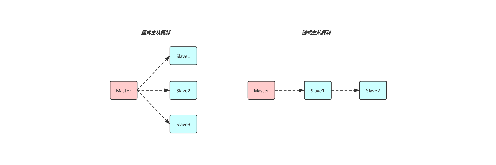
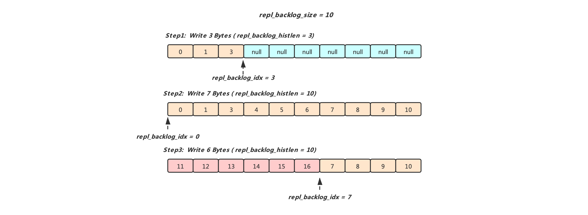
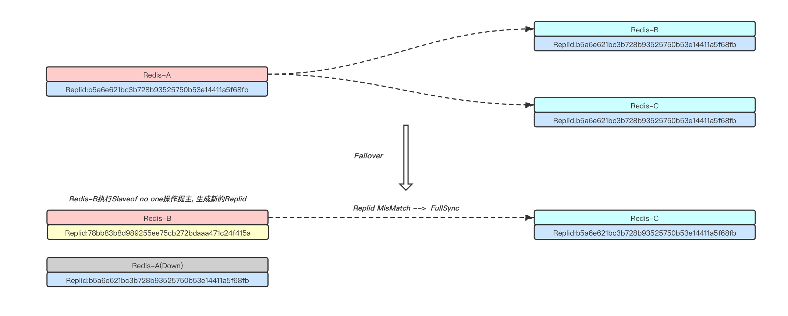
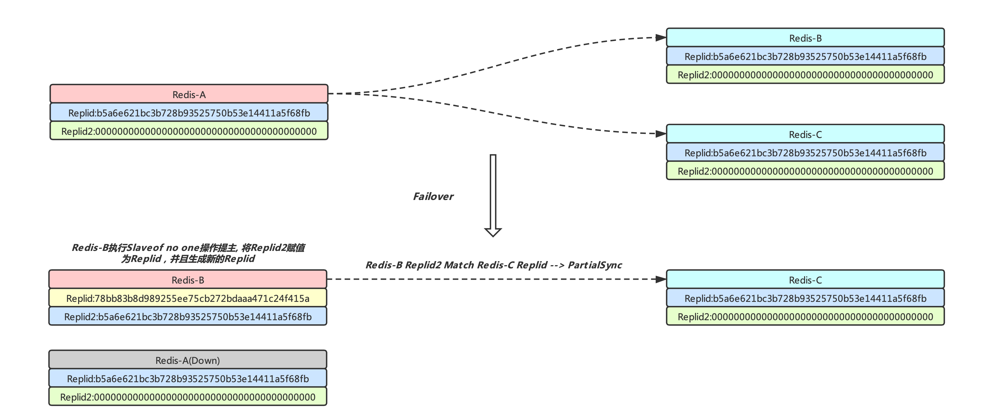

## Redis主从同步

### 介绍
Redis是内存数据库，它将自己的数据库状态存储在内存中，为了避免进程退出从而丢失数据，Redis提供了RDB持久化功能，可以将数据库数据持久化到磁盘上，在启动时通过加载RDB文件可以将数据重新恢复到内存当中,  保证数据不丢的前提是能够及时的同步数据到磁盘，并且服务器一切正常. 但运行Redis的服务器如果出现了硬盘故障，系统崩溃等问题时，面临的不仅仅是丢数据的问题，还可能对业务造成灾难性的打击.

其实大多数数据库都面临同样的问题，为了避免单点故障，最直接的做法是将数据复制多个副本保存在不同的服务器上(通过主从同步的方案)，这样不仅可以在主库挂了的场景下迅速将其他从库做提主操作继续对外提供服务，并且在一主多从的场景下还可以做读写分离，使数据库支持更大的并发.

Redis是支持主从同步的，但是在早期的版本中实现得并不完美，比如说在2.8版本之前在已经建立了主从关系之后，由于网络问题中断了同步，从库再次请求同步时必须要求重新做一遍全同步，而不是直接增量同步，这样效率十分低下(全同步依赖RDB文件，而生成RDB和传输RDB都会给磁盘和网络带来巨大的负担)，于是新版本便对同步方案进行了优化，本篇博客基于Redis4.0的同步方案进行介绍.

### Redis主从复制使用方式
Redis同时支持星式主从复制和链式主从复制，前者的特征是一个主后面挂多个从库，后者的特征是在复制关系中，一个Redis可以既当主库，又当从库，例如下面链式主从复制图中，Slave1既是Master的从库，但同时它又是Slave2的主库.



Redis使用Slaveof命令来建立主从关系和断开主从关系，例如用户向一个Redis服务执行`slaveof 127.0.0.1 9221`, 该Redis便会和地址为`127.0.0.1:9221`的Redis建立主从关系，然后开始同步数据，如果我们想断开主从关系，向从库执行`slaveof no one`命令即可,  使用方式还是十分简单的(需要注意的是从Redis5.0开始由于[某些原因](http://antirez.com/news/122)为Slaveof提供了别名Replicaof)

### 概念
在开始介绍Redis主从复制流程之前先来介绍几个重要的概念

#### RDB文件
RDB是Redis内存数据库数据在某一个时刻(快照)在磁盘上的表现形式，它是二进制格式的文件. 作用是在启动Redis时可以读取RDB文件，将磁盘上的数据恢复至内存，另外如果在建立主从关系过程中发现需要全同步，这时候主库会fork出一个子进程来生成RDB文件(RDB中会记录Server的replid和当前的master\_repl\_offset), 然后将RDB文件发送给从库进行加载，加载完毕之后从库可请求增量同步.

#### Backlog复制积压缓冲区
复制积压缓冲区是主库维护的一段长度固定，先进先出(FIFO)队列，默认大小为1M(配置文件中`repl-backlog-size`可配置),  在命令传播阶段主节点不仅会将写命令传播给Slave, 还会把写命令在Backlog中保存一份，如果由于网络关系主从连接断开，当Slave重连时发现自己请求同步的位置还在Master的Backlog当中，Master便可以从Backlog中获取Slave断开连接期间缺失的命令发送给Slave，然后再传播新的写命令，从而避免了全同步

* repl\_backlog\_size: Backlog的大小
* repl\_backlog\_histlen: Backlog中实际数据的体积(在backlog还没写满之前repl\_backlog\_histlen < repl\_backlog\_size, 一旦Backlog被写满，repl\_backlog\_histlen就等于repl\_backlog\_size)
* repl\_backlog\_idx: Backlog当前的偏移量, 实际上就是指向下一个字节写入的位置




Backlog本质上就是一个char数组，数据从数组头部开始写入，当数组被写满之后，又继续从头部开始写(从上图Step3可以看到，数组已经被写满了，此时我们还需要写入7 Bytes，于是我们从头部开始写，将之前处于[0 ~ 6]上的数据给覆盖掉了)，实际上我们完全可以将Backlog看成Ring Buffer.

既然Backlog存储的数据量有限，在Master写压力大或者Slave断开时间太久的场景下，重连的时候都可能在Master的Backlog中找不到同步的点位，从而触发全同步，所以我们在使用过程中需要通过主库写入压力以及网络中断的平均时间设置合理的`repl-backlog-size`的值来尽量避免由于触发全同步对服务造成的影响.

#### Replid和Replid2
Replid是Redis在启动之后生成(由进程ID和时间为种子生成的40个随机字符构成)的唯一标识(如果有加载RDB文件，则会从RDB文件中恢复)，Replid可以看成数据集的版本，Slave在向Master执行同步请求时会带上Replid，Master收到Replid之后会判断从库的数据集版本是否和自己一致，若不一致，则会进行全量同步，全量同步完成之后Slave会将自己的Replid替换成和Master的Replid一致，这样Slave如果由于网络抖动暂时断开了和Master的同步，再次请求同步时由于自己拥有和Master同样的Replid便可以避免全量同步只进行增量同步(前提是Slave请求的Binlog偏移量还处于Master的Backlog当中)，但是如果Slave是自己主动断开了和Master的同步关系(执行了`slaveof no one`命令)，它会将Replid2赋值为Replid，并且生成一个全新的Replid.

Replid2在Redis启动时被赋值成由40个'0'字符构成的默认串，直到Redis自己主动断开了和Master的主从关系，Replid2便被重新赋值.  所以Replid2在不为默认串的场景下，它记录的是Redis前一个Master的Replid,  Replid2的引入实际上是为了解决由于主从角色切换导致的全同步问题，下面举例说明(为了例子足够简单暂时忽略Backlog对同步造成的影响)

先来看一下只有Replid的场景，一主两从，Redis-A挂了之后，Redis-B执行`Slaveof no one`进行提主操作，同时更新了自己的Replid，此时向Redis-C执行`Salveof Redis-B`, 由于两者Replid不同，必然会触发全同步


同样的场景下，Redis-B执行`Slaveof no one`进行提主操作，在更新自己的Replid之前先将其存到Replid2中(记录自己前一个Master的信息),  此时向Redis-C执行`Salveof Redis-B`, 在同步过程中Redis-B发现自己的的Replid2与Redis-C的Replid相同(由于它们之前是同一个Master的Slave)，这说明两者的数据集版本在之前是一致的，可以进行增量同步.



### 同步流程

首先看一下Slave的同步状态机

```cpp
/* Slave replication state. Used in server.repl_state for slaves to remember
 * what to do next. */
#define REPL_STATE_NONE 0           /* No active replication */
#define REPL_STATE_CONNECT 1        /* Must connect to master */
#define REPL_STATE_CONNECTING 2     /* Connecting to master */
/* --- Handshake states, must be ordered --- */
#define REPL_STATE_RECEIVE_PONG 3   /* Wait for PING reply */
#define REPL_STATE_SEND_AUTH 4      /* Send AUTH to master */
#define REPL_STATE_RECEIVE_AUTH 5   /* Wait for AUTH reply */
#define REPL_STATE_SEND_PORT 6      /* Send REPLCONF listening-port */
#define REPL_STATE_RECEIVE_PORT 7   /* Wait for REPLCONF reply */
#define REPL_STATE_SEND_IP 8        /* Send REPLCONF ip-address */
#define REPL_STATE_RECEIVE_IP 9     /* Wait for REPLCONF reply */
#define REPL_STATE_SEND_CAPA 10     /* Send REPLCONF capa */
#define REPL_STATE_RECEIVE_CAPA 11  /* Wait for REPLCONF reply */
#define REPL_STATE_SEND_PSYNC 12    /* Send PSYNC */
#define REPL_STATE_RECEIVE_PSYNC 13 /* Wait for PSYNC reply */
/* --- End of handshake states --- */
#define REPL_STATE_TRANSFER 14      /* Receiving .rdb from master, 处于接收RDB的过程中 */
#define REPL_STATE_CONNECTED 15     /* Connected to master */
```

#### Slave自身初始化阶段
当我们向Redis执行了`Slaveof ip port`命令之后，由于自己会成为别人的Slave, Redis会将目前挂在自己身上Slave都断开连接，然后更新自身`server.masterhost`和`server.masterport`为指定的主库地址，并且将自身的同步状态机设置为`REPL_STATE_CONNECT`状态，等待下一次定时事件发现自身的同步状态机变化.

定时事件调用`replicationCron()`函数之后检测到同步状态机为REPL\_STATE\_CONNECT状态，Redis获取当前需要同步的Master地址(也就是`server.masterhost`和`server.masterport`)，与其建立TCP连接, 并且使用该条连接的socket注册文件事件`syncWithMaster(aeEventLoop *el, int fd, void *privdata, int mask)`,  该事件用于处理主从同步，接下来将自身的状态机设置为`REPL_STATE_CONNECTING`, 此时Slave自身初始化阶段结束.

#### SlaveHandshake阶段
同步状态机处于[REPL\_STATE\_RECEIVE\_PONG，REPL\_STATE\_RECEIVE\_PSYNC]之间处于Handshake阶段, 当`syncWithMaster`函数发现状态机为`REPL_STATE_CONNECTING`，会向主库发送`Ping`，然后将状态机置为`REPL\_STATE\_RECEIVE\_PONG`

* REPL\_STATE\_RECEIVE\_PONG: 正常接收到Master返回的`PONG`会将状态机置为`REPL_STATE_SEND_AUTH`状态
* REPL\_STATE\_SEND\_AUTH: 检测是否设置了`masterauth`, 若设置了，向Master发送`auth masterauth`，并且将状态机置为`REPL_STATE_RECEIVE_AUTH`, 否则将状态机置为`REPL_STATE_SEND_PORT`
* REPL\_STATE\_RECEIVE\_AUTH: 接收到Master返回的auth结果，并且将状态机置为`REPL_STATE_SEND_PORT`
* REPL\_STATE\_SEND\_PORT: 将自己监听的端口号以`REPLCONF`命令(`REPLCONF listening-port port`)发送给Master, 并且将状态机置为`REPL_STATE_RECEIVE_PORT`, 这里需要注意的是如果Redis处于Network Address Translation (NAT)环境下，我们可以通过不同的ip:port对其进行访问，若我们设置了配置文件中的`slave-announce-ip`和`slave-announce-port`，则Slave告知Master自己的地址会以配置文件中的这两项为准.
*  REPL\_STATE\_RECEIVE\_PORT: 接收Master的返回结果, 并将状态机置为`REPL_STATE_SEND_IP`
*  REPL\_STATE\_SEND\_IP: 和`REPL_STATE_SEND_PORT`类似
*  REPL\_STATE\_RECEIVE\_IP: 和`REPL_STATE_RECEIVE_PORT`类似
*  REPL\_STATE\_SEND\_CAPA: 接下来还是通过`REPLCONF`命令(`REPLCONF capa eof capa psync2`)来告诉Master自己支持哪种处理能力，这里有两种`eof`(supports EOF-style RDB transfer for diskless replication)和`psync2`(supports PSYNC v2, so understands +CONTINUE <new repl ID>)，并且将状态机置为`REPL_STATE_RECEIVE_CAPA`
*  REPL\_STATE\_RECEIVE\_CAPA：接收Master的返回结果，并且将状态机置为`REPL_STATE_RECEIVE_PSYNC`


