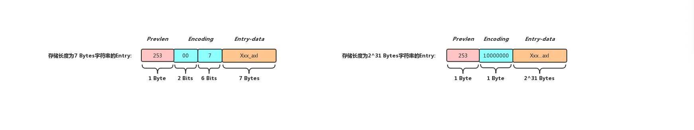
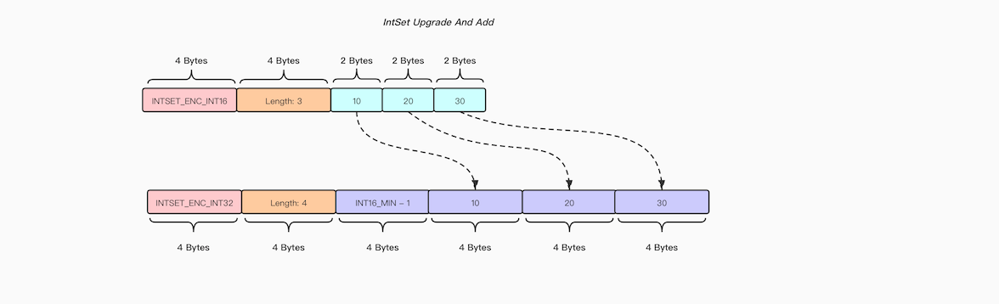

## Redis中的对象

### 介绍
我们知道Redis是基于内存的，支持String, List，Hash, Set, ZSet等多数据结构数据库，虽然Redis支持各种数据结构，但是它本质是以Key-Value形式存储数据的NoSQL数据库，实际上前一篇博客[Redis中的Dict](https://axlgrep.github.io/tech/redis-dict.html)有提到过，Redis数据库本身是使用字典作为底层实现的，而数据库字典中每个结点Value所指向的对象就是本篇博客要介绍的RedisObject

RedisObject翻译过来就是Redis对象，在Redis中RedisObject无处不在，客户端向Redis发送一条命令，经过解析之后命令的每个参数都会以sds的形式存储在RedisObject里面，Redis处理完一条命令，给客户端返回的Reply也会以sds的形式存储在RedisObject当中, 向Redis中存储一个键值对，就会生成存储键对应字符串的RedisObject和存储值对应字符串的RedisObject，如果向Redis中存储一个Hash表，除了会生成存储键对应字符串的RedisObject，甚至会生成一个存储Hash表的RedisObject, 可见RedisObject可以存储的数据并不只是简单的字符串，它也能存储一些复杂的数据结构

### RedisObject的定义
```cpp
typedef struct redisObject {
    unsigned type:4;       // RedisObject的类型
    unsigned encoding:4;   // 同一种类型的RedisObject数据有不同的编码形式
    unsigned lru:LRU_BITS; /* 记录RedisObject访问时间信息，在Redis设置了内
                            * 存上限限制之后会根据该属性来回收redisObject
                            * 从而达到释放内存的效果
                            * LRU time (relative to global lru_clock) or
                            * LFU data (least significant 8 bits frequency
                            * and most significant 16 bits decreas time). */
    int refcount;          // 引用计数，在Redis中同一个RedisObject可能被多个地方共用
    void *ptr;             // 指向底层实现数据结构的指针
} robj;
```

通过查看redisObject结构体源码，我们发现redisObject可以用type属性来表明自己存储数据的类型(type的取值有`OBJ_STRING`,`OBJ_LIST`,`OBJ_SET`,`OBJ_ZSET`,`OBJ_HASH`), 对于Redis数据库中保存的键值对来说，键对象一定是STRING对象，而值可以是STRING类型对象，也可以是LIST，SET, ZSET和HASH对像, 下面给出一个类型为String类型的RedisObject结构图


encoding属性用来表示redisObject的编码类型，举个例子来说同样是Hash类型数据，数据可以存储在ZipList中也可以存在Hash表中，Redis会在内存空间和性能两因素的作用下做出一个权衡，在不同的场景下选择最合适的数据结构进行数据的存储，encoding的取值就比较多了，有`OBJ_ENCODING_RAW`, `OBJ_ENCODING_INT`，`OBJ_ENCODING_HT`, `OBJ_ENCODING_ZIPMAP`, `OBJ_ENCODING_LINKEDLIST`, `OBJ_ENCODING_ZIPLIST`, `OBJ_ENCODING_INTSET`, `OBJ_ENCODING_SKIPLIST`, `OBJ_ENCODING_EMBSTR`, `OBJ_ENCODING_QUICKLIST`(基于Redis4.0，不同版本可能有所区别), 下面给出了不同数据结构可以使用的编码方式，其中有一些编码方式是低版本的时候使用的，在高版本中已经废弃不适用了，例如`OBJ_ENCODING_LINKEDLIST`


Redis数据库是基于内存的，如果Redis内存使用量超过了机器物理内存，可能会导致Redis崩溃，为了应对这种场景，Redis允许用于设置数据库内存使用的上限，当内存使用量达到用户设置的上限，Redis便会采取一些特定的算法策略(目前支持LRU, LFU,Random等回收策略)对数据库中某些符合要求的数据进行回收, 而lru属性便会记录数据库键的空转时长或者一些访问频率信息供回收算法参考, 下面以LRU算法进行举例说明:

当用户使用LRU淘汰策略时，RedisObject的lru内部记录了该对象最后一次被访问时间的时间戳(单位为秒),  当Redis占用内存超过用户设置的最大内存时，便会随机采样一些Key, 然后从中选择闲置时间最久的Key进行淘汰(首先获取全局时钟，然后和当前采样到RedisObject中的lru属性进行计算，获取到该RedisObject的闲置时间), 值得注意的是全局时钟和RedisObject中的lru属性都只能占用24 Bits(由于RedisObject中的type和encoding属性各占4 Bits，从内存对其的角度出发，lru属性被限制只能使用24 Bits)，就算我们用秒作为单位存储时间戳，最多也只能表示194天.

从如下源码可以看出:

* 当全局时钟大于robj中的lru属性时，闲置时间我们直接用全局时钟减去robj的lru属性值即可
* 当全局时钟小于robj中的lru属性时，这说明全局时钟距离robj最后一次访问时间已经超过至少一轮周期了(`LRU_CLOCK_MAX=LRU_CLOCK_MAX ((1<<LRU_BITS)-1)` = 194天)，这时候我们计算闲置时间应该为 `lruclock + (LRU_CLOCK_MAX - o->lru)`

```cpp
/* Given an object returns the min number of milliseconds the object was never
 * requested, using an approximated LRU algorithm. */
unsigned long long estimateObjectIdleTime(robj *o) {
    unsigned long long lruclock = LRU_CLOCK();
    if (lruclock >= o->lru) {
        return (lruclock - o->lru) * LRU_CLOCK_RESOLUTION;
    } else {
        return (lruclock + (LRU_CLOCK_MAX - o->lru)) *
                    LRU_CLOCK_RESOLUTION;
    }
}
```
实际上这种算法在极端场景下还是存在问题的，例如Key1距离当前全局时钟的周期大于Key2, 同时Key1的lru大于Key2的lru，这时候虽然Key1闲置时间比Key2要长，但是计算出来的IdleTime确比Key2要小，从而淘汰的优先级比Key2小，当然这种场景在实际时间中还是很少会出现.

refcount记录着当前redisObject的引用计数，也就是外界有多少地方正在使用这个redisObject，在Redis中操作一些命令成功，Redis会返回`+OK\r\n`,  而如果给出的命令格式错误，Redis会返回`-ERR syntax error\r\n`, 这些字符串都是经常会用到的，如果每次使用的时候都创建一个对应的redisObject和底层存储字符串的数据结构无疑会带来一定的开销，所以在初始化Redis服务的时候就会调用createSharedObjects()来创建一系列的可以共享的redisObject，这样做的好处是可以避免频繁的申请和归还内存，提高数据库的性能

ptr就是一个指针，指向底层存储数据的实际数据结构，接下来会分类细说

### OBJ\_ENCODING\_RAW编码形式
OBJ\_ENCODING\_RAW编码实际上就是简单动态字符串，底层数据结构的实现就是之前博客提到的SDS([Redis中的SDS](https://axlgrep.github.io/tech/redis-sds.html))，但是并不是所有的字符串都会以OBJ\_ENCODING\_RAW编码形式被存储在RedisObject中，只有字符串的长度大于Redis中的OBJ\_ENCODING\_EMBSTR\_SIZE\_LIMIT(44字节), 才会以该形式进行编码，下面给出该编码底层数据结构的结构图


### OBJ\_ENCODING\_EMBSTR编码形式
上面提到了当字符串长度大于44字节，那么字符串会以OBJ\_ENCODING\_RAW编码形式存储在RedisObject当中，但是当字符串长度小于等于44字节时候，便会使用到OBJ\_ENCODING\_EMBSTR形式进行编码

OBJ\_ENCODING\_RAW和OBJ\_ENCODING\_EMBSTR的区别是前者RedisObject和SDS是分别申请内存空间的，也就是说两者所占据的内存是物理不相邻的，而后者在内存中sds是紧跟在RedisObject后面的，在创建一个以OBJ\_ENCODING\_EMBSTR形式编码的RedisObject时也只需要申请一次内存空间(这种形式的sds存储空间在创建之初就是确定的，字符串长度无法更改，举例来说，如果客户端执行`set hello world`命令，由于`world`长度小于44字节，那么Redis便会创建以OBJ\_ENCODING\_EMBSTR编码的RedisObject， 这时候再执行`append`向`world`后面追加100个字符，Redis会将之前以OBJ\_ENCODING\_EMBSTR编码的RedisObject销毁，重新创建一个以OBJ\_ENCODING\_RAW编码的RedisObject，而不是去修改之前的sds对象)

其实这么做的好处显而易见，CSAPP中提到过，在一个良好空间局部性的程序中，如果一个存储器位置被引用了一次，那么程序很可能在不远的将来引用附近的一个存储器位置，我们如果需要访问以OBJ\_ENCODING\_RAW编码的RedisObject，那么目的肯定是要访问其中存储的字符串，这时候如果字符串在内存空间中正好就紧跟在RedisObject后面，这样访问起来就非常高效了，Redis正是利用了这种空间局部性(spatial locality)提升程序的性能

```cpp
/* Create a string object with encoding REDIS_ENCODING_EMBSTR, that is
 * an object where the sds string is actually an unmodifiable string
 * allocated in the same chunk as the object itself.
 *
 * |---------------------- RedisObject ---------------------|---------- Sdshdr ----------|-------- buf[] --------|
 * | <Type> | <Encoding> |  <Lru>  | <Refcount> |   <Ptr>   |  <Len>  |  <Free> | <Flag> |  <String>  |  <'\0'>  |
 *   4 Bits     4 Bits     24 Bits    4 Bytes      8 Bytes     1 Byte    1 Byte   1 Byte    Len Bytes    1 Byte
 * ^                                                        ^                            ^
 * o                                                        sh                          o->ptr
 *
 * EmbeddedStringObject和RawStringObject的区别是后者RedisObject和SDS内存是分离的，而前者
 * RedisObject和SDS内存是连续的，这样访问起来更加高效(空间局部性)
 *
 */
robj *createEmbeddedStringObject(const char *ptr, size_t len) {
    robj *o = zmalloc(sizeof(robj)+sizeof(struct sdshdr8)+len+1);
    struct sdshdr8 *sh = (void*)(o+1);                        // o指向的位置再向后移动sizeof(robj)

    o->type = OBJ_STRING;
    o->encoding = OBJ_ENCODING_EMBSTR;
    o->ptr = sh+1;                                            // sh指向的位置再向后移动sizeof(sdshdr)
    o->refcount = 1;
    if (server.maxmemory_policy & MAXMEMORY_FLAG_LFU) {
        o->lru = (LFUGetTimeInMinutes()<<8) | LFU_INIT_VAL;
    } else {
        o->lru = LRU_CLOCK();
    }

    sh->len = len;                                            // 为sds分配存储字符串的空间和字符串的长度相同
    sh->alloc = len;                                          // 所以这个SDS不允许修改操作
    sh->flags = SDS_TYPE_8;
    if (ptr) {
        memcpy(sh->buf,ptr,len);
        sh->buf[len] = '\0';
    } else {
        memset(sh->buf,0,len+1);
    }
    return o;
}
```
源码还比较简单首先计算出RedisObject和存储字符串的sds一共会占用多少内存空间，然后向系统申请对应大小的内存，最后进行一些赋值操作，以OBJ\_ENCODING\_RAW编码的RedisObject就创建完成了，也许有人会问为什么创建的sds类型是sdshdr8的，那是因为sdshdr5只能存储[0, 1 << 5)区间长度的字符串，一个44字节长度的字符串显然用sdshdr5不够存储的，所以在这里就选用了sdshdr8类型的sds

### OBJ\_ENCODING\_INT编码形式
OBJ\_ENCODING\_INT编码形式的RedisObject内部存储的是整形数字，当我们对Redis中一个Key执行`Incr`命令成功之后，对应的Value在Redis中肯定就是以OBJ\_ENCODING\_INT编码形式的RedisObject进行存储的了，这种编码是所有编码形式中最简单的一种，RedisObject内部的ptr指针无需指向其他数据结构，用自身这8 Bytes存储一个整形数字即可, 下面给出以BJ\_ENCODING\_INT编码的RedisObject

该RedisObject对象内部存储了一个整形数字`6379`, 存储的位置正好就是ptr指针所占用的内存空间，所以当一个解析一个以OBJ\_ENCODING\_INT进行编码的RedisObject时，我们就不能把内部的ptr当做指针看了，而应该把内部的内容当做整形数进行解析

另外在Redis当中存储1~10000这些整数的RedisObject经常会被用到，所以在Redis服务启动之初，便会创建这些被共享的以OBJ\_ENCODING\_INT进行编码的RedisObject

### OBJ\_ENCODING\_ZIPLIST编码形式
ZipList是由一系列特殊编码的连续内存块组成的顺序型数据结构，是Redis为了节约内存而开发的数据结构, 一个压缩链表可以保存任意多个结点，每个结点可以保存一个字节数组或者是一个整数值

上面是ZipList的整体结构，可以看到ZipList中所有的内容在内存中都是物理连续的，ZipList头部存储了自身的一些元信息，ZipList尾部有一个字节的特殊字符用于标识ZipList的尾端, 下面先解释一下各个部分的含义

* ZipListBytes: 自身占用4 Bytes，以uint32_t类型存储数据，记录ZipList占用内存字节数
* ZipListTail: 自身占用4 Bytes，以uint32_t类型存储数据，记录ZipList头部距离表尾ZipListEntry头部的偏移量，通过偏移量，程序无需遍历整个ZipList就能确定表尾ZipListEntry的地址
* ZipListLen: 自身占用2 Bytes, 以uint16_t类型存储数据，记录ZipList中ZipListEntry的数量(当ZipListLen小于UINT16\_MAX时，该属性的值就是ZipList中节点的数量，当ZipListLen等于UINT16\_MAX时，需要遍历整个ZipList才能获取结点数量)
* ZipListEntry: ZipList中存储的结点，占用内存空间的大小由结点保存的内容确定，后面会细说
* ZipListEnd: 自身占用1 Byte, 内部存储的总是0xFF(十进制255), 标识着ZipList的末尾

可以看到实际上ZipList的整体结构还是比较简单的，但是ZipList内部存储的Entry结构就相对复杂了

#### ZipListEntry


##### ZipListEntry的Prevlen属性
Prevlen是记录前一个Entry大小的属性，通过这个属性，我们可以实现压缩链表的反向遍历，当我们当前遍历到某一个Entry的时候，只需要解析这个Entry中的Prevlen属性，然后将指针的偏移量减去Prevlen个字节，指针便指向了前一个Entry的位置(压缩链表中第一个Entry的Prevlen属性值为0), Prevlen属性自身占用空间是根据前一个Entry的体积来决定的，分以下两种情况


*  当前一个Entry体积小于254字节的时候，Prevlen自身占用一个字节，这个字节就用于存储前一个Entry的体积大小
*  当前一个Entry体积大于等于254字节的时候，Prevlen自身占用五个字节， 第一个字节存储固定0xFE, 后面四个字节用于存储前一个Entry的体积大小

实际上一个字节可以存储的数据范围区间是[0, 255]，那么为什么当前一个Entry为254字节的时候需要用五个字节进行存储呢，实际上Prevlen属性到底是占用1 Bytes还是5 Bytes需要一个标志位进行区分，而PrevLen是位于Entry最开始的位置，如果我们用255(0xFF)当做标志数据，那么会和压缩链表表尾的结束符字节混淆(ZipListEnd存储固定数据0xFF), 所以我们只能退而求其次用0xFE作为标志数据

这样当我们解析Prevlen的第一个字节，解析后发现小于0xFE, 这一字节的数据存储的就是前一个Entry的体积，如果第一个字节等于0xFE, 这时候前一个Entry的体积存储在接下来的四个字节里

##### ZipListEntry的Encoding与Entry-data
Encoding是记录当前Entry内部数据的编码形式和数据大小的属性，用户可以根据这两个字段来解析Entry-data中的内容

为了尽可能的节省内存空间，Redis在将数据存入ZipList之前会尝试将其转换成整形进行存储，所以ZipListEntry内部的编码大体分为两类，INT类型编码和STR类型编码，当然根据INT/STR大小的不同，内部还有细分

```cpp
/* Different encoding/length possibilities */
#define ZIP_STR_MASK 0xc0          /* 11000000 */
#define ZIP_INT_MASK 0x30          /* 00110000 */
#define ZIP_STR_06B (0 << 6)       /* 00000000 */
#define ZIP_STR_14B (1 << 6)       /* 01000000 */
#define ZIP_STR_32B (2 << 6)       /* 10000000 */
#define ZIP_INT_16B (0xc0 | 0<<4)  /* 11000000 */
#define ZIP_INT_32B (0xc0 | 1<<4)  /* 11010000 */
#define ZIP_INT_64B (0xc0 | 2<<4)  /* 11100000 */
#define ZIP_INT_24B (0xc0 | 3<<4)  /* 11110000 */
#define ZIP_INT_8B 0xfe            /* 11111110 */

/* 4 bit integer immediate encoding |1111xxxx| with xxxx between
 * 0001 and 1101. */
#define ZIP_INT_IMM_MASK 0x0f   /* Mask to extract the 4 bits value. To add
                                   one is needed to reconstruct the value. */

/* Q: 为什么编码类型是ZIP_INT_IMM_MIN的取值范围只能是[0, 12]:
 *
 * A: 这是为了避免和ZIP_INT_8B冲突
 *
 *   ZipList末尾标记位:                    11111111
 *
 *   当存储0的场景 : 11110001 + 00000000 = 11110001
 *   当存储1的场景 : 11110001 + 00000001 = 11110010
 *   当存储2的场景 : 11110001 + 00000010 = 11110011
 *   ...
 *   当存储12的场景: 11110001 + 00001100 = 11111101
 *
 *   ZIP_INT_8B                        = 11111110
 */
#define ZIP_INT_IMM_MIN 0xf1    /* 11110001 */
#define ZIP_INT_IMM_MAX 0xfd    /* 11111101 */
```

当ZipListEntry以INT编码的时候Encoding属性固定占用一个字节，该字节存储的编码类型进行分以下几种:


* 当数据大小在[0 ~ 12]之间时，Encoding内部存储的是ZIP\_INT\_IMM\_MIN加上内容本身(可以参考上面注释)
* 当数据大小在[-2^7,  2^7)之间时，采用ZIP\_INT\_8B类型编码，说明Entry-data占用一个字节
* 当数据大小在[-2^15, 2^15)之间时，采用ZIP\_INT\_16B类型编码，说明Entry-data占用两个字节
* 当数据大小在[-2^23, 2^23)之间时，采用ZIP\_INT\_24B类型编码，说明Entry-data占用三个字节
* 当数据大小在[-2^31, 2^31)之间时，采用ZIP\_INT\_32B类型编码，说明Entry-data占用四个字节
* 当数据大小在[-2^63, 2^63)之间时，采用ZIP\_INT\_64B类型编码，说明Entry-data占用八个字节

当ZipListEntry以STR编码的时候Encoding属性存储的编码类型以及自身占用空间大小根据要存储的字符串长度决定, 分以下几种:


* 当Entry-data长度在[0 ~ 2^6)之间时，占用1 Byte, 其中高2 Bits存储固定数据00，表示采用ZIP\_STR\_06B编码，剩余6 Bits存储Entry-data长度
* 当Entry-data长度在[0 ~ 2^14)之间时候，占用2 Bytes, 其中高2 Bits存储固定数据01， 表示采用ZIP\_STR\_14B类型编码，剩余14 Bits存储Entry-data长度
* 当Entry-data长度在[0 ~ 2^32)之间的时候，占用5 Bytes, 其中高1 Byte存储固定数据10000000， 表示采用ZIP\_STR\_32B类型编码，剩余4 Bytes存储Entry-data长度

介绍完ZipList之后我们会发现，ZipList是由一整块连续内存构成，所以存储效率很高，但是它并不利于修改操作，每次添加与删除ZipList内部元素都会引起一次realloc操作，另外当ZipList内部元素比较多的场景下，执行完realloc操作之后可能会导致大批量的数据拷贝，进一步的降低了ZipList的整体性能

### OBJ\_ENCODING\_INTSET编码形式
IntSet，顾名思义就是整形数据集合的意思，是Redis中Set这种数据结构底层实现之一，当一个Set所有的Member都可以转换成整形数字并且Member的数量不多时，Redis就会用IntSet作为Set存储数据的数据结构


上面是一个IntSet的整体结构，可以看到IntSet中所有内容在内存中都是物理连续的，Encoding属性记录着Value的编码方式，Length属性记录集合中Value的数量，而Value中则是存储的整形数据本身，结构还是比较清晰的，下面先看一下Encoding的三种取值:

* 当Encoding取值为INTSET\_ENC\_INT16时，表示每个Value占用2 Bytes, 可以存储整形的范围为[-2^15, 2^15)
* 当Encoding取值为INTSET\_ENC\_INT32时，表示每个Value占用4 Byets, 可以存储整形的范围为[-2^31, 2^31)
* 当Encoding取值为INTSET\_ENC\_INT64时，表示每个Value占用8 Byets, 可以存储整形的范围为[-2^63, 2^63)

#### IntSet内部元素有序性
由于Set这种数据结构中不会存在相同的Member， 所以在新插入一个Member的时候需要确保该Set中不存在与新插入值相同的Member， 当Set的底层数据结构是IntSet时，为了提高查询效率，IntSet将Member进行有序存放(从前到后依次递增),  这样就能快速的确认一个Member是否存在与一个IntSet当中以及插入Member的位置pos，大体步骤如下:

1. 获取IntSet的Length, 若Length为0，则说明IntSet中没有任何Member，插入位置pos = 0
2. 将新插入Member与IntSet中第一个Member进行比较(该IntSet中值最小的Member), 若新插入Member比IntSet中最小Member还要小，则说明IntSet中不存在与新插入Member值相同的元素, 插入位置pos = 0
3. 将新插入Member与IntSet中最后一个Member进行比较(该IntSet中值最大的Member), 若新插入Member比IntSet中最大Member还要大， 则说明IntSet中不存在与新插入Member值相同的元素，植入位置pos = length
4. 若不满足以上三种条件，最终我们会使用Binary Search来确认新插入Member在IntSet中的插入位置(若已经存在，则是IntSet中已有Member的位置)

说明了IntSet内部元素有序性之后，我们也就知道了为什么当Set的底层数据结构为IntSet时，我们执行`SMEMBERS`命令时获取到的member都是有序的了，而一旦加入一个不能转换成整形的Member后，再执行`SMEMBERS`命令获取到的member便是无序的了(因为内部被转换成了HashTable的编码形式)

#### IntSet的升级操作
前面有提到过IntSet会记录自己的编码形式，而编码形式是由IntSet中类型最长的那个Member确认的，在IntSet创建之初，由于内部没有任何Member, Encoding值为`INTSET_ENC_INT16`,  此时插入一个在`int16`范围内的Member, IntSet的Encoding属性不会做改变，然而我们插入一个值大于`int16`但是在`int32`范围内的Member时，IntSet便会执行升级操作，将IntSet内部每个Member由原先占用的2Bytes改为占用4Bytes，并且将Encoding属性更改为`INTSET_ENC_INT16`,  升级操作步骤如下:

1. 根据新元素的类型，对IntSet执行Resize操作(需要考虑新插入Member占用的内存)
2. 将IntSet中原先的Member转换成新的类型，并将转换之后的Member放到正确的位置上(Member依然保持有序)
3. 最后将本次新插入的元素放置到正确的位置上

有趣的是，如果由于插入了一个新的Member导致了IntSet执行了升级操作，那么这个新插入的Member一定要么比IntSet中所有已有元素要小(插入到头部), 要么比IntSet中所有已有元素要大(插入到尾部), 所以我们可以将IntSet原有的连续Member放置完毕之后最后再放置新插入的Member，另外由于在IntSet升级执行内存空间分配时调用的是系统的realloc函数进行内存重分配而不是重新开辟一段新的内存，所以在移动Member时我们需要从后向前依次移动，这样能够避免将内存中有效数据覆盖



另外IntSet的升级操作是不可逆的(不支持降级操作)，也就是说IntSet一旦升级到一个比较大的编码类型，便无法进行回退， 这在一些极端的场景下对内存还是不太友好 举个例子来说:

此时一个有1000个范围在int16内Member的IntSet，Encoding为`INTSET_ENC_INT16`, 占用内存`4+4+2*1000=2008 Bytes` ,  此时插入一个范围介于(INT16\_MAX, INT32\_MAX]之间的Member, Int便会执行升级操作, 将Encoding修改为`INTSET_ENC_INT32`, 并且占用内存达到`4+4+4*1001=4012 Bytes`, 若我们再将这个新插入的Member删除，IntSet只是简单的将这个这个Member所占用的内存释放，而Encoding不会做任何变动，此时IntSet中存有和开始一样1000个范围在int16内的Member，但是占用内存确达到了`4+4+4*1000=4008 Bytes`

IntSet同ZipList一样也是由一整块连续内存构成，所以它在执行修改操作的时候也会存在一定的性能问题，不过由于IntSet只用于存储整形数据，结构相对简单，并且内部的数据是有序存储的，在执行查找的时候可以使用Binary Search，而ZipList只能遍历，在这种场景下性能更高

### OBJ\_ENCODING\_HT编码形式
这里的HT底层实现实际上就是前面博客提到的[Redis中的Dict](https://axlgrep.github.io/tech/redis-dict.html)，用于存储Key/Value的数据结构，在Redis中有Hash和Set底层的数据结构使用到了OBJ\_ENCODING\_HT的编码，前者将Field/Value分别存储在Dict的Key/Value当中，而后者只是将Member存放在了Dict的Key当中，Dict中的Value存储的就是NULL, 需要了解OBJ\_ENCODING\_HT编码对应数据结构可以参考之前的博客，本篇就不做过多重述了

### 总结
Redis数据库中每个键和值都是一个RedisObject, 通过其中的type属性我们可以知道RedisObject存储的是什么类型的数据(在执行处理数据的命令时我们可以通过type属性与当前执行的命令进行匹配，避免出现不同数据类型Key相同的场景)，而同一种类型数据会根据性能和存储空间两个维度来选择合适的底层数据结构进行存储，此外为了尽可能的节省空间，RedisObject支持共享，内部有引用计数器，当引用计数器为零的时候，RedisObject对象就能得以释放，另外内部还使用了成员变量存储对象的访问信息，方便在Redis占用内存过高的时候可以按照一定的规则释放一些数据，实现的还是比较灵活与巧妙的


