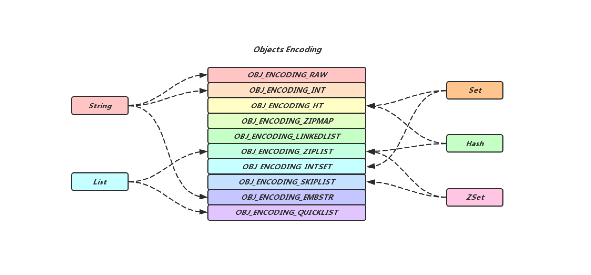
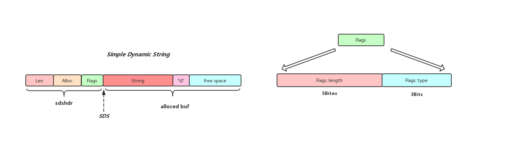
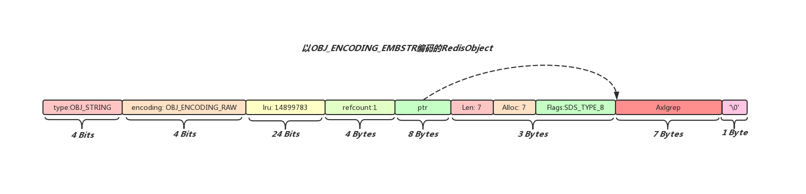
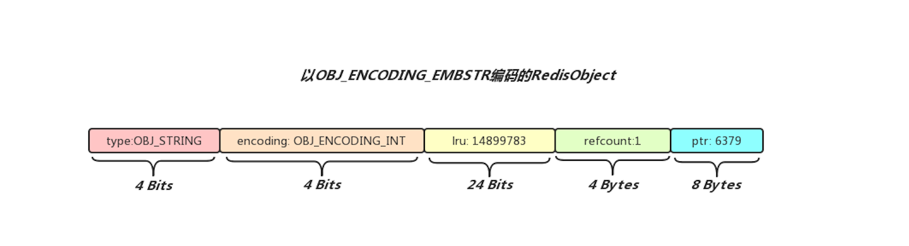
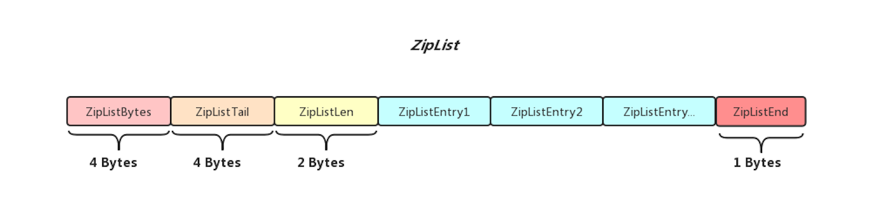

## Redis中的对象

### 介绍
我们知道Redis是基于内存的，支持String, List，Hash, Set, ZSet等多数据结构数据库，虽然Redis支持各种数据结构，但是它本质是以Key-Value形式存储数据的NoSQL数据库，实际上前一篇博客[Redis中的Dict](https://axlgrep.github.io/tech/redis-dict.html)有提到过，Redis数据库本身是使用字典作为底层实现的，而数据库字典中每个结点存储的Key/Value所指向的对象就是本篇博客要介绍的RedisObject

RedisObject翻译过来就是Redis对象，在Redis中RedisObject无处不在，客户端向Redis发送一条命令，经过解析之后命令的每个参数都会以sds的形式存储在RedisObject里面，Redis处理完一条命令，给客户端返回的Reply也会以sds的形式存储在RedisObject当中, 向Redis中存储一个键值对，就会生成存储键对应字符串的RedisObject和存储值对应字符串的RedisObject，如果向Redis中存储一个Hash表，除了会生成存储键对应字符串的RedisObject，甚至会生成一个存储Hash表的RedisObject, 可见RedisObject可以存储的数据并不只是简单的字符串，它也能存储一些复杂的数据结构

### RedisObject的定义
```cpp
typedef struct redisObject {
    unsigned type:4;       // RedisObject的类型
    unsigned encoding:4;   // 同一种类型的RedisObject数据有不同的编码形式
    unsigned lru:LRU_BITS; /* 记录RedisObject访问时间信息，在Redis设置了内
                            * 存上限限制之后会根据该属性来回收redisObject
                            * 从而达到释放内存的效果
                            * LRU time (relative to global lru_clock) or
                            * LFU data (least significant 8 bits frequency
                            * and most significant 16 bits decreas time). */
    int refcount;          // 引用计数，在Redis中同一个RedisObject可能被多个地方共用
    void *ptr;             // 指向底层实现数据结构的指针
} robj;
```

通过查看redisObject结构体源码，我们发现redisObject可以用type属性来表明自己存储数据的类型(type的取值有`OBJ_STRING`,`OBJ_LIST`,`OBJ_SET`,`OBJ_ZSET`,`OBJ_HASH`), 对于Redis数据库中保存的键值对来说，键对象一定是STRING对象，而值可以是STRING类型对象，也可以是LIST，SET, ZSET和HASH对像, 下面给出一个类型为String类型的RedisObject结构图


encoding属性用来表示redisObject的编码类型，举个例子来说同样是Hash类型数据，数据可以存储在ZipList中也可以存在Hash表中，Redis会在内存空间和性能两因素的作用下做出一个权衡，在不同的场景下选择最合适的数据结构进行数据的存储，encoding的取值就比较多了，有`OBJ_ENCODING_RAW`, `OBJ_ENCODING_INT`，`OBJ_ENCODING_HT`, `OBJ_ENCODING_ZIPMAP`, `OBJ_ENCODING_LINKEDLIST`, `OBJ_ENCODING_ZIPLIST`, `OBJ_ENCODING_INTSET`, `OBJ_ENCODING_SKIPLIST`, `OBJ_ENCODING_EMBSTR`, `OBJ_ENCODING_QUICKLIST`(基于Redis4.0，不同版本可能有所区别), 下面给出了不同数据结构可以使用的编码方式，其中有一些编码方式是低版本的时候使用的，在高版本中已经废弃不适用了，例如`OBJ_ENCODING_LINKEDLIST`



Redis数据库是基于内存的，如果Redis内存使用量超过了机器物理内存，可能会导致Redis崩溃，为了应对这种场景，Redis允许用于设置数据库内存使用的上限，当内存使用量达到用户设置的上限，Redis便会采取一些特定的算法策略(目前支持LRU, LFU,Random等回收策略)对数据库中某些符合要求的数据进行回收, 而lru属性便会记录数据库键的空转时长或者一些访问频率信息供回收算法参考

refcount记录着当前redisObject的引用计数，也就是外界有多少地方正在使用这个redisObject，在Redis中操作一些命令成功，Redis会返回`+OK\r\n`,  而如果给出的命令格式错误，Redis会返回`-ERR syntax error\r\n`, 这些字符串都是经常会用到的，如果每次使用的时候都创建一个对应的redisObject和底层存储字符串的数据结构无疑会带来一定的开销，所以在初始化Redis服务的时候就会调用createSharedObjects()来创建一系列的可以共享的redisObject，这样做的好处是可以避免频繁的申请和归还内存，提高数据库的性能

ptr就是一个指针，指向底层存储数据的实际数据结构，接下来会分类细说

### OBJ\_ENCODING\_RAW编码形式
OBJ\_ENCODING\_RAW编码实际上就是简单动态字符串，底层数据结构的实现就是之前博客提到的SDS([Redis中的SDS](https://axlgrep.github.io/tech/redis-sds.html))，但是并不是所有的字符串都会以OBJ\_ENCODING\_RAW编码形式被存储在RedisObject中，只有字符串的长度大于Redis中的OBJ\_ENCODING\_EMBSTR\_SIZE\_LIMIT(44字节), 才会以该形式进行编码，下面给出该编码底层数据结构的结构图


### OBJ\_ENCODING\_EMBSTR编码形式
上面提到了当字符串长度大于44字节，那么字符串会以OBJ\_ENCODING\_RAW编码形式存储在RedisObject当中，但是当字符串长度小于等于44字节时候，便会使用到OBJ\_ENCODING\_EMBSTR形式进行编码

OBJ\_ENCODING\_RAW和OBJ\_ENCODING\_EMBSTR的区别是前者RedisObject和SDS是分别申请内存空间的，也就是说两者所占据的内存是物理不相邻的，而后者在内存中sds是紧跟在RedisObject后面的，在创建一个以OBJ\_ENCODING\_EMBSTR形式编码的RedisObject时也只需要申请一次内存空间(这种形式的sds存储空间在创建之初就是确定的，字符串长度无法更改，举例来说，如果客户端执行`set hello world`命令，由于`world`长度小于44字节，那么Redis便会创建以OBJ\_ENCODING\_EMBSTR编码的RedisObject， 这时候再执行`append`向`world`后面追加100个字符，Redis会将之前以OBJ\_ENCODING\_EMBSTR编码的RedisObject销毁，重新创建一个以OBJ\_ENCODING\_RAW编码的RedisObject，而不是去修改之前的sds对象)

其实这么做的好处显而易见，CSAPP中提到过，在一个良好空间局部性的程序中，如果一个存储器位置被引用了一次，那么程序很可能在不远的将来引用附近的一个存储器位置，我们如果需要访问以OBJ\_ENCODING\_RAW编码的RedisObject，那么目的肯定是要访问其中存储的字符串，这时候如果字符串在内存空间中正好就紧跟在RedisObject后面，这样访问起来就非常高效了，Redis正是利用了这种空间局部性(spatial locality)提升程序的性能

```cpp
/* Create a string object with encoding REDIS_ENCODING_EMBSTR, that is
 * an object where the sds string is actually an unmodifiable string
 * allocated in the same chunk as the object itself.
 *
 * |---------------------- RedisObject ---------------------|---------- Sdshdr ----------|-------- buf[] --------|
 * | <Type> | <Encoding> |  <Lru>  | <Refcount> |   <Ptr>   |  <Len>  |  <Free> | <Flag> |  <String>  |  <'\0'>  |
 *   4 Bits     4 Bits     24 Bits    4 Bytes      8 Bytes     1 Byte    1 Byte   1 Byte    Len Bytes    1 Byte
 * ^                                                        ^                            ^
 * o                                                        sh                          o->ptr
 *
 * EmbeddedStringObject和RawStringObject的区别是后者RedisObject和SDS内存是分离的，而前者
 * RedisObject和SDS内存是连续的，这样访问起来更加高效(空间局部性)
 *
 */
robj *createEmbeddedStringObject(const char *ptr, size_t len) {
    robj *o = zmalloc(sizeof(robj)+sizeof(struct sdshdr8)+len+1);
    struct sdshdr8 *sh = (void*)(o+1);                        // o指向的位置再向后移动sizeof(robj)

    o->type = OBJ_STRING;
    o->encoding = OBJ_ENCODING_EMBSTR;
    o->ptr = sh+1;                                            // sh指向的位置再向后移动sizeof(sdshdr)
    o->refcount = 1;
    if (server.maxmemory_policy & MAXMEMORY_FLAG_LFU) {
        o->lru = (LFUGetTimeInMinutes()<<8) | LFU_INIT_VAL;
    } else {
        o->lru = LRU_CLOCK();
    }

    sh->len = len;                                            // 为sds分配存储字符串的空间和字符串的长度相同
    sh->alloc = len;                                          // 所以这个SDS不允许修改操作
    sh->flags = SDS_TYPE_8;
    if (ptr) {
        memcpy(sh->buf,ptr,len);
        sh->buf[len] = '\0';
    } else {
        memset(sh->buf,0,len+1);
    }
    return o;
}
```
源码还比较简单首先计算出RedisObject和存储字符串的sds一共会占用多少内存空间，然后向系统申请对应大小的内存，最后进行一些赋值操作，以OBJ\_ENCODING\_RAW编码的RedisObject就创建完成了，也许有人会问为什么创建的sds类型是sdshdr8的，那是因为sdshdr5只能存储[0, 1 << 5)区间长度的字符串，一个44字节长度的字符串显然用sdshdr5不够存储的，所以在这里就选用了sdshdr8类型的sds

### OBJ\_ENCODING\_INT编码形式
OBJ\_ENCODING\_INT编码形式的RedisObject内部存储的是整形数字，当我们对Redis中一个Key执行`Incr`命令成功之后，对应的Value在Redis中肯定就是以OBJ\_ENCODING\_INT编码形式的RedisObject进行存储的了，这种编码是所有编码形式中最简单的一种，RedisObject内部的ptr指针无需指向其他数据结构，用自身这8 Bytes存储一个整形数字即可, 下面给出以BJ\_ENCODING\_INT编码的RedisObject

该RedisObject对象内部存储了一个整形数字`6379`, 存储的位置正好就是ptr指针所占用的内存空间，所以当一个解析一个以OBJ\_ENCODING\_INT进行编码的RedisObject时，我们就不能把内部的ptr当做指针看了，而应该把内部的内容当做整形数进行解析

另外在Redis当中存储1~10000这些整数的RedisObject经常会被用到，所以在Redis服务启动之初，便会创建这些被共享的以OBJ\_ENCODING\_INT进行编码的RedisObject

### OBJ\_ENCODING\_ZIPLIST编码形式
ZipList是由一系列特殊编码的连续内存块组成的顺序型数据结构，是Redis为了节约内存而开发的数据结构, 一个压缩链表可以保存任意多个结点，每个结点可以保存一个字节数组或者是一个整数值

上面是ZipList的整体结构，可以看到ZipList中所有的内容在内存中都是物理连续的，ZipList头部存储了自身的一些元信息，ZipList尾部有一个字节的特殊字符用于标识ZipList的尾端, 下面先解释一下各个部分的含义

* ZipListBytes: 自身占用4 Bytes，以uint32_t类型存储数据，记录ZipList占用内存字节数
* ZipListTail: 自身占用4 Bytes，以uint32_t类型存储数据，记录ZipList头部距离表尾ZipListEntry头部的偏移量，通过偏移量，程序无需遍历整个ZipList就能确定表尾ZipListEntry的地址
* ZipListLen: 自身再用2 Bytes, 以uint16_t类型存储数据，记录ZipList中ZipListEntry的数量(当ZipListLen小于UINT16_MAX时，该属性的值就是ZipList中节点的数量，当ZipListLen等于UINT16_MAX时，需要遍历整个ZipList才能获取结点数量)
* ZipListEntry: ZipList中存储的结点，占用内存空间的大小由结点保存的内容确定，后面会细说
* ZipListEnd: 自身占用1 Byte, 内部存储的总是0xFF(十进制255), 标识着ZipList的末尾


