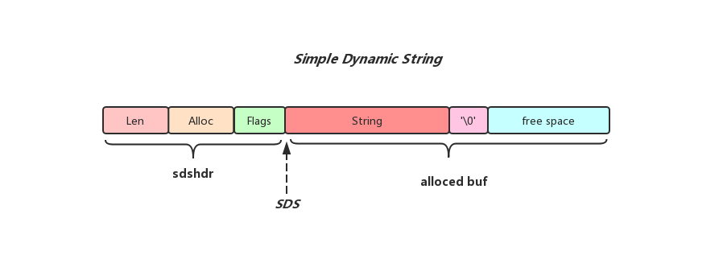
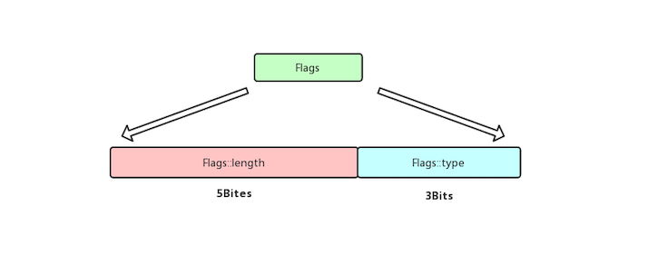

## Redis中的SDS

### 介绍
字符串是Redis中最为常见的数据存储类型，Redis没有直接使用C语言的传统字符串表示，而是自己构建了一种名为简单动态字符串(simple dynamic string, SDS)的抽象类型，并将SDS作为Redis的默认字符串表示，Redis自己构建的SDS相对于C字符串具有如下优势:

* O(1)复杂度就能获取字符串长度(使用sds可以确保获取字符串长度操作不会成为Redis的瓶颈)
* 杜绝缓冲区溢出(sds在拼接字符串之前会判断剩余空间是否满足需求，不满足会先执行扩容操作)
* SDS根据长度判断字符串结束的位置，解决了二进制不安全的问题(这就使得Redis不仅可以保存文本数据，还可以是任意二进制数据)
* 降低了修改字符串时带来的内存重分配次数，提高了性能(空间预分配，和惰性空间释放)

### SDS结构

先来看一下SDS的整体结构:



从上面插图可以看到sds由两部分构成，分别为sdshdr和alloced_buf，下面会分别说明

####Sdshdr

sdshdr用来记录sds的一些元信息，包括sds中存储的字符串长度(Len字段记录)，以及sds已经分配用于存储字符串的alloced_buf的大小(Alloc字段记录)，为了尽可能的节省空间Redis将sdshdr的种类做了细分，根据字符串的长度不同，分配不同类型的sdshdr，不同sdshdr的大小也不一样

* Sdshdr5:  存储字符串长度区间为[0, 1<<5)之间, 没有Len和Alloc字段,只有一个Flags字段,整个sdshdr5占用1Byte
* Sdshdr8:  存储字符串长度区间为[1<<5, 1<<8)之间, Len和Alloc字段都占用1Byte, 整个sdshdr8占用3Bytes
* Sdshdr16:存储字符串长度区间为[1<<8, 1<<16)之间, Len和Alloc字段都占用2Bytes, 整个sdshdr16占用5Bytes
* Sdshdr32:存储字符串长度区间为[1<<16, 1<<32)之间, Len和Alloc字段都占用4Bytes, 整个sdshdr32占用9Bytes
* Sdshdr64:存储字符串长度区间为[1<<32, 1<<64]之间, Len和Alloc字段都占用8Bytes, 整个sdshdr64占用17Bytes

SDS本质上就是一个char类型的指针，指向上图中sdshdr和alloced buf之间的位置，指针指向位置之后的内容和C字符串完全兼容，而SDS获取字符串长度，以及当前分配空间的大小是先通过解析SDS指向位置前一个字节的Flags字段内容，获取到当前sdshdr的类型，再通过不同sdshdr类型向前移动若干个字节获取Len和Alloc字段内容实现的.



不管是什么类型的sdshdr，Flags字段只占用一个字节，Flags字段的低三位用来存储该sdshdr的type，而高五位大多数场景下是无效的，除非当前是sdshdr5类型，就把当前字符串的长度存放到高五位当中(sdshd5类型的SDS，alloced buf的长度就是字符串的长度，没有空间预分配)，从而节省了Len和Alloc字段占用的空间，下面列出了sdshdr5和sdshdr16结构上的区别:

```cpp
 /* e.g..
  *
  * Type SDS_TYPE_5 SDS:
  *    |------------ sdshdr5 ------------|----------- buf[] ------------|
  *    | <Flags::length> | <Flags::type> |    <String>   |  <Tail Char> |
  *    |     5 Bits      |    3 Bits     |     7 Bytes   |    1 Bytes   |
  *    |       7         |  SDS_TYPE_5   |     Xxx_axl   |      \0      |
  *                                      ^
  *                                      s
  *
  * Type SDS_TYPE_16 SDS:
  *    |------------------------- sdshdr16 -------------------------|-----------------------  buf[] -----------------------|
  *    |   <Len>   |  <Alloc>  |  <Flags::length>  |  <Flags::type> |    <String>   | <Tail Char> |       <Free buf>       |
  *    |  2 Bytes  |  2 Bytes  |       5 Bits      |     3 Bits     |   2^10 Bytes  |   1 Bytes   |  2^12 - 2^10 - 1 Bytes |
  *    |    2^10   |    2^12   |       unused      |   SDS_TYPE_16  |    Xxx..axl   |     \0      |                        |
  *                                                                 ^
  *                                                                 s
  */
```


####Alloced buf

Alloced buf是用来存储字符串以及字符串结束符`\0`的buffer，我们知道每次对C字符串进行增加或者是缩短操作，操作系统都会对这个C字符串进行一次内存重新分配的操作，这是十分影响性能的，而Redis自己构建的SDS对存储字符串的buffer采用了空间预分配以及惰性空间释放的策略来尽量避免内存重分配对Redis性能造成的影响，当然这也占用了额外的内存空间(空间换时间的思想)，不过Redis对于空间预分配以及惰性空间释放还是有一套自己的策略

#####空间预分配

在对sds进行修改的时候(追加字符串，拷贝字符串等)通常会调用以下sdsMakeRoomFor方法对sds的剩余容量进行检查，如有必要会对sds进行扩容，当计算修改之后字符串(用target\_string表示)的目标长度之后分以下几种情况:

* 剩余的freespace足够容纳target\_string和末尾`\0`字符，则不作任何操作
* 剩余的freespace不够容纳target\_string和末尾的`\0`字符
  * 当target_string_size < 1MB，则会直接分配2 * target\_string\_size的空间用于存储字符串
  * 当target_string_size >= 1MB，则会再额外多分配1MB的空间用于存储字符串(target\_string\_size + 1024*1024)

需要注意的是，当sds中字符串的长度修改之后，之前的sdshdr头可能存不下新sds中字符串的长度，这时候可能会替换sdshdr头的类型，我们需要对这种情况做一些额外的处理，这些处理操作可以参考sdsMakeRoomFor方法后半段的逻辑

```cpp

/* Enlarge the free space at the end of the sds string so that the caller
 * is sure that after calling this function can overwrite up to addlen
 * bytes after the end of the string, plus one more byte for nul term.
 *
 * Note: this does not change the *length* of the sds string as returned
 * by sdslen(), but only the free buffer space we have. */
sds sdsMakeRoomFor(sds s, size_t addlen) {
    void *sh, *newsh;
    size_t avail = sdsavail(s);
    size_t len, newlzen;
    char type, oldtype = s[-1] & SDS_TYPE_MASK;
    int hdrlen;

    /* Return ASAP if there is enough space left. */
    // 如果剩余空间大于addlen, 则直接无需额外操作，直
    // 接返回就行
    if (avail >= addlen) return s;

    len = sdslen(s);
    sh = (char*)s-sdsHdrSize(oldtype);
    newlen = (len+addlen);
    if (newlen < SDS_MAX_PREALLOC)
        // 如果newlen小于1MB，那么我们申请两倍newlen，防止
        // 下次再追加内容需要重新分配buffer
        newlen *= 2;
    else
        // 如果newlen大于等于1MB，那么我们在newlen基础上多
        // 分配1MB的空间
        newlen += SDS_MAX_PREALLOC;

    type = sdsReqType(newlen);

    /* Don't use type 5: the user is appending to the string and type 5 is
     * not able to remember empty space, so sdsMakeRoomFor() must be called
     * at every appending operation. */
    // SDS_TYPE_5无法记录剩余容量大小，所以在这里我们直接用SDS_TYPE_8
    if (type == SDS_TYPE_5) type = SDS_TYPE_8;

    hdrlen = sdsHdrSize(type);
    if (oldtype==type) {
        // 如果newlen在oldtype范围下还能容纳，那么直接realloc就行
        newsh = s_realloc(sh, hdrlen+newlen+1);
        if (newsh == NULL) return NULL;
        s = (char*)newsh+hdrlen;
    } else {
        /* Since the header size changes, need to move the string forward,
         * and can't use realloc */
        // 如果类型变化了，则头部大小也会发生变化，不能直接realloc了,
        // 需要malloc之后将字符串拷贝到新分配的buffer上, 然后释放之前
        // 的sds
        newsh = s_malloc(hdrlen+newlen+1);
        if (newsh == NULL) return NULL;
        memcpy((char*)newsh+hdrlen, s, len+1);
        s_free(sh);
        s = (char*)newsh+hdrlen;
        s[-1] = type;
        sdssetlen(s, len);
    }
    sdssetalloc(s, newlen);
    return s;
}

```


##### 惰性空间释放

在SDS字符串缩短操作过程中， 多余出来的空间并不会直接释放，而是保留这部分空间，等待下次再用(字符串缩短操作需要更新sdshdr头中的Len字段，以及alloced buffer中的`\0`字符的位置)，可以从下面源码中看到，在更新字符串长度的过程中并没有涉及到内存的重分配策略，只是简单的修改sdshdr头中的Len字段

```cpp
/* Set the sds string length to the length as obtained with strlen(), so
 * considering as content only up to the first null term character.
 *
 * This function is useful when the sds string is hacked manually in some
 * way, like in the following example:
 *
 * s = sdsnew("foobar");
 * s[2] = '\0';
 * sdsupdatelen(s);
 * printf("%d\n", sdslen(s));
 *
 * The output will be "2", but if we comment out the call to sdsupdatelen()
 * the output will be "6" as the string was modified but the logical length
 * remains 6 bytes. */
void sdsupdatelen(sds s) {
    int reallen = strlen(s);
    sdssetlen(s, reallen);
}

static inline void sdssetlen(sds s, size_t newlen) {
    unsigned char flags = s[-1];
    switch(flags&SDS_TYPE_MASK) {
        case SDS_TYPE_5:
            {
                unsigned char *fp = ((unsigned char*)s)-1;
                *fp = SDS_TYPE_5 | (newlen << SDS_TYPE_BITS);
            }
            break;
        case SDS_TYPE_8:
            SDS_HDR(8,s)->len = newlen;
            break;
        case SDS_TYPE_16:
            SDS_HDR(16,s)->len = newlen;
            break;
        case SDS_TYPE_32:
            SDS_HDR(32,s)->len = newlen;
            break;
        case SDS_TYPE_64:
            SDS_HDR(64,s)->len = newlen;
            break;
    }
}

```

###总结

sds的结构还算是比较简单，Redis通过自己构建的sds规避了传统C字符串潜在的性能问题，以及缓冲区溢出的风险，并且通过一系列策略以及数据结构的优化尽可能的节省了内存空间，此外，sds为了和传统C字符串相兼容，在保存字符串的末尾也设置了空字符，使保存文本数据的sds可以使用部分\<string.h\>库中的函数，而sds自身也封装了一些修改字符串常见的操作，为Redis提供了简单可靠高性能的字符串操作API.