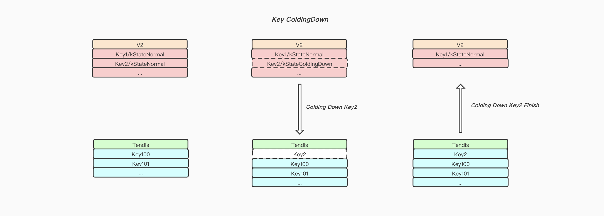
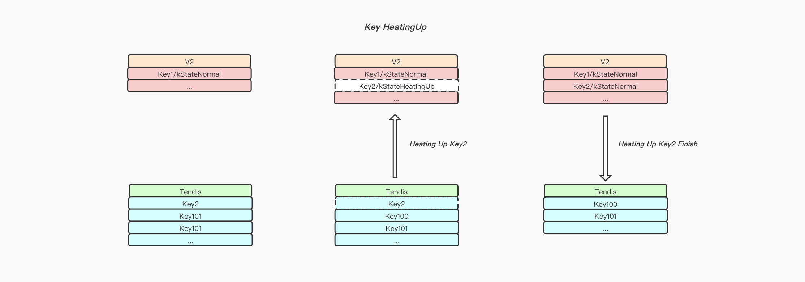
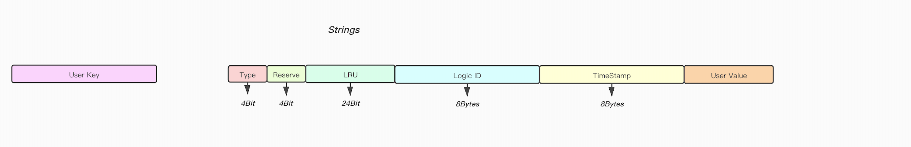
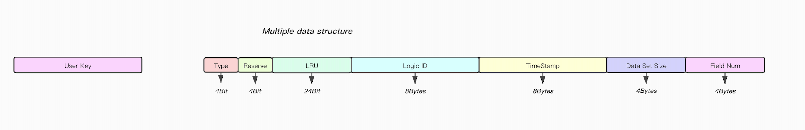
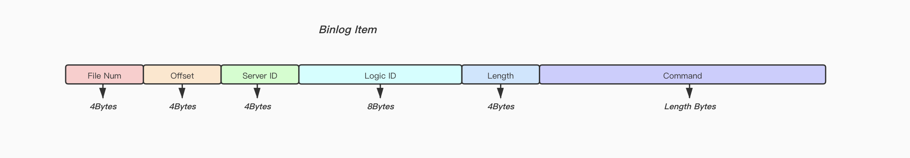

## Tendis V2 可靠性设计

### Key的状态机
```cpp
enum KeyStateMachine {
  kStateNormal      = 0,
  kStateColdingDown = 1,
  kStateHeatingUp   = 2,
}
```

##### Key的落冷流程:

1. 在启动一个Key的降冷之前首先将这个Key的状态机设置为kStateColdingDown并且将它加入到落冷状态Key的集合中.
2. Dump Key, 将序列化内容RESTORE给Tendis
3. Tendis完整之后返回确认给V2, V2将该Key从落冷状态中集合移除, 并且删除这个Key

备注:

1. 在落冷过程中V2和Tendis的连接断开, 等待连接重新建立成功之后遍历落冷状态中集合, 重新启动落冷操作.(需要考虑Tendis脏数据的情况)




#### Key的升温流程:

1. 在启动一个Key的升温操作之前, 在V2中创建这个空Key同时将状态机设置为kStateHeatingUp, 并且将它加入到升温状态Key集合中.
2. 向Tendis发送Dump Key命令, 等待Key的升温完成.
3. 将Key加载到V2成功之后, 再向Tendis发送一条DEL命令.
4. Tendis接受到DEL命令, 删除已经升温成功的Key.



备注:
1. Key的升温是V2主动的一个行为, 在尝试向Tendis拉取Key的过程中, 可能该Key在Tendis中也不存在, 这种场景下, V2需要做特殊的处理(确认升温的是空Key的时候, 需要将处于kStateHeatingUp状态的Key对象删除)

### 更新
* SET:
	* v2中存在:
		* 状态机`kStateNormal`, 直接更新后返回.
		* 状态机为`kStateColdingDown`或者`kStateHeatingUp`, 等待状态变更后重试.(实际场景中很少会直接碰上这两种状态).
	* v2中不存在:
		* 一种方案是直接在v2中做对应的Set操作, 完成后返回Reply给客户端, 然后向Tendis发送一条DEL命令.
		* 另外一种是在v2中创建一个该Key, 并且设置状态机为`kStateHeatingUp`, 等待升温完成之后继续操作(放弃这种方案, 用户请求延迟高)

* SADD:
	* v2中存在:
		* 状态机`kStateNormal`, 直接更新后返回.
		* 状态机为`kStateColdingDown`或者`kStateHeatingUp`, 等待状态变更后重试.(实际场景中很少会直接碰上这两种状态)
	* v2中不存在:
		* 判断该Key需要升温, 在v2中创建一个该Key, 设置状态机为`kStateHeatingUp`, 等待升温完成之后继续操作(考虑加入布隆过滤器).
		* 直接将命令透传给Tendis, 由Tendis生成Reply, 然后转发给客户端(放弃这种方案, 我们采用大KEY不落冷的策略, 所以可以理解为Tendis中都是小Key, 升温代价可控)

* MGET:
	* 所有Key在v2中都存在:
		* 确保所有Key的状态都为`kStateNormal`再执行MGET操作
	* 部分或者所有的Key在v2中不存在:
		* 尝试从Tendis中获取MGET请求中在V2中不存在的Key, 然后再执行MGET操作.

### 删除
* DEL:
	* v2中存在:
		* 状态机`kStateNormal`, 直接DEL后返回(考虑Tendis存在脏数据, 需要转发一次DEL命令)
	* v2中不存在:
		* 直接将命令透传给Tendis, 由Tendis生成Reply, 然后转发给客户端.

* SREM:
	* v2中存在:
		* 状态机`kStateNormal`, 直接SREM后返回.
	* v2中不存在:
		* 直接将命令透传给Tendis, 由Tendis生成Reply, 然后转发给客户端.
		*  判断该Key需要升温, 在v2中创建一个该Key, 设置状态机为`kStateHeatingUp`, 等待升温完成之后继续操作.

### 主从一致性
实际上Master就是向Slave传递自身数据的变更, 而触发数据变更只有两个途径, 一个是用户写请求, 另外一个就是数据的落冷和升温, 所以主要需要同步以下操作:

1. 用户请求, 如果可以直接在V2上完成的操作, 不需要与Tendis进行交互, 直接将命令同步给v2-slave即可.
2. 数据降冷操作, 完成之后向v2-slave同步一条DEL命令.
3. 数据升温操作, 完成之后向v2-slave同步升温Key对应的数据.


### 元信息
这里介绍一下我们增加的一些额外字段用于满足落冷, 备份, 主从同步等需求:

下面是`Strings`这种数据结构, 我们在用户`Value`前面32Bytes用于存储一些元信息

* Type字段: 大小为4Bits, 用于区分当前`MetaValue`所属类型, 取值`OBJ_STRING`,`OBJ_LIST`,`OBJ_SET`,`OBJ_ZSET`,`OBJ_HASH`, 根据这个字段来确认后面数据的解析格式.
* Reserve字段: 大小为4Bits, 暂时保留, 可考虑记录当前格式的版本号(后续可能在末尾新增字段)
* LRU字段: 大小为24Bits, 用于记录`Key`的`创建/更新/访问`时间, 精度为194天, 在采样Key的过程中会依据这个字段判断当前Key是否需要落冷.
* Logic ID字段: 大小为8Bytes, 这里主要是用作主从备份过滤流水使用
* TimeStamp字段: 大小为8Bytes, 没设置过期时间的`Key`该字段为-1, 否则为Key实际的过期时间(精度为ms级别)



针对多数据结构,  除了要记录上面提到的`LRU`, `Version`, `TimeStamp`, 字段以外, 我们还新增了以下两个字段

* Data Set Size字段: 大小为4 Bytes, 用于记录当前多数据结构Key所占的空间(根据该字段判断是否为大Key), 在用户对当前Key进行增加或者删除元素的时候, 该字段都会更新.
* Field Num字段: 大小为4 Bytes, 用于记录当前多数据结构子Field的数量(后续如果要做Field级别的落冷, 可在末尾新增字段记录热Field数量, 两者进行对比便可以判断是否有冷Field在Tendis中)

 


### 数据落冷
目前第一期先支持整Key落冷 考虑到大Key的升温和落冷代价太大(考虑一种场景:用户往巨大的`Set`中写入一个`Member`, 我们需要阻塞用户请求, 直到将整个大Set从Tendis中拉回V2, 然后再执行操作, 相对于我们直接透传命令到Tendis, 由Tendis处理后返回, 无疑后者代价更小), 会直接影响用户请求, 针对大Key我们采取大Key不主动落冷的策略(提供命令供用户对指定Key进行落冷/升温操作), 具体大Key的评判规则如下:

简单的`Strings`类型根据Value大小盘判断是否属于大Key, 我们判定Value小于100MB的Strings为小Key, 可以根据规则随意的升温或者降冷.

针对多数据结构`Lists`, `Hashes`, `Set`, `ZSet`我们从两个维度判断:

* 从数据体积维度, 多数据结构的`MetaValue`中使用`Data Set Size`字段记录了该Key所有`Field/Value`, `Score/Member`, `Node`, `Member`的总体积之和, 目前暂定总体积大于100MB算作大Key.
* 从子数据的数量维度, 目前暂定`Field`, `Member`, `Node`数量大于1000算作大Key.

多数据结构Key只要满足上面两个条件之一, 就算作大Key.

#### 数据的落冷时机
关于如何选择落冷的Key, 这里有两个维度:

* V2容量上限维度: 当V2容量快达到限制的时候, 我们采用LRU的策略, LRU算法需要一个双向链表来记录数据的最近被访问顺序，但是出于节省内存和时间复杂度维度的考虑, 我们并不打算将V2中所有的Key存储在双向链表中, 我们尝试运行一个近似LRU的算法，通过对少量键进行取样，然后回收其中的最久未被访问的键, 我们会在`MetaValue`中使用24 Bits的空间用于记录Key的新建或者更新时间戳, 在采样的时候根据这个字段判断即可.

* 用户自行配置冷Key的闲置时间: 比如七天内未访问的Key, 判断为冷Key, 进行落冷.

#### 多数据结构的子Field落冷(二期内容)
##### Set/ZSet
考虑到`Set/ZSet`如果采取部分Member落冷的策略, 后续SADD, ZADD等常见高频使用命令都可能会存在缓存穿透的风险(用户可能在Set中增加一个全新的Member, 但是如果该`Set/ZSet`有Member已经落冷, 由于我们需要确认是否修改Field Num信息, 我们可能需要直接穿透到Tendis里面去查询该Member是否存在, 这样性能会直接退化成需要进行磁盘交互级别, 而Tendis底层采用Rocksdb, 查询效率不高, 读放大严重),  所以针对`Set/ZSet`, 我们不做Member级别的落冷.

##### Hashes
Hashes落冷实际上以下两种方案:

* Field级别落冷
	* 优点是针对大Hashes的场景下, 可以为用户节省更多的AEP空间.
	* 缺点也很明显, 就是和上面Set的问题一样, 一些常见的命令会存在缓存穿透的风险, 性能受到严重影响.
* Value级别落冷
	* 优点就是常见命令在V2层面就可以确认是否需要穿透到Tendis, 避免了无效的缓存穿透, 并且代码实现逻辑会更加清晰(针对HSCAN, HKEYS这些命令).
	* 缺点无疑就是我们仅仅把Value落冷, Field都保存在V2上, 占用了更多的AEP的空间.

实际在这两种方案中做选择无疑是在时间换空间和空间换时间中做一个这种的权衡, 经过我们内部讨论后认为Value级别落冷这种方案更好, 因为如果不能避免无效的缓存穿透, 对性能的影响是非常大的.

### 数据取活
数据取活实际上是用户请求了某一个Key, 该Key在V2中并不存在的场景下触发, 但是可能这个Key在Tendis中也不存在(由于我们并没有在V2中存储所有的Key, 所以这种场景的穿透无法避免), 另外由于我们采取了大Key不落冷的策略, 我们可以认为Tendis中的Key都是小Key, 取活操作开销可控.

### 备份/回档
常用的三种备份策略:

* 像Redis一样,`Fork()`之后, 子进程遍历数据写文件备份(把AEP设备当高速磁盘用, 不支持`Fork/Copy On Write`, 放弃该方案)
* 像Rocksdb一样, 采用硬链接的形式备份(由于SST文件一旦生成便不会更改), 或者直接打一个`Snapshot`然后遍历数据写文件(目前提供的库函数不支持`Snapshot`, 如果支持,只能二期自己实现`Snapshot`相关功能)
* 直接阻写然后`CP`文件(在AEP设备上`CP`10GB的文件耗时13秒, 服务阻写13秒显然不现实, 放弃该方案)
由于把AEP当做高速磁盘使用

由于上面三种策略短期之内实现的可能性都不大, 首先我们考虑的是用户触发`BGSAVE`命令的时, 直接遍历数据写文件备份, 这种备份方式的缺点是最终备份的数据并不是某一个时刻的数据定格(因为备份过程中数据会受到用户的请求的更新或者删除)

如果要求备份时某一个时刻数据的定格, 可以考虑在从库做备份, 主要基于以下一些考虑:

* 备份是一个很重的操作, 需要遍历全量数据, 放在Master上做可能会占用部分CPU资源.
* 备份期间要保证全量数据不受到修改, 只能采用阻写的策略, 在Master上直接阻写会影响用户请求.

后来经过内部讨论, 还是觉得上面从库备份的方式不优雅, 于是我们开始思考其他方案:

实际上我们遇到的问题就是, 在把AEP设备当做高速磁盘使用, 并不支持`Copy On Write`, 但是我们需要一种机制获取启动备份时刻的数据定格, 由于我们是使用AEP设备做持久化存储, 针对用户的每个事务操作我们都会记录`Undo Log`, 这样能够避免事务操作没有完成(数据没有完整写入AEP设备), 而突然设备断电, 造成数据变脏的问题(如果事务没有执行完成, 我们可以使用`Undo Log`来进行回滚操作.)

当我们想到可以使用`Undo Log`来做回滚操作, 问题就变得简单了, 我们可以用如下方法获取某一个时刻的备份:

1. 当服务接收到备份请求, 我们开始将`Undo Log`记录到一个文件中(执行备份时间点需要对齐)
2. 然后在异步线程将当前AEP设备上的数据库文件进行Copy(拷贝的过程中文件可能会发生变更, 不过没关系, 后面我们可以使用`Undo Log`进行还原).
3. 当数据库文件的Copy操作完成, 我们停止将`Undo Log`到文件中(不需要严格的时间点对齐)
4. 将记录在文件中的`Undo Log`应用到Copy完成数据库文件上, 这时候我们就得到了一份启动备份时刻的数据备份.

回档直接加载备份文件即可.

###  主从同步
主从同步一般分为以下两个步骤:

* 全量同步(Master接受到全量同步请求时, 将全量数据打快照同时记录当前的Binlog偏移量, 然后将快照的全量数据和Binlog偏移量发送给Slave)
* 增量同步(Slave加载完成Master传递过来的快照全量数据后, 根据Binlog偏移量向Master发起增量同步请求)

前面有提到目前基于AEP设备进行备份是有缺陷的(在备份过程中数据有被修改的风险), 但是在全同步阶段对备份文件又是强依赖的, 所以我们在`MetaValue`以及`Binlog`中都增加了一个`Logic ID`字段用于标识版本, `Logic ID`是全局单调递增的, 任何一个对数据的更新操作都会对应唯一的一个`Logic ID`(用户写入数据或者数据落冷/升温操作), 当一个新的写请求到达V2, 首先会为他分配一个`Logic ID`, 这个写请求执行的时候, 它操作`Key`对应的`Logic ID`会被重新赋值.

#### Binlog Item格式
Binlog Item中我们除了记录用户具体的命令, 还增加了一些额外的字段:

* File Num字段: 大小为4Bytes, 用于记录当前Binlog所在的文件序号.
* Offset字段: 大小为4Bytes, 用于记录当前Binlog Item在Binlog文件中的偏移量(单个Binlog文件的上限为 4GB).
* Server ID字段: 大小为4Bytes, 用于记录生成该条Binlog的V2的Server ID.
* Logic ID字段: 大小为8Bytes,  每条Binlog ID都有一个唯一的ID, 用于主从同步过滤使用.
* Length字段: 大小为4Bytes, 用于记录后面追加的用户具体命令的长度.
* Command字段: 大小为Length Bytes, 用于记录实际的用户请求.



#### 同步命令
* `Slaveof ip port force`: 从库向主库发起强制全同步
* `Slaveof ip port FileNum Offset`: 从库向主库尝试进行增量同步(如果Binlog点位找不到, 自动切换成强制全同步)

#### 同步流程:

* Slave发起同步请求
* Master接受到同步请求, 如果可进行增量同步, 直接发送Binlog, 如果需要先触发全量同步, 步骤如下
	* 记录当前Slave触发同步请求时的Binlog偏移量, 并且继续写Binlog(如果有新的写入请求的话)
	* 遍历数据并且发送给Slave
		*  在遍历过程中数据可能会发生更改, 后续可以通过`Logic ID`进行过滤
		*  在搬迁一个大Key的过程中, 可能用户请求会对其进行修改, 造成冲突(加行锁解决, 不过搬迁大Key的过程中如果客户端正好访问该Key, 延迟可能很高?)

* 在Slave接受完Master全量数据时, 进入增量同步阶段, 由于增量同步中部分命令可能已经在Master全量同步时作用过, 并且同步给了Slave, 所以Slave需要将Binlog中的`Logic ID`字段与对应Key的`Logic ID`字段进行比较, 只有`Logic ID`比Key中大的Binlog才会被处理, 其他的直接过滤即可.

这样我们便可以解决Master无法快照备份全量数据的问题.

### 备注
* 在触发备份, 以及全量同步时, 提前关闭数据落冷以及数据升温功能, 保证V2中的数据修改只有一个渠道(用户请求)
* 在Key落冷的期间, 此时又有用户请求访问了该Key, 撤销落冷操作, 回滚Tendis中的数据(执行DEL命令)
*  过期Key的发现和删除, 全局搜索命中率太低,  考虑单独维护一个过期Key列表
*  落冷取活采用`DUMP`/`RESTORE`?  Tendis支不支持这两个命令?
